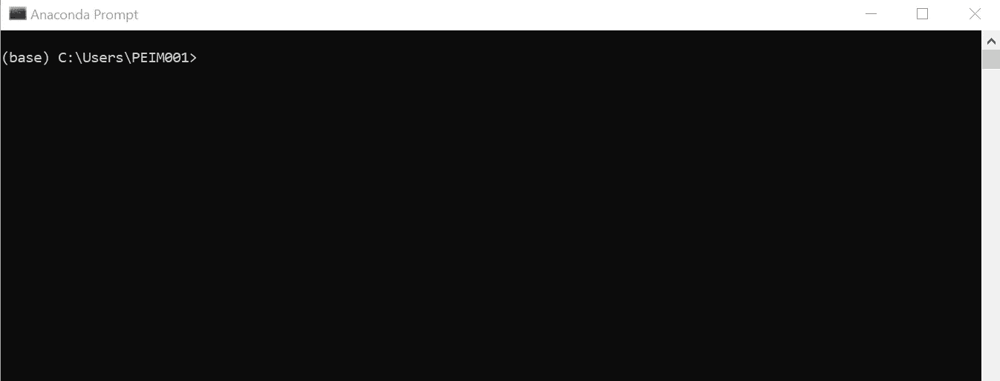
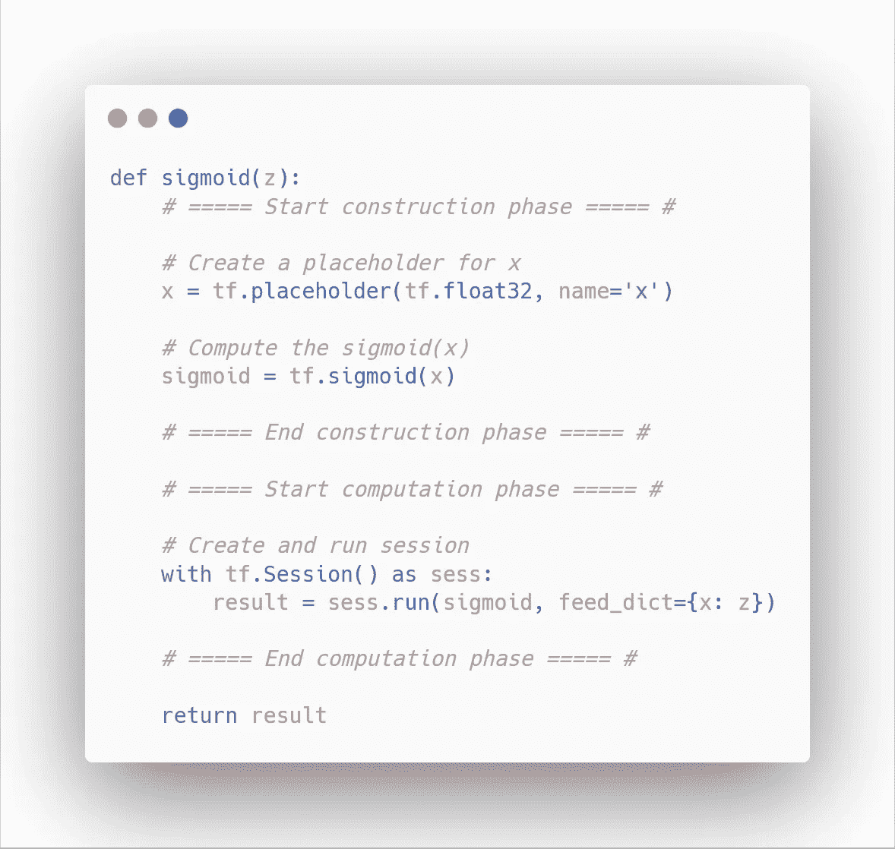
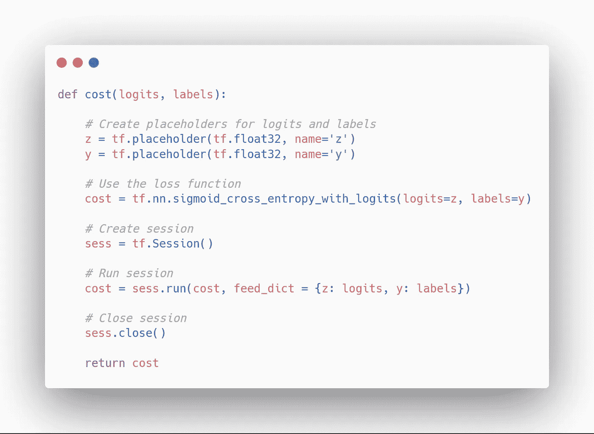
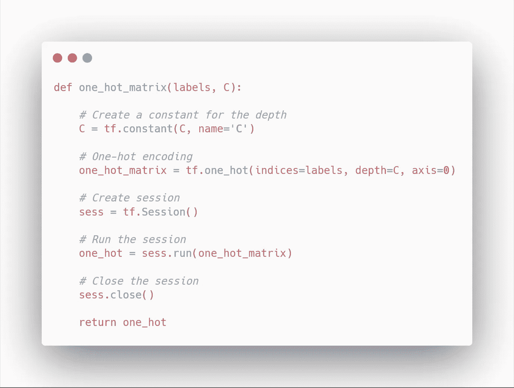
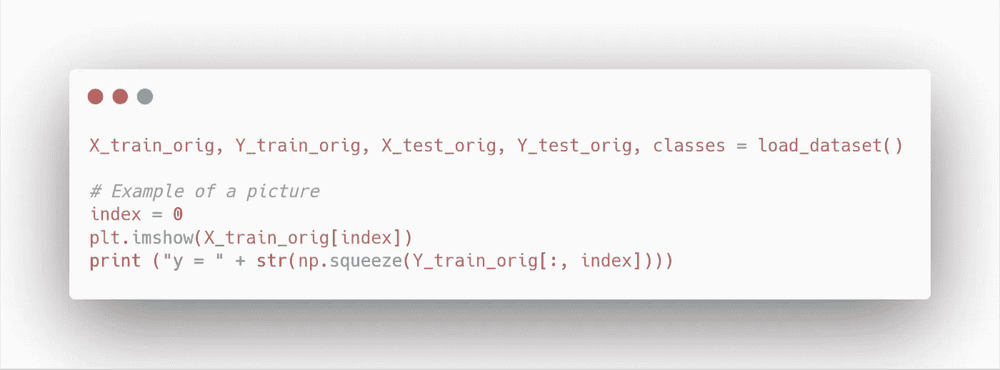
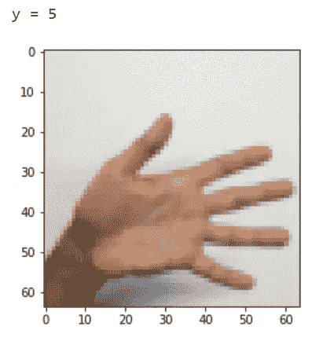
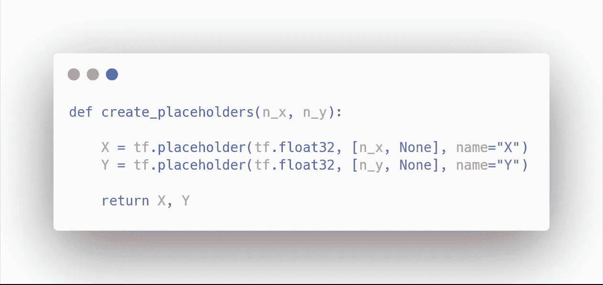
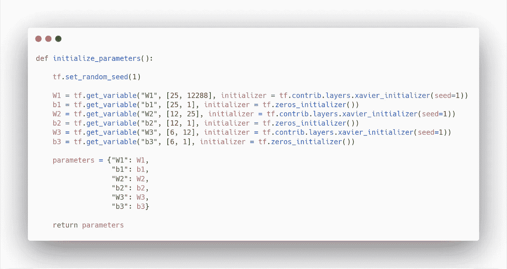
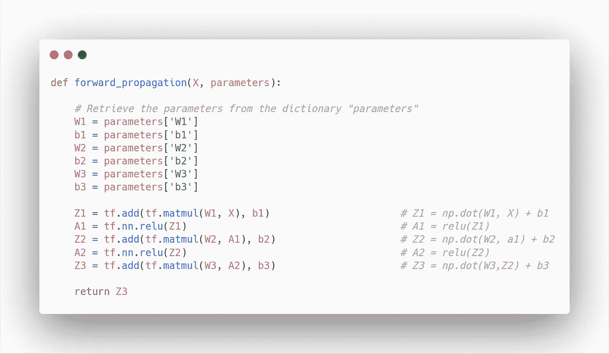
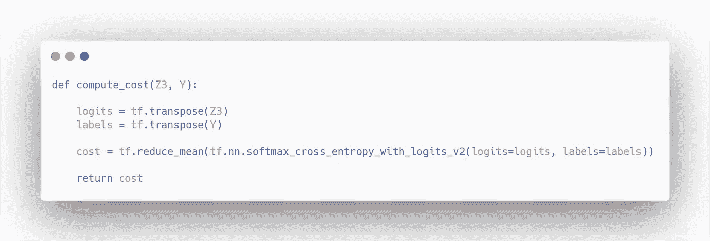

# 新手的完整 TensorFlow 教程

> 原文：<https://towardsdatascience.com/the-complete-tensorflow-tutorial-for-newbies-dc3acc1310f8?source=collection_archive---------16----------------------->

## 从安装到构建用于手势识别的神经网络


Photo by [Jan Kahánek](https://unsplash.com/@honza_kahanek?utm_source=medium&utm_medium=referral) on [Unsplash](https://unsplash.com?utm_source=medium&utm_medium=referral)

[TensorFlow](https://www.tensorflow.org/) 是一个用于机器学习和深度学习的健壮框架。它使得构建模型和为生产部署模型变得更加容易。

它是开发人员中最受欢迎的框架。这并不奇怪，因为该框架也可用于基于网络的机器学习( [TensorFlow.js](https://www.tensorflow.org/js) )和设备上的推理( [TensorFlow Lite](https://www.tensorflow.org/lite) )。此外，随着最近发布的 [TensorFlow 2.0](https://www.tensorflow.org/versions/r2.0/api_docs/python/tf) ，该框架将很快变得更容易使用，因为语法将被简化，减少了 API，并且它将支持 [Julia](https://julialang.org/) 编程语言。

现在是入门 TensorFlow 的大好时机，掌握它是数据科学家的重要资产。

本教程将帮助您开始使用 TensorFlow。注意 TensorFlow 2.0 并不稳定，所以我们将重点放在之前的稳定版本上。

我们将首先以最简单的方式安装框架，然后我们将编写一些函数来学习语法和使用一些 API。最后，我们将编写一个能够识别手势的模型。

我们开始吧！

> 关于机器学习、深度学习和人工智能的实践视频教程，请查看我的 [YouTube 频道](https://www.youtube.com/channel/UC-0lpiwlftqwC7znCcF83qg?view_as=subscriber)。

Yep, our model will recognize these signs!

# 装置

我们安装 TensorFlow 吧！我们将在 Windows 机器上完成安装过程。

如果您在其他操作系统上遇到困难，请随时发表评论。

## 步骤 1 —下载 Anaconda

第一步是下载并安装 [Anaconda](https://www.anaconda.com/distribution/) 。Anaconda 是一个使数据科学变得更容易的平台；它提供了对最流行的工具和库的访问，并且它还充当了一个包管理器。

下载适用于您的操作系统的 Anaconda 发行版，并遵循安装步骤。接受默认设置是安全的。安装可能需要几分钟，因为 Anaconda 捆绑了很多东西。

安装完成后，在 Windows 搜索栏中搜索 *anaconda 提示符*。打开应用程序，您应该会看到类似这样的内容:



Anaconda prompt window

太好了！

## 步骤 2-安装 TensorFlow

现在，要安装 Tensorflow，只需输入:

```
pip install tensorflow
```

等待安装完成，瞧！您现在可以使用 TensorFlow 编写代码了！

# 正在热身

其余的教程将遵循[这个](https://github.com/marcopeix/Deep_Learning_AI/blob/master/2.Improving%20Deep%20Neural%20Networks/3.Hyperparameter%20Tuning%2C%20Batch%20Normalization%20and%20Programming%20Frameworks/Tensorflow%20Application.ipynb)笔记本。您还可以在整个教程中获取任何需要的实用程序。觉得卡住了就参考一下吧！

## 计算 sigmoid 函数

让我们用张量流来计算 sigmoid 函数。这是完整的代码块。然后，我们将遍历代码正在做什么。



一个 TensorFlow 程序通常分为两部分:一个**构建阶段**和一个**计算阶段**。

在构建阶段，我们使用一个*占位符*来创建一个变量。我们需要定义变量的类型，并给它一个名字。然后，我们简单使用内置的 *sigmoid* 函数。请注意，在构建阶段，没有正在计算的值。事实上，代码根本不运行。这就是为什么我们需要一个计算阶段。

在计算阶段，我们创建一个*会话*，并将计算结果赋给另一个变量。注意该函数以 *z* 作为输入，但是在函数内部使用了 *x* ，因此需要 *feed_dict* 。

并且整个块单元被称为张量流**图**。所有 TensorFlow 程序都是这样构建的:

*   在构建阶段定义变量和计算步骤
*   在计算阶段运行计算

理解这个结构是掌握 TensorFlow 的关键。一旦你熟悉了这一点，你就能编写更高级的程序了。

## 计算成本

现在，让我们计算一个分类问题的成本函数。我们习惯于计算交叉熵函数并从头开始编写它。现在，让我们看看 TensorFlow 如何让我们轻松实现相同的结果:



就是这样！只有一行定义了损失函数！

再次注意我们如何使用占位符，并识别上面代码单元的构造和计算阶段。

## 一键编码

[一键编码](/building-a-perfect-mushroom-classifier-ceb9d99ae87e)是一种将多类标签转换为 0 和 1 的向量的技术。

让我们看看如何在 TensorFlow 中实现:



再一次，TensorFlow 使得操纵我们的数据变得非常容易。

既然你对一般的结构已经比较熟悉了，让我们继续建立一个实际的神经网络来对手势进行分类！

# 手势识别

在这个小项目中，我们将建立一个手势识别系统。具体来说，我们的神经网络将识别手是否正在表达从 0 到 5 的数字。

让我们加载数据集，看看一个示例图像:



您应该会看到:



A sample of the dataset

在构建我们的模型之前，我们将首先展平图像，归一化它们的特征，并对标签进行一次性编码:


现在开始建立模型！

## 创建占位符

首先，我们编写一个函数来为特征矩阵和标签矩阵创建占位符:



然后，我们编写一个函数来初始化权重矩阵和偏差矩阵:



厉害！现在，我们必须定义正向传播:



注意，在上面的代码单元中，注释显示了 *numpy* 中的等价语法。

最后，我们定义一个函数来计算成本:



现在，我们准备将所有内容组合成一个模型！

等等…

反向传播呢？与之前我们从头开始编写反向传播的帖子不同，深度学习框架只需几行代码就能自动完成！

## 将所有内容放入一个模型中

现在，我们将所有函数合并到一个模型中，我们将使用小批量梯度下降来训练神经网络:

现在，我们用下面的代码行运行模型:

```
parameters = model(X_train, Y_train, X_test, Y_test)
```

您应该得到:


太好了！测试精度不是很好，因为我们只使用了整个数据集的一小部分，而且我们没有训练很长时间。本教程的主要目标是习惯 TensorFlow 并对其 API 有一个大致的了解。

干得好！您现在已经准备好将 TensorFlow 用于更高级的神经网络和应用程序。在接下来的帖子中，我们将探索不同的神经网络结构，并使用 TensorFlow 或 [Keras](https://keras.io/) (另一种深度学习框架)来构建它们。

敬请关注，继续学习！