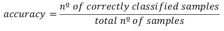
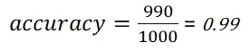
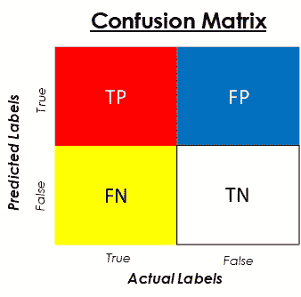
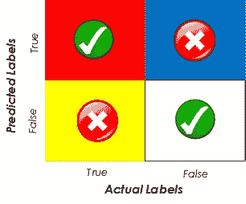
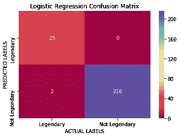
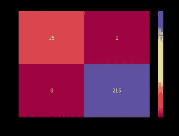
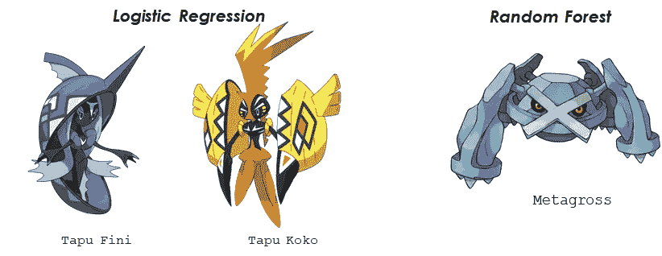
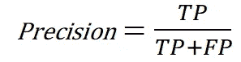
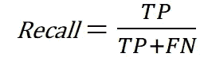
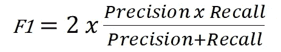

# 困惑矩阵:揭开面纱

> 原文：<https://towardsdatascience.com/the-confusion-matrix-unveiled-2d030136be40?source=collection_archive---------19----------------------->

## 如何衡量分类性能…用口袋妖怪！

Image from: [Source](https://www.deviantart.com/mysticalpha/art/Pokemon-Group-682191776)

## 所有好的经验如果伪装成冒险会更好的学习…我们今天的任务将是发现传说中的口袋妖怪，以便抓住他们。为此，我们将使用我们所掌握的最好的工具:机器学习！

这篇文章的目的是解释混淆矩阵是什么，它在评估分类算法性能中的重要性，以及如何用它来比较不同的模型。一切从一开始就会解释清楚，项目中使用的代码会在文章末尾提供，供您随意摆弄和复制。

# **数据集**

正如你可能已经猜到的，我们将使用著名的 ***完整口袋妖怪数据集*** ，你可以在这里下载[。该数据集包含了 802 只口袋妖怪的 41 个特征，如它们的名字、身高、体重、攻击和防御等..我们将关注的是:**一个二元特征，它告诉我们口袋妖怪是否是传奇**。](https://www.kaggle.com/rounakbanik/pokemon/data#)

Can we catch them all?

在包含所有代码的笔记本中，您会发现一个*探索性数据分析* (EDA)阶段，在这个阶段，我会对数据进行一点探索，构建虚拟变量，并进行一些清理。这个阶段不在这里讨论，所以我们可以直接跳到更困扰我们的问题:分类结果。

# 分类结果的问题

当我们有一个*回归*算法时(例如，我们想估计房子的价格)，评估这个算法做得有多好并不太难。我们可以简单地计算预测的每个数值和房屋的实际值之间的差异，并使用一个容易理解的指标来推断整体性能，如*平均百分比误差* (MAPE)或*均方误差* (MSE)。

**在*的分类中，*却不是那么微不足道的**。例如，让我们考虑一个二元分类问题。我们的数据中有两个不同的类别(就像我们案例中的传奇和非传奇口袋妖怪)，通常用 0(通常用于虚假案例)和 1(通常用于真实案例)表示。评估性能的最简单方法是使用模型的*精确度*，这是考虑到正确分类的样本数和样本总数而简单计算的。

accuracy formula

这个指标的问题是，尽管它给了我们一个模型表现如何的总体估计，它**不包含我们的模型在不同类上表现如何的信息**。让我们看一个例子，为什么这是相关的。

考虑一个虚构的口袋妖怪世界，我们总共有 1000 个口袋妖怪，在这 1000 个中，只有 10 个是传奇。如果我们用一个糟糕的机器学习算法构建了一个令人敬畏的 Pokedex 来告诉我们一个口袋妖怪是否是传奇，并且它每次都告诉我们这个口袋妖怪不是传奇，那么会发生两件事:

*   **1** 。在所有的口袋妖怪中，因为只有 10/1000 = 1%是传奇，所以我们的模型仍然具有以下准确性:

accuracy of our model

99%的准确率。哇哦。理论上这看起来很棒，但是**我们的算法真的做得很好吗？**

*   **2** 。作为口袋妖怪大师，我们会变得非常沮丧，因为我们已经购买了一些非常昂贵的主球，以便能够抓住传说中的口袋妖怪并提升我们的游戏，但每次我们面对新的口袋妖怪时，尽管它们看起来多么强大，我们的 Pokedex 与机器学习算法一起告诉我们它不是传说中的。

What can we do then? [Source](http://epicocityrealities.blogspot.com/2017/11/review-of-series-pokemon-xy-part-7-ash.html)

通过仅使用准确性来评估我们的机器学习模型的性能，我们错过了许多相关信息。此外，当比较不同的模型时，如果我们只使用这个指标，我们只能看到一个非常宽泛的画面，而没有进一步研究它们可能的差异。

不过不要担心，还有其他更具体的指标和工具可以帮助我们发现这些差异，并让我们更深入地了解我们的模型是如何执行的。这些工具中的第一个是混淆矩阵。让我们来看看吧。

# 混乱矩阵

混淆矩阵为评估分类算法的结果提供了一种比准确度更精细的方法。它通过将结果分成在矩阵中连接在一起的两个类别来做到这一点:**数据点的预测标签和实际标签**。

在继续之前，让我们看一个混乱矩阵的图像，这样你就能知道我在说什么。

Standard confusion matrix for binary classification

正如您从这个图中看到的，行代表我们的测试数据的预测标签，列代表实际的或真实的标签。有时您会发现这个矩阵被转置了，行代表实际值，列代表预测值，所以在解释它时要小心。

让我们描述一下这个矩阵中每个元素的含义，这样你就能明白它为什么如此有用。当我们看到一个真实的例子时，这些字母( **TP** 、 **FP** 、 **FN** 和 **TN** )将被数字所取代，从中我们可以得出各种见解:

*   **TP —真阳性:**该块是真预测与真标签的交集；其代表具有由我们的算法或模型正确预测的真实标签的数据点。在我们的口袋妖怪例子中，这将代表被正确识别的传奇口袋妖怪的数量。
*   **FP —假阳性:**这个块是真预测和假真标签的交集。它表示具有虚假真实标签但被模型预测为真实的数据点。在我们的情况下，这将是口袋妖怪，不是传说中的，但已经被我们的算法预测到了。
*   **FN —假阴性:**这个块是假预测与真标签的交集。它表示具有被算法错误地预测为假的真实真实标签的数据点。在我们的情况下，这将是传说中的口袋妖怪被预测为常见的。
*   **TN —真阴性:**这个块是假预测和假真实标签之间的交集。它表示具有被模型正确分类为假的假真实标签的数据点。在我们的例子中，这个单元对应于已经被正确分类的非传奇口袋妖怪。

真阳性和真阴性表示我们的模型已经正确分类的数据点，而假阳性和假阴性表示我们的模型已经错误分类的数据点。

Correct and Incorrectly classified blocks of the Confusion Matrix

假阴性和假阳性很容易混淆。*“哪个代表什么？”你可能会发现自己在问。为了避免这种混淆(没有双关的意思),把假阴性想象成假阴性预测(所以是真阳性)，把假阳性想象成假阳性预测(所以是真阴性)。*

在我们的示例中，在进行了训练-测试分离、对训练数据进行了非常简单的逻辑回归训练，并使用对测试数据进行的预测构建了混淆矩阵之后，我们得到了以下结果:

Confusion matrix for our example using Logistic Regression

这个混淆矩阵告诉我们的是，在我们的数据集中的 25 个传奇口袋妖怪中，23 个被正确地分类为传奇，2 个被错误地分类为非传奇(左下方的假阴性块)。此外，我们的模型在分类非传奇口袋妖怪方面做得很好，因为它得到了所有正确的预测(矩阵的右栏)。

这里的准确度也是 99%,但是，我们现在可以比仅仅评估这个数字更深入。**让我们看看混淆矩阵如何帮助我们做到这一点**:想象我们是一个痴迷的口袋妖怪训练师，想要捕捉传说中的每一只口袋妖怪。随着这个逻辑回归模型在我们的 Pokedex 上运行，将会有两个传说中的口袋妖怪，我们永远无法识别，因此我们永远无法实现我们的梦想。

有了这些信息，我们现在可以决定尝试不同的算法或模型，这将完美地分类所有传说中的口袋妖怪。让我们训练一个随机森林，并使用混淆矩阵评估其性能:

Confusion matrix for our example using Random Forest

酷！有了随机森林，我们现在可以正确地分类所有的传奇口袋妖怪，然而，有一个非传奇口袋妖怪被分类成这样(右上角的假阳性)。我们可以不断尝试各种模型，直到找到完美的模型，但在现实生活中，这种模型很少存在。现在发生的是，我们必须选择我们更喜欢哪种错误。

我们更喜欢错过 2 个传奇口袋妖怪还是捕捉一个不是传奇的想法呢？这很大程度上取决于我们的情况和这个机器学习项目的目标。我们可以进一步分析错误，并获得关于正在发生的事情的更多信息。

Errors of both models

从上图中我们可以看到，我们的逻辑回归将*塔普菲尼*和*卡璞·鸣鸣*归类为非传奇，而他们实际上是传奇。另一方面，兰登森林将巨金怪归类为传奇人物，而他不是。

现在该由我们来决定了。知道了这些错误，我们是否介意错过这两个，以及可能错过未来加入口袋妖怪社区的其他传奇口袋妖怪，或者在像*巨金怪*这样的口袋妖怪上使用我们珍贵的*主球*，以及可能在其他不那么有价值的新口袋妖怪上出现？

无论我们做出什么决定，混淆矩阵都允许我们在知道将会发生什么的情况下做出这个决定，这正是我们想要的:**使用这些模型做出更明智和增值的决策。**

从混淆矩阵中可以提取出许多度量标准，告诉我们这样的事情:我们的模型在 0 或 1 上做得如何，在预测值中有多少是正确的，以及其他一些。让我们来看看其中的一些。

# 从混淆矩阵中导出的度量

可以从混淆矩阵中得出的两个主要指标(除了准确性)是*精度*和*召回*。让我们恢复初始的、通用的混淆矩阵，看看这些来自哪里。

Standard confusion matrix for binary classification

*   **模型**的*精度*使用预测标签的真实行计算。它告诉我们，当我们的模型做出正面预测时，它有多好。在我们的例子中，它会告诉我们，在我们算法的所有积极预测中，我们有多少真正的传奇口袋妖怪。

Formula for the precision of the model

当我们想要避免我们算法的真实预测中的错误时，这个度量是重要的。在我们故事的例子中，如果我们知道我们只有 25 个传说中的口袋妖怪，并且我们正好买了 25 个主球来捕捉它们，那么 100%的精确度将意味着我们的 Pokedex 在看到它时将正确地识别每个传说中的口袋妖怪，不会将非传说中的与传说中的混淆。我们训练的逻辑回归模型就是这种情况。

然而，该算法只预测了总共 23 个传奇口袋妖怪，而实际上有 25 个。为了评估这个错误，我们有另一个度量:召回。

*   **我们型号**的*召回*是使用实际或真实标签的 True 列计算的。它告诉我们，在我们的真实数据点中，算法或模型正确地捕捉了多少。在我们的例子中，它将反映有多少传奇口袋妖怪被正确地识别为传奇。

Formula for the recall of the model

当我们想要尽可能地识别数据的最真实的实例时，这个指标是很重要的。在我们的例子中，如果我们不想错过一个传说中的口袋妖怪，我们会考虑这个指标。我们的随机森林算法具有 100%的召回率，因为它正确地发现了所有传说中的口袋妖怪。回忆有时也被称为*敏感度*。

**总而言之**，精度与我们的模型在做出正面预测时的表现有关，而召回指的是我们的模型在识别正面真实标签时的表现。

还有一个组合指标，即考虑了精确度和召回率的 ***F1-Score*** ，当我们想要在两者之间进行折衷，并且想要一个不同于精确度的指标时，或者当我们想要快速比较两个分类器时。F1 的公式如下:

Formula for the F1 Score

该公式表示精度和召回率的*调和平均值*。与给所有值相同权重的普通算术平均值相反，调和平均值给低值更高的权重。这意味着只有当精确度和召回率都很高时，我们才会有很高的 F1 分数。

# 结论

**我们已经看到了混淆矩阵是什么，以及如何使用它来评估分类模型的性能**。**我们还探讨了从它衍生的不同指标**。在下一篇文章中，我们将看到使用 ROC 曲线和 AUC 来做这件事的更多方法。

这个简单项目的代码可以在我的 Github 上找到[。](https://github.com/jaimezorno/The-Confusion-Matrix-Unveiled)

来看看 [**关注我上媒**](https://medium.com/@jaimezornoza) ，敬请关注！

One of our precious Masterballs

就这些，我希望你喜欢这个帖子。欢迎在 **@jaimezorno** 的 [Twitter](https://twitter.com/Jaimezorno) 上关注我。还有，你可以看看我其他关于数据科学和机器学习的帖子[**这里**](https://medium.com/@jaimezornoza) 。好好读！