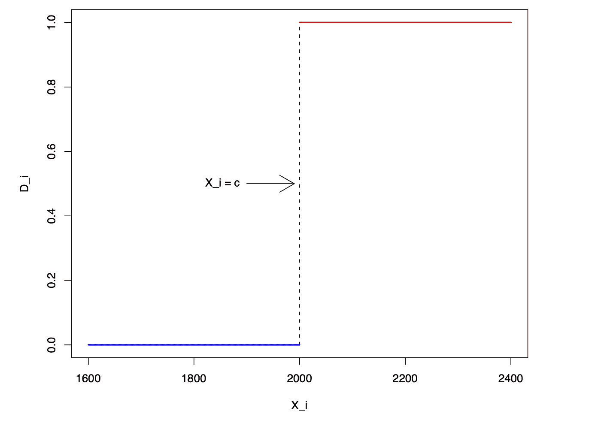
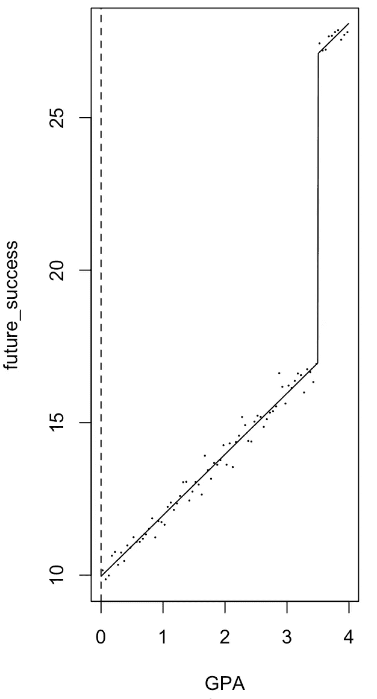

# 回归不连续设计:因果推理皇冠上的宝石

> 原文：<https://towardsdatascience.com/the-crown-jewel-of-causal-inference-regression-discontinuity-design-rdd-bad37a68e786?source=collection_archive---------14----------------------->

## 实验和因果推理

## 带 R 代码的 RDD 完全指南


Photo by [Harley-Davidson](https://unsplash.com/@harleydavidson?utm_source=unsplash&utm_medium=referral&utm_content=creditCopyText) on [Unsplash](https://unsplash.com/?utm_source=unsplash&utm_medium=referral&utm_content=creditCopyText)

> 为什么是哈利？
> 
> B/C 数据科学摇滚！

# **简介**

在一系列的帖子([为什么实验](/why-do-we-do-and-how-can-we-benefit-from-experimental-studies-a3bbdab313fe)、[双向因果方向](/the-chicken-or-the-egg-experiments-can-help-determine-two-way-causality-723a06c37db7)、[陷阱](/experiments-can-be-dangerous-if-you-fall-into-these-pitfalls-c9851848f3ee)、[关联&因果](/the-turf-war-between-causality-and-correlation-in-data-science-which-one-is-more-important-9256f609ab92)、[自然实验](/research-note-what-are-natural-experiments-methods-approaches-and-applications-ad84e0365c75))中，我们已经涵盖了包括什么、为什么以及如何进行实验的主题。不管它们看起来多么令人向往，出于各种原因，不可能对所有类型的商业问题进行实验。

这样做可能是不道德的。假设我们对本科教育对学生未来收入的影响感兴趣。随机分配一些高中生接受教育，而不分配给其他人，这从根本上来说是错误的。

或者，它可能是昂贵的，耗时的，或技术上不可行的。即使是像[网飞](https://netflixtechblog.com/key-challenges-with-quasi-experiments-at-netflix-89b4f234b852)和 [Airbnb](https://medium.com/airbnb-engineering/experimentation-measurement-for-search-engine-optimization-b64136629760) 这样的顶级公司，也无法始终保证随机化在个人用户层面的内部有效性。

在这些情况下，我们不得不依靠其他方法，包括观察和准实验设计，来推导因果关系。回归不连续设计 RDD 作为一种成熟的准实验技术，经历了很长一段时间的休眠，直到最近才强势回归。

在这篇文章中，我们详细阐述了 RDD 的基本概念，如研究意识形态，统计假设，潜在结果框架(POF)，优点，局限性和 R 说明。

# **什么是 RDD？**

首先，这是一种带有[前后测试设计](https://conjointly.com/kb/regression-discontinuity-design/)的准实验方法，意味着研究人员在干预(治疗)之前和之后实施感兴趣的措施。

通过设置一个“截止”点，我们选择略高于阈值线**的受试者为治疗组，略低于阈值线**的受试者**为对照组。由于这两个组在地理上彼此接近，我们可以控制潜在的混杂变量，并将其视为一个 ***好像*** 随机治疗分配。如果潜在结果有任何不同，我们可以将其归因于治疗的存在。**

这种“好像”随机成分使我们相信 RDD 可以像随机对照试验(RCT)一样准确地得出因果推断。

以统计形式:


*哪里*

*Di:受试者是否接受了治疗*

*Xi:强迫(又名得分或跑动)变量*

*c:截止点*

简单地说，如果受试者 I 的 Xi 值高于截止值，则受试者 I 接受治疗。

假设，我们感兴趣的是获得基于成绩的奖学金对学生未来成功的因果影响。主要的评选标准是 GPA:GPA 在 3.5 以上(≥3.5)的都拿到奖学金，线下的都没拿到，不管多接近。换句话说，绩点 3.51 的学生和绩点 3.49 的学生之间没有显著差异。

采用 RDD 框架，我们可以通过以下步骤估计因果关系。

1.  选择 ***勉强*** 有资格获得奖学金的学生(绩点在 3.51 到 3.55 之间)作为治疗组。
2.  选择略低于分数线的学生作为对照组(其平均分在 3.45 至 3.49 之间)。
3.  比较这两组之间的差异。

让我们看一下图解。



Plot 1

*哪里*

*D_i = 1:获得奖学金的人(治疗组)*

*D_i = 0:没有的人(对照组)*

c: GPA = 3.5


Plot 2

从图 2 中，我们可以看到有奖学金的学生用蓝色表示，没有奖学金的用红色表示。


Plot 3: POF and LATE

在拟合回归线之后，我们观察到两条回归线之间存在不连续。因此，我们得出结论，奖学金确实有所不同。

> 结论是:给学生更多的经济支持！

# 潜在成果框架

在其 POF 中，RDD 有以下表示:


该估计值是两个回归函数在分界点 c 处的差值。换句话说，RDD 是在分界点而不是在个体和群体水平上估计**局部平均治疗效果(晚期**)。一些人认为，对 RDD 来说，能够晚测既是一件幸事，也是一个缺点。在试图概括这些发现时要小心。

# **统计假设**

有两个假设。

*   ***1。独立作业。***

潜在受益人或任何其他利益相关者不会影响分配流程。比方说，平均绩点为 3.4 的学生不能告诉管理员将分数线设置为 3.4，这样他/她就有资格。

*   ***2。条件回归函数的连续性***

E[Y(0)|X=x]和 E[Y(1)|X=x]，在 X 中是连续的。而且，条件分布函数在协变量中是光滑的。这一点很重要，因为我们想排除其他协变量在分界点引起不连续性(回归线中的跳跃)的可能性。

# r 插图

我们将使用模拟数据。

这是上例的回归模型:


```
#setwd(“/Users/andy/desktop”)#generate a sample data#cutoff point = 3.5GPA <- runif(1000, 0, 4)future_success <- 10 + 2 * GPA + 10 * (GPA>=3.5) + rnorm(1000)#install and load the package ‘rddtools’
#install.packages(“rddtools”)library(rddtools)data <- rdd_data(future_success, GPA, cutpoint = 3.5)# plot the dataset
plot(data,col = “red”,
 cex = 0.1, 
 xlab = “GPA”, 
 ylab = “future_success”)
```


```
# estimate the sharp RDD model
rdd_mod <- rdd_reg_lm(rdd_object = data, slope = “same”)summary(rdd_mod)Call:
lm(formula = y ~ ., data = dat_step1, weights = weights)Residuals:
    Min      1Q  Median      3Q     Max 
-3.3156 -0.6794 -0.0116  0.6732  2.9288Coefficients:
            Estimate Std. Error t value Pr(>|t|)    
(Intercept) 16.96270    0.06878  246.63   <2e-16 ***
D           10.13726    0.12352   82.07   <2e-16 ***
x            2.00150    0.03330   60.10   <2e-16 ***
---
Signif. codes:  0 ‘***’ 0.001 ‘**’ 0.01 ‘*’ 0.05 ‘.’ 0.1 ‘ ’ 1Residual standard error: 1.025 on 997 degrees of freedom
Multiple R-squared:  0.9577, Adjusted R-squared:  0.9577 
F-statistic: 1.13e+04 on 2 and 997 DF,  p-value: < 2.2e-16
```

估计效果为 10.13，在 0.001 水平显著。

```
# plot the RDD model along with binned observations
plot(rdd_mod,cex = 0.1, 
 col = “red”, 
 xlab = “GPA”, 
 ylab = “future_success”)
```



这是效果的直观表示，我们可以在截止点看到“**跳跃**”。

# 什么时候为什么去 RDD？

*   当随机化不可行时，这是一个很好的选择。
*   非常适合基于规则的问题(例如选举、项目评估等)。).
*   易于在实践中应用，假设不太严格。
*   如果应用得当，具有很强的内部效度和因果效应。

*Medium 最近进化出了它的* [*作家伙伴计划*](https://blog.medium.com/evolving-the-partner-program-2613708f9f3c) *，支持像我这样的普通作家。如果你还不是订户，通过下面的链接注册，我会收到一部分会员费。*

[](https://leihua-ye.medium.com/membership) [## 阅读叶雷华博士研究员(以及其他成千上万的媒体作家)的每一个故事

### 作为一个媒体会员，你的会员费的一部分会给你阅读的作家，你可以完全接触到每一个故事…

leihua-ye.medium.com](https://leihua-ye.medium.com/membership) 

# 喜欢读这本书吗？

> 请在 [LinkedIn](https://www.linkedin.com/in/leihuaye/) 和 [Youtube](https://www.youtube.com/channel/UCBBu2nqs6iZPyNSgMjXUGPg) 找到我。
> 
> 还有，看看我其他关于人工智能和机器学习的帖子。