# word 嵌入层的关键-第 1 部分

> 原文：<https://towardsdatascience.com/the-crux-of-word-embedding-layers-part-1-97e4a612277d?source=collection_archive---------20----------------------->

在[最后一个故事](https://medium.com/analytics-vidhya/essence-of-rasa-nlu-899629a83a89)中，我们讨论了 RASA NLU，这是一个开源的对话式人工智能工具。我们使用 Tensorflow 管道进行意图分类。流水线有不同的组件，如记号赋予器、特征赋予器、实体提取器和**意图分类器**。我们的意图分类器本身有子组件，如 TensorFlow 嵌入。现在我们将讨论嵌入层及其在管道中的重要性。


[Parallel dots](https://blog.paralleldots.com/wp-content/uploads/2018/12/abstract-ai-art-373543-1024x683.jpg)

# 目标

人类可以非常直观地处理文本格式，但是如果我们在一天内生成数百万甚至数十亿个文档，我们不可能让人类执行所有的任务。它既不可扩展也不有效。因此，我们有计算机来执行所有使用机器学习技术的任务。在本文中，我们将讨论各种可用的嵌入层。我们这篇文章的目标是实现这些单词嵌入层。我们将深入了解这些层。

**什么是文字嵌入？**

嵌入不过是把东西从一个维度放到另一个维度。它从高维空间中选取点，放入低维空间。单词嵌入是将文本转换成数字，并且这些数字可能具有相同文本的不同数字表示。简单地说，它是文档(句子)词汇的表示。

**为什么要嵌入单词？**

大多数机器学习算法甚至深度学习架构都能够处理句子或文本。我们可以对每个字符采用基于字符的编码。但是它不会帮助我们理解一个词的意思。

例子:我们来举个例子。一种常见的简单字符编码是 ASCII(美国信息交换标准代码)。

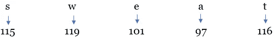

ASCII of sweat

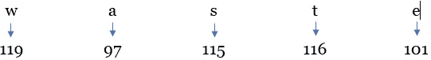

ASCII of waste

所以，你可以看到汗水和浪费的意义是不同的。但是它们仍然共享 ASCII 值。对于计算机来说，这可能是一项令人生畏的任务。

一个词嵌入有两类。

1.  **简单的基于频率的嵌入**
2.  **基于预测的嵌入方法**

a) **计数矢量器&一键编码**

I . count vectorizer 提供了一种简单的方法，既可以标记一组文本文档，构建已知单词的词汇表，还可以使用该词汇表对新文档进行编码。

二。一键编码是将分类变量表示为二进制向量。每个整数值都表示为一个二进制向量，除了用 1 标记的整数索引之外，其他都是零值。

三。余弦相似度是一种度量，用于确定文档的相似程度，而不考虑它们的大小，并且它测量在多维空间中投影的两个向量之间的角度的余弦。

所以以(I，ii，iii)为例

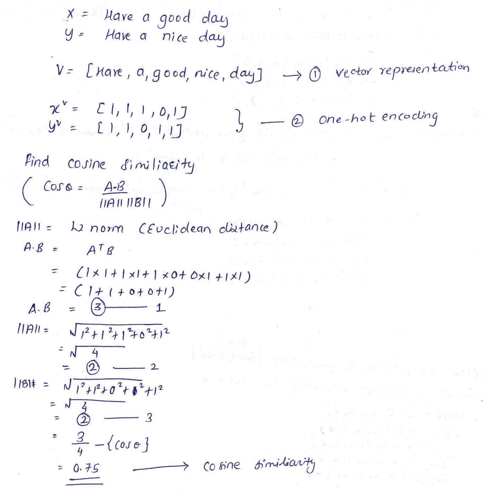

Example

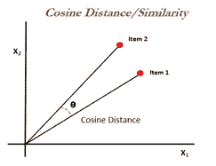

Cosine distance

x 和 y 的余弦相似度是 0.75

b) **TF-IDF 矢量器**

**TF** 表示词频，idf 表示逆文档频率。TF 计算所有项，并对它们一视同仁。

```
TF= term count/document word count
```

**IDF** 代表逆文档频率，表示日志。对数是指数运算的反函数。1614 年，天文学家和数学家约翰·耐普尔首先发现了对数，用来解决复杂的数学运算。

```
IDF = log(number of documents/ number of documents with term)
```

**为什么要日志？**


[Tenor](https://tenor.com/view/jennifer-aniston-thinking-contemplate-agree-yes-gif-3372425)

我们可以将 log 与 **Zipf 定律**联系起来，Zipf 定律是一条经验定律使用数理统计方法制定，并以语言学家 George Kingsley Zipf 的名字命名。它指出，给定一个使用的单词的大样本，任何单词的频率都与其在频率表中的排名成反比。

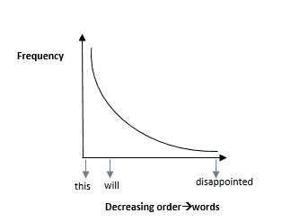

Zipf’s law

TF-IDF 的主要目标是缩小语料库中信息量较少的术语的影响。在语料库中频繁出现但意义较小的术语，如(“this”、“will”)。我们需要降低常用词的权重，同时降低生僻词的权重。

**示例:**假设我们有一个包含 1800 个单词的文档，该文档有 50 个出现术语“apple”的实例。

```
**TF = 50/1,800 = 0.027**
```

现在，假设我们有另一个包含 1000 万个单词的文档，单词“apple”出现了 1250 次，那么 IDF 和 TF-IDF 将是:

```
**IDF = log(10,000,000/1,250) = 3.9****TF-IDF = 0.027 * 3.9 = 0.10**
```

所以现在我们已经减轻了我们任期的分量。

c) **word2vec**

可以说是自 2013 年以来最重要的单词嵌入模型。如果有两个单词 w1 和 w2，并且如果它们相似，那么向量 v1 和 v2 会更接近。Word2Vec 是使用浅层神经网络学习单词嵌入的最流行的技术之一。它是由谷歌的托马斯·米科洛夫于 2013 年开发的。它用于学习单词的向量表示，称为“单词嵌入”，并作为预处理步骤完成，之后学习的向量被输入到模型中，以生成预测并执行各种有趣的事情。

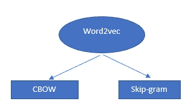

word2vector

Word2vec 构建于:

1.  滔滔不绝的话
2.  跳过克

**一.连续词汇袋(CBOW)**

CBOW 的核心思想是给定的上下文词预测焦点词。

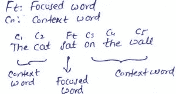

简单来说就是使用目标单词 ft 前后的 n 个单词进行预测。你也可以称之为多类分类器。我们的目标是在给定当前(聚焦)单词的情况下，找到对预测周围单词有用的单词表示。

让我们从神经网络的角度来理解 CBOW(最后😍)

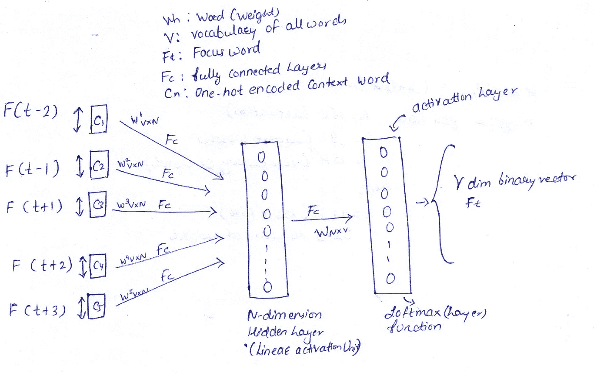

CBOW (NN Intuition)

**二。跳过程序**

Skip-gram 的工作方式与 CBOW 略有不同。我们可以说 skip-gram 是 CBOW 的反义词。skip-gram 背后的核心思想是给出一个聚焦的单词来查找上下文单词。

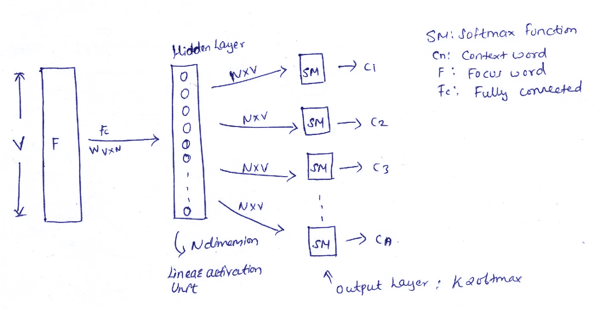

Skip-gram (NN intuition)

Word2vec 提供了在(CBOW 和 skip-gram)之间进行选择的选项。这些参数是在模型训练期间提供的。可以选择使用 softmax 或分层 softmax 层。

现在我们来计算时间复杂度

*   CBOW → 1 软最大值
*   Skip-gram → k softmax

因为 Skipgram 有 k 个 softmax，所以计算量更大。

**利弊**

CBOW:

> 训练速度更快
> 
> 对常用词更有效

跳过程序:

> *较慢/困难/复杂*
> 
> *可以很好地处理较小的数据*
> 
> *对不常用的单词更有效*

**注意:**如果上下文单词增加，维数 N 增加，如果 N 增加，word2vec 工作得更好。

让我们计算重量

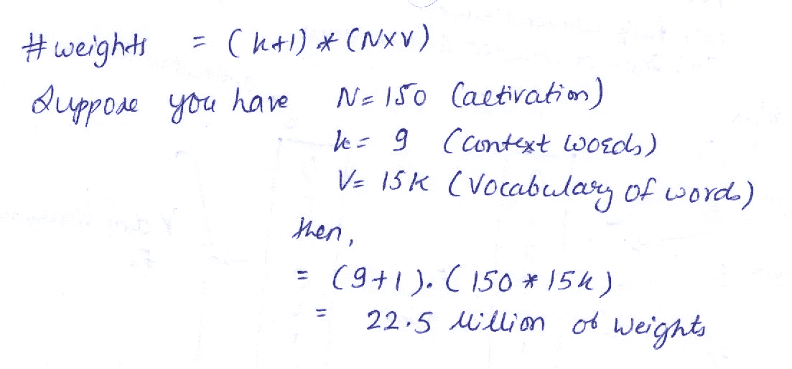

2250 万的重量😧


[Giphy](https://media.giphy.com/media/t9ctG5MZhyyU8/giphy.gif)

> *训练 2250 万个重量需要叶…*

**等等！优化**前来救援☺️

**算法优化简介:**

**分级 softmax**

传统的 softmax 方法在大型语料库上可能是昂贵的。因此，我们将使用分层的 softmax →修改的 softmax 使其达到最优。

分层 softmax 是受(霍夫曼)二叉树(数据结构😋)是由 Morin 和 Bengio (2005)提出的。它本质上是用一个以单词为叶子的分层层来替换平面的 softmax 层。通过使用数据结构，我们最终能够轻松有效地解决问题。

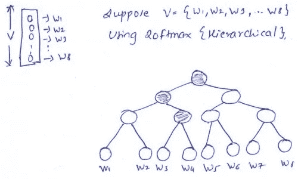

假设我有 8 个包含概率的激活单元(每个单词 wn)。所以 wn 的和将会是 1。我们的任务是找到概率最高的单词。

我只需要 3 个激活单位就能得到我的单词 w3，而不是应用 8 个激活单位。因此，通过使用二叉树方法，我们的时间和计算复杂性大大降低。

```
**log base 2 (8) = 3**
```

**阴性采样**

负采样采用训练样本，并且只修改一小部分权重，而不是所有权重。使用负采样，我们随机选择少量的词来更新权重。

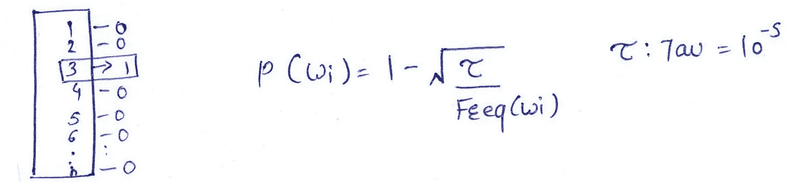

Negative sampling

1.  始终保持目标词(在我们的例子中是 3)
2.  在所有非目标词中，不要更新所有词，只需使用样本。对于采样，我们有一个如上所示的公式。

在下一篇文章中，我们将深入了解算法优化，如 softmax 函数、分层 softmax、负采样、噪声对比估计、快速文本、glove 和脸书的拼写错误遗忘(单词)嵌入(MOE)。

如有疑问，请通过[shubhamdeshmukh @**Yahoo . in**联系作者。如果你对数据科学/机器学习有热情，请随时在](http://shubhamdeshmukh40@yahoo.in/) [LinkedIn](https://www.linkedin.com/in/shubhamdeshmukh619/) 上加我。