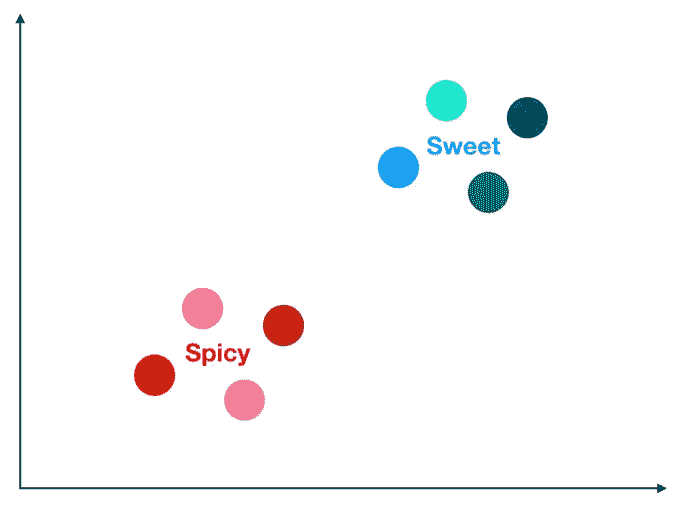
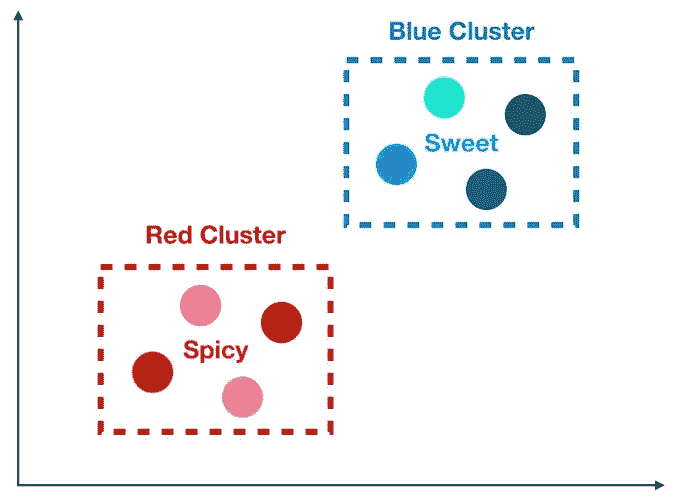
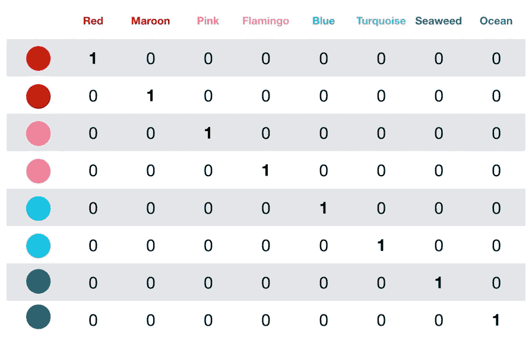
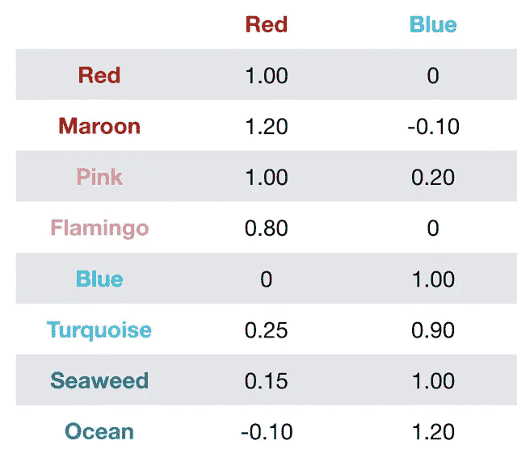
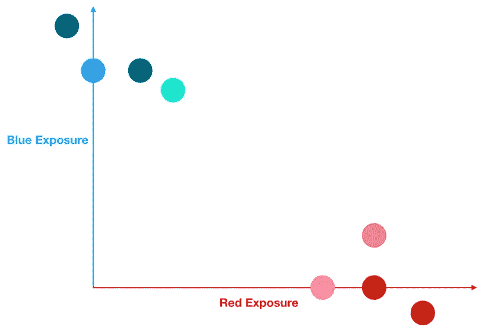

# 维度的诅咒

> 原文：<https://towardsdatascience.com/the-curse-of-dimensionality-50dc6e49aa1e?source=collection_archive---------0----------------------->

Photo by [rawpixel.com](https://www.pexels.com/@rawpixel?utm_content=attributionCopyText&utm_medium=referral&utm_source=pexels) from [Pexels](https://www.pexels.com/photo/six-assorted-color-lollipops-1043519/?utm_content=attributionCopyText&utm_medium=referral&utm_source=pexels)

## 为什么高维数据会如此麻烦

你有没有在给别人讲故事的过程中，或者在对复杂的事情进行冗长的解释时，对方看着你问道:“这有什么意义？”

第一，你的朋友太粗鲁了！

但是我们也站在你朋友的立场上——我们都是忙碌的人，有地方要去，有朋友要见。我们希望我们的信息快速而中肯。

这就是降维的本质。**当面对一大堆数据时，我们可以使用降维算法让数据“切中要害”。**

在之前的一篇文章中，[我介绍了 PCA](/understanding-pca-fae3e243731d) ，这是一种强大而通用的降维算法，可以挖掘我们数据中的潜在趋势。还有其他选择——比如非负矩阵分解、线性判别分析等等(我保证以后会谈到这些)。

然而，今天我们的话题不是关于一个特定的算法，而是关于我们为什么首先需要降维算法——维度的诅咒。

# 什么时候数据是高维的，为什么这可能是一个问题？

维数灾难听起来像是直接来自盗版电影，但它真正指的是当你的数据有太多的特征时。

这个短语是理查德·贝尔曼发明的，用来表达使用暴力(也叫网格搜索)来优化一个有太多输入变量的函数的困难。想象一下，运行一个 Excel 规划求解优化，其中有 100，000 个可能的输入变量，或者换句话说，有 100，000 个潜在的杠杆可以利用(很肯定这会使您的 Excel 崩溃)。

在当今的大数据世界中，它还可以指当您的数据具有大量维度时出现的其他几个潜在问题:

1.  如果我们的特征比观察值多，我们就有可能过度拟合我们的模型——这通常会导致糟糕的样本外性能。
2.  当我们有太多的要素时，观测值会变得更难聚类-信不信由你，**过多的维度会导致数据集中的每个观测值看起来与所有其他观测值等距。**因为聚类使用距离度量[比如欧几里德距离](https://en.wikipedia.org/wiki/Euclidean_distance)来量化观察值之间的相似性，这是一个大问题。**如果距离都近似相等，那么所有的观察结果看起来都一样(也一样不同)，并且不能形成有意义的聚类。**

第二点很重要，所以让我们用一个例子来看看为什么会这样。

# 高维数据诅咒我们的一个简单例子

假设我们的数据集由以下 8 种糖果组成。

Our Two Candy Clusters

事实是，在我们的 8 种糖果的数据集中有两类——辣的和甜的。所以，如果我们所关心的只是得到正确的口味，我们怎么能把我们的糖果聚集在一起，以确保我们永远不会不小心把辣糖给了我们爱吃甜食的朋友呢？

我们可以按颜色分类，如下所示:

Our 2 Color Based Clusters of Candy Flavor

很好，由于我们的聚类，我们知道如果我们吃红色的糖果，它会是辣的；如果我们吃一颗带蓝色的糖果，它会是甜的。

但实际上没那么简单。作为人类，我们能够目测糖果，并很快决定红色意味着辣，蓝色意味着甜。但是，只有当数据正确呈现给机器学习算法时，它才能做到这一点。如果我们的数据看起来像下表，那么我们是幸运的——我们有两个特征，红色和蓝色，它们产生完美的味觉簇，给我们一个完美的模型。

Perfect Clusters

但是如果我们的数据是高维的，如下表所示，那该怎么办呢？

High Dimensional Data Makes Trouble For Clustering

现在我们有 8 种颜色，而不是 2 种。聚类算法可能如何解释这一点？它会查看每一颗糖果，并得出以下结论:

*   每种糖果都有自己的颜色。
*   *作为一个算法(没有经过特殊训练)，* ***不知颜色之间的关系。*** *比如，不像人类，我不知道粉色比绿松石更接近红色。*
*   ***给定这组特征，我推断有 8 个聚类，并且它们彼此都同样相似。***
*   ***我还得出结论，在我的 8 个聚类中，4 个是辣的，4 个是甜的。***

那一点用都没有。诚然，糖果都是不同的颜色，但这个结论并没有让我们比我们开始时过得更好。再读一遍最后一点——它只是重申了我们已经知道的数据集。我们对如何预测给定的糖果是辣的还是甜的一无所知。那么我们该如何解决这个问题呢？

# 降维拯救

下面是降维工作原理的典型例子。这并不意味着解释一个特定的算法，而是一个简单的例子，展示了维数约减算法遵循的一些原则。

Each Feature’s Exposure to the Latent Features

**算法首先定位我们特征中的潜在趋势**——这些可以是文本数据中的体育或政治等主题，或者时间序列数据中的主要趋势([参见我的理解 PCA 博客帖子以了解更多关于此的细节](/understanding-pca-fae3e243731d))。**对于我们的糖果数据集，潜在的趋势很可能是红色和蓝色这两种原色。在数据科学中，隐藏在我们特征中的这些潜在趋势通常被称为潜在特征。**

接下来，该算法根据上表中这些潜在特征的暴露程度来估计和重写每一个其他特征。

让我们根据每种糖果的潜在特征曝光度(上表中的数值)来绘制它们的图表——回想一下，每种糖果都有自己独特的颜色:

Each Candy Plotted According to its Latent Exposures

不错！从上面的图中可以很清楚地看出，使用我们的潜在特征(红色和蓝色)让我们产生了两个有意义的集群。最后，我们可以查看每个聚类，并计算有多少糖果是辣的，有多少是甜的，并使用这个频率作为我们预测的基础。

因此，我们的糖果辣/甜模型看起来如下所示:

1.  给定一种新糖果，**记录它的颜色。**
2.  将其颜色转换为红色特征和蓝色特征的曝光——换句话说，**根据我们的潜在特征重写颜色。**
3.  使用我们的新糖果的潜在特征曝光，**使用距离度量，例如[欧几里德距离](https://en.wikipedia.org/wiki/Euclidean_distance)，计算出它是否更类似于红色糖果集群或蓝色糖果集群**。
4.  如果我们的模型将它放在红色聚类中，我们预测新的糖果是辣的(因为我们原始数据集中所有的红色聚类糖果都是辣的)。如果我们的模型把它放在蓝色的聚类中，我们预测新的糖果是甜的(因为我们原始数据集中所有的蓝色聚类糖果都是甜的)。

# 结论

今天，我们看到了太多的特征会如何混淆某些机器学习算法，如聚类算法。我们看到了降维是如何帮助恢复秩序的。

在混乱、嘈杂的数据和复杂关系的真实世界中(不像我们简单的糖果)，降维代表了一个更健壮的模型(希望如此！)和较低的可解释性([我的 PCA 博客文章对此进行了更详细的讨论——查看标题为“将所有这些联系在一起的示例”的部分](/understanding-pca-fae3e243731d))。

所以请记住，虽然我们有一个工具来对抗维数灾难，但是使用这个工具是有代价的。干杯！

[***如果你总体上喜欢这篇文章和我的写作，请考虑通过我在这里的推荐链接注册 Medium 来支持我的写作。谢谢！***](https://tonester524.medium.com/membership)