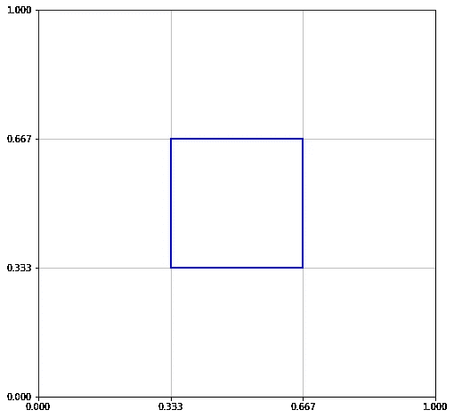
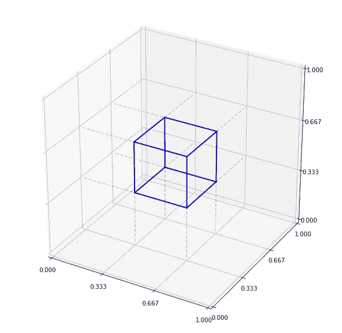
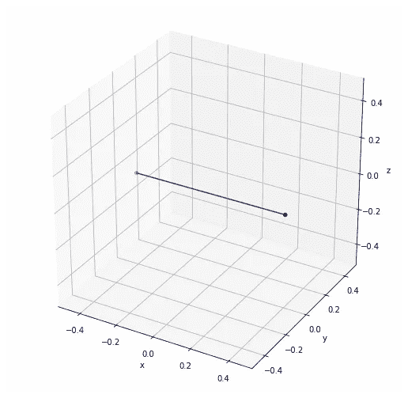
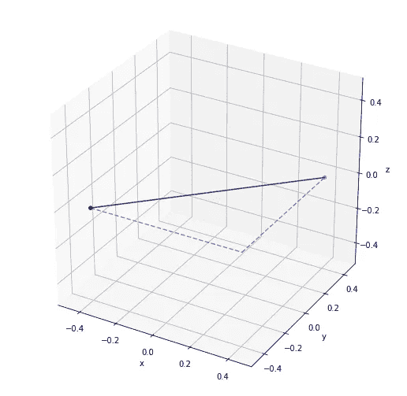
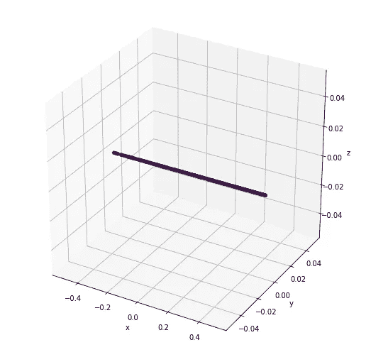
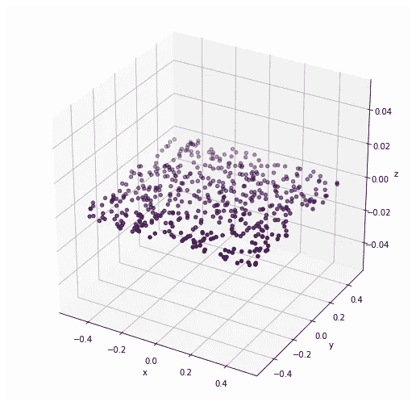
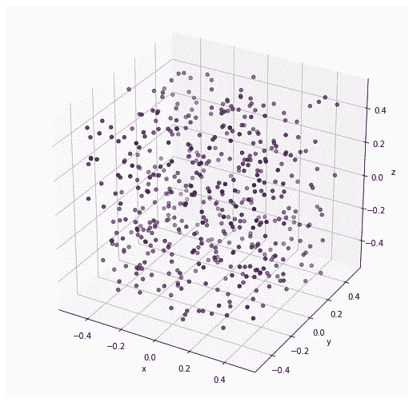
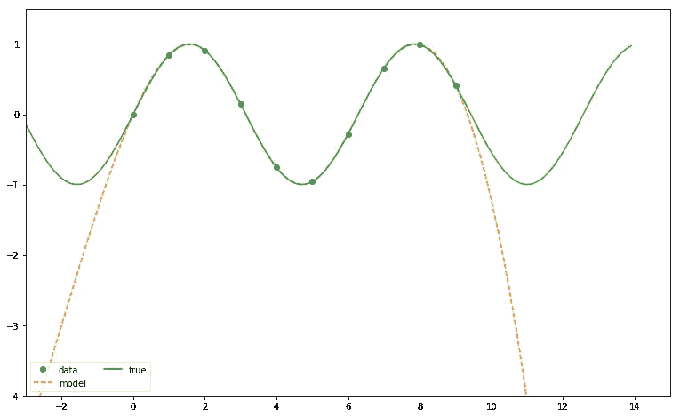
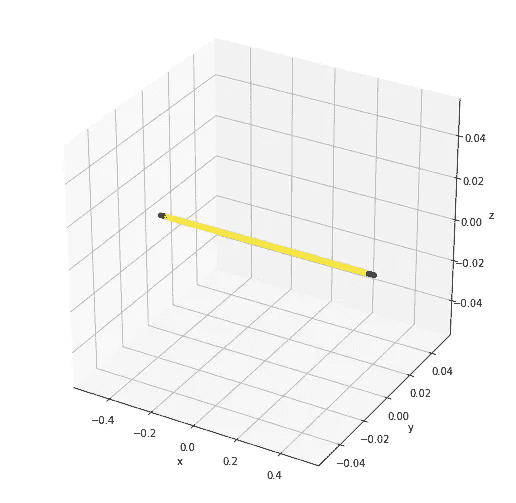

# 维度的诅咒

> 原文：<https://towardsdatascience.com/the-curse-of-dimensionality-f07c66128fe1?source=collection_archive---------10----------------------->

## [AI/ML 实用性](http://towardsdatascience.com/tagged/ai-ml-practicalities)

## 怪异的事情发生在更高的维度。即使是有用的信息也可能使机器学习模型过载。

*本文是* [*AI/ML 实用性*](/ai-ml-practicalities-bca0a47013c9) *系列的一部分。*

Photo by [MontyLov](https://unsplash.com/@montylov?utm_source=unsplash&utm_medium=referral&utm_content=creditCopyText) on [Unsplash](https://unsplash.com/s/photos/curse?utm_source=unsplash&utm_medium=referral&utm_content=creditCopyText)

我们大多数人都有非常合理的直觉，认为信息越多越好。例如，我对潜在借款人了解得越多，我就能越好地预测该借款人是否会拖欠贷款。令人惊讶的是，这种直觉是错误的，有时错误得惊人。

[我已经单独写了](/ai-ml-practicalities-more-data-isnt-always-better-ae1dac9ad28f)额外的信息可能比无用的信息更糟糕，因为数据样本中的字段可能以误导的方式聚集或关联。这种不相关或随机的偶然效应会掩盖真实的效应。

事实上，事情变得更糟。额外的信息即使有用也会引起问题。这个令人惊讶的事实是由于只在高维度中出现的现象，被称为*维度的诅咒*。

(注意:如果你对更高维度的概念感到不安，[这篇文章](/if-multi-dimensional-hurts-your-brain-c137c9c572d6)可能会有所帮助。)

# 掉进兔子洞

诅咒是一系列依赖于问题细节的效应。下面我将详细介绍其中两个最大的问题。不过，所有这些都与高维空间的直觉延伸效应有关。所以，我想从一个简单的智力游戏开始。

让我们看看随着输入数量的增加，输入空间会发生什么变化。*输入空间*是一个奇特的术语，指所有可能的输入组合，不管它们是否真实。

假设我们试图只用一个输入特征来预测一个结果。我们的输入空间由该特征的所有可能值组成。让我们来看看下面三分之一的可能值，用蓝色条表示:

1/3 of feature range = 1/3 of input space

很明显，输入的所有可能值的三分之一包含在该输入范围的中间三分之一。并且，因为只有一个特征，所以它也包含所有输入组合的三分之一，即输入空间的三分之一。

当我们添加第二个特性并将它的可能值分成三份时，我们可以画一个正方形来表示一个范围，该范围覆盖了这两个特性中每一个的可能值的三分之一:

1/3 of each feature range = 1/9 of the input space

这里，输入空间有两个值，每个要素一个值。虽然这个框包含了每个特性的三分之一的可能值，但是它只包含了九分之一，或者所有可能值组合的 11%。

添加第三个特征使我们的立方体再次覆盖了每个特征范围的三分之一，但是现在只有 1/27 或大约 4%的输入空间:

1/3 of each feature range = 1/27 of the input space

我们无法想象超过三个维度，但是我们可以计算。一旦我们达到十个特征，等效的框将包含不到千分之一的输入空间。有了 20 个特征，该框将包含不到百万分之一的输入空间。有了 50 个特征，我们已经超过了万亿分之一。

然而，这些代表输入空间的极小部分的小盒子仍然代表了每个维度的三分之一的可能值。

虽然盒子很小，但是它们有很长的边！

怪异。对吗？

# 高维=稀疏

为了理解为什么这很重要，让我们换一个更容易思考的效果。

假设我们有一个 500 个数据点的样本，让我们探索一下当我们获得关于每个数据点的更多信息时，即当我们添加维度时，会发生什么。

添加关于每个数据点的更多信息为数据点之间的不同创造了新的方式。因此，它增加了数据点之间的可能距离。

Each new dimension creates an opportunity for two data points to differ in a new way — i.e. to be farther apart from each other

只有一条信息，我们的 500 个数据点看起来几乎是连续的。

对于每个数据点的两条信息，点之间的平均距离大约是两倍:

对于三条信息，它们之间的平均距离是四倍:

尽管我们无法想象更高维度，但数学告诉我们，点与点之间的距离会继续增长。有了 50 维，点与点之间的平均距离将是只有一维时的 20 多倍。

# 稀疏=误差

用非常简单的话来说，机器学习的基本策略是通过查看相似的数据来进行推断。一些模型，像 [*k-* 最近邻](https://en.wikipedia.org/wiki/K-nearest_neighbors_algorithm)，甚至明确地这样做。

用数学术语来说，“相似”就是接近的意思。随着我们对每个数据点了解得越来越多，我们发现它们之间的距离越来越远。因此，我们被迫从越来越不相似的数据中做出推论。

然而，并非所有的距离都同等重要。有些特征比其他特征更能告诉我们想要推断的东西。机器学习的工作是揭示这些差异和无关紧要的负重距离。但是，随着维度数量的增加，数据以指数方式变得更加稀疏，真正的差异被随机变化(噪声)掩盖了。

您可以通过获取更多的训练数据来解决这个问题。但是，过了某一点，这几乎是不可能的。在我们的示例中，要保持相同的数据密度，每增加一个维度需要 500 倍的数据。在 50 维，你需要的数据点比宇宙中的粒子还要多！

顺便说一下，最近邻居遇到了另一个奇怪的问题。如果数据存在随机变化，增加多个维度可以使所有点之间的距离大致相同。因此,“邻居”的概念就消失了。

# 一切都是异数

在统计分析中，与其他数据显著不同的数据点称为异常值。这些极端事件造成了很多麻烦。

首先，很难知道异常值是否代表了被测量的东西或我们如何测量它的统计变化。我们可能会问，婴儿出生时体重 12 磅的可能性有多大？还是称出了故障？甚至对于统计学家来说，丢弃离群值以防止混淆统计模型也是很常见的。

此外，数据集边缘附近的推理永远不会像中心附近那样有效。弄清楚两个已知案例之间发生了什么比想象已知案例之外发生了什么要容易得多。

在以下示例中，从正弦波(绿线)中采样了 10 个点。一种名为“[三次样条](https://en.wikipedia.org/wiki/Spline_(mathematics))”(橙色虚线)的技术在数据点之间的曲线插值方面做得很好，但在边缘处完全放大了。

Modeling at the edges of a dataset is much harder!

这是一种人为的情况，但它只是每个机器学习模型都会发生的一个极端例子。

在高维空间，这是一个更大的问题。考虑到这么多方面，事实证明几乎每个数据点在某种程度上都是异常值。让我们进行同样的一次一个维度的演练，看看发生了什么。

下面是我们在稀疏部分看到的相同数据。极端数据点以紫色突出显示。为了这个例子的目的，我们将考虑一个极值，如果它在所有观察值的最低或最高的 2.5%。

In one dimension, 5% of the data points are extreme

添加第二维度后，我们现在突出显示其值在二维度中的任一维度或二维度中都为极值的数据点。

In two dimensions, 9.75% of the data points are extreme

至少在一个方面极端的数据点比例几乎翻倍，从 5%增加到 9.75%。

对于三个维度，异常值的百分比上升到 14.26%:

In three dimensions, 14.26% of the data points are extreme

再说一次，我们无法想象三维以外的情况，但是我们可以做数学计算。在 10 个维度中，40.13%的数据点在至少一个维度上是极端的。在 100 个维度中，99.41%的数据点在至少一个维度上是极端的。

Outliers form an “outer shell” of the dataset

再次查看二维图，我们可以用另一种方式描述异常值。它们是靠近数据集边缘的点，形成一个“外壳”。

在高维空间中，几乎所有的数据都在外壳中。这意味着，“邻域”通常会延伸到多个维度的外部边缘，机器学习模型几乎总是需要外推，并且很少有其他数据点会与任何给定的数据点“相似”。

# 厄运和黑暗？

尽管存在诅咒，但机器学习的许多最大成功都来自高维领域。

在图像识别中，每个像素通常是一个维度。垃圾邮件过滤器和机器翻译通常将语言中的每个单词视为一个维度。然而，在这些领域，机器学习产生了惊人的结果。怎么回事？

首先，在成功的地方，数据是丰富的。谷歌在机器翻译领域占据主导地位并不奇怪。他们已经把网上所有的文件都编目了！

第二，与我上面使用的三次样条方法不同，图像识别和翻译中使用的模型是为解决高维度问题而设计并不断改进的。

第三，当数据中的数据变化很大时，高维度问题最糟糕。但是许多，也许是大多数，数据集至少在某些维度上有高度的规律性。这种效应被称为“一致性的祝福”，它在一定程度上消除了维数灾难。

注意:示例中的数据集在所有维度上都是独立的标准正态分布。