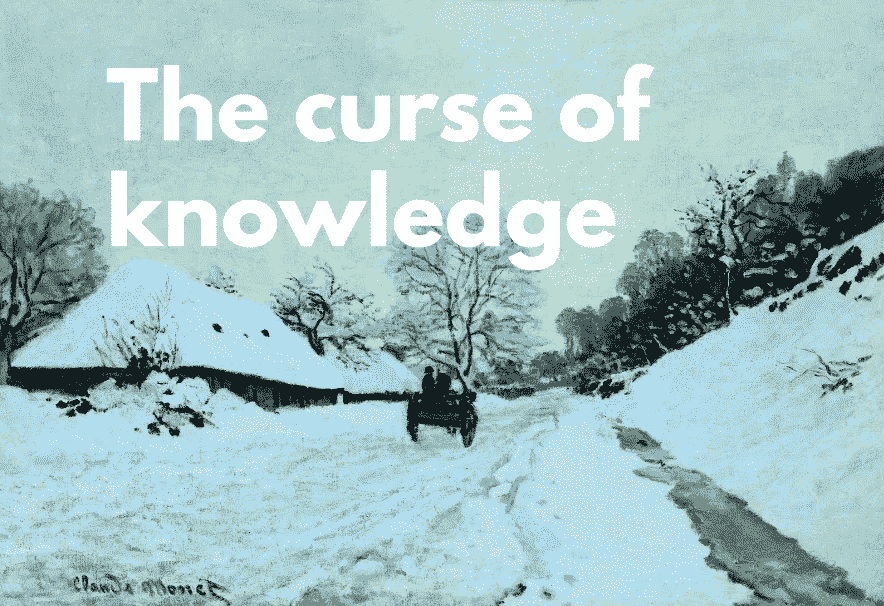

# 知识的诅咒

> 原文：<https://towardsdatascience.com/the-curse-of-knowledge-8deb4769bff9?source=collection_archive---------26----------------------->

Claude Monet, Cart on the Snow Covered Road with Saint-Simeon Farm, 1865

> 为什么有能力的人往往教学这么差？事实证明，专业知识伴随着认知障碍，这使得很难将高级知识转移给其他人。

一个三岁的男孩来到实验室，坐在一张桌子旁。实验者给了他一盒聪明糖。他很兴奋。他打开盒子，发现盒子里装的不是智能玩具，而是铅笔。所以孩子很惊讶。实验者把铅笔放回盒子里，关上盒子，放回桌子上。他说:好的，现在另一个小男孩要进来了，杰森。杰森认为盒子里有什么？而男孩会说*铅笔*。当然，尽管杰森无法知道盒子里装的是铅笔，但男孩知道，但新来的男孩不会知道。事实上，如果你问他，当你走进房间时，你认为盒子里是什么？他会说铅笔。现在他知道了，就再也无法恢复他曾经不知道的那种天真无邪的状态了。”—史蒂芬·平克，*21 世纪的语言学、文体与写作* [4]。

“知识的诅咒”一词是经济学家科林·卡默勒、乔治·洛温斯坦和马丁·韦伯在 1989 年的《政治经济学杂志》上发表的一篇文章中创造的，用来描述一种认知偏见，这种偏见使人们将自己对世界的知识和经验投射到他人身上。知识的诅咒使我们很难准确地重建我们以前的、知识较少的精神状态，在这种状态下，我们不知道或不理解某些东西。实际上，我们有一种强烈的倾向，不知不觉地认为别人知道我们知道的东西，或者认为学习它比实际上更容易。在他关于后见之明偏差的论文中，人们倾向于认为已经发生的事件比事件发生前的实际情况更可预测，菲施霍夫提出理论，认为在知识较少的状态下无法与自己产生共鸣是因为我们“锚定在接受知识所产生的后见状态中”[5]。

Richard Fisher 在他的文章中指出，在 20 世纪 80 年代，一些行为经济学家观察到了这一现象，当时汽车销售人员错误地判断了他们的汽车可以赚多少钱。因为他们对自己的汽车了如指掌，他们无意识地认为他们的顾客也是如此，包括汽车的缺陷。然而，事实上，无知的顾客会很乐意支付更多的钱。

加州斯坦福大学的帕梅拉·海因兹是最早研究这个问题的心理学家之一。在她的一个实验中，她让有经验的销售人员估计一个新手需要多长时间学会如何使用手机完成一系列任务。她发现专家们大大低估了所需的时间。平均来说，不熟练的新手花的时间是预期的两倍。“这些研究的结果表明，专家可能有认知障碍，导致低估新手面临的困难，而具有中等专业水平的专家可能更准确地预测新手的表现”[1]。由新手和中级用户组成的另外两个组被问了同样的问题。两者都给出了更好的估计。

为什么我们如此不善于猜测别人知道什么？为什么很容易低估一个人学会一件事需要多长时间？首先，我们必须承认，仅仅因为你知道一些事情，而你的观众不知道，你们两个之间一定有差距。提炼多年的经验很难，因为很多时候不容易用语言表达出来。肌肉记忆、精神习惯、无意识偏见都起着主要作用。

在讨论优秀写作的挑战时，史蒂芬·平克注意到，作者根本没有想到，读者没有学会他们的行话，不知道中间的步骤，这些步骤似乎太明显而不能提及，也不能在作者的脑海中想象出当前的场景。实际上，他们懒得解释行话，阐明逻辑，并为读者提供具体的细节和例子。平克接着说，不幸的是，这种情况甚至在为专业同行写作时也会发生，他举了以下《认知科学趋势》杂志上一篇论文中的一段话作为例子:

有意识知觉的缓慢和整合的本质在行为上得到观察的证实，如“兔子错觉”及其变体，其中刺激最终被感知的方式受到原始刺激后几百毫秒发生的刺激后事件的影响

“我干这行快四十年了，我根本不知道他们在说什么。”

在日益复杂、瞬息万变的信息时代，传递知识的能力极其重要。因此，知识的诅咒给我们的现代文明提出了一个棘手的问题。正如我们所看到的，已经掌握知识的老师，常常不能以适合于那些还没有掌握知识的人的方式来传授知识。正如 Chip 和 Dan Heath 补充的那样，在商业世界中，经理和员工、营销人员和客户、公司总部和一线，都依赖于持续的沟通，但却遭受着巨大的信息不平衡。

> 费希霍夫的理论认为，在知识较少的状态下，我们无法与自己产生共鸣，是因为我们“被固定在接受知识所产生的后视状态中”。

# 我们能做些什么呢？

幸运的是，我们可以做一些事情来减少负面影响。平克说，一个传统的解决方案是始终让你的读者保持警惕。“也就是说，要和读者强调，从她的角度看世界，试着感受她的痛苦，穿着她的鹿皮鞋走一英里路。”然而，他补充说，这并不总是有效的，因为许多心理学研究表明，我们不太擅长弄清楚别人知道什么，即使我们非常非常努力地尝试[原文]。一个更好的解决方案是直接吸引你的观众，并获得尽可能多的反馈。把你的草稿给你的学生或同事看，甚至在一段时间后给你自己看，材料已经不熟悉了。“如果你和我一样，你会发现自己在想‘这不清楚’或者‘我这么说是什么意思？’，或者经常说，“谁写的这些垃圾？””平克开玩笑地说。然后，重写材料(最好是几次)，记住许多你的听众可能不知道的事情，同时，不要假设你的听众已经知道一些事情。

第二条重要的建议来自 Chip 和 Dan Heath 的畅销书 *Made to Stick，*该书教导如何创造出持久并“留在”观众记忆中的创意。作者说“具体的语言和故事打败了知识的诅咒。”根据希斯兄弟的说法，这种具有强烈形象化的想法更容易理解和记忆。"语言常常是抽象的，但*生活*并不抽象."因此，作者建议用简单的语言和尽可能多的例子来表达复杂的思想，同时避免过于抽象的语言。

最后，承认并拥抱你的无知。不出所料，看到知识的诅咒的一个更明显的地方是在教室里。不列颠哥伦比亚大学的心理学家苏珊·伯奇说:“这是一种矛盾的说法，但无知在教育中可以是一种美德。”。要把你的知识传递给别人，你不仅要把多年的经验提炼成文字，这本身就够难的了，而且你还需要从新手的天真角度看待事物。"有时，经验不足的老师能更好地在恰当的层面传达信息。"

无知是福。

# 参考

1.  Hinds，P. J. (1999 年)。专业知识的诅咒:专业知识和去偏方法对新手表现预测的影响。*实验心理学杂志:应用*， *5* (2)，205。
2.  理查德·费希尔。不要自作聪明:知识的诅咒。*新科学家。*
3.  奇普·希斯，丹·希斯。为什么一些想法存活下来，而另一些却死了。*兰登书屋。*
4.  [史蒂芬·平克。21 世纪的语言学、文体和写作。](https://www.youtube.com/watch?v=OV5J6BfToSw)
5.  [奇普希斯，丹希斯。知识的诅咒。*哈佛商业评论。*](https://hbr.org/2006/12/the-curse-of-knowledge)
6.  巴鲁克·菲施霍夫(1975 年)。“后见之明不等于先见之明:不确定条件下结果知识对判断的影响”。*实验心理学杂志:人类感知与表现*。**1**(3):288–299。