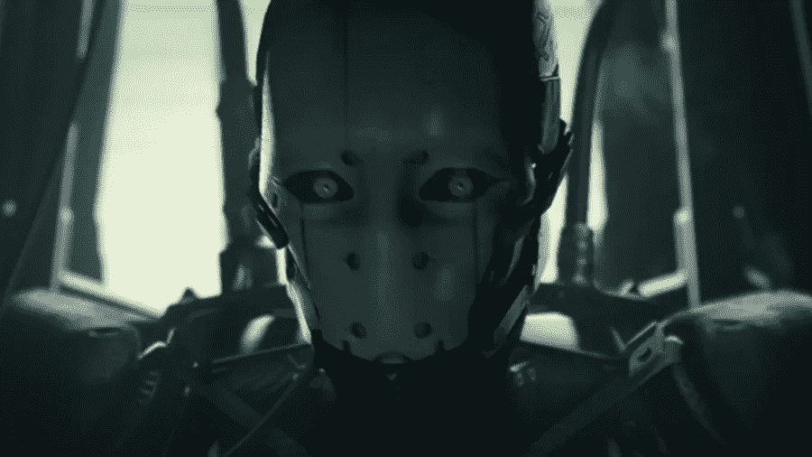

# 人工智能在招聘中的危险(及 3 点建议)

> 原文：<https://towardsdatascience.com/the-danger-of-artificial-intelligence-in-recruiting-and-3-suggestions-7fcc73389903?source=collection_archive---------22----------------------->

我最近遇到了人工智能在招聘中最用心良苦、也最令人不安的应用之一；一个会说话的机器人头被认为是避免面试中偏见的解决方案。想象一个 Alexa 大小的机器人，上面画着一张真实的人脸。脸变了，试图表现出表情和非语言的暗示。

就像许多第一次尝试从技术上解决人类问题一样，过度应用技术和公众不准备在如此严峻的应用中接受这种程度的“我，机器人”(我正看着你谷歌眼镜)，很容易令人痛苦地错过目标。

机器人的宣传视频以一个戴头巾或 khimar 的女性开始。她在回答典型的面试问题时，对自己的技能、培训和教育给予了积极的回应。她应该是个重要的候选人，对吧？她的白人面试官可不这么认为，他们很难看出她的“健康”。直到最后，有人听到她的话，她的经历，她的价值。有人吗？某件*事*。进入面试机器人。

看着这段视频，穆斯林妇女一次又一次地被歧视，然后被一个字面上的会说话的头带着惊讶和宽慰接受和欢迎，我不禁努力想象一个候选人会对这样的面试感到高兴和投入。想象一下潜在的非故意的信息，一个已经代表不足的候选人可能有被歧视的历史，不值得一个真正的人类同胞的时间或考虑(感知是现实，不管意图的纯度)。我希望我们的目标是足够好地理解偏见并克服它，利用技术来增加和加强我们的人际关系，而不是简单地试图用技术来交换人。要是让我们的文化超越种族歧视有那么容易就好了。

说到这个…

# 我们怎么知道算法不是种族歧视？

比机器人应该在世界上最人性化的行业之一(招聘)中取代人类更令人担忧的是，许多人接受并在算法是客观的、不受过去经验影响的前提下操作，而且，嗯，是机器人。事实上，这很可能是有偏见的，与它首先试图解决的问题背道而驰。

这可能是由多种原因造成的，但我们只简单分析两个原因。

首先，编写代码的开发人员本身主要是白人男性，这导致在我们了解模式和行为之前，潜在的对底层代码的偏见。

> “就其本质而言，算法会带有某种偏见……每当你在纸上、印刷品上或代码中表达一个想法时，这个想法就会以一种单方面定义的方式出现，必然带有某种偏见。”Dipayan Ghosh，哈佛大学肯尼迪学院新美国和 Shorenstein 中心的研究员。

其次，AI/机器学习是在海量数据集上训练的。根据定义，这些数据来自历史行为，事件，甚至是成功的衡量，等等，我们普遍认为这些数据包含偏见，这就是为什么我们首先要解决这个问题。我们如何开发一个基于有偏数据的客观算法？

> “如果您使用反映现有和历史偏差的数据，并要求数学工具基于该数据进行预测，预测将反映该偏差。”——Rachel Goodman，美国公民自由联盟种族公正项目的律师

不要误解我，我完全支持和认可这些努力背后的思想和他们试图解决的问题。偏见，无论是隐性的还是显性的，在面试过程中(或任何地方)都是没有位置的，我赞扬开发人员试图解决这个普遍而隐蔽的社会问题。这项技术和其他相关技术有一个难以置信的机会来解决招聘中猖獗的一些问题，偏见是一个非常重要的问题。

从筛选到评估到日程安排，甚至聊天机器人实时回答候选人的常见问题等等，招聘人员利用这些新兴技术的潜力很大。但我也在确保保持人力资源中的“H”的阵营中，并且我是在雇主品牌、讲故事和招聘中包含和展示人、真诚互动和员工故事的坚定支持者，所以我喜欢寻找这两者如何真正协同工作。

# 设定期望值的重要性

成功最关键的一步是设定现实的内在期望。作为术语人工智能(以及相关术语，如算法、机器学习等。)在集体意识中上升，与从自动驾驶汽车到投资到寻找下一个公寓的所有事情联系在一起，似乎有一种相应的想法，即它们是为你做所有事情的“一劳永逸”的系统。

没有灵丹妙药。人才市场竞争异常激烈，购买最新的玩具不会让你的所有候选人突然接受你的提议。但它能做的是，让你的团队腾出更多的时间来从事更有价值的活动，在减少采购和招聘过程中的偏见方面发挥积极作用，并在不增加(事实上，往往更少)工时的情况下，提供更加简化、更具吸引力的候选人体验。

在所有具备颠覆条件的行业中，人才收购是最人性化的行业之一，如果不是最人性化的话。我们的角色是关系的媒人，这将占据你意识时间的绝大部分；你的事业。你可能比你的家人或其他重要的人花更多的时间和你的同事在一起。你的工作对你的精神、身体和财务健康有着根本性的影响。你工作场所的文化可能会让你在早上兴奋不已，或者在你考虑回去的时候沉浸在周日的忧郁中。如果我们有办法做到这一点:

*   较好的
*   更有效地
*   更有效地
*   更少的偏见
*   随着更多的交流
*   更加个性化

我全押上了。但是，当产品和推销以及未经充分思考的“解决方案”冲击市场和你的收件箱时，你怎么知道从哪里开始呢？我建议我们从确定一些我们希望用技术解决/改进的核心问题开始，并回到正确的方法，用更先进的工具集成我们的人类团队。毕竟，你不会想走进手术室，却发现一个全自动手术机器人在没有人类监督和控制的情况下准备切开你的身体。同样，候选人不希望感觉他们正在被筛选、选择，并被算法认为有价值或没有价值。我们身处的是一个关系行业，关系，无论好坏，都是与他人建立的。

# 您可以从三个方面入手

清单很长，很容易做很多事情，却没有做得特别好。而在我开始之前，我先承认，这些并不都是“AI”。

先说三个。名单上还有很多，所以我不认为知道“正确”的三个，但我认为这些都是唾手可得的果实，从招聘人员和候选人的角度来看，都可以加快和改善往往是艰巨而痛苦的招聘过程。我将这些概括为:

1.  偏见
2.  时间
3.  沟通

# 偏见:增加候选人渠道的多样性

我们都有偏见，有些人(比其他人)更有偏见，但它以你可能没有意识到的方式影响了这个过程，从某人在哪里上学到他们是否和你从事同样的运动。幸运的是，现在有一些系统和平台允许对技能和能力进行评估，而不考虑教育背景、GPA 或其他历史证书，这些证书在很大程度上被证明与该角色的表现没有任何关联。这些正在被大型知名品牌广泛使用，是扩大你的人才库和发现最佳人才的好方法，不会产生偏见。

# 时间:增加对增值活动的关注。

你的团队花了多少时间来(重新)安排面试，回答候选人同样的问题，整理简历……这样的事情不胜枚举。有一些很棒的解决方案可以帮你摆脱这些，这样你就可以把时间花在你最擅长的事情上；居然招人！让人们决定接受还是不接受这份工作的是与人的对话，以及他们与招聘人员和面试团队中其他人的互动，但他们可能会因为人力资源部门的过度工作和人手不足而错过这个过程。让人工智能处理分析简历、安排面试，你可以专注于在你的优势所在之处产生最大的影响。更进一步，你可以拥有一个永远在线的人工智能聊天机器人，通过桌面或文本来回答候选人的问题和状态更新请求，这导致

# 沟通:实际去做

从两面来看，我们都很清楚投简历和职位空缺之间众所周知的“黑洞”,以及整个面试过程中经常出现的有限(或完全缺乏)沟通。

以我们现有的技术，绝对没有任何借口或理由这样做。至少，当收到申请时，当申请在 ATS 中从一个阶段进入另一个阶段时，以及一旦做出决定时，你应该与你的候选人保持联系(补充说明:这些需要从股票模板样板中重写，以你的品牌声音出现，哦，这是一个多么棒和意想不到的文化视频！)

关于这个话题还有很多可以写的，但是我想加入这个话题的讨论，并且很乐意阅读/回应任何评论、问题、观察等。！