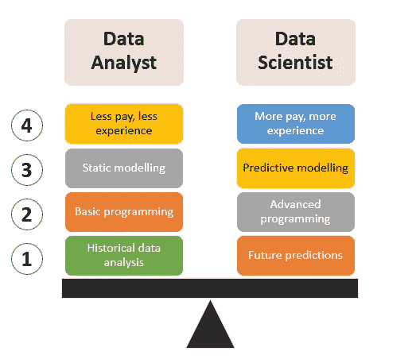

# 数据分析中标题游戏的危险

> 原文：<https://towardsdatascience.com/the-danger-of-title-play-in-data-analytics-b94e92c49c53?source=collection_archive---------9----------------------->

## 我对数据初级人员和专业人员的建议

## 在谷歌，你的头衔并不重要。你的工作有！

Source: Unsplash

> “你是一名数据分析师，为什么要做机器学习？”

一个应届毕业生问我。在他心目中，我把自己的头衔定为数据分析师真的很奇怪。他毕竟是一家大型电子商务初创公司的数据科学家/机器学习工程师。这两个头衔目前在数据分析领域享有盛誉。

然而，在谷歌，头衔并不重要。不管你是数据分析师还是软件工程师。如果你的日常工作需要，他们会希望你使用机器学习。尽管我称自己为分析师，但我仍然扮演着技术角色。我从 Gmail 和 Chrome 作为数据源，用计算机视觉、图像识别、机器学习来检测钓鱼攻击。

在传统定义中，我是一个完整的数据科学家，提取数据，然后用产品可维护代码生成洞察/模型。

# 数据分析师和数据科学家的传统定义。

From Skillfin Learning

当我开始我的数据科学之旅时，我作为一名数据科学家在 Lazada 实习。在 Lazada，他们有两种类型的数据科学家:

1.  使用 excel 或 dashboard viz 工具生成图表和业务见解的数据科学家。
2.  使用机器学习和统计严谨性来分析数据和发现见解的数据科学家。

他们都被称为数据科学家，处理数据，但本质上角色是不同的。根据 Skillfin 的定义，他们将 1 号称为数据分析师，2 号称为数据科学家。一些创业公司称 1 号为初级数据科学家。[当然，后者](https://www.simplilearn.com/data-science-vs-data-analytics-vs-machine-learning-article)是你作为数据科学家通常期望从事的工作。

# 肮脏的标题游戏

Source unsplash

## “数据科学家”头衔的滥用

似乎随着数据科学家这个头衔的不断演变，它变得越来越饱和。5 年前，在新加坡，数据科学家的头衔并不突出。然而，随着数据趋势变得越来越大，许多研究人员、顾问和教育家也加入了这一趋势，并承担起数据科学家的角色。

这导致很多创业公司滥用了“数据科学家”这个头衔。因此，数据科学家这个术语被越来越多地滥用。如今，我们可以看到一些数据科学家[已经将自己](https://www.datanami.com/2019/04/17/data-scientist-title-evolving-into-new-thing/)更名为机器学习工程师或研究科学家。

作为人类，我们是天生的简化论者，我们总是想简化事物，以便更容易理解。如今，许多公司将他们的工作描述与数据科学家的头衔分开。核心思想是数据分析师建立仪表板和初步分析，然后数据科学家建立机器学习模型。

当我向一位从初创公司跳槽到谷歌的同事提到这一点时，他告诉我:

> 就在不久前，我的 10 个同事将他们的头衔从数据科学家改为机器学习工程师。他们接着问我，“你怎么会被降职为数据分析师？."对他们，我只是回答“我不在乎，我得到的报酬更多。”

## 原因

为什么会出现这种标题剧？很简单，这是因为新的头衔会吸引更多的人和威望。许多初创公司会调整他们的头衔和工作描述，以顺应潮流，让更多应届毕业生和专业人士申请他们的公司。

还记得在故事开始时接近我的那个应届毕业生吗？他告诉我，他真的很开心把自己的头衔从数据科学家变成了机器学习工程师。对他来说，这使他更有价值。

最终，许多人失望了。招聘经理很失望，他们认为他们雇佣了一个很好的数据科学家，但最终得到的是一个只知道如何实现库而不知道为什么的人。他们的工作描述与职位名称不符。

另一方面，工人们也很失望。我有几个做数据科学家实习生的朋友，但是深感沮丧，因为他们只手动输入数据标签。

从这里，我们知道，如果你不仔细分析标题，它会在未来咬你。

# 真正重要的是:解决你的招聘经理问题

Source: [Unsplash](https://unsplash.com/photos/NbtIDoFKGO8)

根据我对多位数据科学家/专业人士的采访，我发现对你来说重要的只是关注你的经验和技能。作为一名教育工作者，我总是告诉我的后辈:专注于你提供的价值。

每次面试都有一个简单的目标

> 你如何解决面试官的问题？

你需要评估你拥有哪些对你和你的面试官有价值的资产。不管你在简历中放了多少废话和“华丽的”字眼，如果你不能回答“你是如何解决面试官的问题的”，你就不会成功。

在谷歌，面试官将测试你以前的经历，以及你将如何适应和学习这个角色。每位面试者将以匿名身份将招聘包交给招聘委员会。这意味着招聘委员会不知道每个面试者的姓名、性别，甚至种族。然后，他们会纯粹根据招聘计划对你的价值做出选择。你的头衔在这方面会有点发言权。

面试也将在结构化面试中进行。这意味着他们会问很多假设性的(如果…)和行为性的(如果…)。这两个问题对于谷歌确定你的价值至关重要。我有更多关于[参加符合这些描述的数据分析面试的信息。](/ace-your-data-analytics-interviews-ef114606c5d7)

那你被录用后。这是一个你需要专注于培养技能和超越自我的时刻。我已经在我的文章中提到了这一点的重要性。

另一个参考是加州纽波特的[深度作品，作者教你在有限的时间内培养技能的技巧，这样你就可以学习并在当今纷乱的世界中变得有价值。从这里，我学会了批量处理我的工作，并专注于数据分析和机器学习的复杂世界。](https://www.amazon.com/Deep-Work-Focused-Success-Distracted/dp/1455586692/ref=asc_df_1455586692/?tag=hyprod-20&linkCode=df0&hvadid=312741934517&hvpos=1o1&hvnetw=g&hvrand=8390308441290233035&hvpone=&hvptwo=&hvqmt=&hvdev=c&hvdvcmdl=&hvlocint=&hvlocphy=9031922&hvtargid=pla-421604508630&psc=1&tag=&ref=&adgrpid=64940825031&hvpone=&hvptwo=&hvadid=312741934517&hvpos=1o1&hvnetw=g&hvrand=8390308441290233035&hvqmt=&hvdev=c&hvdvcmdl=&hvlocint=&hvlocphy=9031922&hvtargid=pla-421604508630)

## 结论:关注工作而不是头衔

Source: Unsplash

总之，你不是由标题和绒毛来判断的。而是你所做工作的影响。解决你的面试官和招聘经理的问题，你就没事了。思考如何建立必要的价值观和技能，为未来的职业生涯做准备。

对我来说，我总是利用我的空闲时间来进行我的副业项目，并将它们很好地打包到 Github 或其他博客中。然后，我会部署这些应用程序并编写它们，以便为我的下属和其他数据从业者带来价值。几个月之内，我的 LinkedIn 就成了 Google HR 推荐我的个人资料，以便与我联系。当他在 LinkedIn 搜索上键入“数据挖掘”和“数据分析”时，他发现了我的个人资料。多么美妙的惊喜啊！

## 总之，记住这些可行的计划:

1.  小心你的头衔和工作描述。这可能不是你想要的。
2.  关注你给简历和面试带来的价值。[这就是你赢得面试的方法](/ace-your-data-analytics-interviews-ef114606c5d7)。
3.  通过发展和贡献你的技能来超越自己。然后做深入的工作，贡献更多的价值。

如果你把你工作的许多价值带给别人，你会得到许多机会。这就是你应该如何在你的职业生涯中穿越。

# 最后…

我真的希望这是一本很棒的读物，是你发展和创新的灵感来源。

请在下面**评论**以获得建议和反馈。就像你一样，我也在学习如何成为一名更好的数据科学家和工程师。请帮助我改进，以便我可以在后续的文章发布中更好地帮助您。

谢谢大家，编码快乐:)

# 关于作者

Vincent Tatan 是一名数据和技术爱好者，拥有在 Google LLC、Visa Inc .和 Lazada 实施微服务架构、商业智能和分析管道项目[的相关工作经验。](https://bit.ly/2I8jkWV.?source=post_page---------------------------)

Vincent 是土生土长的印度尼西亚人，在解决问题方面成绩斐然，擅长全栈开发、数据分析和战略规划。

他一直积极咨询 SMU BI & Analytics Club，指导来自不同背景的有抱负的数据科学家和工程师，并为企业开发他们的产品开放他的专业知识。

文森特还在 [BestTop](https://www.besttopcareer.com/mentors-datascience) 和 10to8 上开设了他的一对一导师服务，指导你如何在谷歌、Visa 或其他大型科技公司获得你梦想的数据科学家/工程师工作。如果你正在寻找良师益友，请在这里预约你和他的约会。

最后，请通过[**LinkedIn**](http://www.linkedin.com/in/vincenttatan/?source=post_page---------------------------)**、**[**Medium**](https://medium.com/@vincentkernn?source=post_page---------------------------)**或** [**Youtube 频道**](https://www.youtube.com/user/vincelance1/videos?source=post_page---------------------------) 联系文森特