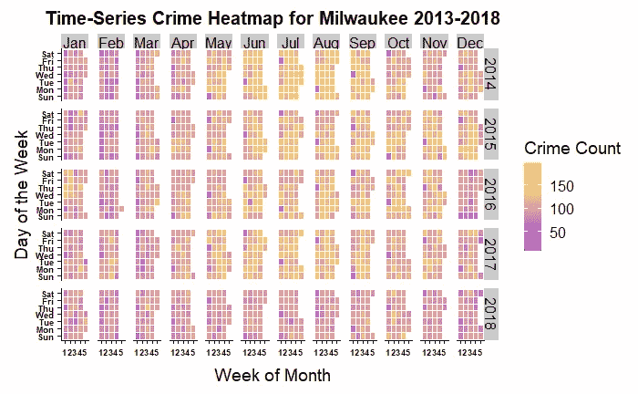

# 密尔沃基犯罪数据驱动指南

> 原文：<https://towardsdatascience.com/the-data-driven-guide-to-crime-in-milwaukee-b6a373f898e9?source=collection_archive---------16----------------------->

## 我们调查了超过 600，000 起事件，揭示了美国最危险的城市之一的错综复杂的犯罪

Milwaukee at Night. Photo by [Kayle Kaupanger](https://unsplash.com/photos/UQRQ6uAXgNA?utm_source=unsplash&utm_medium=referral&utm_content=creditCopyText)

密尔沃基是威斯康星州最大的城市，也是哈雷戴维森汽车公司、密尔沃基艺术博物馆的所在地，并以其酿酒厂而闻名。但更重要的是，它因高犯罪率而臭名昭著。

密尔沃基已经被列为 T2 最危险的城市之一。犯罪分析网站指出，密尔沃基比美国 96%的[–97%的](https://www.areavibes.com/milwaukee-wi/crime/) %更危险，比威斯康星州的 [99%](https://www.areavibes.com/milwaukee-wi/crime/) 更危险。

利用从 [*密尔沃基市开放数据门户*](https://data.milwaukee.gov/) 公开获得的 [WIBR 犯罪数据](https://data.milwaukee.gov/dataset/wibr)，我捕获并评估了从 2005 年 3 月到 2018 年 12 月发生的 666，790 起被视为*A 组犯罪*的犯罪事件。据我所知，这项工作是第一次公开探索和分析这些信息。

这是一份全面的指南，其中包括:I)犯罪率与*时间*之间关系的详细评估，II)对在犯罪中使用的*武器的评估，以及最后，III)展示*城市中*犯罪发生的*地理空间分析。**

***免责声明:*** *以下数据和数字代表被举报的罪行。根据皮尤研究中心的数据，大多数犯罪都没有向警方报案(* [*此处*](http://www.pewresearch.org/fact-tank/2019/01/03/5-facts-about-crime-in-the-u-s/) *)。因此，在解释结果时应该小心。*

# 基于时间的可视化

## ***当*的罪行发生时**

以下结果表明犯罪是在什么时候被报告的，而不是在什么时候发生的。犯罪发生的时间和报案的时间可能会有所不同，请在阅读时记住这一点。

## **每天下午 4:00 的犯罪报告高峰**

根据密尔沃基 2005-2018 年(上文)按小时统计的*总犯罪报告，凌晨 2:00 至 6:00 之间的犯罪率最低，这一时间许多人可能正在睡觉。早上 6:00-8:00，当许多人醒来时，我们看到犯罪报告迅速增加。犯罪报告在一天中持续上升，在下午 4 点达到最大值。*

在按一天中的小时划分的*犯罪类型中，* *盗窃*占早上 8:00 到下午 6:00 之间报告的大多数犯罪。针对*刑事损坏*、*锁定车辆进入和车辆盗窃*的犯罪报告具有相似的模式，报告中的峰值出现在上午 8:00。与其他犯罪模式在早上或中午达到高峰不同，*攻击罪*和*抢劫*的报案量在早上较低，在傍晚达到高峰。

上述数字表明，一周内犯罪报告略有变化。为了测试所报告的犯罪数量是否与一周中的某一天有关，对数据进行了单向方差分析(ANOVA)。测试得出的 p 值为 0.287，未超出预定义的显著性阈值(p< 0.05). Thus, **)*报告的犯罪数量*与一周中的*天*** 无关。

## **全年犯罪率**

犯罪率随季节变化是众所周知的事实(此处阅读更多&[此处](https://scholarlycommons.law.northwestern.edu/cgi/viewcontent.cgi?article=4004&context=jclc))。此外，天气变化最大的地区在夏季也会经历与财产相关的犯罪的急剧增加。

然而，犯罪率的这些“季节性”变化似乎完全可以用社会互动来解释。因此，我们应该注意犯罪率的变化不太可能直接归因于天气或温度的变化。

*密尔沃基每月的总犯罪率(2006–2008)*显示了报告的犯罪总数与一年中的月份之间的密切关系。犯罪报告的低谷出现在二月，高峰出现在七月和八月。让我们了解一下个人犯罪是如何促成这一趋势的:

在《密尔沃基每月犯罪率》一书中，我们提出了个人犯罪在几个月内如何波动的想法。*盗窃*、*伤害罪*、*刑事毁坏*、*入室盗窃*、*车辆盗窃*、*抢劫*高峰在 7、8 月份，而*锁车进入*高峰在 9、10 月份。

为了检查每个月之间发生的犯罪率波动，这里有一个更精细的可视化:

***How to Read the Figure:*** *t*he columns and rows are grouped into months and years, respectively (see the top and right graph headings). The small individual columns labeled on the bottom of the graph each represents the day of the week. The individual rows labeled on the bottom of the graph represent the week of the month. Each small colored square represents a single day and is colored according to the total amount of crime reports made that day.

该热图可以直观显示每周和每天的趋势。7 月*和 8 月*的季节性犯罪高峰似乎是这两个月犯罪水平一致的结果，但 2014 年除外，该年的高峰出现在 7 月底和 8 月初。

几乎每个月的月最小值(最暗的紫色方块)都落在该月的第一周，这一趋势适用于 2005—2013 年的数据(未公布的结果)。

*每月每天报告的犯罪总数*证实了我们在上图中观察到的趋势，每月的低点通常出现在每月的第四天，紧随其后的是第二天。虽然犯罪报告变化很大，但通常会在一个月内增加。

## 犯罪率下降的趋势

犯罪报告总量在 2006 年达到高峰后不久就稳步下降。 ***与 2006 年的水平相比，2018 年报告的犯罪总数下降了近 40%。然而，这种趋势并非密尔沃基独有。根据皮尤研究中心的数据，自 20 世纪 90 年代初以来，美国的犯罪率一直在大幅下降。***

在*按犯罪类型分类的年度犯罪总数报告*中，我们看到*盗窃*和 c *刑事伤害*随着时间的推移明显稳步下降。相反，自 2006 年以来，攻击性犯罪的报告数量有所增加，当时的犯罪报告总数要高得多。尽管报告的犯罪总量有很大的变化，但性犯罪、纵火和凶杀案的数量在过去几年里保持不变。

# **基于武器的调查结果**

## **武器使用**

在本分析报告的 667，025 起犯罪中，有 277，580 起报告使用了武器。然而，在超过 100，000 个案例中，使用的*武器*被归类为“*未知”*。这就剩下大约 175，000 个已确认的武器使用案例需要分析。

为了按武器类型确定武器使用的普遍程度，915 种不同的“使用的武器”分类被压缩到类似的分组中，结果被过滤，产生 2005 年至 2018 年间 100 起或更多事件中使用的武器。

*密尔沃基 2005 年至 2018 年犯罪中使用的武器总数*显示 ***使用的前 3 种武器是“手”、“手枪”和“枪”。*** 为了调查与犯罪类型相关的武器使用情况，武器根据其在犯罪中的使用记录绘制成柱状图:

为了简明起见，只列入了在 1 000 起或更多事件中使用的武器。由于事件数量有限，用于*杀人*、*锁车*和*偷车*的武器不在列表中。

在*按犯罪类型划分的武器使用中*，*攻击性犯罪*，*入室盗窃*，*性犯罪*，*盗窃*中使用频率最高的武器是“手”。“手枪”一直是抢劫案中使用的主要武器，也是涉及武器的袭击案中使用第二多的武器。

*A Milwaukee city street.* Photo by [Lucas Ludwig](https://unsplash.com/photos/eguiIyEGxQU?utm_source=unsplash&utm_medium=referral&utm_content=creditCopyText)

# **可视化基于位置的数据**

为了对犯罪进行地理空间分析，选择了 2018 年的密尔沃基犯罪数据，并清理了数据以移除缺失和不完整的位置值。这些数据随后被导出到德克萨斯州的地理服务公司，他们为这个项目捐赠了世界一流的地理编码服务。从 Texas A & M GeoServices 接收计算的纬度和经度坐标，并将结果与现有数据相结合。然后，基于位置(地理空间)的密尔沃基犯罪地图被创建。 ***注:*** *位置数据可能代表犯罪发生的地点或报案的地点。*

## ***识别犯罪‘热点’***

为了开发我们对 2018 年发生许多犯罪的区域的直觉，创建了一个基于密度的地图，其中该区域被划分为半径为 0.5 英里(0.8047 公里)的六边形。每个六边形根据犯罪密度进行颜色编码，密度最低的区域为白色，密度最高的区域为紫色:

Density map of crime reported in Milwaukee in 2018\. Note: not all data is visible. Click [here](https://kepler.gl/demo/map?mapUrl=https://dl.dropboxusercontent.com/s/hjn4hwknqyey4u3/keplergl_0vgem5r.json) to interact with the map and explore the full data set. Click [here](https://kepler.gl/demo/map?mapUrl=https://dl.dropboxusercontent.com/s/hjn4hwknqyey4u3/keplergl_0vgem5r.json) to interact with a 3-dimensional version of the map.

随着我们向市中心移动，犯罪率有上升的趋势。特别是，两个连续的高密度(紫色)区域非常突出，一个在城市中心的西北方向，另一个在中心的西南方向。

为了更好地显示*犯罪类型*的犯罪率，我们制作了一张地图，地图上的六边形根据各自区域内最常见的犯罪进行了着色:

Prevalence of Crime by Crime Type for Milwaukee in 2018\. Hexagons are colored according to the crime that is most prevalent within it. Interact with the map [here](https://kepler.gl/demo/map?mapUrl=https://dl.dropboxusercontent.com/s/v9wjxcxl1cfv83r/keplergl_ta2b2s.json).

在上面的地图中，我们看到袭击罪是 2018 年密尔沃基最普遍的犯罪。我们还注意到，在城市的东部，密尔沃基港的上方和下方，上锁的车辆入口非常普遍。

# **识别基于位置的集群**

为了识别基于位置的犯罪集群(分组)，实施了监督机器学习算法:对点进行排序以识别集群结构(*光学*)。 *OPTICS* 是一种[基于密度的聚类](https://onlinelibrary.wiley.com/doi/full/10.1002/widm.30)算法，允许我们准确识别聚类，即使道路、湖泊和街区等地理特征可能会影响犯罪发生的地点。阅读更多关于*光学* [这里](https://cran.r-project.org/web/packages/dbscan/vignettes/dbscan.pdf) & [这里](https://en.wikipedia.org/wiki/OPTICS_algorithm)。

Points with low reachability distance (located in ‘valleys’) are identified and grouped together into clusters (represented by color).

在包含 1000 起或更多犯罪(minPts = 1000)的基础上搜索高密度区域，这些犯罪发生在彼此接近的可达性距离内(对比参数 xi = 0.0037)。

*OPTICS* 被设置为识别 1，000 个或更多犯罪发生的聚类。证明我们的聚类选择的可达性图和凸聚类壳图分别在上面和下面可用。

A summary of the cluster data’s spatial distribution.

最后，我们将聚类绘制到密尔沃基的地图上:

The results of OPTICS-defined clusters mapped to Milwaukee. Visit the interactive map [here](https://kepler.gl/demo/map?mapUrl=https://dl.dropboxusercontent.com/s/v9wjxcxl1cfv83r/keplergl_ta2b2s.json).

上图显示了 2018 年密尔沃基四个*光学*定义的犯罪集群。聚类 1 由暗淡的褐红色点组成，并且包含所分析的所有点。请注意，并非所有的点都可以从该图像中看到，因为该图像的重点是强调 3 个感兴趣的集群(红色、橙色和黄色)，但是，通过此[链接](https://kepler.gl/demo/map?mapUrl=https://dl.dropboxusercontent.com/s/v9wjxcxl1cfv83r/keplergl_ta2b2s.json)可以看到这些点(确保切换缩小)。

红色聚类表示发生了近 1，800 起犯罪的区域，橙色区域包含发生了超过 2，500 起犯罪的区域，黄色区域包含发生了约 5，100 起犯罪的区域(详见表 1)。

*位置*图标代表每个集群的近似中心。为了更好地了解这些中心点的位置，将中心点与本地标识符进行匹配，结果如表 1 所示。

**表 1:** *聚类，2018 年的犯罪事件数量，&代表聚类中心的本地标识符。要查看地图，点击这里的集群编号:* [*1*](https://www.google.com/maps/place/Roosevelt+Grove,+Milwaukee,+WI+53216/@43.0825601,-87.9820856,14z/data=!3m1!4b1!4m5!3m4!1s0x88051c70cd8f0555:0xe62a4c89a1adc9a7!8m2!3d43.0863238!4d-87.9604345) *，* [*2*](http://Concordia) *，* [*3*](https://www.google.com/maps/place/E+Juneau+Ave+%26+N+Milwaukee+St,+Milwaukee,+WI+53202/@43.045959,-87.9178323,14.75z/data=!4m5!3m4!1s0x8805190eeee2d3cb:0xb26802cdef42ede1!8m2!3d43.0457528!4d-87.9073019) *，&*[*4*](https://www.google.com/maps/place/W+Burnham+St+%26+S+16th+St,+Milwaukee,+WI+53204/@43.0115774,-87.9523515,14.25z/data=!4m5!3m4!1s0x880519f804399d9d:0xae7cd71b3bc927ba!8m2!3d43.0101975!4d-87.9331134)*。*

## **结论**

这项分析研究了 2005 年至 2018 年间密尔沃基报告的 60 多万起犯罪。结果表明，有案可查的犯罪在过去 13 年中大幅下降，这主要是由于盗窃行为的减少。然而，尽管有这种趋势，关于攻击的报告一直在增加。从历史上看，犯罪率在每年的 2 月份最低，在 7 月和 8 月达到高峰。24 小时报告的犯罪趋势表明，上午 8:00 至下午 5:00 之间的水平较高，而没有观察到犯罪与星期几之间的关系。

地理空间分析将 2018 年犯罪数据映射到密尔沃基，并证明袭击是该市大多数地区最普遍的犯罪。最后， *OPTICS* 聚类确定了密尔沃基的三个高犯罪率地区，占 2018 年犯罪率的约 25%。

*Milwaukee Skyline at Sunset.* Photo Credit: [Steve](https://upload.wikimedia.org/wikipedia/commons/3/3a/Milwaukee_Skyline_at_Sunset.jpg). Photo modified to fit the page.

## **致谢**

衷心感谢 *Charin Polpanumas* 对他在数据科学方面的指导以及对这个项目的审查(点击查看他的杰出工作[)。感谢德克萨斯州地理服务公司为该项目提供地理编码服务。](https://medium.com/@iwishcognitivedissonance)

**连线:**加入脸书的[美国数据科学](https://www.facebook.com/groups/1947504675394524/)

**Github:**[https://github.com/jsolson4](https://github.com/jsolson4)

**作者:**贾斯汀·奥尔森

