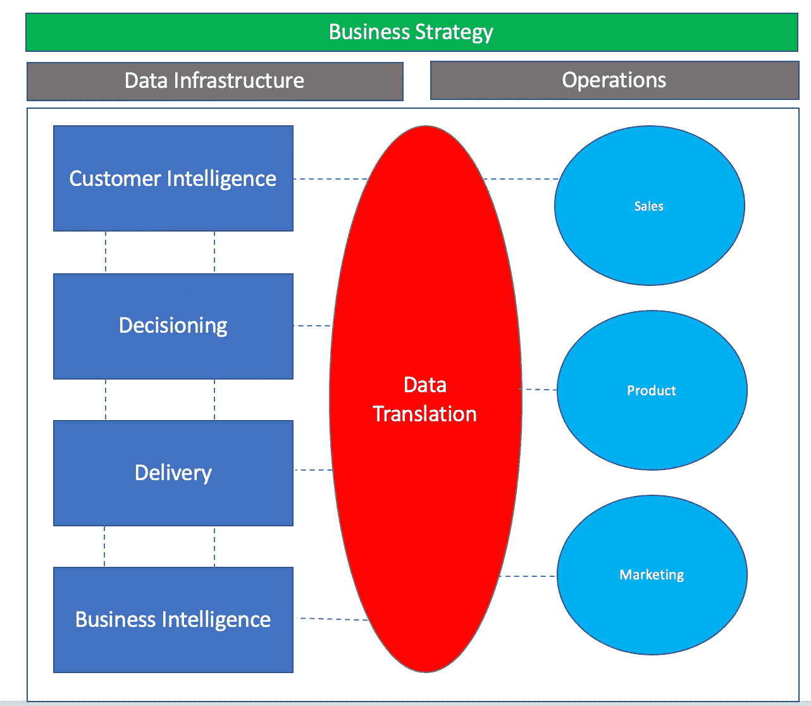

# 数据驱动的运营模式

> 原文：<https://towardsdatascience.com/the-data-driven-operating-model-2fa1b72c0f1d?source=collection_archive---------8----------------------->

数据，尤其是机器学习通常被认为是解决所有商业挑战的灵丹妙药。随后，许多企业已经或正在建设必要的基础设施和人才，以兑现他们认为数据和机器学习可以提供的崇高承诺。这是正确的举措——毫无疑问，分析，无论是描述性的还是规范性的，都有能力彻底改变企业的动力和效率。不幸的是，许多公司都难以实现数据和机器学习所代表的崇高承诺。

正如我们大多数人所知，真正成功的数据科学或分析项目与业务成果密不可分，并跨越多个团队、组织和专业领域。构建模型或拼接数据本身很复杂，但通常是操作数据流或算法的“简单”部分，以便对业务产生真正的影响并推动战略向前发展。很少看到数据项目达到这种水平，正因为如此，许多数据项目被视为失败或被忽视。大型高科技公司也不能幸免于这一挑战。我亲眼目睹了世界上最大的技术公司之一的数据科学团队花费数年时间来完成一个模型，但无法以任何有效的方式将该模型有效地交付给最终客户。

## 数据操作的复杂性

我们如何解决这个问题？这个问题的最佳答案会让你相信这是由于人才短缺造成的，也就是说，如果我们有更多的专家或“合适的”专家来解决“数据”问题，我们就能解决它。这种策略是许多组织应对困难挑战时所采用的。在科学界，这种想法被称为“局部搜索”(爱泼斯坦， *Range* ，第 173 页— [在我之前的文章](/what-ive-learned-doing-data-science-and-analytics-at-8-different-companies-and-4-jobs-in-6-years-f745a2c63976)中提到)依赖单一知识领域的专家，他们利用最老套的方法来解决复杂的问题。虽然专业化绝对没有错，但在多个组织或整个公司中部署描述性和规范性分析的挑战跨越了多个业务知识领域、团队以及业务战略和财务、数据工程、数据科学和运营之间的交叉领域。有这么多的变量在起作用，“数据项目”的复杂性达到了令人眩晕的高度。著名的行为科学家丹尼尔·卡内曼帮助我们理解这种性质的问题是“邪恶的”卡尼曼将一个棘手的问题定义为“一个游戏规则经常不清楚或不完整的问题，可能有也可能没有重复的模式，它们可能不明显，反馈经常被延迟或不准确，或者两者兼而有之。”(Epstein， *Range* ，第 21 页)集成和部署数据驱动的解决方案和产品的挑战充满了各种障碍，这些障碍对于每个组织来说都是独一无二的，需要能够横向连接跨领域和业务部门的知识和专业技能。心理学家称之为“类比思维”，即“在多个领域或场景中识别概念相似性的实践，这些领域或场景表面上似乎没有什么共同点。”(爱泼斯坦，范围，第 103 页)

类比思维提供了一套工具，用于解决在整个组织范围内操作数据的挑战性任务。我在自己的工作中利用类比思维提出了一个解决这个问题的框架——我称之为*数据驱动的运营模式*。

## 数据驱动的运营模式

数据驱动的运营模式是一个构建流程和基础设施的框架，使公司能够有效地运营数据。我主要在营销组织的环境中使用这个框架，但是我相信这里的原则将广泛适用。数据驱动的运营模式的目标不是提供一个放之四海而皆准的解决方案，而是提供一个框架来创建您自己的计划，以组织您企业的人员、流程和数据基础架构，从而部署高效的描述性和规范性分析解决方案。该模型由 5 根支柱支撑:

1.  客户智能
2.  决策
3.  交付
4.  商业智能
5.  数据翻译

五大支柱中的每一个都可以由一个团队或个人组成，遵循为该支柱设计的独特流程。下面，我将解释每一个支柱，该支柱中的团队或个人的责任，以及应该围绕它们设计的流程。(如果您不想阅读每一部分，请滚动到最后一段了解关键要点。)

## 客户智能

不要与商业智能相混淆，客户智能是一个存储库和流程(CDP、CRM 或手工制作),其中保存了客户的完整资料。这是为整个数据驱动模型提供动力的燃料。最终，客户是保持业务运营的关键，因此围绕客户知识组织一个团队，并以逻辑方式将这些知识结合起来，对于实现业务驱动的分析解决方案至关重要。

该团队或个人负责创建尽可能完整的客户形象。这意味着创建一个数据库、CDP 或 CRM(可能两者都有),它对您的整个客户群、他们在您的交付渠道中的行为集(稍后将详细介绍)以及将数据引入存储库的自动化或 ETL 的构建进行了有组织的细分。

这个团队负责从您的每个外联渠道获取和组织数据，通常由数据工程师、数据分析师和业务分析师组成。这包括您选择的 CDP/CRM 软件中的 Salesforce 分析师或专家。该团队不仅统一了客户数据流，而且对客户是谁、应该收集哪些客户数据以及为什么应该收集这些数据有着深刻的理解。在您的普通组织中，数据工程与 IT 坐在一起，并且经常与那些具有深厚客户知识的人分开。这些团队需要通力合作，为客户提供能够推动业务发展的行动和知识。

该团队使用数据翻译来获取和拼接数据，这些数据与公司的战略业务目标相一致，用于衡量和决策制定。该团队还对客户群进行特别分析，以回答客户活动和化妆品方面的业务问题。

## 决策

决策是围绕数据处理建立的团队和基础设施。这意味着算法和自动化进入外联渠道或商业智能，用于报告和决策。

该团队与客户智能和数据翻译合作，将业务目标合成为数据产品，推动公司目标向前发展，该团队由数据科学家、数据工程师和研究人员组成。

该团队通过数据翻译将业务问题和目标转化为数据产品，这意味着预测客户在营销或业务运营方面的行为，预测销售/库存/渠道，或者构建自动化以推动向客户或商业智能的交付。

## 交付

交付是用于操作预测模型和自动化的团队和基础设施，这些模型和自动化实现了去往客户或返回业务的各种活动集。

这个团队与决策和数据翻译一起工作，获取测试模型和自动化，并将其投入到适当渠道的生产中。这意味着将算法投入生产，用于电子邮件营销活动、网站个性化、客户体验、业务可视化或其他。这个团队由机器学习工程师和数据工程师组成。

## 商业智能

商业智能是为企业创建、维护和交付报告和仪表板的团队和基础设施。

该团队负责数据翻译和交付，以开发需要持续检查的报告和仪表板，例如营销活动绩效或高级管理业务摘要。该团队由数据工程师和分析师组成，他们专门负责构建和设计报表和数据自动化，以支持仪表盘、电子邮件、警报或销售、营销和产品团队可能需要的任何其他商业智能。

## 数据翻译

数据转换是数据驱动运营模式的基础，也是其他支柱正常运行的关键。如果只从这篇文章中拿一样东西的话，数据翻译概念是最重要的。

数据翻译团队负责将业务目标和策略翻译成技术数据项目。该团队与业务运营部门一起学习业务需求，并将这些需求转化为技术项目，然后将这些项目反馈给客户智能、业务智能和决策部门的各个小组。该团队由“数据翻译”组成，即精通业务的转换分析师、数据工程师或数据科学家，他们擅长将所有不同的部分结合在一起，以提供分析解决方案。最终，确保数据项目成功的任务落到了数据翻译人员的身上，他们需要跨多个业务部门来部署成功的解决方案。

## 这种模式与当今公司的做法有何不同？

数据驱动的运营模式的焦点是团队或个人(数据翻译人员)，他们的责任和时间完全集中在连接业务战略、运营团队以及分析和数据团队之间的点，以释放数据可以为组织带来的全部潜力。

我主要观察了在大多数企业中部署分析的两种不同的组织模式:1)由数据科学家和分析师组成的中央数据团队与运营业务部门坐在一起并提供支持，或者 2)分别位于每个组织内的较小的分析团队。虽然这些模型可以提供一些价值，但它们缺乏将所有业务单位和业务战略横向连接到分析组织的刻意关注，而完整的组织模型需要这种关注。数据驱动的运营模式通过围绕业务活动(而非数据活动)组织数据和分析来解决这一问题，即了解客户、做出有关客户的决策、向客户交付产品以及做出有关业务的决策。数据翻译团队在这些团队和他们的业务运营对应方之间建立联系，从而实现全面的说明性和描述性分析的整体方法。

## 我如何将数据驱动的运营模式引入我的组织？

我在本文中介绍的框架并不完美，也没有解决每个公司的独特情况。我也不处理与团队重组相关的政治或结构性挑战。然而，我希望该模型能为您提供一个全新的视角，让您了解如何更有效地组织数据团队，从而提供更具影响力的数据解决方案。和所有的框架一样，我在这里介绍的只是一个指导方针，告诉你如何在你工作的地方实现积极的改变。为此，以下是关键要点:

*   如果可能的话，围绕*业务活动*而不是数据活动来组织不同的分析团队或团队成员。这意味着，与其拥有分散的数据工程、数据科学和分析师团队，不如将人员放在一起，共同更有效地实现业务目标或完成项目。当麻省理工学院研究员托马斯艾伦研究美国政府工程团队在太空竞赛中的效率时，他发现最成功的团队(那些完成最复杂项目的团队)有一个惊人的共同点；他们桌子的接近度(科伊尔，*，文化代码*，第 5 章)。我们与那些和我们工作关系密切的人交流得更多——从而带来更大的信任和更多的联系。显而易见，当我们之间没有墙(无论是组织上的，还是实际上的墙)时，我们会做更多的事情。
*   有人需要将业务单位和数据组织之间的点连接起来。无论是正式的“数据翻译”还是你团队中的某个人(或者你！)非常擅长将业务需求和战略转化为技术解决方案，这是绝对必要的。这个人或团队必须得到业务和技术团队的信任和重视，并像与数据组织一样与业务部门密切合作。
*   我们都可以花更多的时间做“类比思考”也就是说，在与我们专业领域完全不同的领域工作和思考。这样做会让我们更好地解决“邪恶”的问题，这些问题是我们大多数人从未见过的，模式不清楚，也没有明确的规则存在。正是这些类型的问题，如果得到解决，将对我们和我们工作的地方产生最大的影响。