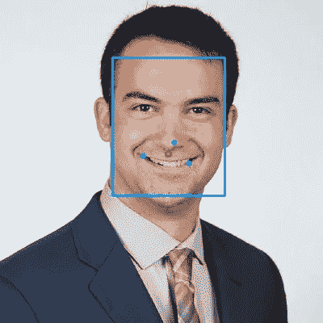
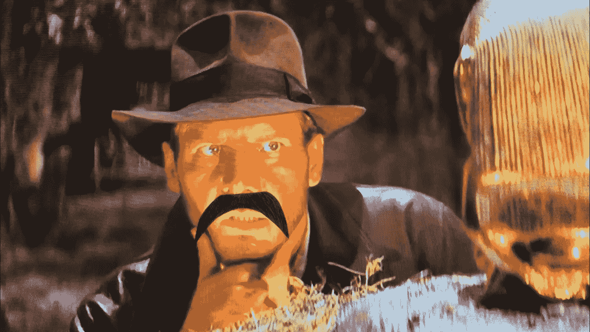
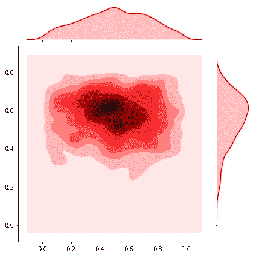
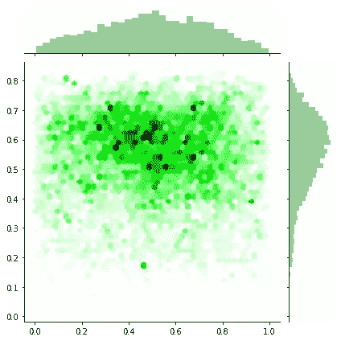

# 数据驱动的派对:电影胡子

> 原文：<https://towardsdatascience.com/the-data-driven-partier-movie-mustache-25b078c7e72d?source=collection_archive---------13----------------------->

“电影胡子”背后的概念很简单，但却是革命性的。和朋友一起看电影，但在电视上留一两撇小胡子——只要小胡子和角色的上唇对齐，每个人都会喝酒。这个游戏对我来说是陌生的，直到几周前，当我观看亚当·桑德勒经典电影《T2 水兵》时才体验到。虽然看着每个角色都留着电视上的小胡子很令人惊讶，但与接下来的问题陈述相比，这就相形见绌了:*我们怎么才能把小胡子放在一起，最大限度地让大家一起喝酒呢？*和往常一样，这里看到的代码可以在 [my GitHub](https://github.com/aaronfrederick/Movie-Mustache) 上完整查看。

The placement of this mustache was optimized for comedic effect

由于面部识别软件包的可用性，通过正确的方法，这个问题可以在不到一天的时间内得到解决。为了尽可能高效地解决我的问题陈述，我将其分解为几个简单的步骤:

1.  找到一个预先训练的神经网络，找到人脸
2.  使用模型返回的面部坐标，估计小胡子应该去哪里
3.  使用电影数据获取频繁的小胡子位置
4.  理智地想象这些位置



The red dot marks where MTCNN suggests a mustache should go

我使用的模型涉及多任务级联卷积神经网络，称为 MTCNN。我想特别感谢[这篇文章](/mtcnn-face-detection-cdcb20448ce0)包含了很多与包相关的语法，因为它几乎忽略了这一努力。MTCNN 非常有效地定位面部标志，并返回五个更有用的标志:左眼和右眼、左右嘴角和鼻子。用我自己的一张照片测试这个模型，我们可以看到它不能完美地检测到这些面部标志，但是对于这个项目来说，它足够好了。在左边的图片中，我用 MTCNN 在我的脸上画了一个边界框，并在模型输出我的鼻子、右嘴角和左嘴角的地方画了蓝点。我用红色标出了这三个点的质心，以估计小胡子应该去哪里，结果令我非常惊喜。



现在，我们已经用 MTCNN 在我的一张脸上做了概念验证，是时候扩大这个过程了。使用下面的代码，我让 MTCNN 观看了《T10》印第安纳·琼斯和《夺宝奇兵》，找到了小胡子应该去的地方。

```
#get_mustache takes the output from MTCNN and returns the #coordinates of the nose and mouth-corners centroid.detector = MTCNN()mustaches = []
for file in os.listdir(‘data/indiana_jones1/’):
    image = cv2.imread(f’data/indiana_jones1/{file}’)
    result = detector.detect_faces(image)
    for face in result:
        mustache_location = get_mustache(face)
        mustaches.append(mustache_location)
```

我现在有了一个与第一部印第安纳·琼斯电影相关的(~9000)个胡须位置元组的列表，是时候可视化结果了。因为元组列表与我想到的可视化解决方案不兼容，所以必须进行一些轻微的清理:

```
x = []
y = []
for location in mustaches:
    x.append(location[0]/2880)
    y.append((1800-location[1])/1880)
```

我使用的 y 值是 1800 减去 y 坐标，因为(0，0)表示图像的左上方，但我需要(0，0)表示图像的左下方，图像是 2880x1800。然后我把它们缩小到小数，这样坐标值就可以成为任何电视或屏幕上可用的分数。



A kde plot of frequent mustache coordinates

在这个游戏中，我用来最大化饮酒量的表示是一个核密度估计器(KD)和一个 2D hexplot。kde 图就像一张地形图，显示了所测量的所有事件的密度。在这种情况下，它显示了小胡子出现概率最高的区域。在轴上，分别有胡子的 x 和 y 坐标的平滑分布。这些轴按屏幕比例缩放，因此(0.5，0.5)的值将是屏幕中心的一个点。我非常喜欢这种可视化，因为它简单易懂，但也有缺点。首先也是最重要的一点，它只显示了一个高密度的区域，所以如果我们玩的游戏有一个以上的胡子，这种可视化显然是有限的。这种可视化的另一个主要缺陷是它有多模糊。地形风格的层是很好地看到收敛在一个点上，但最暗的层是令人失望的大。使用不同的可视化，我们应该能够看到胡子应该去哪里。



Hexplot of frequent mustache locations

使用 hexplot，解决了 kde plot 的两个缺点。此处显示的六边形图就像一个 2D 直方图，准确地显示了胡须最常出现的位置。该图的 x 轴和 y 轴显示了 KD 图轴上表示的不平滑直方图，更精确地表示了每个维度中的数据。hexplot 还显示了小胡子与脸对齐的每个位置，这意味着如果我们不想最大化所喝的饮料，我们仍然可以将小胡子放在它们偶尔会与脸对齐的合理位置。

如果规则是在小胡子排成一行的时候喝酒，这里描述的方法有助于让电影小胡子之夜更有侵略性，但是如果规则是每个小胡子只能喝一杯，我们可能需要考虑一个稍微不同的方法。要在这个新的方向上采用基于算法的方法，只需跟踪先前的小胡子位置，并在将坐标添加到列表之前确保每个后续坐标对都在预定距离阈值之外，从而从我们的数据集中移除重复的移动。诚然，我没有运用这一逻辑，但我假设这不会对最终结果产生太大影响。

我欢迎对这些方法的任何改进，也欢迎对数据科学工具包的其他有趣应用提出你想看到的建议——请在下面留下评论！