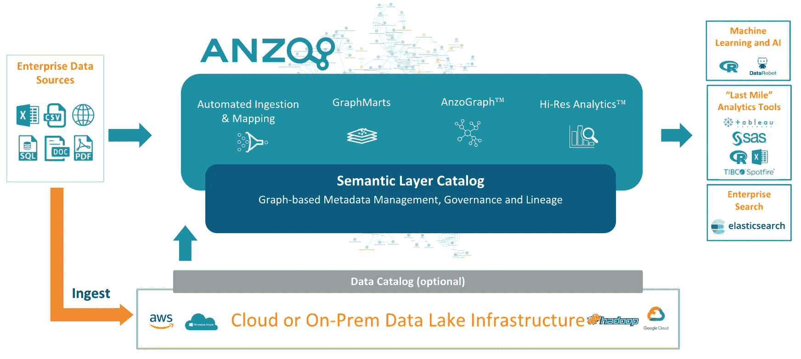
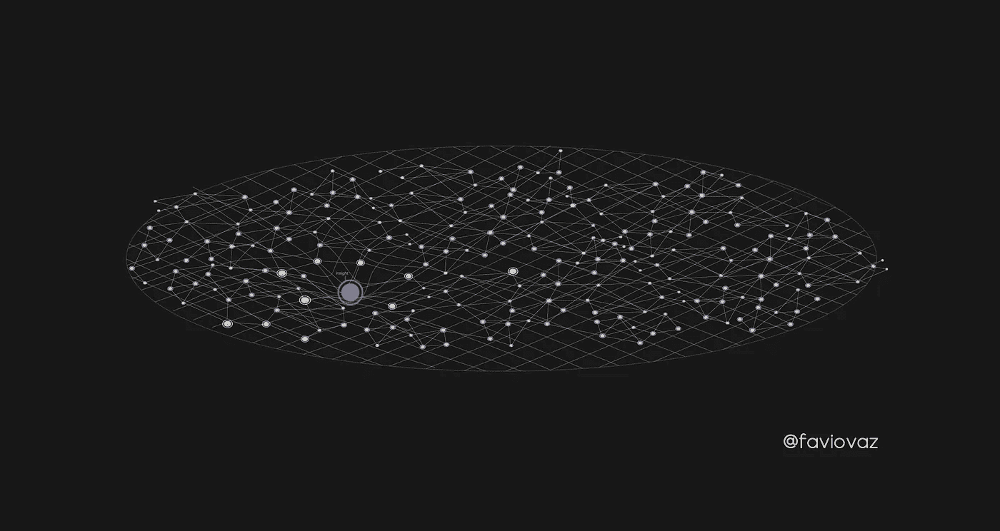

# 机器学习的数据结构。第一部分。

> 原文：<https://towardsdatascience.com/the-data-fabric-for-machine-learning-part-1-2c558b7035d7?source=collection_archive---------8----------------------->

## 语义和数据结构的新进展如何帮助我们更好地进行机器学习。还有，机器学习的新定义。[这里是关于深度学习的 1-b 部分。](/the-data-fabric-for-machine-learning-part-1-b-deep-learning-on-graphs-309316774fe7)

Image by [Héizel Vázquez](https://www.instagram.com/heizelvazquez/)

点击此处阅读第 1-b 部分:关于数据结构的深度学习:

 [## 机器学习的数据结构。第 1-b 部分:图上的深度学习。

### 图形的深度学习日益重要。在这里，我将展示思考机器的基础…

towardsdatascience.com](/the-data-fabric-for-machine-learning-part-1-b-deep-learning-on-graphs-309316774fe7) 

# 介绍

如果你在网上搜索机器学习，你会找到大约 2，050，000，000 个结果。是啊，真的。找到适合每一种用途或情况的描述或定义并不容易，但还是有令人惊讶的。在这里，我将提出一个不同的机器学习定义，专注于一个新的范式，即数据结构。

# 目标

## 一般

> 解释数据结构与机器学习的联系。

## 细节

*   描述数据结构和创建数据结构的生态系统。
*   用几句话解释一下什么是机器学习。
*   提出一种在数据结构内部可视化机器学习洞察的方法。

# 主要理论

如果我们能够构建一个支持公司所有数据的**数据结构**，那么其中的**业务** **洞察**可以被认为是 it 中的**凹痕**。发现洞察力是什么的**自动过程**，它被称为**机器学习**。

# 第一节。什么是数据结构？

我在之前已经[谈到过数据结构，并且给出了它的定义(下面我将再次把它放在这里)。](/deep-learning-for-the-masses-and-the-semantic-layer-f1db5e3ab94b)

当我们谈到数据结构时，有几个词我们应该提到:图、知识图、本体、语义、关联数据。如果你想要这些定义，请阅读上面的文章；然后我们可以说:

> *数据结构是支持公司所有数据的平台。它是如何被管理、描述、组合和普遍访问的。该平台由企业知识图构成，以创建统一的数据环境。*

让我们把这个定义分成几部分。我们首先需要的是一个**知识图**。

知识图由数据和信息的集成集合组成，其中还包含不同数据之间的大量链接。这里的关键是，在这个新模型下，我们不是在寻找可能的答案，而是在寻找答案。我们想要事实——这些事实从何而来并不重要。这里的数据可以代表概念、物体、事物、人，实际上是你脑海中的任何东西。图表填充了概念之间的关系和联系。

知识图表还允许您为图表中的关系创建结构。有了它，就有可能建立一个框架来研究数据及其与其他数据的关系([还记得本体论吗？](/ontology-and-data-science-45e916288cc5))。

在这种情况下，我们可以向我们的数据湖提出这个问题:

> 这里存在什么？

数据湖的概念也很重要，因为我们需要一个存储数据、管理数据和运行工作的地方。但我们需要一个智能数据湖，一个了解我们拥有什么以及如何使用它的地方，这是拥有数据结构的好处之一。

数据结构应该是一致和统一的，这意味着我们应该努力将组织中的所有数据组织在一个地方，并真正管理和控制它。

# 第二节。什么是机器学习？

[http://www.cognub.com/index.php/cognitive-platform/](http://www.cognub.com/index.php/cognitive-platform/)

机器学习已经存在一段时间了。有很多关于它的描述、书籍、文章和博客，所以我不会用 10 个段落来烦你。

我只想把几点说清楚。

> **机器学习不是魔法。**
> 
> 机器学习是数据科学工作流程的一部分。但这并不是结束。
> 
> 机器学习需要数据才能存在。至少现在是这样。

好了，接下来，让我给机器学习一个借用的个性化定义:

> 机器学习是理解数据中的模式和一些数据表示的自动过程，通过使用能够提取这些模式而无需专门编程的算法来创建解决特定(或多个)问题的模型。

你可以同意这个定义，也可以不同意，现在文献中有很多很好的定义，我只是认为这个定义很简单，对我想表达的东西很有用。

# 第三节。在数据结构中进行机器学习

在爱因斯坦引力理论(广义相对论)中，他从数学上提出质量可以使时空变形，这种变形就是我们所理解的引力。我知道如果你不熟悉这个理论，听起来会很奇怪。让我试着解释一下。

在没有引力的狭义相对论的“平坦”时空里，力学定律呈现出一种特别简单的形式:只要没有外力作用在物体上，它就会在时空里做直线运动:沿直线路径匀速运动(牛顿力学第一定律)。

但是当我们有质量和加速度时，我们可以说我们在重力的存在下。就像惠勒说的:

> 时空告诉物质如何运动；物质告诉时空如何弯曲。

在上面的图像中,“立方体”是时空结构的代表，当质量在其中移动时，它会使其变形,“线”移动的方式会告诉我们一个附近的物体在接近那个物体时会如何表现。所以重力就像是:

所以当我们有质量时，我们可以在时空中制造一个“凹痕”，之后当我们靠近那个凹痕时，我们看到的就是重力。我们必须离物体足够近才能感受到它。

这正是我提出的机器学习在数据结构中的作用。我知道我听起来很疯狂。让我解释一下。

假设我们已经创建了一个数据结构。对我来说，最好的工具是我在其他文章中提到的 Anzo。

[https://www.cambridgesemantics.com/](https://www.cambridgesemantics.com/)

你可以用 Anzo 建立一个叫做“企业知识图”的东西，当然也可以创建你的数据结构。

图中的节点和边灵活地捕捉了每个数据源的高分辨率孪生数据—结构化的或非结构化的。该图表可以帮助用户快速、互动地回答任何问题，允许用户与数据对话以揭示**洞察力**。

顺便说一句，这是我如何描绘一个洞察力:

Image by [Héizel Vázquez](https://www.instagram.com/heizelvazquez/)

如果我们有数据结构:

Image by [Héizel Vázquez](https://www.instagram.com/heizelvazquez/)

我的建议是，一个洞见可以被认为是其中的一个**凹痕**。发现这种洞察力是什么的自动过程，就是机器学习。

Image by [Héizel Vázquez](https://www.instagram.com/heizelvazquez/)

所以现在我们可以说:

> 机器学习是通过使用算法发现数据结构中隐藏的见解的自动过程，这些算法能够在没有专门编程的情况下找到这些见解，以创建解决特定(或多个)问题的模型。

通过结构生成的洞察本身是新数据，作为结构的一部分变得显式/明显。也就是说，洞察力可以扩大图表，潜在地产生进一步的洞察力。

在数据结构中，我们遇到了一个问题，试图找到数据中隐藏的见解，然后使用机器学习我们可以发现它们。这在现实生活中会是什么样子？

[剑桥语义](https://www.cambridgesemantics.com/)的人也有 Anzo 的答案。Anzo for Machine Learning 解决方案用一个现代数据平台取代了这种繁琐、容易出错的工作，该平台旨在快速集成、协调和转换来自所有相关数据源的数据，使其成为优化的机器学习就绪的要素数据集。

数据结构提供了快速有效的功能工程所必需的高级数据转换功能，有助于将关键业务信号与无关噪声分离开来。

请记住，**数据第一**，这种新模式使用内置的图形数据库和语义数据层来集成和协调所有相关的数据源，包括结构化和非结构化数据。数据结构传达了数据的业务上下文和含义，使业务用户更容易理解和正确利用。

再现性对于数据科学和机器学习来说非常重要，因此我们需要一种简单的方法，通过管理数据集的目录以及数据集成的持续方面(如数据质量处理)来重用协调的结构化和非结构化数据，这就是数据结构所提供的。它还保留了组成机器学习数据集的数据的端到端血统和出处，以便在生产中使用模型时，很容易发现需要什么数据转换。

在接下来的文章中，我将给出一个具体的例子来说明如何在这个新的框架中进行机器学习。

# 结论

机器学习并不新鲜，但有一个新的范式来做它，也许它是该领域的未来(我多么乐观)。在数据结构内部，我们有了新的概念，如本体、语义、层、知识图等；但所有这些都可以改善我们思考和进行机器学习的方式。

在这种范式中，我们通过使用算法来发现数据结构中隐藏的见解，这些算法能够找到这些见解，而无需为此专门编程，从而创建解决特定(或多个)问题的模型。

感谢[科学与数据](http://www.cienciaydatos.org)团队对本文的帮助。

也感谢你阅读这篇文章。希望你在这里发现了一些有趣的东西:)。如果这些文章对你有帮助，请与你的朋友分享！

如果您有任何问题，请在 Twitter 上关注我:

 [## 法维奥·巴斯克斯(@法维奥·巴斯克斯)|推特

### Favio Vázquez 的最新推文(@FavioVaz)。数据科学家。物理学家和计算工程师。我有一个…

twitter.com](https://twitter.com/faviovaz) 

和 LinkedIn:

 [## favio vázquez——science ia y Datos | LinkedIn 创始人

### 查看 Favio Vázquez 在世界上最大的职业社区 LinkedIn 上的个人资料。Favio 有 16 个工作列在他们的…

www.linkedin.com](https://www.linkedin.com/in/faviovazquez/) 

那里见:)