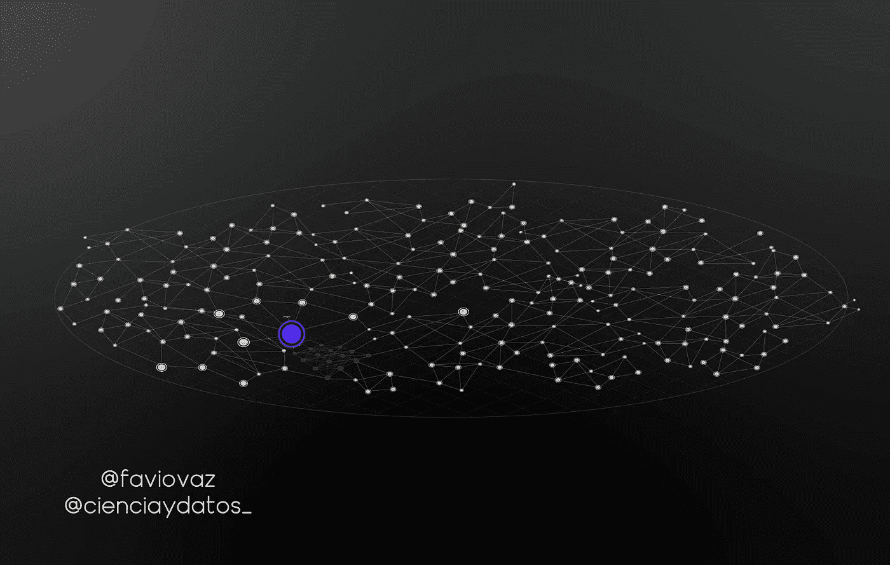
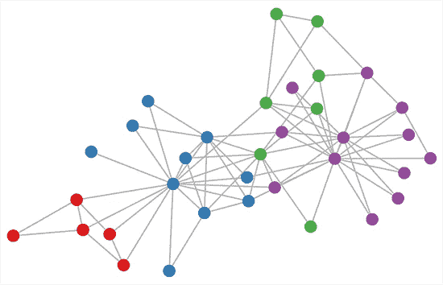
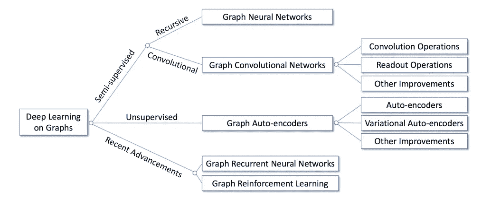
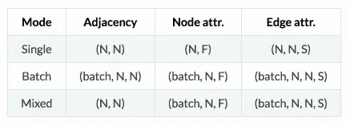
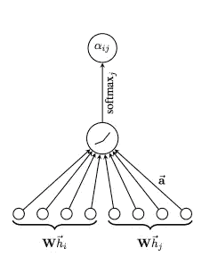
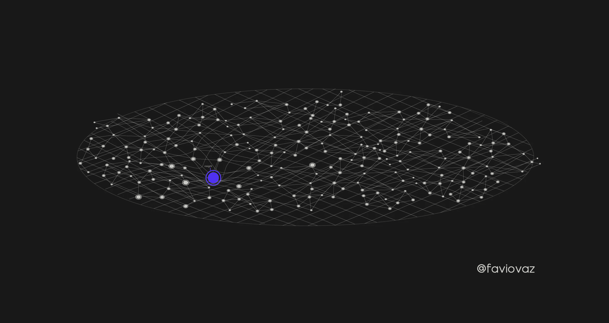
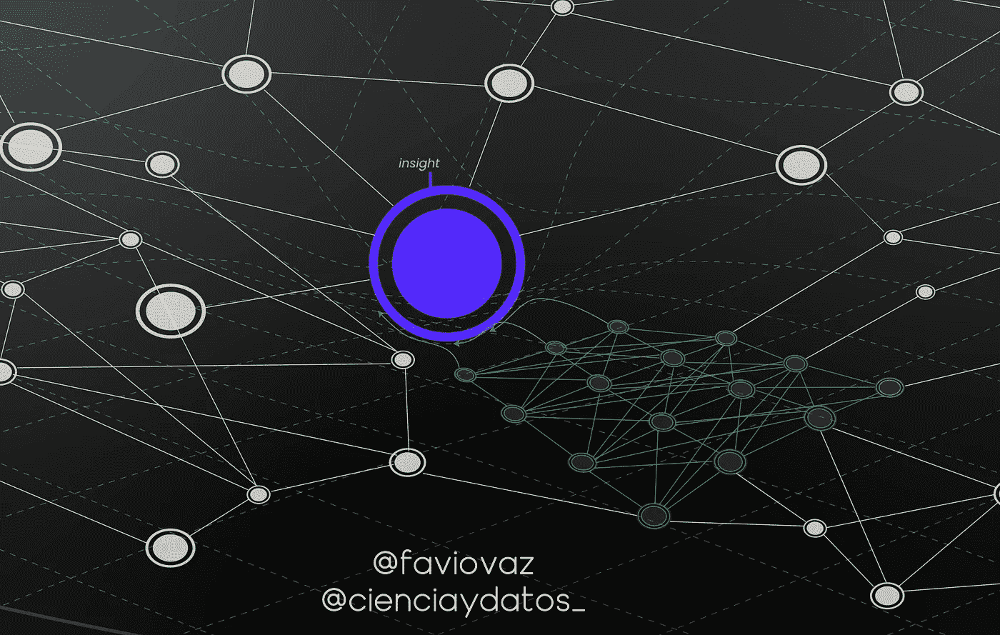

# 机器学习的数据结构。第 1-b 部分:图上的深度学习。

> 原文：<https://towardsdatascience.com/the-data-fabric-for-machine-learning-part-1-b-deep-learning-on-graphs-309316774fe7?source=collection_archive---------16----------------------->

## 图形的深度学习日益重要。在这里，我将通过库 Spektral 和平台 MatrixDS 展示在图上思考机器学习和深度学习的基础知识。第一部分[这里](/the-data-fabric-for-machine-learning-part-1-2c558b7035d7)。



> 声明:这不是第二部分的[过去的文章](/the-data-fabric-for-machine-learning-part-1-2c558b7035d7)的主题；这是第一部分的延续，强调深度学习。

# 介绍


我们正在定义一种新的机器学习方式，专注于一种新的范式，即数据结构。

在过去的文章中，我给出了我对机器学习的新定义:

> 机器学习是通过使用算法发现数据结构中隐藏的见解的自动过程，这些算法能够在没有专门编程的情况下找到这些见解，以创建解决特定(或多个)问题的模型。

理解这一点的前提是我们已经创建了一个数据结构。对我来说，最好的工具就是我在其他文章中提到的 Anzo。


[https://www.cambridgesemantics.com/](https://www.cambridgesemantics.com/)

你可以用 Anzo 建立一个叫做“企业知识图”的东西，当然也可以创建你的数据结构。

但是现在我想把重点放在机器学习内部的一个话题，深度学习。在[的另一篇文章](https://becominghuman.ai/deep-learning-made-easy-with-deep-cognition-403fbe445351)中，我给出了深度学习的定义:

> 深度学习是机器学习的一个特定子领域，是从数据中学习表示的一种新方式，它强调学习越来越有意义的表示的连续**“层**【神经网络】。

在这里，我们将讨论深度学习和图论的结合，并看看它如何帮助我们的研究向前发展。

# 目标

## 一般

> 为在数据结构上进行深度学习奠定基础。

## 细节

*   在图上描述深度学习的基础。
*   探索图书馆的特色。
*   验证在数据结构上进行深度学习的可能性。

# 主要假设

如果我们可以构建一个支持公司所有数据的**数据结构**，那么通过使用**神经网络**(深度学习)从数据中**学习越来越有意义的表示**来发现见解的**自动过程**就可以在数据结构内部运行。

# 第一节。关于图的深度学习？



[https://tkipf.github.io/graph-convolutional-networks/](https://tkipf.github.io/graph-convolutional-networks/)

通常我们使用张量来创建神经网络，但是记住我们也可以用矩阵来定义张量，并且[图](/graph-databases-whats-the-big-deal-ec310b1bc0ed)可以通过矩阵来定义。

在库[speck tral](https://danielegrattarola.github.io/spektral/data/)的文档中，他们声明一个图通常由三个矩阵表示:

*   A∈{0,1}^(N×N): a 二元邻接矩阵，其中如果节点 *i* 和 *j* 之间有连接，A_ *ij* =1，否则 a _*ij*= 0；
*   X∈ℝ^(N×F):编码节点属性(或特征)的矩阵，其中 FF 维属性向量与每个节点相关联；
*   E∈ℝ^(N×N×S):一个编码边属性的矩阵，其中一个 *S* 维属性向量与每个边相关联。

我不会在这里详细介绍，但如果你想更全面地了解图形深度学习，请查看 [Tobias Skovgaard Jepsen](https://medium.com/u/565f7254b058?source=post_page-----309316774fe7--------------------------------) 的文章:

[](/how-to-do-deep-learning-on-graphs-with-graph-convolutional-networks-7d2250723780) [## 如何用图卷积网络在图上做深度学习

### 第 1 部分:图卷积网络的高级介绍

towardsdatascience.com](/how-to-do-deep-learning-on-graphs-with-graph-convolutional-networks-7d2250723780) 

这里重要的部分是图形神经网络(GNN)的概念。

## 图形神经网络(GNN)



[https://arxiv.org/pdf/1812.04202.pdf](https://arxiv.org/pdf/1812.04202.pdf)

GNN 的思路很简单:对图的结构信息进行编码，每个节点 v_ *i* 可以用一个低维状态向量 s_ *i* ，1 ≤ *i* ≤ N 来表示(记住向量可以认为是秩 1 的张量，张量可以用矩阵来表示)。

学习图上的深度模型的任务可以大致分为两个领域:

*   **以节点为中心的任务:**任务与图中的单个节点相关联。例子包括节点分类、链接预测和节点推荐。
*   **以图形为中心的任务:**任务与整个图形相关联。示例包括图形分类、估计图形的某些属性或生成图形。

# 第二节。使用 Spektral 进行深度学习


[https://github.com/danielegrattarola/spektral/](https://github.com/danielegrattarola/spektral/)

作者将 Spektral 定义为一个关系表示学习的框架，用 Python 构建，基于 Keras API。

## 装置

我们将使用 [MatrixDS](https://matrixds.com/) 作为运行我们代码的工具。请记住，在 Anzo 中，你也可以带着这段代码在那里运行。

您需要做的第一件事是派生 MatrixDS 项目:

 [## MatrixDS |数据项目工作台

### MatrixDS 是一个构建、共享和管理任何规模的数据项目的地方。

community.platform.matrixds.com](https://community.platform.matrixds.com/community/project/5c6ae7c8c1b06ba1e18f2a6e/files) 

点击:


您将已经安装了库，并且一切都正常工作:)。

如果你在外面运行这个，记住这个框架是为 Ubuntu 16.04 和 18.04 测试的，你应该安装:

```
sudo apt install graphviz libgraphviz-dev libcgraph6
```

然后使用以下内容安装该库:

```
pip install spektral
```

## 数据表示法

在 Spektral 中，一些层和函数被实现为在单个图形上工作，而其他层和函数则考虑图形的集合(即数据集或批次)。

该框架区分三种主要*操作模式*:

*   **单个**，这里我们考虑一个单个的图，以及它的拓扑和属性；
*   **batch** ，这里我们考虑一个图的集合，每个图都有自己的拓扑和属性；
*   **混合**，这里我们考虑一个具有固定拓扑的图，但是是不同属性的集合；这可以被视为批处理模式的一种特殊情况(即，所有邻接矩阵都相同的情况)，但是出于计算原因而被分开处理。



例如，如果我们跑

```
from spektral.datasets import citation
adj, node_features, edge_features, _, _, _, _, _ = citation.load_data('cora')
```

我们将以单一模式加载数据:

我们的邻接矩阵是:

```
In [3]: adj.shape 
Out[3]: (2708, 2708)
```

出音符属性包括:

```
In [3]: node_attributes.shape 
Out[3]: (2708, 2708)
```

我们的优势是:

```
In [3]: edge_attributes.shape 
Out[3]: (2708, 7)
```

## 基于图关注层的半监督分类

> 声明:我假设你从这里知道 Keras。

有关更多详细信息和代码视图:

 [## MatrixDS |数据项目工作台

### MatrixDS 是一个构建、共享和管理任何规模的数据项目的地方。

community.platform.matrixds.com](https://community.platform.matrixds.com/community/project/5c6ae7c8c1b06ba1e18f2a6e/files) 

GAT 是一种新颖的神经网络体系结构，利用掩蔽的自注意层对图结构数据进行操作。在 Spektral 中， *GraphAttention* 层计算类似于`layers.GraphConv`的卷积，但是使用 Attention 机制对邻接矩阵进行加权，而不是使用归一化拉普拉斯算子。

它们的工作方式是通过堆叠层，其中节点能够关注其邻域的特征，这使得能够(隐式地)为邻域中的不同节点指定不同的权重，而不需要任何代价高昂的矩阵运算(如求逆)，也不依赖于预先知道的图结构。



[https://arxiv.org/pdf/1812.04202.pdf](https://arxiv.org/pdf/1812.04202.pdf). The attention mechanism employed by the model, parametrized by a weight vector, applying a LeakyReLU activation.

我们将使用的模型非常简单:

```
# Layers
dropout_1 = Dropout(dropout_rate)(X_in)
graph_attention_1 = GraphAttention(gat_channels,
                                   attn_heads=n_attn_heads,
                                   attn_heads_reduction='concat',
                                   dropout_rate=dropout_rate,
                                   activation='elu',
                                   kernel_regularizer=l2(l2_reg),
                                   attn_kernel_regularizer=l2(l2_reg))([dropout_1, A_in])
dropout_2 = Dropout(dropout_rate)(graph_attention_1)
graph_attention_2 = GraphAttention(n_classes,
                                   attn_heads=1,
                                   attn_heads_reduction='average',
                                   dropout_rate=dropout_rate,
                                   activation='softmax',
                                   kernel_regularizer=l2(l2_reg),
                                   attn_kernel_regularizer=l2(l2_reg))([dropout_2, A_in])# Build model
model = Model(inputs=[X_in, A_in], outputs=graph_attention_2)
optimizer = Adam(lr=learning_rate)
model.compile(optimizer=optimizer,
              loss='categorical_crossentropy',
              weighted_metrics=['acc'])
model.summary()# Callbacks
es_callback = EarlyStopping(monitor='val_weighted_acc', patience=es_patience)
tb_callback = TensorBoard(log_dir=log_dir, batch_size=N)
mc_callback = ModelCheckpoint(log_dir + 'best_model.h5',
                              monitor='val_weighted_acc',
                              save_best_only=True,
                              save_weights_only=True)
```

顺便说一句，模型很大:

```
__________________________________________________________________________________________________
Layer (type)                    Output Shape         Param #     Connected to                     
==================================================================================================
input_1 (InputLayer)            (None, 1433)         0                                            
__________________________________________________________________________________________________
dropout_1 (Dropout)             (None, 1433)         0           input_1[0][0]                    
__________________________________________________________________________________________________
input_2 (InputLayer)            (None, 2708)         0                                            
__________________________________________________________________________________________________
graph_attention_1 (GraphAttenti (None, 64)           91904       dropout_1[0][0]                  
                                                                 input_2[0][0]                    
__________________________________________________________________________________________________
dropout_18 (Dropout)            (None, 64)           0           graph_attention_1[0][0]          
__________________________________________________________________________________________________
graph_attention_2 (GraphAttenti (None, 7)            469         dropout_18[0][0]                 
                                                                 input_2[0][0]                    
==================================================================================================
Total params: 92,373
Trainable params: 92,373
Non-trainable params: 0
```

因此，如果你没有那么多的力量，就减少使用它的次数。请记住，升级您的 [MatrixDS 帐户](https://matrixds.com/pricing/)非常容易。

然后我们训练它(如果你没有足够的电力，这可能需要几个小时):

```
# Train model
validation_data = ([node_features, adj], y_val, val_mask)
model.fit([node_features, adj],
          y_train,
          sample_weight=train_mask,
          epochs=epochs,
          batch_size=N,
          validation_data=validation_data,
          shuffle=False,  # Shuffling data means shuffling the whole graph
          callbacks=[es_callback, tb_callback, mc_callback])
```

获得最佳型号:

```
model.load_weights(log_dir + 'best_model.h5')
```

并对其进行评估:

```
print('Evaluating model.')
eval_results = model.evaluate([node_features, adj],
                              y_test,
                              sample_weight=test_mask,
                              batch_size=N)
print('Done.\n'
      'Test loss: {}\n'
      'Test accuracy: {}'.format(*eval_results))
```

在 MatrixDS 项目中查看更多信息:

 [## MatrixDS |数据项目工作台

### MatrixDS 是一个构建、共享和管理任何规模的数据项目的地方。

community.platform.matrixds.com](https://community.platform.matrixds.com/community/project/5c6ae7c8c1b06ba1e18f2a6e/files) 

# 第三节。这在数据结构中处于什么位置？

如果您还记得上一部分，如果我们有一个数据结构:



洞察力可以被认为是其中的一个凹痕:


如果您在 MatrixDS 平台上阅读本教程，您会意识到我们使用的数据不是简单的 CS，但是我们为库提供了:

*   一个 N 乘 N 邻接矩阵(N 是节点数)，
*   N 乘 D 特征矩阵(D 是每个节点的特征数量)，以及
*   一个 N 乘 E 的二进制标签矩阵(E 是类的数量)。

存储的是一系列文件:

```
ind.dataset_str.x => the feature vectors of the training instances as scipy.sparse.csr.csr_matrix object;    ind.dataset_str.tx => the feature vectors of the test instances as scipy.sparse.csr.csr_matrix object;    ind.dataset_str.allx => the feature vectors of both labeled and unlabeled training instances        (a superset of ind.dataset_str.x) as scipy.sparse.csr.csr_matrix object;    ind.dataset_str.y => the one-hot labels of the labeled training instances as numpy.ndarray object;    ind.dataset_str.ty => the one-hot labels of the test instances as numpy.ndarray object;    ind.dataset_str.ally => the labels for instances in ind.dataset_str.allx as numpy.ndarray object;    ind.dataset_str.graph => a dict in the format {index: [index_of_neighbor_nodes]} as collections.defaultdict        object;    ind.dataset_str.test.index => the indices of test instances in graph, for the inductive setting as list object.
```

所以这些数据存在于图表中。我们所做的就是将数据加载到库中。实际上，您可以在库中将数据转换为 NetworkX、numpy 和 sdf 格式。

这意味着，如果我们将数据存储在一个数据结构中，我们就有了我们的知识图，所以我们已经有了许多这些特征，我们所拥有的是找到一种将它与库连接起来的方法。这是现在最棘手的部分。

> 然后，我们可以通过对数据结构中的图表运行深度学习算法，开始在数据结构中寻找见解。

有趣的是，在图表本身中可能有运行这些算法的方法，为此我们需要能够利用图表结构中固有的存储数据来构建模型， [Lauren Shin](https://medium.com/u/db0210be98bc?source=post_page-----309316774fe7--------------------------------) 在 Neo4j 中有一个非常有趣的方法:

[](/graphs-and-ml-multiple-linear-regression-c6920a1f2e70) [## 图形和 ML:多元线性回归

### 同样的 neo4j 线性回归程序，现在自变量无限！更多功能，无需额外…

towardsdatascience.com](/graphs-and-ml-multiple-linear-regression-c6920a1f2e70) 

但这也是一项正在进行的工作。我想象这个过程是这样的:



这意味着神经网络可以生活在数据结构中，算法将与其中的资源一起运行。

有一件重要的事情我在这里甚至没有提到，那就是**非欧几里德数据**的概念，但是我稍后会讲到。

# 结论

如果我们可以将知识图与 Spektral(或其他)库连接起来，通过为我们拥有的图形数据部署图形神经网络模型，就有可能在数据结构上运行深度学习算法。

除了节点或图分类等标准的图推理任务，基于图的深度学习方法还被应用于广泛的学科领域，如建模社会影响、推荐系统、化学、物理、疾病或药物预测、自然语言处理(NLP)、计算机视觉、交通预测、程序归纳和解决基于图的 NP 问题。见[https://arxiv.org/pdf/1812.04202.pdf](https://arxiv.org/pdf/1812.04202.pdf)。

应用是无止境的，这是一个新时代的开始。敬请关注更多:)