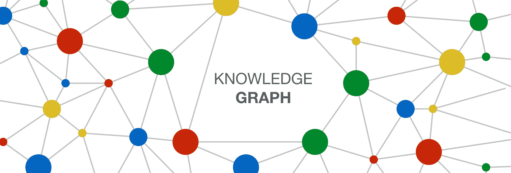
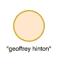
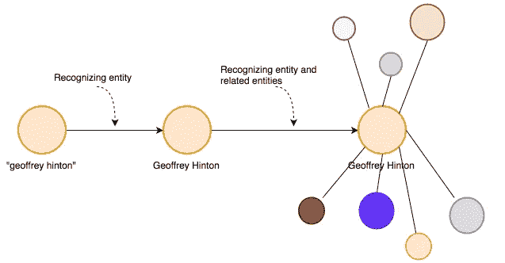
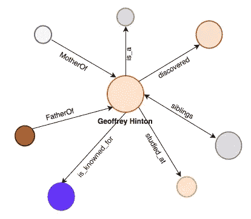
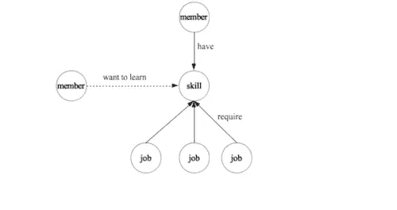
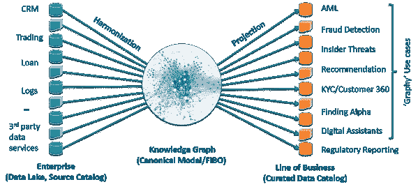

# 机器学习的数据结构。第 2 部分:构建知识图。

> 原文：<https://towardsdatascience.com/the-data-fabric-for-machine-learning-part-2-building-a-knowledge-graph-2fdd1370bb0a?source=collection_archive---------6----------------------->

在能够开发数据结构之前，我们需要构建一个知识图。在这篇文章中，我将建立如何创建它的基础，在下一篇文章中，我们将练习如何做到这一点。Part 1 是[这里的](/the-data-fabric-for-machine-learning-part-1-2c558b7035d7)，part 1-b 是[这里的](/the-data-fabric-for-machine-learning-part-1-b-deep-learning-on-graphs-309316774fe7)。

# 介绍

在本系列的最后一篇文章中:

 [## 机器学习的数据结构。第一部分。

### 语义学的新进展如何帮助我们更好地进行机器学习。

towardsdatascience.com](/the-data-fabric-for-machine-learning-part-1-2c558b7035d7)  [## 机器学习的数据结构。第 1-b 部分:图上的深度学习。

### 图形的深度学习日益重要。在这里，我将展示思考机器的基础…

towardsdatascience.com](/the-data-fabric-for-machine-learning-part-1-b-deep-learning-on-graphs-309316774fe7) 

我一直在笼统地谈论数据结构，并给出了数据结构中机器学习和深度学习的一些概念。并给出了我对数据结构的定义:

> *数据结构是支持公司所有数据的平台。它是如何被管理、描述、组合和普遍访问的。该平台由一个* ***企业知识图*** *组成，创建一个统一的数据环境。*

如果你看一下定义，它说数据结构是由一个**企业知识图形成的。因此，我们更好地知道如何创建和管理它。**

# 目标

**一般**

建立知识图谱理论和构建的基础。

**细节**

*   解释与企业相关的知识图的概念。
*   给出一些关于建立成功的企业知识图的建议。
*   展示知识图表的例子。

# 主要理论

数据结构中的**结构**是从知识图构建的，为了创建知识图，你需要语义和本体来找到一种链接数据的有用方法，这种方法可以唯一地识别和连接具有常见业务术语的数据。

# 第一节。什么是知识图？

[https://medium.com/@sderymail/challenges-of-knowledge-graph-part-1-d9ffe9e35214](https://medium.com/@sderymail/challenges-of-knowledge-graph-part-1-d9ffe9e35214)

> 知识图由数据和信息的集成集合组成，其中还包含不同数据之间的大量链接。

这里的关键是，在这个新模型**下，我们不是在寻找可能的答案，而是在寻找答案。**我们想要事实——那些事实来自哪里并不重要。这里的数据可以代表概念、物体、事物、人，实际上是你脑海中的任何东西。图表填充了概念之间的关系和联系。

在这种情况下，我们可以向我们的数据湖提出这个问题:

> 这里存在什么？

我们在不同的地方。一个有可能建立一个框架来研究数据及其与其他数据的关系的领域。在知识图中，以特定形式的[本体](/ontology-and-data-science-45e916288cc5)表示的信息可以更容易地被自动化信息处理访问，如何最好地做到这一点是像数据科学这样的计算机科学中的一个活跃的研究领域。

本体语言中的所有数据建模语句(以及其他一切)和数据的知识图世界本质上都是增量的。事后增强或修改数据模型可以很容易地通过修改概念来实现。

使用知识图，我们正在构建的是一种人类可读的数据表示，它唯一地标识数据并将其与常见的业务术语联系起来。这个“层”帮助最终用户自主、安全、自信地访问数据。

还记得这张图片吗？

我之前提出过，数据结构中的洞察可以被认为是 it 中的一个**凹痕**。发现这种洞察力是什么的自动过程，就是机器学习。

但是这个**面料**是什么？是知识图形成的对象。就像在爱因斯坦的相对论中，织物是由连续体([还是离散体)构成的？在这里，当你创建一个知识图时，结构就建立起来了。](https://www.amazon.com/Road-Reality-Complete-Guide-Universe/dp/0679776311)

为了构建知识图，你需要关联数据。关联数据的目标是以这样一种方式发布结构化数据，即它可以很容易地被消费并与其他关联数据和本体相结合，作为我们可以连接实体并理解它们的关系的方式。

# 第二节。创建成功的企业知识图

[https://www.freepik.com/free-vector/real-estate-development-flat-icon_4167283.htm](https://www.freepik.com/free-vector/real-estate-development-flat-icon_4167283.htm)

不久前，Sebastien Dery 写了一篇关于知识图表挑战的有趣文章。这里你可以看看:

 [## 知识图表的挑战

### 从弦乐到事物——导论

medium.com](https://medium.com/@sderymail/challenges-of-knowledge-graph-part-1-d9ffe9e35214) 

来自 cambridgesemantis.com[的伟大博客](https://www.cambridgesemantics.com)

 [## 学习 RDF

### 引言这一系列课程是对 RDF 的介绍，RDF 是语义网的核心数据模型，也是

www.cambridgesemantics.com](https://www.cambridgesemantics.com/blog/semantic-university/learn-rdf/) 

还有更多资源，有一个概念我甚至没有在任何文章中提到过，但是非常重要，就是**三元组**的概念:**主语、宾语、谓语**(或者*实体-属性-值*)。通常，当您研究三元组时，它们实际上意味着资源描述框架(RDF)。

RDF 是三种基本语义 Web 技术之一，另外两种是 SPARQL 和 OWL。RDF 是语义网的数据模型。

注意:哦，顺便说一句，几乎所有这些概念都伴随着万维网语义的新定义而来，但是我们将把它用于一般的知识图。

我不会在这里给出一个完整的框架描述，但是我会给你一个他们如何工作的例子。请记住，我这样做是因为这是我们开始构建本体、连接数据和知识图表的方式。

让我们来看一个例子，看看这个三元组是什么。这与塞巴斯蒂安的例子密切相关。

我们将以字符串“geoffrey hinton”开始。

Here we have a simple string that represents first edge, the thing I want to know more about

现在开始构建一个知识图谱，首先系统识别出这个字符串实际上指的是 Geoffrey Hinton 这个人。然后它会识别与那个人相关的实体。

Then we have some entities that are related to Geoffrey but we don’t know what they are yet.

顺便说一句，这是杰弗里·辛顿，如果你不认识他的话:

[https://www.thestar.com/news/world/2015/04/17/how-a-toronto-professors-research-revolutionized-artificial-intelligence.html](https://www.thestar.com/news/world/2015/04/17/how-a-toronto-professors-research-revolutionized-artificial-intelligence.html)

然后系统将开始为这些关系命名:

Now we have named relationships where we know what type of connection we have for our main entity.

这个系统可以在一段时间内找到连接的连接，从而为我们的“搜索字符串”创建一个代表不同关系的巨大图表。

为了做到这一点，知识图使用三元组。像这样:

To have a triple we need a subject and object, and a predicate linking the two.

所以你可以看到我们有与**对象** <研究者>相关的**主语** < Geoffrey Hinton >由**谓语** <构成>。这对我们人类来说可能听起来很容易，但需要一个非常全面的框架来用机器做到这一点。

这是知识图形成的方式，也是我们使用本体和语义链接数据的方式。

那么，我们需要什么来创建一个成功的知识图表呢？剑桥语义学的 Partha Sarathi 写了一篇关于这个的博客。你可以在这里阅读:

 [## 创建成功的企业知识图

### 自从谷歌在 2012 年通过一个关于增强网络搜索的流行博客将知识图表主流化以来，企业已经…

blog.cambridgesemantics.com](https://blog.cambridgesemantics.com/creating-a-successful-enterprise-knowledge-graph?utm_campaign=data%20fabric%20drip%20campaign%202019&utm_source=hs_automation&utm_medium=email&utm_content=69101454&_hsenc=p2ANqtz-9BB7227QOhvpzRuILO6HfQFdI4PR1o-4SfjbxqhPYv3rlfuL27w3y9AKEfZ3cs3cbEFc4hmDnnCeu6heguyt8AwCwtcw&_hsmi=69101454) 

总而言之，他说我们需要:

*   **设想 it 的人:**你需要具备某种形式的业务关键主题专业知识和技术的人。
*   **数据多样性和可能的大量数据**:企业知识图的价值和采用规模与它所包含的数据的多样性成正比。
*   **构建知识图的好产品 *:*** 知识图需要治理良好、安全、易于连接到上游和下游系统、可大规模分析，并且通常是云友好的。因此，用于创建现代企业知识图的产品需要针对自动化进行优化，支持各种输入系统的连接器，向下游系统提供基于标准的数据输出，快速分析任何数量的数据，并使治理对用户友好。

您可以在此阅读更多信息:

 [## 构建您的企业知识图

### 企业知识图正在帮助公司连接他们复杂的数据源。有了 Anzo，您可以设计、构建…

info.cambridgesemantics.com](https://info.cambridgesemantics.com/build-your-enterprise-knowledge-graph) 

# 第三节。知识图表示例

## 谷歌:

谷歌基本上是一个巨大的知识(有更多的补充)图，他们创造了可能是最大的数据结构。谷歌拥有数十亿个事实，包括数百万个对象的信息和关系。并允许我们搜索他们的系统以发现其中的洞见。

在这里，您可以了解更多信息:

## LinkedIn:

我最喜欢的社交网络 LinkedIn 有一个巨大的知识图谱库，它建立在 LinkedIn 上的“实体”之上，如成员、工作、头衔、技能、公司、地理位置、学校等。这些实体以及它们之间的关系构成了专业世界的本体。

洞察有助于领导者和销售人员做出商业决策，并提高 LinkedIn 会员的参与度:

[https://engineering.linkedin.com/blog/2016/10/building-the-linkedin-knowledge-graph](https://engineering.linkedin.com/blog/2016/10/building-the-linkedin-knowledge-graph)

记住，LinkedIn(和几乎所有的)知识图谱需要随着新成员注册、新职位发布、新公司、技能和头衔出现在成员档案和职位描述中等而扩展。

您可以在此阅读更多信息:

 [## 构建 LinkedIn 知识图表

### 作者:齐河，陈必忠，迪帕克·阿加瓦尔

engineering.linkedin.com](https://engineering.linkedin.com/blog/2016/10/building-the-linkedin-knowledge-graph) 

## **金融机构知识图谱:**

Conceptual model to harmonize data from diverse sources and to create governed data sets for business use case consumption.

在 Marty Loughlin 的这篇文章中，他展示了一个 Anzo 平台可以为银行做什么的例子，在这里你可以看到这项技术不仅与搜索引擎相关，还可以处理不同的数据。

在那里，他展示了知识图表如何帮助这类机构:

*   用于分析和机器学习的替代数据
*   利率互换风险分析
*   贸易监督
*   欺诈分析
*   特征工程和选择
*   数据迁移

还有更多。去看看。

# 结论

为了创建一个知识图，你需要语义和本体来找到一个有用的方法来链接你的数据，唯一地识别和连接数据和普通的业务术语，从而构建数据结构的底层结构。

当我们构建知识图时，我们需要使用本体和语义形成三元组来链接数据。此外，知识图表的制作基本上取决于三件事:设想它的人、数据多样性和构建它的好产品。

我们周围有许多我们甚至不知道的知识图表的例子。世界上大多数成功的公司都在实施和迁移他们的系统，以构建数据结构，当然还有其中的所有东西。