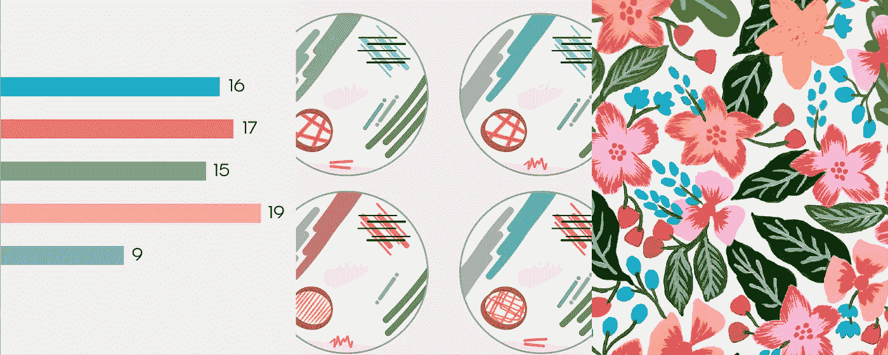
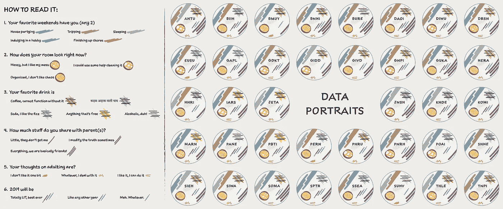

# 数据在艺术里！

> 原文：<https://towardsdatascience.com/the-data-is-in-the-art-b97cf2ceda7c?source=collection_archive---------13----------------------->

## 利用颜色、形状和涂鸦来理解软数据和小数据

几周前，我让我的朋友和熟人填写了一份调查。我问的问题不一定会在谈话中出现，但却揭示了一个人性格的有趣细节。我喜欢做这个活动，因为在分析和可视化调查结果后，我觉得我比以前更了解每一个人。

我想集体看看这些结果，并对我们这些年轻的千禧一代的想法做一个快照。为了实现这一点，我决定以不同的方式来回答不同的问题，从而将本次调查的结果可视化。以下文章中的所有图片都可以在[这里](https://rutagokhale.github.io/DataViz/Images/Being%20a%20Millennial%20Adult/SurveyResults.pdf)找到。

## 1.有哪些受欢迎的偏好？

我从一个简单的**条形图**开始，来理解不同的选择如何在整个组中进行比较。这是一种简单而有效的方法，可以直观地显示每个问题的热门选择。

## 2.个人喜好有哪些？

为了回答这个问题，我从 Giorgia Lupi 和她的工作室在创建数据画像方面的工作以及她诱导数据人文主义的哲学中获得了灵感。

假设有 38 个人，其中一些人有相同的名字或姓氏，需要一些排列来为每个人生成一个唯一的标识符。我选定了姓和名的组合。
1ˢᵗ姓氏的字母+ 2ⁿᵈ名字的字母+ 3ʳᵈ姓氏的字母+ 4ᵗʰ名字的字母
比如我的名字，Ruta Gokhale 就被编码为 GUKA。

通过这些**数据画像**，我试图突出个人偏好，同时也展示个人与整个群体相比如何。我意识到，将个性融入数据会使数据更丰富，更容易理解。

## 3.总体共识是什么？

我想创建一个高层次的响应图。为了以不同的方式呈现这些信息，我根据这些数据创作了一幅**画**。

我画了植物图案，并用丙烯颜料来编码这些丰富的信息。每个图案代表一个人，植物元素与他们的反应相对应。

这幅图并不是为了指出个别细节，而是为了理解信息的整体性质，从而理解我们的想法。这幅画，对我来说，是在说我们既相似又不同！创造这种数据艺术是一个同时具有逻辑性和创造性的过程。

所有这些图像都有高分辨率[在这里](https://rutagokhale.github.io/DataViz/Images/Being%20a%20Millennial%20Adult/SurveyResults.pdf)。你从这些数据可视化中得出什么结论？你最喜欢哪一个，为什么？