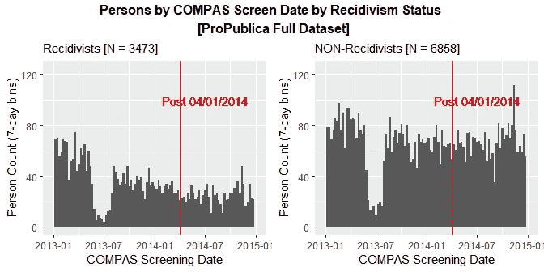
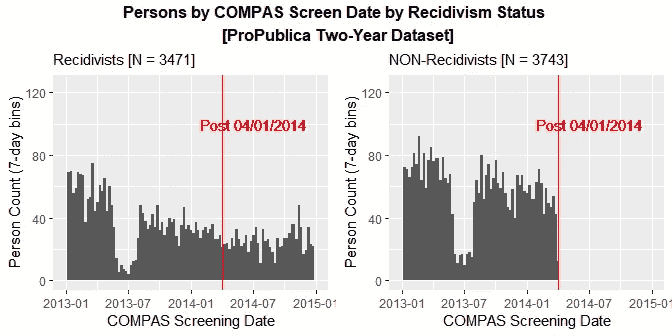

# 一个著名的公平机器学习数据集(长版本)中的数据处理错误

> 原文：<https://towardsdatascience.com/the-data-processing-error-in-one-of-the-most-prominent-fair-machine-learning-datasets-4fa205daa3c4?source=collection_archive---------37----------------------->

## ProPublica 的 COMPAS 评分和累犯数据

在最近的一篇研究 [**论文**](https://arxiv.org/abs/1906.04711) 中，我重新审视了 **ProPublica** 收集的 **COMPAS 累犯风险评分**和**犯罪史**数据，为其开创性的 **2016** [**文章**](https://www.propublica.org/article/machine-bias-risk-assessments-in-criminal-sentencing) 论司法系统中的算法公正。

我*发现*发现 **ProPublica** 在构建 *key* **sub** 时犯了一个**数据处理错误**——用于文章分析的数据集。我发现的数据错误会对这些关键子数据集的几个更基本的方面产生相当大的影响*，例如样本大小、累犯数量和累犯率。我估计累犯率是*偏向*向上差不多 **25%** 。*

*尽管如此，有趣的是，我发现的非平凡数据处理错误对 ProPublica 使用相同子数据集报告的最引人注目的结果几乎没有影响。即非裔美国人相对于白种人的假阳性率和假阴性率。*

*C*

*基于其分析，专注于一组预测指标，ProPublica 得出结论，COMPAS 累犯风险评分**偏向**不利于*非裔美国人*。开发 COMPAS 风险评分系统的公司 **Northpointe Inc.** ，使用相同的数据，但侧重于一组不同的预测指标， [*为*](http://go.volarisgroup.com/rs/430-MBX-989/images/ProPublica_Commentary_Final_070616.pdf) 风险评分辩护为**无偏**。*

*由于主题和结果的争议性，以及数据的公开可用性，ProPublica 调查性新闻的开创性工作在公平机器学习或算法公平 T21 这一新兴领域引发了激烈的辩论和研究。*

*ProPublica 的 COMPAS 分数和累犯数据可能已经成为研究人员用来测试新的或现有的算法公平性定义和程序的最重要的基准数据。(参见 [Corbett-Davies 和 Goel 2018](http://arxiv.org/abs/1808.00023) 以及我在下面列出的其他参考资料；或者是 [**中的一篇**](/a-tutorial-on-fairness-in-machine-learning-3ff8ba1040cb) 中的几篇**博文)***

*当 ProPublica 的 COMPAS 数据被越来越多的研究使用时，研究人员通常会按原样采用 ProPublica 创建的数据集，并且*似乎没有*仔细检查过它们的数据处理问题。我没有测试一个新的公平定义或程序，而是仔细观察了 ProPublica 收集的真实数据集*

*特别是，我检查了**子**——数据集 ProPublica 建立来研究一个*两年内* *窗口*中一个被告最初被捕后的再犯数据。这样做，我发现 ProPublica 在构造这些**两年累犯数据集**时，犯了一个实质性的**数据处理错误**。*

> *如下图所示， **ProPublica 未能**对**惯犯**实施**两年窗口样本截止**(然而**对**非**惯犯实施了这样的样本截止)***

*因此，ProPublica 错误地在两年的数据集中保留了**累犯**的**不成比例的**份额。我估计这个**将**的**两年**一般**累犯**率**向上**大约**九个**百分点，将其从 **36%** 推至 **45%** 。*

*因此，ProPublica 计算的两年再犯率比正确处理*的同一数据中的*真实的*两年再犯率高约**25%*****。***

***在我的研究论文中，我还探讨了这种数据处理错误如何影响其他统计数据。具体来说，我看了 ProPublica 的**混淆矩阵**对高/低 COMPAS 分数与两年累犯状态的分析。我发现有偏差的两年期数据集对**阳性预测值**(或 ***精度*** )和**阴性预测值**也有*实质性的*影响。***

*****另一方面**，有偏差的两年期数据集对*混淆矩阵*分析中的其他几个关键统计数据的影响相对*较小*，这些统计数据对*累犯与非累犯相对比例的变化不太敏感*。特别是**准确率**、**假阳性率**和**假阴性率**。***

***ProPublica 的关键发现是 ***的假阳性率高于******假阴性率低于**的非裔美国人*比*的白种人*高，因此，当一个人正确处理数据时**不会改变**。*******

***据我所知，这是第一次强调上述数据处理错误。**在这篇博文中，我总结了我的研究** [**论文**](https://arxiv.org/abs/1906.04711) 。***

***(如果你想阅读更短的摘要，请参见我这篇博文的**短** [**版本**](/the-data-processing-error-in-the-most-prominent-fair-machine-learning-dataset-short-version-d27d8d390fea) 。我还用我写的 R 程序创建了一个 **GitHub** [**资源库**](https://github.com/mbarenstein/ProPublica_COMPAS_Data_Revisited) 来分析数据)***

# ***数据***

***在 **2016** 年，ProPublica 的一个记者团队获得了一个超过**一万一千名** *审前*被告的数据集，这些被告来自佛罗里达州**布劳沃德县**已被逮捕，并在 2013 年**1 月 1 日**至 2014 年**12 月 31 日**期间*用 COMPAS 筛选系统对*进行了评估。(COMPAS 筛选调查由*审前服务*在被告被捕后与他或她合作完成)***

***ProPublica 随后收集了截至 2016 年 3 月底**的*未来*逮捕的数据，以研究 COMPAS 风险评分对这些被告累犯的预测程度(并于 2016 年 5 月发表了其文章)。( **ProPublica 的** **数据**和**分析**在这里 [**描述**](https://www.propublica.org/article/how-we-analyzed-the-compas-recidivism-algorithm) )*****

***ProPublica 的调查确实具有突破性。它使用公共记录请求来获取一组被告的 COMPAS 分数、放映日期和个人信息，以及他们的监狱和监狱信息。然后，它匹配并合并这些不同的数据源。***

***截至 2016 年 3 月底，ProPublica 从布劳沃德县书记官办公室网站上的公共犯罪记录中获得了该审前被告样本在 COMPAS 筛选日期后的犯罪历史信息。(它还从布劳沃德县警长办公室和佛罗里达州惩教署网站获得了公共监狱和监禁记录)***

***ProPublica 为其研究收集了数据，并创建了一个数据库。从那个数据库中，它构建了几个**子**-数据集，合并并计算各种*特征*。例如，在最初犯罪两年内因新犯罪再次被捕的指示变量。然后，ProPublica 将这些子数据集导出到**。csv 文件**。这些文件是其他研究人员最常用的文件。(再次， **ProPublica 在 Web 上的数据**是**可用** [**这里**](https://github.com/propublica/compas-analysis) )***

***我主要用的是**中的两个**。ProPublica 创建的 csv 文件，即 **compas-scores.csv** 和**compas-scores-two-years . CSV**。第一个*CSV 文件包含 ProPublica 从布劳沃德县治安官办公室获得的**审前**被告的完整数据集。这份文件包含了超过 11，000 名审前被告，然后 ProPublica 将他们减少到 10，331 名被告，部分原因是数据质量问题，正如我在我的研究论文中所描述的。(我仍然将这个稍微精简的数据集称为*完整*数据集)****

***上面列出的*第二个* csv 文件是 ProPublica 专门为了研究*两年一般累犯*而创建的文件。术语**一般**累犯是用来区别于**暴力**累犯的更小子集。一般累犯包括暴力犯罪和非暴力犯罪。在这篇文章中，我重点关注两年期的*普通*累犯数据集，但由 ProPublica 创建的两年期*暴力*累犯数据集也存在我在这里发现的相同数据处理问题。***

***理论上，这个两年累犯文件包含了观察至少两年的人*的子集，ProPublica 将这个文件中两年内累犯的人标记为打开了***two _ year _ recid***指示器标志。ProPublica 两年*普通*累犯 csv 文件包含**7214 人**。****

# ***COMPAS 屏幕日期分布***

## ***完整数据***

***我从查看 **10，331** 名被告的*完整*数据集开始。我做了一个*直方图*和**的对比筛选日期**(通常在逮捕当天或一天后执行)的案件或逮捕数量。为了清楚地看到数据处理错误，我做了*分离*比较累犯和非累犯的屏幕日期直方图。***

***对于这些直方图和后续直方图，我使用 **7 天**(即一周)数据**箱**。供(后)参考，我在**2014 年 4 月 1 日**画一条红色竖线，这是在之前*到 ProPublica 犯罪记录数据收集窗口结束(2016 年 3 月下旬)的两年标记。****

***首先，对于整个数据集，除了与无关的**之外，非常明显的是，*在 2013 年年中的 COMPAS 筛选日期中去掉了*(对于惯犯和非惯犯都一样)，下图显示*合理*。*****

******

***(Source: [Barenstein, 2019](https://arxiv.org/abs/1906.04711); Figure 3)***

***不清楚为什么 2013 年年中 COMPAS 屏幕或案例中的会出现*下降*。就此而言，这似乎是 ProPublica 从布劳沃德县收到的**原始**数据集的问题，因为它在 ProPublica 的 **compas-scores-raw.csv** 数据集中也很明显。因此，这并不**而不是**似乎是 ProPublica 的数据处理错误，并且**我在这篇文章或我的论文中并没有解决这个问题**。***

## ***两年数据(处理错误)***

***为了构建两年的累犯数据集，ProPublica 可能希望在 2016 年 3 月下旬收集犯罪记录数据的时间窗结束时，对人们进行至少两年的观察。因此，我们不应该期望在 2014 年 4 月 1 日**之后*的两年数据集中看到*任何*被告。(也就是说，在 ProPublica 收集的犯罪记录数据结束日期之前两年内，人们对*的观察少于*)。******

***然而，如下图所示，在两年的数据集中，有许多人(特别是*惯犯*)确实在这个潜在截止日期之后有一个 COMPAS 筛查(或逮捕)日期。他们的 COMPAS 筛选日期一直到 2014 年 12 月 31 日，这是 ProPublica 数据库中原始逮捕和 COMPAS 筛选的最后可能日期。***

***原因是为了创建两年的数据集，ProPublica 使用了以下*逻辑*:***

*   ***如果在 2016 年 3 月下旬 ProPublica 收集数据时，在他们的 COMPAS 筛选日期之后被观察了两年或两年以上(*在监狱和监狱之外】),请将他们保留在数据集中。****
*   ***如果*再犯*，还要留人观察*少于*两年(监狱外和监狱内*)。****

***下面是 ProPublica 使用的 **Python** 代码**(730 天的*生存期*用于两年标记):*****

*****(Source: ProPublica’s COMPAS analysis GitHub [repository](https://github.com/propublica/compas-analysis), 2016)*****

*****该代码的第二行保证对于非累犯的**来说，他们的 COMPAS 筛选日期在 2014 年 4 月 1 日**之前，因为他们需要在数据中被观察(监狱和监狱外)超过两年(或 730 天)。*****

******(这部分逻辑似乎成立。扣除引发对比屏幕的原始犯罪的监狱和服刑时间似乎* ***合理*** *因为一个人在服刑期间再犯的概率可能大不相同******

*****然而，对于惯犯来说，上面代码的第一行表明这个要求是*而不是*到位的。据推测，ProPublica 意识到没有必要在监狱和监狱外观察累犯整整两年。鉴于他们在最初的 COMPAS 放映日期后再犯，可能会被投入监狱相当长的一段时间。人们仍然希望将这些人纳入数据中。*****

> ******虽然实施要求*惯犯*必须在*监狱外*观察两年* ***是合乎逻辑的*而不是*，但仍应在 2014 年 4 月 1 日*** *或之前为他们申请 COMPAS 筛选日期样本截止。但是 ProPublica* ***没能*** *这样做。******

*****不清楚 ProPublica 是否打算以这种方式处理数据，在这种情况下，这是一个*概念上的*错误，还是它不打算使用这种错误的逻辑，在这种情况下，这是一个数据*处理*错误。无论哪种情况，都会导致相同的**偏倚**样本**两年期子数据集**。*****

*****在下图中，基于现在的两年*一般*累犯数据集，我再次在 2014 年**4 月 1 日**用红色竖线表示潜在的两年窗口对比屏幕截止日期。*****

**********

*****(Source: [Barenstein, 2019](https://arxiv.org/abs/1906.04711); Figure 4)*****

*****这是我研究论文中的关键人物。它显示了在两年的数据集中，ProPublica 处理**惯犯**和**非惯犯**的方式存在明显差异。在**右侧-** 侧图中，对于**非**惯犯，我们看到 ProPublica *正确地*删除了 COMPAS 筛选日期在**2014 年 4 月 1 日**之后的被告。*****

*****然而，在**左侧**侧图中，对于累犯，我们看到 ProPublica 没有*而不是*放弃 2014 年**4 月 1 日**之后的 COMPAS 放映日期的被告。事实上，左边的这张图几乎是前面显示的完整数据集中类似图形的复制品。两年数据集与完整数据集的*惯犯数量*基本相同。*****

> *****ProPublica *未能*对累犯实施两年的窗口*样本截止******

*****为了计算 ProPublica *错误地*保留在两年数据集中的*总*额外*累犯*数，我通过 2014 年 4 月 1 日前后的**COMPAS 屏幕日期指示器标记对两年**累犯**变量进行交叉制表，并计算每个单元格中的被告人数:*******

***(Source: [Barenstein, 2019](https://arxiv.org/abs/1906.04711); Table 5)***

***由于 ProPublica 保留了 COMPAS 筛选日期在**2014 年 4 月 1 日**之后的累犯(但没有保留非累犯)，因此 COMPAS 筛选日期在此日期之后的两年累犯数据集中的所有人确实是累犯。ProPublica 两年数据中错误保存的 **998** 名累犯占该数据集中两年内累犯总数**3251**人的 **30.7%** 。或者，我们可以说，ProPublica 保留了 **998/2253、**或 **44.3%、**超过应有的两年累犯。***

# ***对关键统计数据的影响***

***两年累犯数据集构建中的这一基本问题对一些统计数据的影响比对其他数据的影响更大。正如我们刚刚看到的，它对累犯的总数有很大的影响，因此，对累犯的比例也有影响。特别是，它**人为地膨胀**了累犯率。ProPublica 两年期一般累犯数据集中的两年期累犯率如下:***

***(Source: [Barenstein, 2019](https://arxiv.org/abs/1906.04711); Table 4)***

***所以 ProPublica 两年数据集中的两年再犯率是 **45.1%** 。然而，如果我们再次通过 2014 年 4 月 1 日之前与之后的 COMPAS 屏幕日期指示器标志来查看两年累犯变量，正如我们在上面的第一个表中所做的那样，但现在以*百分比*的形式，我们有了下表:***

***(Source: [Barenstein, 2019](https://arxiv.org/abs/1906.04711); Table 6)***

***我们看到，如果对所有被告(包括累犯)应用**2014 年 4 月 1 日**的简单对比筛选日期截止规则，两年累犯率将为 **36.2%** 。ProPublica 计算的 **45.1%** 的比率几乎比高出**9 个**百分点，因此**比**高出 **24%** 。***

***衡量 ProPublica 的数据处理错误对累犯率的影响的另一种方法是进行*生存*分析。在我的论文中，我做了这样的分析，它证实了刚刚提出的结果。***

***在我的研究论文中，我还探讨了这种数据处理错误如何影响其他统计数据。具体我看 ProPublica 的**混淆矩阵**(或*真值表*)对 COMPAS 评分 vs 两年累犯状态的分析。为了进行这样的分析，ProPublica 将 COMPAS 分数转化为一个二元分类器，即低分数和高分数。(在我的论文中，我也是这样做的)***

***除了累犯患病率(即累犯率)，ProPublica 使用的**有偏**两年数据集还影响*正预测值* ( **PPV** )(通常称为*)*负预测值*(**NPV**)*检出*率。如果 ProPublica*正确地*处理了两年的数据，并因此降低了累犯的发生率，毫不奇怪，PPV(和破案率)会更低，NPV 会更高。****

******另一方面**，有偏差的两年期数据集对其他几个关键统计数据的影响相对*较小*，这些统计数据对累犯与非累犯相对比例的变化*不太敏感*。特别是*准确率*、*假阳性率* ( **FPR** )、*假阴性率* ( **FNR** )。(或一减去这些比率，即**特异性**和**敏感性**)****

****根据定义， **FPR** 与数据中的实际阳性(或累犯)数无关。它是*预测*呈阳性(或复发)但*未*实际呈阳性的病例数与*未*呈阳性的所有病例数之比。所以 FPR 只根据*实际负数*计算(即只做**不做** recidivate 的人)。因此，当人们正确处理数据时，FPR 仍然与 ProPublica 两年数据中的 FPR 完全相同。****

****同样的， **FNR** 仅仅是基于*实际阳性*或者确实复发的人。FNR 是预测不会复发但实际复发的人与所有复发的人的比率。当一个人正确处理数据时，复发的总人数是相当不同的。然而，只要在两年数据中错误保存的 998 名 ProPublica 额外累犯的 COMPAS 分数与正确保存此类数据的 2，253 名累犯的 COMPAS 分数相似，这将对 FNR 几乎没有影响。在我的研究论文中，我证明了这是事实。****

****给定相同的 FPR 和非常相似的 FNR，在我的论文中，我还表明对*受试者操作特性* **(ROC)** *曲线*和该曲线下的面积几乎没有*影响。*****

****在我的研究论文中，我还针对**非裔美国人**和**白种人**分别重复了**混淆矩阵**分析*。这是 ProPublica 在 2016 年发表文章时获得最多关注的关键分析，显示与*白种人*相比，*非裔美国人*的 ***假阳性***率【FPR】*和***假阴性*率**(FNR)较低。******

***正如预期的那样，类似于刚才讨论的合并种族结果，FPR 是相同的，并且当正确处理数据时，FNR 非常相似，因此非裔美国人*仍然*比白种人具有高得多的 FPR 和低得多的 FNR。因此，当正确处理数据*时，ProPublica 的这一关键发现**不会改变**。****

***虽然，就像合并的种族数据结果一样，当一个*正确地*处理两年的数据时，每个种族组的其他统计数据确实出现了实质性的变化。特别是，每个种族组的累犯率、PPV 和 NPV*都有相当大的变化*。***

***U 最后，我在这里认定的数据处理错误的实际重要性可能是*有限的*。例如，我并不是说 Northpointe 在开发 COMPAS 累犯风险评分时犯了一个错误(尽管用于此的数据和实际模型是专有的，并不公开)。***

***然而，领域专业知识并不总是转化为正确处理的数据。例如，Northpointe 使用相同的 ProPublica COMPAS 数据集*对 ProPublica 的分析进行的[批评](http://go.volarisgroup.com/rs/430-MBX-989/images/ProPublica_Commentary_Final_070616.pdf)未能*识别出 ProPublica 的数据处理错误。***

***其他研究过这些数据的研究人员也未能发现 ProPublica 两年数据集的处理错误。结果，正如我在我的研究论文中详述的那样，他们得出的两年再犯率的数字*是向上偏的*。***

***尽管如此，他们分析的主旨仍然有效。大多数*公平*的机器学习研究似乎针对 FPR、FNR 或准确度，如上所述，这些不受数据处理误差的*而非*影响。***

***最后，许多潜在的测量问题可能会影响 ProPublica COMPAS 数据中估计的两年累犯率(正如我在论文中提到的)。其中一些因素可能会对估计值产生向下的压力，也许会在一定程度上抵消我在这里提到的向上的偏差。***

***然而，这最后一点并没有使我所指出的数据处理问题的重点和我所呼吁的随后的数据修正无效。我关注的是*内部*数据处理的有效性。我并不是说经过这次修正后，数据将不会有任何遗留问题，也不一定会有*外部*有效性，这超出了我的分析范围。***

***无论如何，似乎没有人像我上面所做的那样，预先设想过两年累犯数据集的 COMPAS 筛选日期。(如果他们有，也没有被广泛传播)因此，我在这里确定的数据处理错误已经持续并传播了三年多(明显的例外是 [Rudin et al. 2018](https://arxiv.org/abs/1811.00731) )。***

***我的帖子和论文试图将焦点放回数据处理阶段，并强调其中的潜在陷阱。***

# ***脚注***

1.  ***最近，研究人员指出了*分类奇偶校验*的算法*公平性*目标的一些潜在缺陷，该目标试图在人口亚组之间等同分类误差的度量，如 FPR 或 FNR([Corbett-Davies 和 Goel 2018](http://arxiv.org/abs/1808.00023) )。其他工作表明，几种流行的算法公平性目标是不相容的，不可能同时实现*(例如 [Chouldechova 2016](https://arxiv.org/abs/1610.07524) 和 [Kleinberg et al. 2018](https://www.aeaweb.org/articles?id=10.1257/pandp.20181018) )。****
2.  ****[Rudin et al. 2018](https://arxiv.org/abs/1811.00731) 从原始 ProPublica 数据库重建 ProPublica COMPAS 数据集(并使此[可用](https://github.com/beauCoker/age_of_unfairness))。通过这样做，他们似乎避免了犯 ProPublica 在两年累犯子数据集方面犯的同样的数据处理错误。*然而，他们没有明确指出，或以任何方式强调，ProPublica 的两年数据处理错误*。他们的关注点完全不同，因为他们试图对 T21 的 COMPAS 累犯风险评分进行逆向工程，以了解 Northpointe 是如何建立这些评分的。****

****关于我的论文的一个更短的摘要，请参见我这篇博文的版本。**我论文的一个长篇版本是 arXiv 上的** [**可用**](https://arxiv.org/abs/1906.04711) **。**我还用我写的 R 程序创建了一个 **GitHub** [**资源库**](https://github.com/mbarenstein/ProPublica_COMPAS_Data_Revisited) 来做我的分析。****

****我是美国联邦贸易委员会的经济学家。这项研究与我在联邦贸易委员会的工作无关。本文所表达的观点仅代表作者个人观点。他们不一定代表美国联邦贸易委员会或其任何委员的意见。****