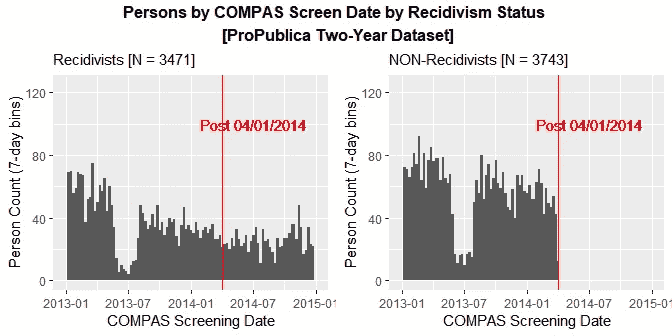

# 一个显著的公平机器学习数据集(短版本)中的数据处理错误

> 原文：<https://towardsdatascience.com/the-data-processing-error-in-the-most-prominent-fair-machine-learning-dataset-short-version-d27d8d390fea?source=collection_archive---------29----------------------->

## ProPublica 的 COMPAS 评分和累犯数据

在最近的一次研究 [**论文**](https://arxiv.org/abs/1906.04711) 和博客 [**帖子**](/the-data-processing-error-in-one-of-the-most-prominent-fair-machine-learning-datasets-4fa205daa3c4) 中，我重新审视了 **COMPAS 累犯风险评分**和**犯罪史**数据由 **ProPublica** 为其开创性的 **2016** [**文章**](https://www.propublica.org/article/machine-bias-risk-assessments-in-criminal-sentencing) 关于算法公平性

我*发现 **ProPublica** 在构建*键* **子**-用于文章分析的数据集时，出现了**数据处理错误**。我发现的数据错误会对这些关键子数据集的几个更基本的方面产生相当大的影响*，例如样本大小、累犯数量和累犯率。我估计累犯率是*向上偏*差不多 **25%** 。**

*尽管如此，有趣的是，我发现的非平凡数据处理错误对 ProPublica 使用相同子数据集报告的最引人注目的结果几乎没有影响。即非裔美国人相对于白种人的假阳性率和假阴性率。*

*C*

*基于其分析，专注于一组预测指标，ProPublica 得出结论，COMPAS 累犯风险评分**偏向**不利于*非裔美国人*。开发 COMPAS 风险评分系统的公司 **Northpointe Inc.** ，使用相同的数据，但侧重于一组不同的预测指标， [*为*](http://go.volarisgroup.com/rs/430-MBX-989/images/ProPublica_Commentary_Final_070616.pdf) 风险评分辩护为**无偏**。*

*由于主题和结果的争议性，以及数据的公开可用性，ProPublica 调查性新闻的开创性工作在公平机器学习或算法公平 T21 这一新兴领域引发了激烈的辩论和研究。*

*ProPublica 的 COMPAS 分数和累犯数据可能已经成为研究人员用来测试新的或现有的算法公平性定义和程序的最重要的基准数据。(参见 [Corbett-Davies 和 Goel 2018](http://arxiv.org/abs/1808.00023) 以及我在下面列出的其他参考资料；或者是 [**中的一篇**](/a-tutorial-on-fairness-in-machine-learning-3ff8ba1040cb) 中的几篇**博文)***

*当 ProPublica 的 COMPAS 数据被越来越多的研究使用时，研究人员通常会按原样采用 ProPublica 创建的数据集，并且*似乎没有*仔细检查过它们的数据处理问题。我没有测试一个新的公平定义或程序，而是仔细观察了 ProPublica 收集的真实数据集*

*特别是，我检查了**子**——数据集 ProPublica 建立来研究一个*两年内* *窗口*中一个被告最初被捕后的再犯数据。这样做，我发现 ProPublica 在构造这些**两年累犯数据集**时，犯了一个实质性的**数据处理错误**。*

> *如下图所示， **ProPublica 未能**对**惯犯**实施**两年窗口样本截止**(然而**对**非**惯犯实施了这样的样本截止)***

*因此，ProPublica 错误地在两年的数据集中保留了**累犯**的**不成比例的**份额。我估计这个**将**的**两年**一般**累犯**率**向上**大约**九个**百分点，将其从 **36%** 推至 **45%** 。*

*因此，ProPublica 计算的两年再犯率比正确处理*的同一数据中的*真实的*两年再犯率高约**25%*****。***

***在我的研究论文中，我还探讨了这种数据处理错误如何影响其他统计数据。具体来说，我看了 ProPublica 的**混淆矩阵**对高/低 COMPAS 分数与两年累犯状态的分析。我发现有偏差的两年期数据集对**阳性预测值**(或 ***精度*** )和**阴性预测值**也有*实质性的*影响。***

*****另一方面**，有偏差的两年期数据集对*混淆矩阵*分析中的其他几个关键统计数据的影响相对*较小*，这些统计数据对*累犯与非累犯相对比例的变化不太敏感*。特别是**准确率**、**假阳性率**和**假阴性率**。***

***ProPublica 的关键发现是 ***的假阳性率高于******假阴性率低于**的非裔美国人*比*的白种人*高，因此，当一个人正确处理数据时**不会改变**。*******

***据我所知，这是第一次强调上述数据处理错误。**在这篇博文中，我总结了我的研究** [**论文**](https://arxiv.org/abs/1906.04711) 。***

***(如果你想了解更多信息，但不是全文的研究论文，请看我以前的**长** [**版本**](/the-data-processing-error-in-one-of-the-most-prominent-fair-machine-learning-datasets-4fa205daa3c4) 的这篇博文。我还用我写的 R 程序创建了一个 **GitHub** [**资源库**](https://github.com/mbarenstein/ProPublica_COMPAS_Data_Revisited) 来分析数据)***

***在 2016 年的 **中，ProPublica 的一组记者获得了一个数据集，该数据集包含超过**一万一千名** *来自佛罗里达州**布劳沃德县**的审前*被告，这些被告在 2013 年**1 月 1 日**和 2014 年**12 月 31 日**之间被逮捕并*用 COMPAS 筛选系统评估*。*****

***ProPublica 随后收集了截至 2016 年 3 月底**的*未来*逮捕数据，以研究 COMPAS 风险评分对这些被告累犯的预测程度(并于 2016 年 5 月发表了文章)。( **ProPublica 的** **数据**和**分析**在这里 [**描述**](https://www.propublica.org/article/how-we-analyzed-the-compas-recidivism-algorithm) )*****

*****从这些数据中，ProPublica 创建了两个数据集，专门用于研究在最初犯罪和对比筛选日期的两年内的累犯。我特别检查了为研究*一般*累犯的可能性而构建的两年累犯子数据集 ProPublica。(一般累犯包括暴力和非暴力犯罪)*****

*****为了构建两年的累犯数据集，ProPublica 可能希望在 2016 年 3 月下旬收集犯罪记录数据的时间窗结束时，让人们*观察*至少两年。*****

*****因此，我们不应该期望在 2014 年 4 月 1 日**之后*的两年数据集中看到*任何*被告。(也就是说，在 ProPublica 收集的犯罪记录数据结束日期之前的两年内，人们观察到的*少于*)。********

*******为了验证这一点，**我通过分析被告在 **COMPAS 筛选日期**的**分布**来可视化**两年*普通*累犯数据集(筛选通常在逮捕当天或一天后进行)。这样做的时候，我发现 ProPublica 在创建这个数据集的时候犯了一个实质性的数据处理错误。*******

> ***ProPublica 未能对累犯实施为期两年的窗口样本截断(但它确实对非累犯实施了这样的样本截断)***

****(在之前的一篇* ***长*** [***版本***](/the-data-processing-error-in-one-of-the-most-prominent-fair-machine-learning-datasets-4fa205daa3c4) *的这篇博文中，我解释了可能导致 ProPublica 这样误入歧途的推理)****

***我在下图中展示了这个数据处理错误(我的研究论文中的关键图)。在这个图中，我做了一个*直方图*，显示了按 COMPAS 筛选日期(通常在逮捕当天或之后一天执行)划分的案件或逮捕数量。为了清楚地看到数据处理错误，我做了*分离*比较累犯和非累犯的屏幕日期直方图。***

***对于这些直方图，我使用 **7 天**(即一周)数据**箱**。作为参考，我在**2014 年 4 月 1 日**画一条红色竖线，这是 ProPublica 的犯罪记录数据收集窗口(2016 年 3 月下旬)结束前的两年标记*。****

******

***Source: [Barenstein, 2019.](https://arxiv.org/abs/1906.04711) (Figure 4)***

****【注:该图还显示了一个***，但非常明显，* ***在 2013 年年中的 COMPAS 放映(或案件)中*** *下降(对累犯和非累犯一视同仁)。这是一个* ***单独的问题*** *，但是，它似乎存在于 ProPublica 从佛罗里达州布劳沃德县收到的* ***原始*** *数据集。所以这个* ***不是*** *看起来是 ProPublica 的数据处理错误，而* ***我不*** *解决这个问题】*****

****T 上面描述的*关于累犯的数据处理错误导致*到**两年数据集中虚高的**累犯率。这是由于 2014 年 4 月 1 日之后的所有*额外*累犯。ProPublica 应该从两年的数据集中剔除这些额外的累犯，但它没有这么做。(在我的长文博文和论文中，我计算出这些额外的累犯构成了 ProPublica 两年*普通*累犯数据集中总累犯的大约 30 %)****

****于是，在 ProPublica 创建的两年*普通*累犯数据集里，**两年累犯率**为 **45%** 。但是，当我*去掉*多余的*累犯*时，我反而估计两年累犯率只有**36%** 。因此，在 ProPublica 的数据集中，两年的累犯率是**向上**偏移大约**九个**百分点或者 **25%** 。****

****在我的研究论文中，我还探讨了这种数据处理错误如何影响其他统计数据。具体我看 ProPublica 的**混淆矩阵**(或*真值表*)对 COMPAS 评分 vs 两年累犯状态的分析。为了进行这样的分析，ProPublica 将 COMPAS 分数转化为一个二元分类器，即低分数和高分数。(在我的论文中，我也是这样做的)****

****除了累犯患病率(即累犯率)，ProPublica 使用的*偏倚*两年期数据集也影响阳性预测值( **PPV** )(或 ***精度*** )和阴性预测值( **NPV** )。如果 ProPublica*正确地*处理了两年的数据，结果是累犯的发生率更低，毫不奇怪，PPV 会更低，NPV 会更高。****

******另一方面**，有偏差的两年期数据集对*混淆矩阵*分析中的其他几个关键统计数据的*影响相对较小*，这些统计数据对*累犯与非累犯相对比例的变化不太敏感*。特别是*准确率*、*假阳性率* ( **FPR** )、*假阴性率* ( **FNR** )。或者一个减去这些比率，即**特异性**和**敏感性**。(我在这篇博文的**长** [**版本**](/the-data-processing-error-in-one-of-the-most-prominent-fair-machine-learning-datasets-4fa205daa3c4) 和我的研究论文中解释了为什么会这样)****

****ProPublica 发现*非裔美国人*比*白种人*假阳性率高假阳性率 ***假阴性率****低，这是最受关注的关键发现。因此，当正确处理数据*时**不会改变**。******

****U 最后，我这里认定的数据处理错误的实际重要性可能是*有限的*。例如，我并不是说 Northpointe 在开发 COMPAS 累犯风险评分时犯了一个错误(尽管用于此的数据和实际模型是专有的，并不公开)。****

****此外，大多数*公平的*机器学习研究似乎以 FPR、FNR 或准确性为目标，这些不受数据处理误差的影响。****

****最后，请注意，许多潜在的测量问题可能会影响 ProPublica COMPAS 数据中估计的两年累犯率(正如我在论文中提到的)。其中一些可能会对估计值施加向下的压力，也许会在某种程度上抵消我在这里提到的向上的偏差。****

****然而，这最后一点并没有使我所指出的数据处理问题的重点和我所呼吁的随后的数据修正无效。我的重点是*内部*数据处理的有效性。我并不是说经过这种修正后，数据将不会有任何遗留问题，也不一定会有*外部*有效性，这超出了我的分析范围。****

****在任何情况下，似乎没有人像我上面所做的那样，预先设想过*两年*累犯数据集的 COMPAS 筛选日期。(如果他们有，也没有被广泛传播)因此，我在这里指出的数据处理错误一般会持续和传播三年以上。****

****我的博客文章和研究论文试图将焦点放回到数据*处理*阶段，并强调其中的潜在隐患。****

# ****脚注****

1.  ****最近，研究人员指出了*分类奇偶校验*的算法公平性目标的一些潜在缺陷，该目标试图在人口亚组之间使分类误差的度量相等，如 FPR 或 FNR([Corbett-Davies 和 Goel 2018](http://arxiv.org/abs/1808.00023) )。其他工作表明，几种流行的算法公平目标是不相容的，不可能同时实现*(例如 [Chouldechova 2016](https://arxiv.org/abs/1610.07524) 和 [Kleinberg 等人 2018](https://www.aeaweb.org/articles?id=10.1257/pandp.20181018) )。*****
2.  *****在我的博客文章和论文中，我研究了 ProPublica 两年的一般累犯数据集。当我关注这个数据集时，ProPublica 也*T21*创建的两年期**暴力**累犯数据集*也遭遇了我在这里指出的同样的数据处理问题。******

***这篇博文是我**上一篇**走向数据科学 [**帖子**](/the-data-processing-error-in-one-of-the-most-prominent-fair-machine-learning-datasets-4fa205daa3c4) 的*短*版。我的一篇*长篇*版本的论文是 [**可在 **arXiv** 上**](https://arxiv.org/abs/1906.04711) 。(我还用我写的 R 程序创建了一个 **GitHub** [**资源库**](https://github.com/mbarenstein/ProPublica_COMPAS_Data_Revisited) )***

***我是美国联邦贸易委员会的经济学家。这项研究与我在联邦贸易委员会的工作无关。**本文仅代表作者个人观点。他们不一定代表美国联邦贸易委员会或其任何专员的意见。*****