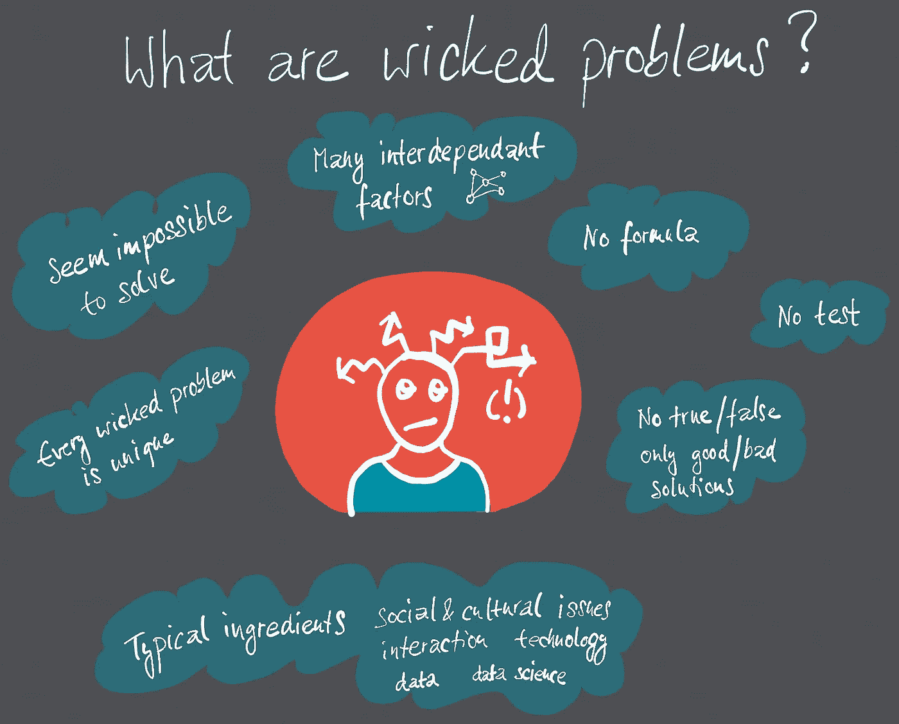
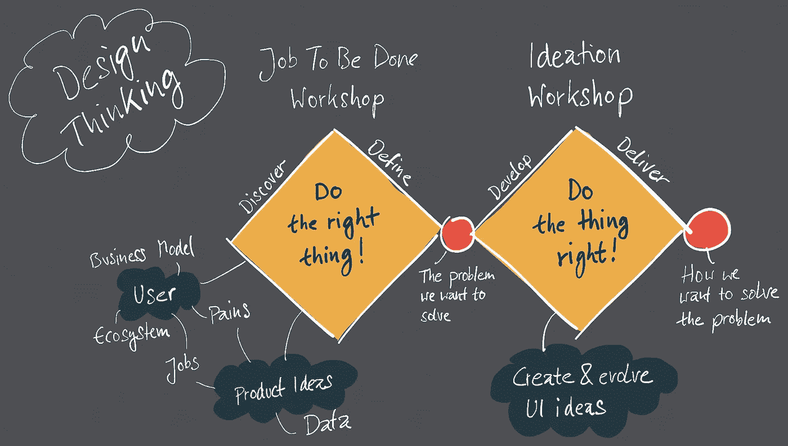

# 数据产品设计思维过程

> 原文：<https://towardsdatascience.com/the-data-product-design-thinking-process-6b3eba561b2b?source=collection_archive---------9----------------------->

## 如何用设计思维解决棘手的数据可视化问题？

好奇心是我们所有人的主要驱动力。我们不断地对过程、原因和结果进行研究。

我们希望了解公司、运营流程和经济关系是如何运作的，它们由哪些步骤和部分组成，事情为什么会发生，以及一切是如何相互关联的。

一旦我们分析了一切，我们就可以利用这些知识以积极的方式对世界施加影响。

在寻找相关性的过程中，数据是一个越来越重要的因素。正确的数据(智能数据而不是大数据)让黑暗变得更加明亮。没有数据，对我们周围的世界进行准确、系统的分析和精确的设计就不再可能。仅靠直觉和直觉是不够的。

而是原始版本的数据(二进制、表、日志文件、数据库等。)实际上不能被人类阅读。如果我们想要更快，我们需要数据可视化，使正确的数据选择在适当的聚合级别上容易且精确地可见。这项任务由所谓的数据产品来完成。它们以一种合适的形式将我们的世界形象化，并使我们能够分析和寻找原因和结果。

谷歌地图、谷歌分析或天气、健康或时间表的移动应用等数据产品为我们提供了非常高水平的信息。我们所看到的吸引人的、清晰的展示是对数据、联系和结构的高度复杂的浓缩和复杂的视觉总结。

# 什么是数据产品？

数据产品是使用和可视化数据来支持决策和帮助控制复杂系统的数字产品。

数据产品是在算法的帮助下，对系统的统计的，主要是复杂的数据分析的可视化处理结果。系统可以是流程、设施、公司、城市、国家、基础设施、太阳系、有机体、生态系统、气候条件。事实上，我们的世界由无数的系统组成。

数据产品描述了该系统的历史、当前或未来的条件和发展。用户使用数据产品快速、直观地描述系统的复杂状况和发展，并从中获取信息和自己的决策。

# 使用数据进行设计

机器(数据产品)与人之间的视觉界面非常重要。

但是你到底是如何开发它们的呢？我们如何确保他们有效地完成任务？特别是在专业环境中，不同的用户对新的数据产品有不同的要求。你会很快发现自己处于一个必须解决棘手问题(邪恶问题)的境地。

棘手的问题有以下几个特点:
有许多相互依赖的影响变量
没有对错的解决方案，只有好的和坏的
你不能只用一个公式和逻辑来解决它们
你只能凭直觉解决，而不是逻辑上的
有社会、心理和文化方面的考虑。

What are wicked problems?

# 如何处理棘手的问题

数据产品面临的挑战是…

在**内容**方面:
底层系统复杂度高

在**数据**方面:
来自不同数据源的数据必须相互连接
数据质量通常不够
数据准备(ETL)复杂且耗时
必须正确集成数据科学技术

在**可视化**方面:
经典的可视化方法(条形图、饼图、点状图)已经不够用了
使用 Qlik、Tableau 和 PowerBI 等常用工具进行可视化的可能性受到了限制

在**用户**方面:
用户有非常不同的知识
他们必须做非常不同的工作(要做的工作)
解码数据产品中包含的信息并将其分配给你自己的知识是一项挑战
用户的工作环境(医疗技术、系统控制、车辆控制)非常复杂

关于所有这些方面的更多细节也可以在我们关于数据设计指南的文章中找到。[此处](https://www.designation.eu/en/2019/01/31/why-does-no-one-understand-my-data-visualization/)

How to deal with wicked problems ?

# 什么是设计思维？

设计思维为解决棘手的问题提供了一种非常有效的方法。在这里，一个跨学科的团队从用户的角度出发，以单独的、系统的步骤来处理一个潜在的解决方案。然后由用户测试其适用性。

设计思维已经成为一种众所周知的、久经考验的发展创新的方法。许多大型技术和咨询公司都使用它。

互联网上充满了对设计思维的实用和描述性的解释，所以这里只是对设计思维过程中的四个基本阶段的简要概述。

发现——发现所考虑问题的环境和背景
定义——制定用户的要求和需求
开发——对解决方案提出初步想法
交付——创建解决方案并获得用户反馈。

The Data Design Thinking Process

# 数据产品的设计思维

我们想知道这种方法是否也可以用于数据产品。设计思维完全是关于用户和他们的需求。现在又增加了一个非常复杂的维度:数据或数据科学。然后，我们专门针对数据产品采用了经典的设计思维方法，并且自 2018 年初以来一直非常成功地与之合作。

在商业应用的数据产品开发中使用设计思维的挑战在于以下几点:
·大数据和数据科学应用的数据产品开发往往会有新的突破。在这一点上，目标用途(要做的工作)在开始时没有明确定义。使用环境和用户需求必须与数据产品同等开发。有时，它们只是在第一次可视化之前不可见的系统之后才变得明显。
用户的数据能力未知或太低，无法理解信息
设计者需要对数据结构、原始数据和数据管道有深入的了解。创造性开发的东西也必须在技术上是可能的。纯粹的 UX 观点是不够的。
许多数据产品都基于数据科学算法。数据以及统计学和数据科学的潜力是创造过程的原材料。数据产品只有在充分利用这种数据潜力时才会变得高效。在这里，如果不了解数据素养和数据科学，设计师也无法走得更远。
专业环境中的数据产品面向专业领域的用户和专家。因此，数据产品深度介入了所谓的业务领域——更高层次的复杂性。

作者:Evelyn münster/Christoph Nieberding

# **关于我们**

Evelyn Münster 和 Christoph Nieberding 是 Designation 的管理合伙人，Designation 是一家位于慕尼黑的数据产品和商业设计设计公司。 [www.designation.eu](https://designation.eu/en)