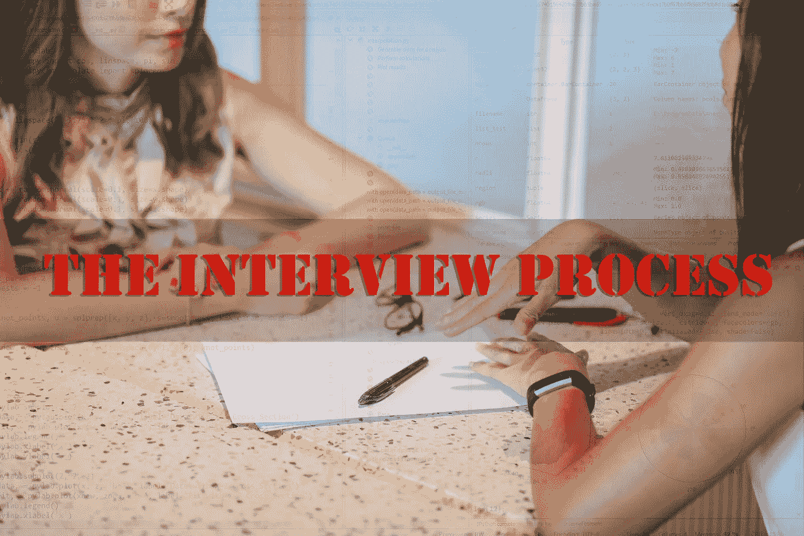

# 数据科学面试:期待什么

> 原文：<https://towardsdatascience.com/the-data-science-interview-what-to-expect-15deecea35cc?source=collection_archive---------15----------------------->

## 数据科学面试因其不确定性而令人恐惧。在这里，我分解了这个过程，并提供了一些帮助你成功的技巧

在许多行业中，面试过程是人们害怕的事情。在咨询和银行业，潜在客户要花无数时间学习，以掌握案例面试和技术问题。对于软件工程师来说，一种全新的商业模式已经完全建立在帮助潜在客户回答编码问题的基础上。许多关于面试的恐惧来自于对面试过程的不确定性。在数据科学这一相对较新的领域，这一点更加神秘。

所有公司对数据科学的面试都不一样；然而，在你申请的大部分工作中，还是有一些相似之处。在这篇文章中，我尽我所能分解了一般的面试阶段，并给出了一些如何在每个阶段脱颖而出的建议。希望这将缓解一些与数据科学面试中的不确定性相关的压力。

为了本文的目的，我们将跳过申请过程的细微差别。以后打算写一篇关于如何优化你的简历和你与公司的沟通渠道的文章，敬请关注！

## 第 1 阶段:电话面试(15-30 分钟)

对于大多数公司来说，第一步是和你通电话。你通常会与技术招聘人员(大公司)或数据科学经理(小公司)交谈。

这些对话很短，主要集中在了解你的适合度或你过去的项目经验。偶尔，他们会要求对你的相关技能进行广泛的评估。

成功秘诀:

*   仔细想想你为什么要为公司工作。招聘人员会因为对公司使命的热情或你申请的特定职位而兴奋
*   查看招聘启事，确保你能用任何相关工具讲述你的经历
*   回顾你的简历，确保你能清楚地讲述你过去参与的任何项目。为了加分，把这些项目和你可能在工作中做的工作联系起来
*   这是一个问自己问题的好机会。问一些深思熟虑的问题，表明你对这家公司进行了彻底的调查，可以增加你进入下一轮的机会

## 第二阶段:带回家测试

当你通过电话面试后，公司通常会给你一份带回家的评估。这可以是供您分析的数据集、编码评估或他们希望您演示的项目。这将因公司和角色的不同而有很大差异。

**数据分析:**我个人认为这个选项最能代表你每天要做的工作。对于这类问题，他们通常会要求您在相对较短的时间内完成分析。他们会说:“这应该不会花你超过 3 个小时”。从我的经验来看，他们几乎总是要花很长时间。如果可能的话，我会试着安排一下，这样你就可以在周末完成。

成功秘诀:

*   如果没有明确说明不能从外部来源引入数据，可以考虑添加其他有用的数据。
*   使用特征工程或特征缩减(并能够解释为什么)可以极大地提高你的分析质量
*   花些时间让业务涉众理解你的工作(详细的视觉效果),可以表明你了解如何推动业务价值
*   创建一个 API 端点或 web 应用程序说明了你的工作偏向于可操作性(这可能有点过头了)

**编码评估:**除非你申请的是机器学习工程师的职位，否则编码评估通常更容易获得数据科学职位。你应该预料到他们会让你选择你喜欢的编程语言来回答几个问题。

对于这些，一般都有严格的时间限制。他们要么让你登录一个会观察你进行评估的面试官，要么让你在无人监控的情况下通过一个在线平台参加测试。

老实说，这些即使相对简单，也让我紧张。当编码或解决问题时，时间压力会让人感到不舒服。

成功秘诀:

*   练习，练习，练习。网上有很多地方可以练习编码问题。最著名的可能是 [leetcode](https://leetcode.com/)
*   继续[glassdoor.com](https://www.glassdoor.com/)看看你是否能对某些问题有所感觉
*   如果你是在面试官在场的情况下做评估，练习用你的方式讲述你的代码。有人在那里观察你是有帮助的，即使他们对编码或数据科学一无所知

**呈现:**这些都挺少见的。一些公司可能会要求你介绍一个过去的项目，或者进行一个简单的分析，并通过 powerpoint 展示你的发现。如果他们让你出席，他们可能是想测试你与商业利益相关者交谈的能力。

成功秘诀:

*   试着集中讲述一个关于你的项目的好故事，你为什么使用你所做的方法，以及结果是什么
*   花点时间让你的幻灯片在视觉上吸引人
*   用数据支持你的每一句话
*   提前准备好潜在的问题

如果你通过了前两个阶段，他们会带你去办公室进行面对面的面试。如果你住在全国各地或申请一份远程工作(视频面试)，也有例外。

*在办公室里，你通常会与团队和整个公司的人进行 2-5 次面谈。以下阶段可以按任何顺序进行。你的面试时间表很大程度上取决于面试你的人的时间表。*

## 第 3 阶段:采访数据科学家(30 分钟-1 小时)

在你进入办公室后，公司会让你与团队中的一名数据科学家交谈。这次面试可能会变得相当专业。预计他们会问你简历上的项目和你方法背后的逻辑。他们可能还会要求你解释一些你所使用的算法背后的数学原理。

如果他们有任何关于带回家测试的问题，他们通常也会在这里问。由于这是一个他们熟悉的项目(他们可能自己参加了评估)，所以要准备好回答有关数据清理、模型选择等问题。

最后，如果有时间，他们可能会问几个行为面试问题。这些很重要，因为如果你得到了这份工作，你很可能会和这个人一起工作。如果你能在这里建立一种联系，这将大有帮助。

成功秘诀:

*   花点时间彻底检查你简历上的项目。能够深入解释你使用的任何算法
*   回顾一般数据科学面试问题，这些问题通常基于统计数据。你可以在这里找到这些[的例子](https://www.springboard.com/blog/data-science-interview-questions/)
*   回顾你的评估，思考你可以改进分析的方法
*   询问他/她在公司的经历

## 第 4 阶段:现场编码考试(30 分钟— 1 小时)

通常，上一节中的同一位数据科学家会给你另一个快速的技术评估。这一篇主要关注 SQL 或一些轻量级的 python 数据操作。

对于这些问题，他们要么给你一台电脑，要么让你在白板上解决问题。他们希望你按照自己的方式来编写代码。

成功秘诀:

*   在线练习 SQL 问题。确保您了解查询基础知识(SELECT、FROM、WHERE、GROUPBY、HAVING、ORDERBY)、连接类型、自连接、子查询等。
*   熟悉 pandas 和 numpy 的数据操作(如果可以使用 Python 的话)
*   有同伴在场的情况下，在一张纸上或白板上练习解决问题

## 第 5 阶段:与数据科学经理或主管面谈(30 分钟-1 小时)

在一天中的某个时候，你会和一位人事经理交谈。此人可以是数据科学总监、分析副总裁、数据科学经理等..他们会再次关注你是否适合这个团队。

期待他们询问你过去参与的项目。他们通常会更关注你所使用的过程，而不是技术算法。他们可能还会问你和项目经理相处的经验以及不同的项目管理哲学。在这种情况下，技术问题通常很少出现，除非这位经理有大量的量化背景。

在这次面试的行为部分，他们想更好地了解你的目标。他们可能会问你希望如何在公司成长，或者你想在工作中学习什么。

成功秘诀:

*   在早期阶段询问团队使用的 PM 哲学。做一些功课，这样你至少对它有一个基本的了解
*   想想你想在工作中学习什么，你想在公司里有什么样的发展轨迹
*   询问公司提供的管理理念、工作自主权和职业发展方面的问题

## 第 6 阶段:汇报(30 分钟-1 小时)

这个面试一般留到最后。在较大的公司，这将是与人力资源代表，但在一些较小的公司，这可能是一个机会，以满足首席技术官或首席执行官。此对话还将包含一个重要的 fit 部分。这是你重申你对公司及其使命的兴奋之情的机会，为什么你会是一个很好的人选，以及你如何能为组织创造独特的价值。

从我的经验来看，你的面试官会问一些问题，然后让你掌握主动权。

成功秘诀:

*   不要害怕谈论你自己，只要你把它与你为什么爱这家公司或者你如何能为它创造价值联系起来
*   赞美别人，如果你在和首席执行官或首席技术官谈话，不妨说你很喜欢其他面试
*   询问有关公司未来和下一步行动的问题

## 你可能面试的其他人

主要嫌疑人是数据科学团队的成员或技术招聘人员，但也有一些其他人可能是面试过程的一部分。也有可能会有多人同时面试你。

以下是一些其他类型的面试官:

*   项目经理——如果你得到了这份工作，你将每天和这些人一起工作。他们通常会问你关于你的工作风格和你使用不同类型的项目管理框架的经验。
*   商业利益相关者——这些人会从你的工作中受益。他们可能会问你如何传达信息和发现。
*   招聘经理——这个群体关注的是你在公司的适合度。他们想看看你是否对工作充满热情，是否认同公司文化。
*   数据工程师或软件工程师——如果你经常和他们一起工作，有时他们会让这些人面试你。他们还可以管理 SQL 评估。

## 最后的想法

希望这份指南能让你更好地理解面试中会发生什么。当这个过程的不确定性减少时，我相信它实际上是有趣的。如果你想成功，在行为部分和技术部分都表现出色是很重要的。很多次，我看到候选人得到工作，因为面试官相信他们的潜力和激情，尽管他们的技术能力有限。在面试之前，你应该尽可能多地对将要面试你的人进行调查。发现人们的共性和趋势与发现数据一样重要。