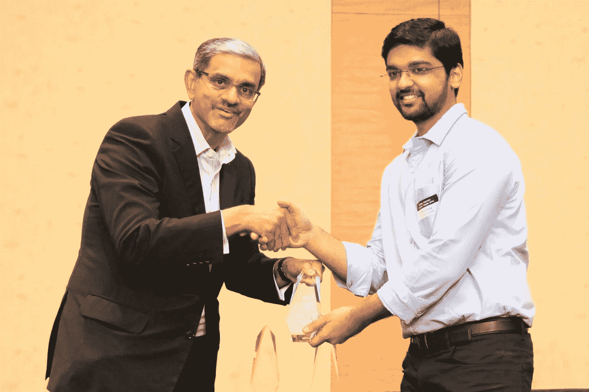
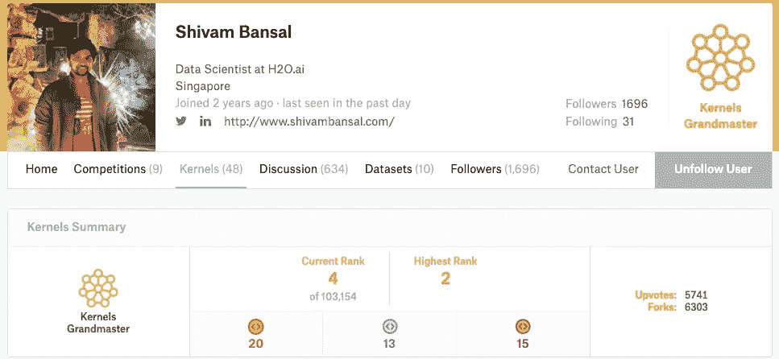
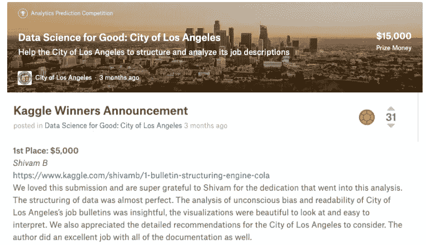

# 这位数据科学家负责 Kaggle 上的“数据科学为善”竞赛。

> 原文：<https://towardsdatascience.com/the-data-scientist-who-rules-the-data-science-for-good-competitions-on-kaggle-ab436595a29f?source=collection_archive---------13----------------------->

## 在与 Shivam Bansal 的对话中:一位数据科学家，一位 Kaggle 内核的特级大师，三次获得 Kaggle 数据科学良好竞争奖。

通信是一门艺术，也是数据科学领域的有用工具。能够交流见解是必要的，以便其他人可以根据这些发现的结果采取所需的行动。**传达** **数据**的最有效方式之一是通过**讲故事。**但要成为引人注目的故事讲述者，我们需要简化事情，而不是复杂化，这样分析的真正本质才不会丢失。总之，不要单纯的展示数据，用数据讲一个故事。

在本期 Kaggle Grandmasters 的采访中，我将向您展示一位讲故事大师的惊人而鼓舞人心的旅程:[**Shivam ban sal**](https://www.kaggle.com/shivamb)**，**一位 Kaggle 内核大师和 H2O.ai 的高级数据科学家。他目前不在新加坡，正在参与 H2O.ai 的 APAC 活动。Shivam 是来自印度的计算机科学毕业生。他于 2019 年获得了新加坡国立大学的商业分析硕士学位，并获得了**杰出顶点项目奖。**

Shivam 有一个非常有趣和专注的 Kaggle 旅程，用他自己的话说:

*“我在一月份加入 kaggle，到了年底，我成为了内核* ***特级大师，*** *达到了* ***综合排名第二，*** *获得了* ***10 个内核奖*** *(其中包括三个* ***周内核奖*** *和四个*

*以下是我与 Shivam 对话的摘录:*

*   Kaggle 最初吸引你的是什么，你是什么时候赢得第一次胜利的？

***Shivam***:2014 年我在第一家公司工作的时候认识了 Kaggle。我正在开发一个文本分析框架，包括情感分析，与此同时，一个类似的竞争也在 Kaggle 上运行。我当时并没有加入 Kaggle，而是把它作为一些好的讨论和知识的参考。2018 年初，我在四年后加入了 kaggle，并参加了一场关于有毒评论分类的比赛。在那次比赛中，我从别人分享的很多内核中学到了很多。我意识到 Kaggle 内核是任何试图学习和实践数据科学的人最有价值的工具之一。我还决定分享其中一个内核作为比赛的一部分，幸运的是它被选为其中一个奖项的获胜者。

[Shivam’s Kernel’s Profile](https://www.kaggle.com/shivamb/kernels)

在【2018 年 4 月，我参加了 **DonorsChoose** 、 **Kaggle、**和 **Google** 组织的**Data science for good competition**。我在一个内核中创建了一个混合推荐引擎，它被选为比赛的获胜者。这是我在卡格尔的第一次重大胜利。

*   ***你为什么为了好的竞争而决定进入数据科学？***

Shivam’s Winning Submission: [https://www.kaggle.com/shivamb/1-bulletin-structuring-engine-cola](https://www.kaggle.com/shivamb/1-bulletin-structuring-engine-cola)

***希瓦姆*** :我喜欢参与数据科学的有益挑战。这些竞赛提出了一系列特殊的、独特的、具有挑战性的问题陈述。与排行榜进行评估的传统 ML 特定竞赛不同，这些竞赛更加开放。这种竞赛要求解决方案在数据科学的几乎所有方面都是完整的，从数据挖掘、清理、工程、分析、建模、可视化、洞察力，以及最重要的讲故事。我喜欢这些比赛非常接近现实生活中的数据科学项目。

*   从你的内核可以推断，你通常会把一个问题分解成更小的部分。这种方法如何帮助你解决问题？

***Shivam*** :任何分析或数据科学问题本质上都是非结构化的。这意味着没有明确的目标和任务要完成；因此，有时很难建模和接近。我总是试图通过将问题分解成更小的任务来使问题陈述有一个结构。然后，我试着将任务联系起来，准备一个粗略的管道，包含每项工作可能的解决方案/代码。

作为第一个目标，我确保创建一个端到端的内核版本，所有组件和任务都准备好了。在这一点上，结果可能不是有效的，并且是最先进的，但是我通过添加可视化、洞察力、解释、代码重构等来迭代地改进我的内核。这种方法使整个问题状态和解决方案变得清晰，也有助于提高与分析性思维、结构化思维和批判性思维相关的技能。

*   除了在您的内核中显而易见的全面分析之外，您还具有可视化结果的能力。数据可视化作为数据科学家的一项技能有多重要？

***Shivam*** :可视化是整个数据科学工作流程的重要组成部分。清楚地显示数据集中存在的信息和见解的能力是业内高度赞赏和追求的技能。无论是在 EDA 阶段还是后建模阶段；可视化发挥了重要作用。您的作品的最终用户可能并不总是理解数据或结果的技术方面，但是当使用不同的图、交互、动画和各种图表进行可视化时，它会变得更加明显。视觉在许多领域都显示出了重要性——数据故事，向业务用户展示数据的洞察力，甚至解释黑盒机器学习模型。

*   **你是 H2O.ai 大师库中的最新成员。作为 H2O.ai 的数据科学家，你的角色是什么？你在哪些具体领域工作？**

Shivam with some of the fellow Kaggle Grandmasters at H2O.ai

Shivam :我的目标是为 H2O.ai 目前正在开发的新产品做出贡献，并通过新的功能和配方来帮助改善 DriverlessAI。我希望产生影响的一些领域是无监督的机器学习、自然语言处理、自动洞察、视觉分析、自动叙事的自然语言生成以及人工智能。我还积极与 APAC 地区的销售和售前团队合作，以吸引更多客户，教育潜在客户，并帮助他们解决具体的项目和问题。此外，我还与客户成功团队合作，帮助不同的组织在其项目中实现人工智能。

*   **除了 Kaggle，能不能分享一些对数据科学初学者有用的资源？**

***Shivam*** :除了 Kaggle 之外，我还从像 Analytics Vidhya、Towards Data Science 和 KDnuggets 这样的博客和网站学到了很多东西。这些博客是了解新概念的好来源。为了获得更全面的数据科学知识，我推荐像 **deeplearning.ai** 和 **fast.ai** 这样的专家开设的课程。

*   你想在 ML 中应用你的专业知识吗？

***【希瓦姆】*** :为发展中国家的弱势人群解决小额信贷问题。许多个人或小企业无法获得贷款，因为他们无法从银行获得贷款，因此没有信用记录。我想使用网络科学、图论和非结构化数据等概念来开发模型，以帮助这部分人群。

*   **对于刚刚开始或希望开始数据科学之旅的数据科学有志者，有什么建议吗？**

***Shivam*** :数据科学是关于想法和实验的。这都是关于尝试那些想法和实验，一次又一次地重复，直到达到一个成功的阶段。这是关于培养“愿意尝试”不同实验和失败的心态。也是要迈出第一步，不断进步。

Shivam won the **Outstanding Capstone Project Award** from the National University of Singapore for creating a platform for **Alternative Credit Scoring for SMEs** using unstructured data and deep learning.

另一个有价值的建议是始终从端到端的角度考虑问题。这意味着在开发数据科学解决方案时，有必要牢记业务视角。这种想法有助于为手头的任何业务问题提出一个创造性的相关解决方案。

最后，在开始学习数据科学时，互联网上有大量有用的资源，拿一个，开始一个，坚持下去，完成它。有这么多的资源在那里，很容易被分散注意力，我已经看到许多人没有做到这一点。要从任何课程中获得最大收益，最好的方法就是完成它。

Kaggle 上的 Shivam 内核总是彻底研究、清晰文档和高质量可视化的完美结合。他在工作背后付出的努力是巨大的，也是显而易见的。Ben Shneiderman 曾经说过可视化的目的是洞察力，而不是图片，Shivam 的内核就是这一事实的见证。

# 阅读本系列的其他采访:

*   Bojan Tunguz :从学术界到 Kaggle:物理学家如何在数据科学中找到爱情
*   [Rohan](/a-data-scientists-journey-from-sudoku-to-kaggle-120876b7fa33) Rao:数据科学家从数独到 Kaggle 的旅程