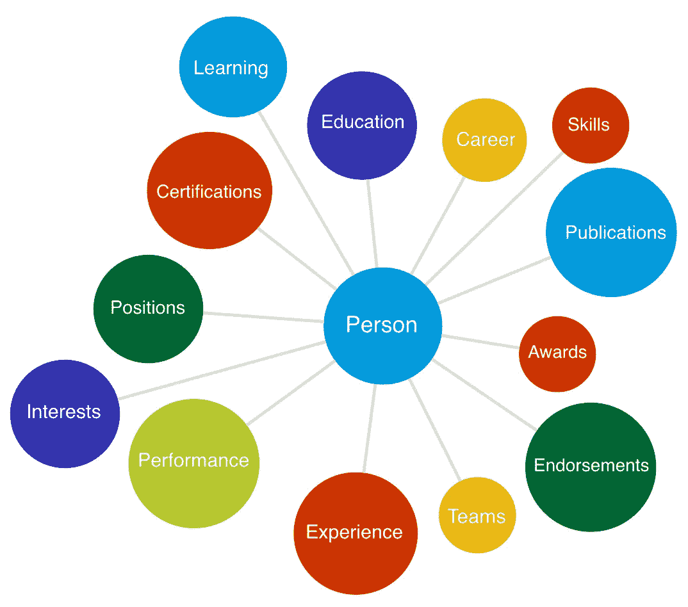
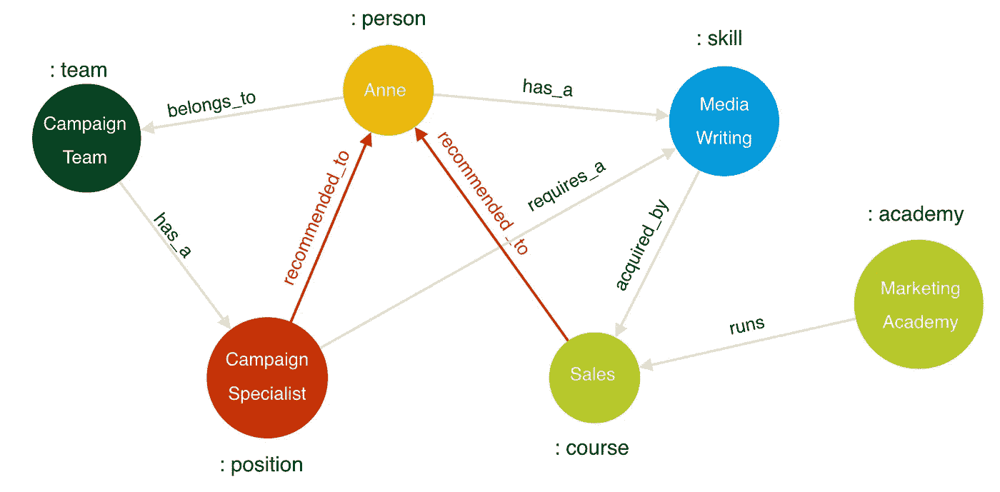

# 人员分析的新时代

> 原文：<https://towardsdatascience.com/the-dawn-of-a-new-era-for-people-analytics-9a748f7fdc2?source=collection_archive---------22----------------------->

## 用图表技术建立组织智能能力

对于每一个现代企业来说，要克服人力资本管理中最大的战略挑战——*培养和留住人才、提高绩效、实现增长思维和发展敏捷的工作文化*s——能够利用人员数据是至关重要的。然而，领先的全行业人力资本管理调查发现，大多数组织几乎只具备最基本的人员分析能力，即“运营报告”。在接受调查的行业领先组织中，只有相对较小比例的组织利用预测分析，更小比例的组织仍在利用这些预测算法来自动化和增强 HCM。

许多组织面临的现实是，“他们的人员数据”实际上并不属于他们。*他们的人*把*他们的数据*放在流行的职业网络上——当然是 LinkedIn 以及许多开放的职业网络/社区平台中的一个上。可以理解的是，价值部分来自于联系。

许多大型组织已经经历了无数次 HCM 平台和*组织内部网络工具的尝试，一个接一个的失败。太多的人陷入了像 LinkedIn 这样的开放网络平台一样的前意识空间，并且在这样做的时候，很少被理解。虽然可以从这些开放网络工具的用户体验和算法行为中学到很多东西，但*组织内部*网络在很大程度上未能实现它们最重要的优势——在用户*组织* *环境*中获得*有形*和*相关*好处。*

# 重建社会企业

如今，企业比以往任何时候都更需要找到从员工数据中获取价值的方法，即*管理人才、理解网络和促进工作文化。事实上，调查反复发现，员工希望他们的雇主在这方面做得更好。这也得到了前所未有的员工流失率和蓬勃发展的招聘行业的支持。*终身工作怎么了？**

如今，要想成功建立社会企业，意味着至少在员工的意识中创造和征服一个新的空间，让员工和公司都能找到相关性和价值。重建社会企业并不是为了与开放的网络平台竞争；这是关于建立一个内部联系的社区，在这里，获得学习、职业发展和个人成功的回报在组织文化中根深蒂固，参与的价值是巨大的。只要说“网络”是支撑这种智能能力的技术就够了，因为人与人之间的数据本质上是相互联系的。

People Data is Connected

# *人员数据已连接*

如果能从 LinkedIn 等职业网络的统治地位中学到什么，那就是*连接数据驱动价值*。人员数据已连接。在隐私限制范围内，兴趣、奖励、经验、兴趣、职位、表现、技能以及这些与每个人的联系推动了巨大的洞察力和价值。

人员数据不仅相互连接，而且相互关联。例如，如果员工 Anne 拥有某个空缺职位所需的技能，我们可能会向她推荐该职位。相反，如果 Anne 对她感兴趣的角色需要一项技能，我们可能会向她推荐一门课程，使她能够获得这项技能。

Talent Management Scenario with Connected People Data

有了这些明确定义的数据之间的关系，组织发展和利用人才、评估和提高绩效的机会是巨大的。继续这个例子，安妮正在走的路；她尚未获得的技能；她在组织中的影响力和她被裁掉的几率更容易量化，因为人们对它们的理解更深入。更重要的是，因为个人愿望——远不止是报酬——得到了更好的理解，奖励也更有意义，参与数据处理的程度也更高了。

# *进入图形数据库的世界*

能够理解*人们学习什么、与谁互动、与什么互动的不断发展的关系*是人力资本管理的关键。开发、维护和查询关系 SQL 结构以从人员数据中提取含义，是在错误的工作中使用错误的工具。另一方面，开发和维护一个图不仅仅是更高的性能，而且允许分析师通过来自业务用户的持续反馈进行迭代开发*，*，因为用图建模对用户来说足够直观，易于理解。这就是原生图技术的无模式本质，数据用户变成了数据分析师，人们数据探索的机会——通常保留给数据科学家的任务——变成了每个团队和每个员工的可能性，无论是初级还是高级。所有这一切开创了人员分析的新时代，在这个时代，人员数据是相互关联的，可供每个人使用，分析就像组织和决策者希望的那样敏捷。

展望未来，图表技术为人员分析带来了巨大的机遇，原因如下:

*员工采用的社交企业应用需要建立在图表的基础上*——因为围绕学习、职业发展和支持的个性化建议和预测性分析都可以通过图表轻松实现，内容将更加相关，因此员工更有可能与这些应用互动。

*更好地洞察人员数据* —人员数据高度关联。图表为关联数据提供了理想的技术堆栈，而用于中心性和社区检测的图表算法提供了使用关系表结构难以获得的洞察力。

*组织变得更具适应性* —图表支持以灵活的方式处理数据，这是适应不断变化和发展的人力资本市场的关键。特别是，通过图表，业务用户可以为定义和发展图表模型做出积极的贡献，这意味着数据的分析和视图总是*相关的。*

*提高效率和分析能力* —数据分析师不必像查询关系结构那样编写耗时的连接，而是可以重新分配到更高级的任务，例如开发用于高级分析的图形模型。

*分析变得大众化并推动决策制定* —查询图表比关系结构更直观，可视化工具为整个企业的决策者提供了强大的故事讲述功能。

# 接下来去哪里？

查看运行中的人员图表。在我的下一篇文章中，我将构建一个人物图表，向您展示图表如何提高 HCM 能力。如果你喜欢你所看到的，或者想要更多关于为你的组织建立一个人的图表的信息，Twitter DM @jamesdhope。

# 参考资料:

[1]德勤人力资本趋势 2019，[https://www2 . Deloitte . com/insights/us/en/focus/Human-Capital-Trends . html](https://www2.deloitte.com/insights/us/en/focus/human-capital-trends.html)

[2]https://neo4j.com/developer/

[3]BlueDataLab.com，人物数据分析案例研究