# 数据科学家之死

> 原文：<https://towardsdatascience.com/the-death-of-data-scientists-c243ae167701?source=collection_archive---------4----------------------->

## AutoML 会取代数据科学家吗？

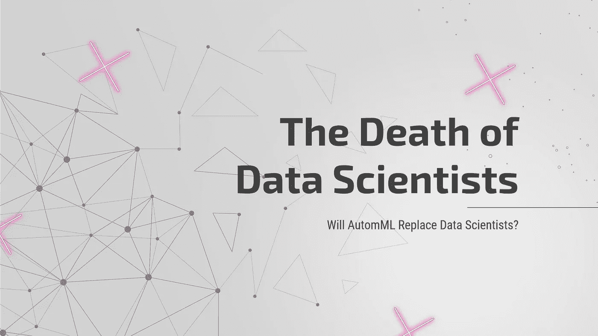

# AutoML 来了！

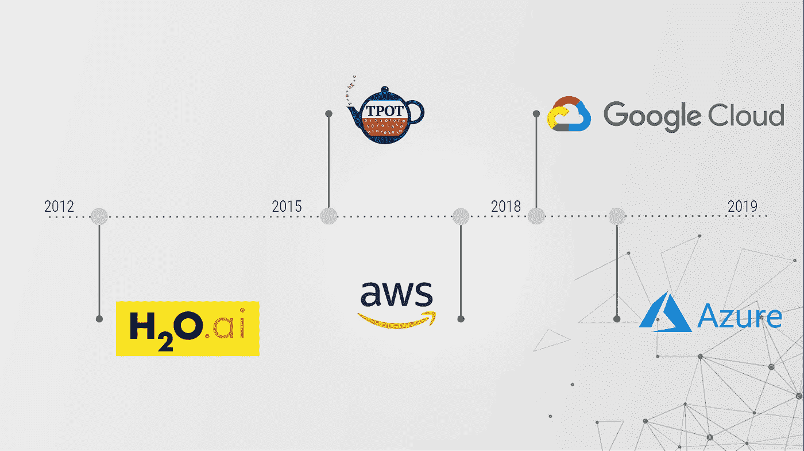

A brief history of AutoML platforms

在 *2018 年，科技巨头谷歌和微软向世界介绍了他们的 AutoML 服务:谷歌云 AutoML 和 Azure 机器学习。从那以后，这些服务的受欢迎程度和受关注程度直线上升。在这篇博文中，我们将讨论 AutoML 是什么，目前有哪些平台，以及数据科学家最关键的问题:AutoML 会取代我们吗？*

# **汽车简介**

在介绍 AutoML 时，不能不提到机器学习项目的生命周期，它包括数据清理、特征选择/工程、模型选择、参数优化，以及最后的模型验证。随着技术的进步，传统的数据科学项目仍然包含大量的手动流程，并且仍然非常耗时和重复。

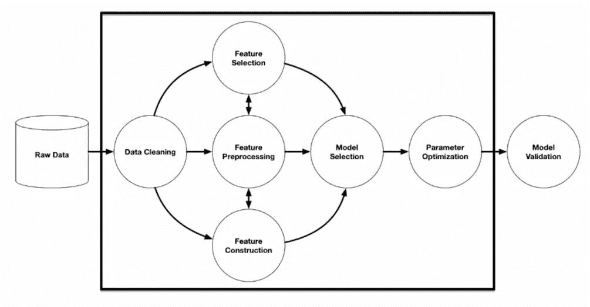

source: R. Olson et. al. (2016) “Evaluation of a Tree-based Pipeline Optimization Tool for Automating Data Science.”

AutoML 的出现自动化了从数据清理到参数优化的整个过程。它在时间节约和性能方面为机器学习项目提供了巨大的价值。

# 有哪些 AutoML 平台可用？

## 1.谷歌云汽车

Google Cloud AutoML 于 2018 年推出，凭借其用户友好的界面和高性能迅速获得了人们的喜爱。下面的图表展示了谷歌与其他 AutoML 平台相比的表现(蓝条)。

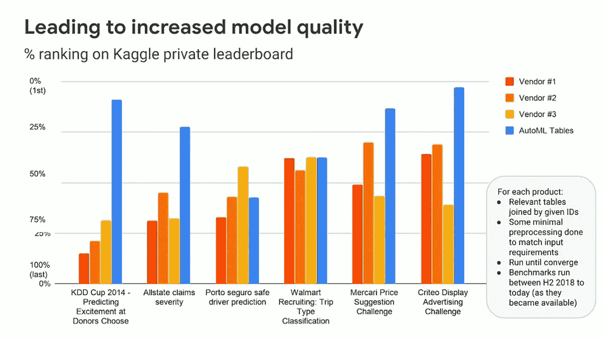

Source: [Tackling High-Value Business Problems Using AutoML on Structured Data (Cloud Next ‘19)](https://www.youtube.com/watch?v=MqO_L9nIOWM&t=1399s)

## 2.微软 Azure AutoML

同样在 2018 年发布的 Azure AutoML 为其不熟悉编码的用户提供了一个透明的模型选择过程。

## 3.H2o.ai

> “H2O 一直是建造大规模模型的驱动力。我们谈论的是数十亿的索赔。你不能用标准的现成开源技术做到这一点。”— [H2o.ai](https://www.h2o.ai/)

H2o 成立于 2012 年，提供开源包和名为无人驾驶人工智能的商业汽车服务。自问世以来，H2o 已被广泛应用于金融服务和零售等行业。

## **4。** TPOT

TPOT(基于树的管道优化工具)由宾夕法尼亚大学开发，是一个免费使用的 Python 包。虽然是免费的，但该软件包非常强大，并在各种数据集上取得了出色的性能:虹膜数据集的准确率约为 97%，MNIST 数字识别的准确率为 98%，波士顿房价预测的准确率为 10 MSE。([资料来源:TPOT 文件](https://epistasislab.github.io/tpot/examples/))

# AutoML 与数据科学家

现在我们知道了 AutoML 是什么，有哪些选项可用，我们将解决房间里的大象:这些平台将取代人类数据科学家吗？我们将从成本的角度来看这个问题，并运行一个黑客马拉松来评估汽车“与人类相比的性能”。

## 成本比较

根据 Indeed.com 的数据，美国数据科学家的平均年薪为 121，585 美元。与此同时，如果一家公司为一个全职职位(每周 40 小时，每年 52 周)雇用一名 AutoML，每年的成本将从 4160 美元到 41600 美元不等，具体取决于它选择的平台。

诚然，这不是一个科学上合理的比较，因为我们都知道数据科学家不仅仅是运行模型。然而，这是一种非常快速和简单的方式来显示数据科学家和 AutoML 在成本方面的立场。

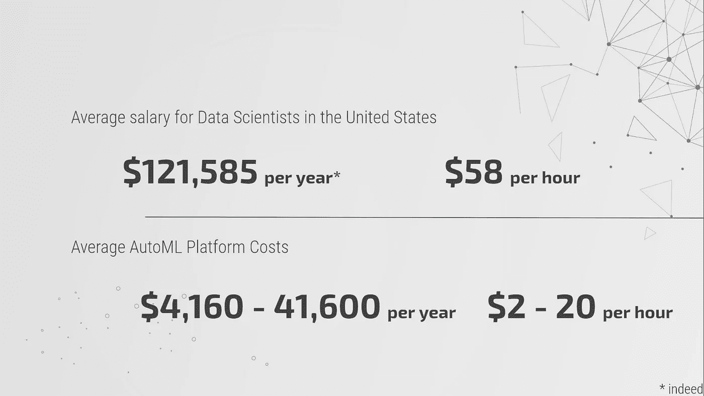

Data Scientists vs. AutoML Cost Comparison

## 性能比较:黑客马拉松

我们将通过使用两个数据集运行黑客马拉松，继续比较人类数据科学家与 AutoML 平台的性能。在每个数据集中，一组人类数据科学家将与 AutoML 平台竞争。两个团队都将经历数据处理、特征选择/工程、模型选择和参数调整，以得出具有预定性能指标的最佳预测结果。

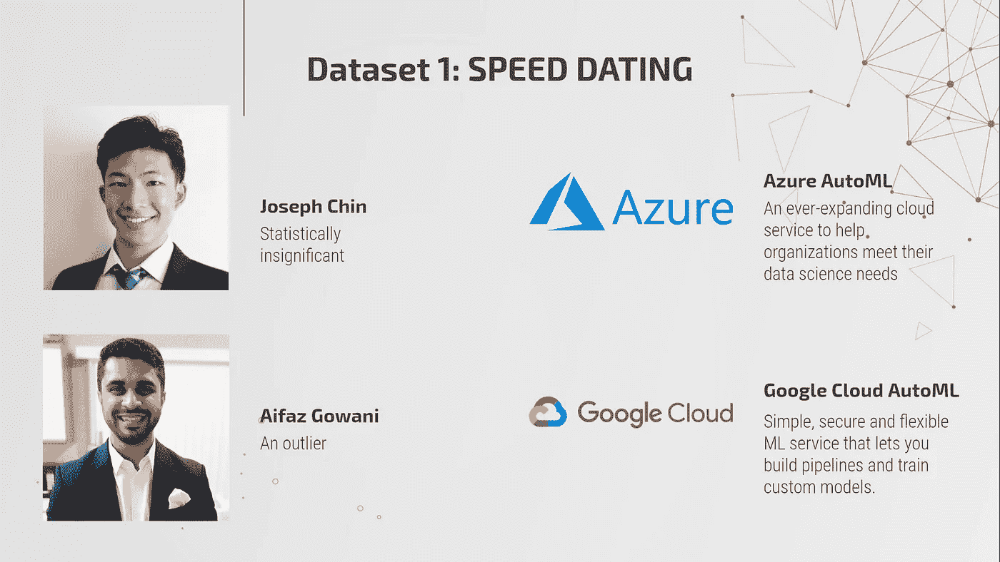

Hackathon Dataset 1: Speed Dating (Classification)

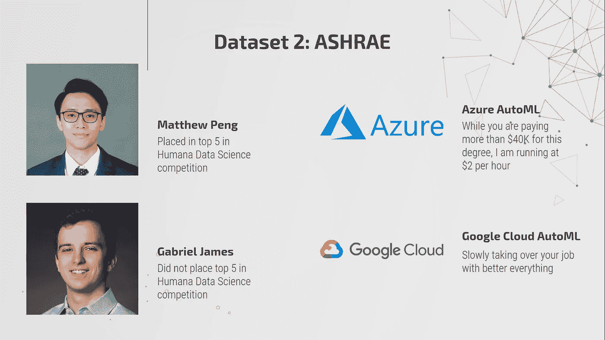

Hackathon Dataset 2: ASHRAE (Regression)

# 数据集 1:速配数据集

## 数据集概述

这个数据集是从实验性速配活动的参与者那里收集来的。在这些活动中，参与者会填写一份调查，其中包括关于他们自己的信息，以及他们在伴侣身上寻找的东西。例如，他们在 1-10 的范围内对自己的雄心有多高，他们参与的活动是什么，你希望你的伴侣有多高的雄心。该数据集的目标是预测个人是否能够根据他们对特征的偏好找到匹配。这是一个以“匹配”变量作为因变量的分类问题。

## 数据科学家的数据预处理和特征工程

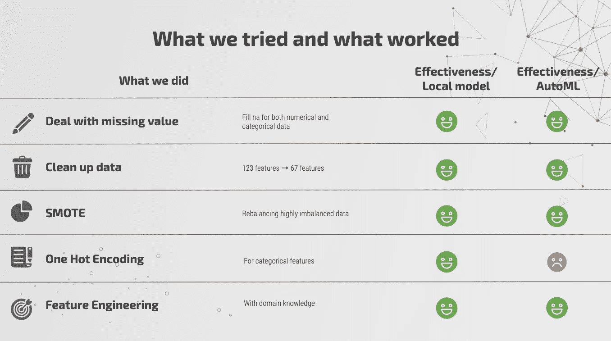

为了获得比 AutoML 平台更好的结果，我们需要对数据集进行特征工程，处理类不平衡问题，处理缺失值，并对分类变量进行一次性编码。因为数据是通过调查收集的，所以我们面临着整个数据集中缺少值的问题。如果这个人没有参与或者觉得回答这个问题很舒服，他们就把它留为空白。这些缺失值通过适当地输入均值、中值或众数来处理。数据在一些独立变量之间存在共线性，因此某些变量被删除。只有 29%的从属标签的二进制值为 1，而其他的为 0。为了解决这个问题，我们使用了 SMOTE(合成少数过采样技术)。SMOTE 从少数类创建合成样本，而不是简单地复制数据。独热编码变量在 Google 平台上尤其麻烦，因为该平台无法以提取有意义信息的方式对它们进行分组。

我们现在将使用原始数据和功能工程数据来分析 Azure 和 Google 的 AutoML 平台的整体有效性。

## 数据科学家 vs AutoML 平台

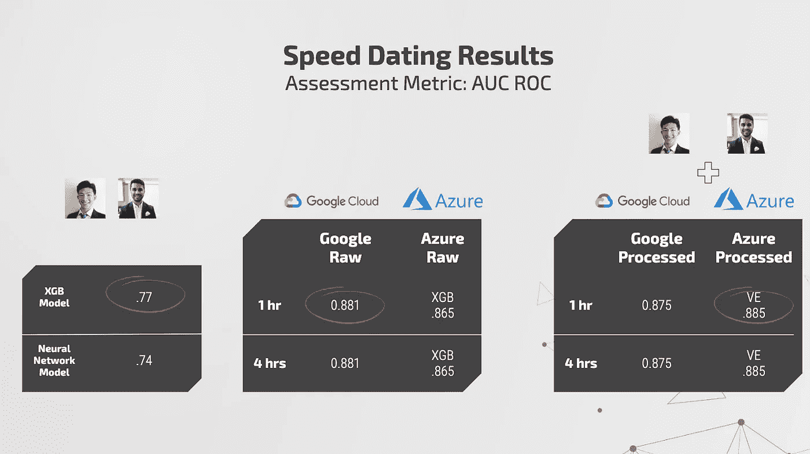

**数据科学家:**我们尝试了几种不同的模型，发现 XGBoost 和神经网络模型表现最好。我们在这里查看 AUC ROC 分数，以便比较我们的模型与这些 AutoML 平台创建的模型的结果。我们的 XGBoost 模型和神经网络模型的 AUC ROC 值分别为. 77 和. 74。

**原始数据上的 AutoML 平台:**谷歌的表现比 Azure 的 XGBoost 模型好一点。谷歌的 AUC ROC 得分为 0.881，而 Azure 的 AUC ROC 得分为 0.865。谷歌的平台不会告诉我们哪个模型被选为最佳模型，因为这些信息被认为是专有的。另一方面，Azure 会告诉你到底运行了多少个模型，每个模型下的分数是多少，以及训练每个模型所花费的时间。

**基于已处理数据的 AutoML 平台:**我们现在想要测量我们的特征工程数据集的性能。我们注意到了一些事情:谷歌的性能下降了，而 Azure 的性能提高了。正如前面提到的，one-hot 编码对于 Google 的 AutoML 有一个问题，这个平台是为了执行它自己的功能工程而创建的。因此，为特征工程数据提供一次性编码变量会降低整体性能。Azure 的性能从. 865 提高到. 885。

这是 Azure 在这个数据集上运行的模型的图片:

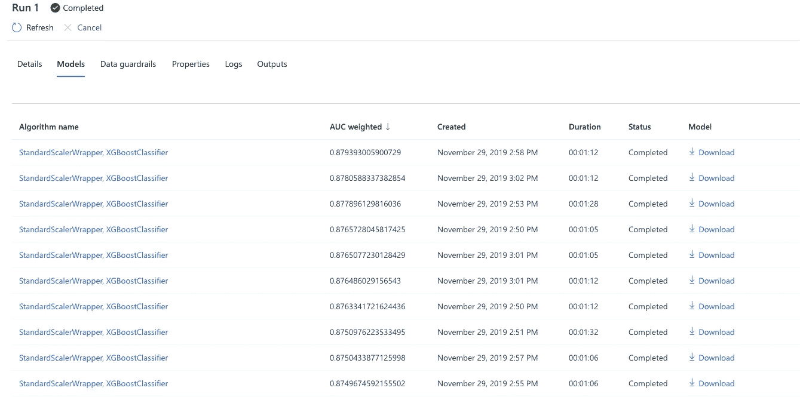

你还可以在 Google 和 Azure 的平台上查看精确召回图、ROC 图、混淆矩阵和功能重要性图:

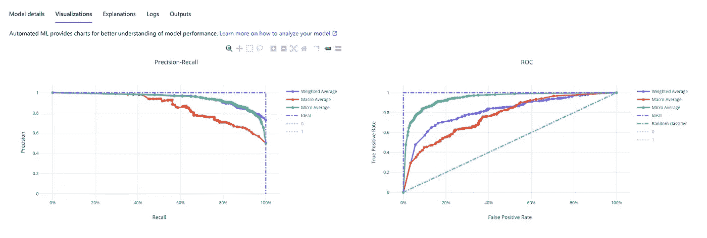

## 快速约会数据集的要点:

*   数据科学家可以通过向 AutoML 平台提供功能完善的工程数据集来增加价值。
*   Azure 在告知预测中使用了哪个模型方面更加透明；谷歌的模型创建和选择信息是专有的。
*   Google 没有很好地处理一次性编码变量。

# 数据集 2: ASHRAE

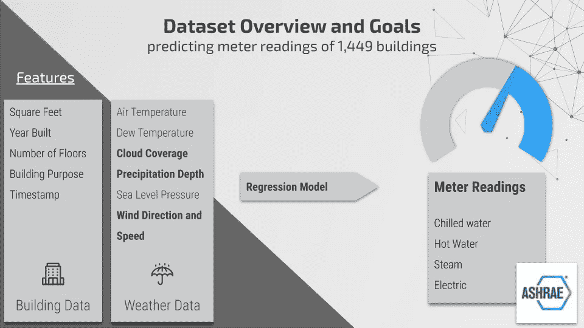

## 数据集概述

该数据集来自 ASHRAE 能源预测 Kaggle 竞赛，该竞赛要求参赛者为 1，449 栋建筑的热水、冷水、蒸汽和电表读数开发预测模型。数据由建筑物的元数据组成，包括平方英尺、建造年份和楼层数；按时间戳显示的仪表类型和读数；和天气数据，包括气温、云量、降水深度、风速、风向度数和海平面气压。天气数据由最近的气象站在现场收集。

## 数据科学家的数据预处理和特征工程

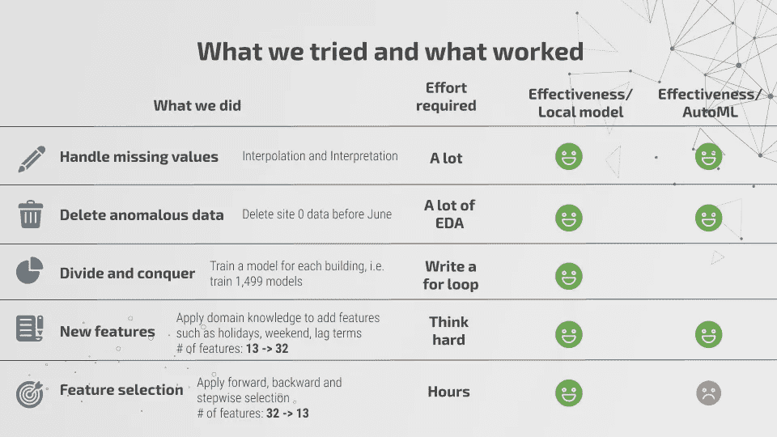

天气数据集中的缺失值是一个需要解决的重大问题，因为云覆盖率和降水深度要素分别缺失了 50%和 35%的值。一些气象站点丢失了所有的云覆盖率和降水深度数据。为了克服这一障碍，我们尝试对气温、露点温度、风速和海平面气压特征中的缺失值进行插值，这些缺失值包含很少的零值，并使用插值数据开发云覆盖率和降水深度的预测模型。

我们使用 10 重交叉验证为每个特征选择插值方法，并将其应用于我们的训练和测试数据。我们运行了一系列模型来预测云覆盖和降水深度，但没有找到一个足够精确的模型来生成缺失值。风向按区间重构为一组分类变量，由于风速严重向右倾斜，我们对其进行了对数变换。此外，我们还构建了一些特性，如假日、周末和特性的滞后项。总的来说，我们在 13 个原始特性的基础上构建了 19 个特性，总共有 32 个变量。

最后，我们删除了在一个气象站点收集的异常天气数据，然后应用向前、向后和逐步选择来确定最佳预测特征，最终使用了 32 个变量中的 13 个。

## 数据科学家 vs AutoML 平台

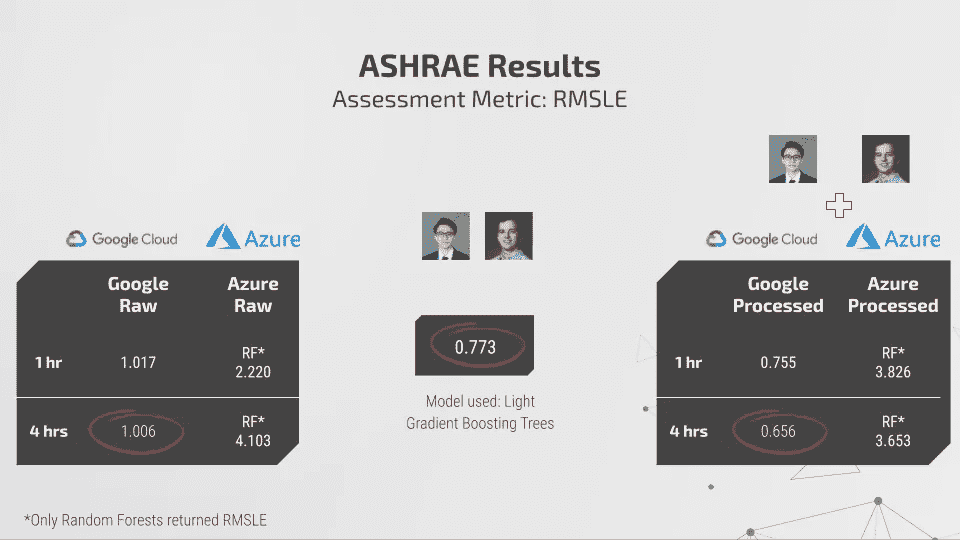

**数据科学家:**由于训练集和测试集包含相同的建筑物，因此我们没有为所有建筑物创建通用模型，而是为数据集中的每个建筑物构建了光梯度增强模型。通过这种方法，我们获得了 0.773 的 RMSLE。

**原始数据上的 AutoML 平台:**一个小时的训练时间，Google Cloud 取得了 1.017 的 RMSLE 额外训练 3 小时将 RMSLE 提高了 0.011。谷歌轻松超过 Azure，后者的 RMSLE 为 2.22。这不是一个完全公平的比较，因为我们将 Azure 限制为随机森林，因为只有这个方法会返回一个 RMSLE。

**处理数据的 AutoML 平台:**我们通过谷歌云运行处理后的数据，当经过 4 个小时的训练后，谷歌云达到 1.7 的 RMSLE 时，我们感到惊讶。经过进一步研究，我们发现我们的特征选择方法抑制了 AutoML 的性能，因为 AutoML 平台将执行自己的特征选择。我们再次在两个平台上运行处理后的数据，使用所有 32 个变量，而不是只有 13 个。这一次，两个平台的性能都有所提高。Google Cloud 在一个小时的训练后获得了 0.755 的 RMSLE，在四个小时后获得了 0.656 的 RMSLE，这是数据科学家表现的一个重大改进！Azure 在一个小时的训练中达到了 3.826 的 RMSLE，在四个小时后达到了 3.653。

## ASHRAE 数据集的要点:

*   虽然 AutoML 是一个强大的预测工具，但它不能很好地预处理数据，以持续超越人类。
*   额外几个小时的培训可以大大提高 AutoML 平台的性能。
*   允许 AutoML 平台为您选择功能；否则，您将面临严重限制平台性能的风险。
*   将数据科学家对业务问题的专业知识与 AutoMLs 的特征选择、特征预处理、模型选择和超参数调整功能相结合，是获得有价值见解和强大预测结果的有效解决方案。

# 结论和关键要点

最后，我们想通过回答三个问题来结束我们的项目。

## **AutoML 会取代数据科学家吗？**

答案是**否**。

虽然 AutoMLs 擅长建立模型，但它们仍然无法完成数据科学家的大部分工作。我们仍然需要数据科学家来定义业务问题。我们仍然需要数据科学家应用他们的领域知识来生成更多有用的特征。现在的 AutoML 只能处理有限类型的问题，比如分类和回归问题。目前，他们没有能力建立推荐和排名模型。最重要的是，我们仍然需要数据科学家从数据中得出可操作的见解，这不能仅靠 AutoMLs 来完成。

然而，AutoMLs 仍然是数据科学家为其利益相关者创造价值的强大工具。因此，下一个明显的问题是:我们应该如何以及何时使用 AutoML？

## **数据科学家何时能最好地利用 AutoML 平台？**

这里我们想提一些可能值得考虑的例子。

*   **性能超过可解释性:**

有时，涉众可能只关心模型的精确性，而可解释性不是最重要的考虑因素。基于我们的实验，AutoMLs 与合理的特征工程一起，似乎可以获得令人满意的性能。然而，在我们的例子中，可解释性仅限于两个平台的特性重要性。换句话说，如果特性的重要性足以解决您的问题，那么 AutoMLs 可能是获得更高精度的正确选择。

*   **生产速度:**

Google 和 Azure 都提供了将模型部署到产品中的便捷方式。例如，谷歌云允许批量预测和在线预测，只需几次点击。它还允许您使用他们的 API 将您的模型部署到您的网站。这些功能可以让数据科学家加快生产过程并减少工作量。

*   **更好地利用你的时间:**

数据科学家有太多的职责，可能会让人不堪重负。作为一名数据科学家，时间可能是你最稀缺的资源。您的时间被与利益相关者(产品经理、业务部门的员工和客户)的无数会议所占据，维护现有的模型，收集/清理数据，准备下一次会议，并且列表还在继续。AutoML 是一个很好的工具，可以节省你的时间，因为它只需要你点击几下鼠标，花几块钱就可以训练出一个具有足够性能的模型。因此，您可以专注于产生最大价值的任务(有时花时间准备精彩的演示比提高 1%的模型准确性更有价值)。

## **哪个 AutoML 比较好？(Google Cloud AutoML vs. Azure 机器学习)**

上表总结了我们在 Google 云和 Azure 上使用 AutoMLs 的经验。这里我们想指出一些细节。

*   **用户体验:**

我们在使用 Azure 时遇到了一些错误。当我们在 ASHRAE 数据集(大约 2000 万行，30 列)上训练模型时，三分之一的实验失败了。我们设置了训练时间限制，以使两个平台具有可比性，但对于像 ASHRAE 这样的大规模数据集，一个小时的限制可能会导致一些错误。然而，当运行一个更小的数据集时，比如我们的速配数据集，这个过程是相当有效的。另一方面，我们在谷歌平台上没有遇到任何问题。

*   **可解释性:**

谷歌的 AutoML 使用其专有的深度学习算法。因此，就可解释性而言，Google AutoML 能做的最好的事情就是打印出特性的重要性。另一方面，在 Azure 中，可解释性本质上取决于您使用什么模型。虽然 Azure 中的所有模型都比 Google 的模型更容易理解，但它仍然更灵活。例如，如果您使用由 Azure 调整的 XGB 模型，您可以下载该模型并在其上运行 SHAP，以了解功能如何影响模型的输出。

## 尝试 AutoMLs 前的一些提醒:

*   使用 Google 的 AutoML 时，让平台负责特性选择。正如我们的实验所示，在数据集上运行 Google 的 AutoML 之前选择/删除特征会损害性能。更好的方法是添加你认为适合原始数据集的任何功能，让 Google 的 AutoML 挑选最佳功能。
*   如果你正在处理一个大型数据集，谷歌的 AutoML 可能是一个更好的选择。如果你必须使用 Azure 的平台，确保你设置了更高的时间限制(或者根本不设置限制)，以防止潜在的错误。另一方面，如果你的数据集相对较小(少于一百万行)，Azure 可能会表现得更好。
*   命名不带空格的列。在两个平台上上传数据集时，包含空格的列名可能会导致错误，所以请确保正确命名列！在 Python 中，推荐使用下划线(_)代替空格。
*   熟悉评估指标。下面我们列出了两个平台上可用的评估指标。有时您可能找不到您想要用来训练模型的指标，因此您需要一个代理指标。因此，了解每个指标的特性有助于您选择评估指标以及合适的 AutoML 平台。

# 参考

*   [速配数据集](https://www.openml.org/d/40536)
*   [ASHRAE 数据集](https://www.kaggle.com/c/ashrae-energy-prediction/overview)
*   [TPOT](https://epistasislab.github.io/tpot/)
*   [比较机器学习即服务:亚马逊、微软 Azure、谷歌云 AI、IBM Watson](https://www.altexsoft.com/blog/datascience/comparing-machine-learning-as-a-service-amazon-microsoft-azure-google-cloud-ai-ibm-watson/)
*   [在结构化数据上使用 AutoML 解决高价值业务问题(Cloud Next’19)](https://www.youtube.com/watch?v=MqO_L9nIOWM&t=1012s)

# 贡献者

[Joseph Chin](https://medium.com/u/53d95f7e2c5f?source=post_page-----c243ae167701--------------------------------) ，*UT joseph.chin@utexas.edu 奥斯汀 MSBA 20 年*

艾法兹·戈瓦尼，*aifazg92@gmail.com 奥斯丁 20 岁*

20 年 gabejames@me.com 奥斯丁 183；MSBA

[马修彭](https://medium.com/u/aeab0bbc52e4?source=post_page-----c243ae167701--------------------------------)， *UT 奥斯 MSBA 20:*