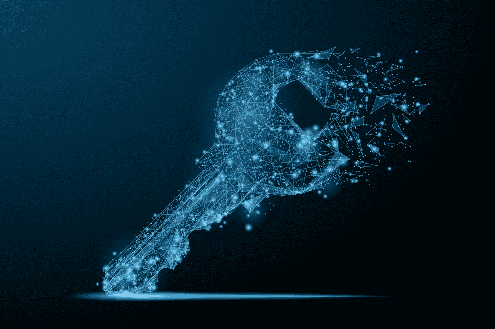
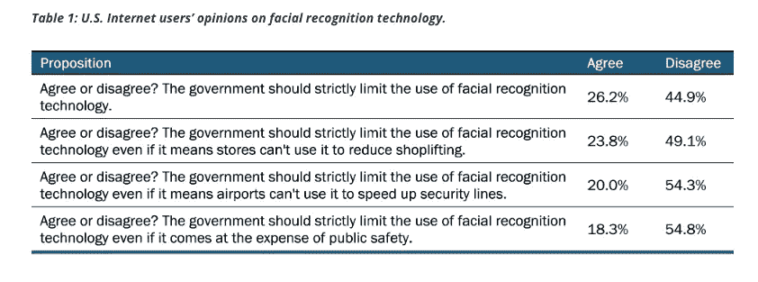
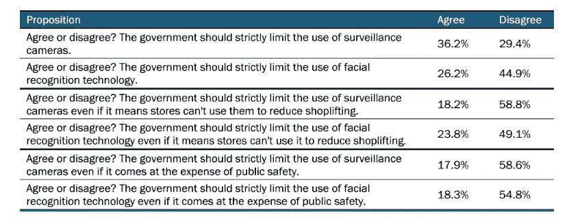

# 围绕数据隐私的辩论没有抓住要点

> 原文：<https://towardsdatascience.com/the-debate-around-data-privacy-is-missing-the-point-1fcdc4effa40?source=collection_archive---------15----------------------->

Photo Credit: Polaris Pacific

数据处理席卷了整个世界。企业、政府和个人都开始意识到数据可以帮助他们做出更明智的决定，知道如何与其他国家谈判，或帮助改善他们的睡眠周期。虽然人工智能和机器学习领域已经并将继续给我们的世界带来新的理解水平，但在这条发展道路上并不是一帆风顺的。

所有人工智能和机器学习算法的发展都需要使用数据，而且是大量的数据。随着普通大众越来越多地了解他们的日常行为如何被用作开发这些算法的数据点，围绕数据隐私的对话正在获得巨大的吸引力。欧盟最近通过了一项围绕数据隐私的主要法律，名为《通用数据保护条例》(GDPR)，对科技公司管理和收集用户数据施加了更多监管。在美国，加利福尼亚州最近通过了他们自己的消费者隐私法案，该法案也有类似的目的，以确保人们的数据受到保护和隐私，并且只用于用户同意的目的。我想提出的问题是:数据隐私是我们应该为之奋斗的东西吗？

首先，让我们谈谈人们以数据隐私的名义试图实现(或试图进一步实现)的一些解决方案。最容易的替罪羊之一就是匿名。大型科技公司表示，即使他们在各种分析中利用用户数据，也没有办法将数据追溯到用户，所有私人数据属性(姓名、社会保障/国民身份信息等)都将被删除。)都在分析前去掉了，而且那只是百万分之一，又有什么坏处呢？不幸的是，许多组织已经表明[匿名数据并不像我们想象的那样匿名](https://www.technologyreview.com/s/613996/youre-very-easy-to-track-down-even-when-your-data-has-been-anonymized/)。虽然这些公司和政府对我们的数据感兴趣的目的可能并不关心我们的识别信息，但任何能够接触到数据集的人，只要有足够的技能，都可以很容易地识别出组成数据集的真实个人。这使我们都成为身份盗窃、勒索和无数其他剥削行为的目标，任何人都不应该遭受这些行为。

如果我们不能做到匿名，而数据又与我们密不可分，那么至少让我们从中赚点钱吧！让我们根据人们为所有这些组织产生的数据的价值向他们支付报酬。这是许多人提出的想法，特别是 Will.i.am，他认为下一个合乎逻辑的步骤是数据的商品化。[隐私国际对他的文章](https://privacyinternational.org/news-analysis/2683/we-dont-want-sell-our-data-we-want-data-rights)进行了反驳，称“我们也有一些非常实际的担忧，这让我们对数据货币化持怀疑态度。你的个人数据实际上并没有那么有价值。虽然整个数据市场可能价值 3 万亿美元…但访问海量聚合数据才是有价值的。”

所以我们不能让它匿名，也不值得我们花时间去商品化它，我们该怎么办？对此的答案是加强对如何收集和使用数据的监管和限制(即欧盟和加州)，但这种应对措施实际可行吗？

每天创建的数据量惊人。随着大量的大型科技公司、政府机构和手机上的小应用程序跟踪你花在游戏和窃听上的时间，我们几乎不可能跟上我们作为一个物种创造的所有数据。 [IBM 估计人类每天会产生万亿字节的数据](https://www.brookings.edu/research/why-protecting-privacy-is-a-losing-game-today-and-how-to-change-the-game/)，我们的数字足迹每年都在翻倍。在数据创建的大部分历史中，消费者有责任意识到他们通过使用服务放弃了什么数据。他们需要通读隐私政策，了解科技公司的最新动向，并决定何时放弃通过某个软件提交更多数据。这不仅是令人生畏的只是打字，但对于这种数据使用方式的任何支持者来说，剑桥分析/脸书丑闻及其对我们脸书数据的自由支配应该让任何人暂停对用户的责任。正如 Brookings.edu 在他们最近的一篇研究论文中所说，

> “也许知情同意在二十年前是可行的，但在今天却是一种幻想。在持续不断的在线互动中，尤其是在现在占大多数使用的小屏幕上，通读隐私政策是不现实的。而人们根本不会。”

我明白他们的意思。我都不知道上一次阅读我注册的新服务的隐私政策是什么时候了。当世界以我们过去十年设定的速度前进时，要筛选的信息太多了。这些政策也是具有法律约束力的文件，因此在任何组织保护自己的努力中，我们都“同意”的这些隐私声明不太可能在短期内改变。

Brookings 的文章接着说，有必要制定基本的隐私立法，以便用户始终了解他们的数据是如何被使用、存储和共享的，以及这些数据是根据他们的兴趣和收集这些数据的情况使用的。这个概念被称为数据最小化，虽然表面上听起来是个好主意，但它并不真正符合最近的人工智能实践。正如《国际数据隐私法》中的一篇社论文章所详述的那样，[这种数据最小化的想法并不适合人工智能的发展](https://academic.oup.com/idpl/article/8/4/289/5299551)。我们世界中的许多进步都发生在所谓的“黑盒”人工智能开发周期中，但在这些黑盒中，很难预先知道在一个意外相关的世界中什么是必要的。定义数据的目的有时是一个争论点，因为机器学习模型的目的可能会在整个学习过程中完全改变。如果在使用这些模型的过程中出现了意想不到的创新，偏离了一个用户认为他们的数据将如何实现的方式，我们该如何利用这种洞察力呢？在知道结果可能是什么的情况下，我们必须去找每一个用户并获得他们的许可才能重新进行实验吗？如果有人拒绝，我们是不是被迫把这种见解扔出窗外，因为它是通过百万用户之一不同意的方式炮制出来的？除了记录他们过去所做的决定，个人并没有真正参与到这种创新的创造中，所以一旦发现，他们在创新的发展中应该有什么发言权呢？

在这场辩论中，人们还经常忽视使用这项技术带来的隐私好处，而仅仅关注技术侵犯我们当前隐私状态的方式。与其说是明显的隐私损失，不如说是一种权衡。有了网上购物，我可以买一盒花生酱，并让他们送货上门，我从来没有机会碰到我的健身模特朋友，她会骂我奢侈。当我们没有机会让我们的朋友看到我们亲自购买这些东西时，购买性玩具甚至仅仅是避孕套是一种更加舒适和私密的体验。作为回报，我们告诉亚马逊算法我们喜欢什么样的东西，他们可以记录我们在他们的平台上做出的这些决定，以便从他们的合作伙伴那里向我们发送更准确的建议。我们可以在网飞看我们最喜欢的罪恶快感节目，我们的朋友都不知道，网飞可以看到电视和电影发展的总趋势。有一种技术让人们在搜索互联网时有更多的隐私，帮助那些在专制政权下的人获得免费和开放的数据。随着我们进入一个连通性更强、数据流动更自由的时代，我们将很难阻止这一趋势，特别是如果我们的决策记录的交换意味着人们生活在一个更安全的社会。

监控摄像头和面部识别软件，尤其是警方在调查中使用的监控摄像头和面部识别软件，已经成为一个热门话题。 [Data Innovation 最近围绕这些预防性安全措施进行了一项调查](https://www.datainnovation.org/2019/01/survey-few-americans-want-government-to-limit-use-of-facial-recognition-technology-particularly-for-public-safety-or-airport-screening/)，结果发现，首先，美国人并不那么关心面部识别软件及其开发。

Credit: Datainnovation.org

另一方面，监控摄像头的使用(在面部识别过程中广泛使用)人们更加警惕…直到摄像头的使用被置于安全的背景下，意见的分布发生了逆转。

Credit: Datainnovation.org

似乎人们很愿意牺牲隐私，如果这意味着他们在日常生活中感到更安全的话。公共卫生呢？虽然谷歌流感趋势的初始运行飞得很高，然后崩溃，但访问我们的更多数据可能正是一个新模型所需要的，以更准确地预测流感趋势。沃森正在研究一张又一张 x 光片，以了解如何比任何人类医生更好地识别肿瘤，这是因为患者向 IBM 放弃了一部分隐私，这无疑有助于确保他们发现任何癌症，并帮助下一位患者得到更好的诊断。

如果我们能够通过及早发现这一趋势来防止每年数百人死于流感，那会怎么样？如果从红色标记的谷歌搜索中，我们可以在悲剧发生前提醒当地警方一名可能的枪手前往一个节日？如果我们让癌症筛查变得如此具有预测性和可负担性，癌症死亡将成为一种罕见的事件，而不是我们所有人预期的年龄增长，会怎么样？这都是可能的，但这需要一个契约，放弃我们的一些安全来换取另一种安全。

许多年来，人类一直在个人经验高于一切的假设下运作。每个人都是自己命运的主人。我认为我们的文化越来越重视个人经历，越来越重视个人对整个人类知识和生存的贡献。我们数据的总和大于其组成部分，我们需要这些贡献来保持自己前进。“自由主义”被定义为个人经验是世界上最有价值的商品，[尤瓦尔·哈拉里说，](https://www.amazon.com/Homo-Deus-Brief-History-Tomorrow/dp/1784703931/ref=asc_df_1784703931/?tag=hyprod-20&linkCode=df0&hvadid=312425492373&hvpos=1o1&hvnetw=g&hvrand=16610005902822945457&hvpone=&hvptwo=&hvqmt=&hvdev=c&hvdvcmdl=&hvlocint=&hvlocphy=9067609&hvtargid=pla-348588412529&psc=1)“如果谷歌做出足够好的决定，人们会授予它越来越多的权力。随着时间的推移，数据库将会增长，统计数据将会变得更加准确，算法将会改进，决策将会更好。自由主义会在系统比我更了解我自己的那一天崩溃。这并没有听起来那么难，因为大多数人并不真正了解自己……”

虽然关于我们的哪些数据是私人的，哪些公司和机构有权使用的辩论正在激烈进行，但它忽略了所有这些复合数据将我们引向一条新的道路，即集体比个人更有价值。我不知道这对我们来说是否是一条更好的道路，但我可以看到它作为一个物种将如何成长，并取得超出我们想象的成就。团队总能比个人做得更好。随着我们走向这种集体人性思维模式，隐瞒数据以让自己感觉更安全的想法变成了一个道德难题。如果我们的价值大部分来自我们为人工智能处理和发现见解而创造的数据，那么隐瞒这一点意味着我们从整体上降低了价值，我们正在犯道德错误。我们正在用数据隐私换取另一种隐私和惊人的增长，在我看来，这是一笔相当公平的交易。