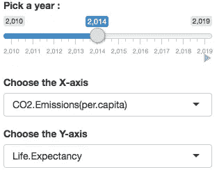
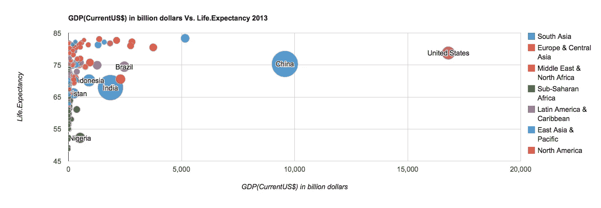
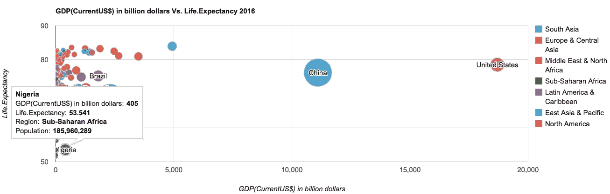
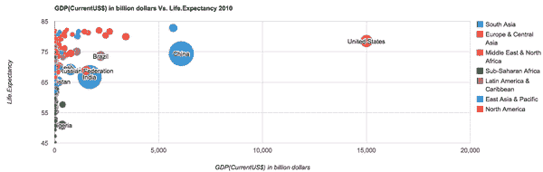

# 与 R 闪亮的十年回顾！

> 原文：<https://towardsdatascience.com/the-decade-in-review-with-r-shiny-ea57f8fa5e0e?source=collection_archive---------48----------------------->

## 用 R Shiny 可视化过去十年世界发展指标的演变

这是漫长的一年。确切地说，这是一个漫长的十年。ISIS 已经被正式消灭，抗击小儿麻痹症的战斗取得胜利，南苏丹隆重地成为一个国家，冥王星从可爱的小行星变成了绕着太阳转的矮星，莱斯特城赢得了英超联赛，Kanye 发布了他标志性的 Yeezy，我们现在可以在旅途中听音乐，而不用长电线缠绕我们的头发，苹果公司成为世界上第一个万亿美元的公司，Ted Mosby 最后告诉他的孩子他是如何遇见他们的母亲的，我学会了 R 闪亮！

在从郑中的 google 图表绑定中得到急需的灵感后，我决定好好利用我过去几十年的学习。

这是一个交互式的 R Shiny 应用程序，它描绘了世界银行在过去十年中所有国家的主要发展指标的演变。该应用程序允许您选择要在 X 和 Y 轴上动态绘制的指标以及所需的年份。

发布所需的选择后，将绘制一个气泡图，该图描绘了两个变量之间的关系，气泡由该国的地理区域(T3)和人口(T4)决定大小。

如上所示，当光标悬停在每个气泡上时，会弹出一个工具提示，指示其特征值。

你也可以通过点击位于年份滑块斜下方的“播放”按钮来观看这两个变量在过去十年中的演变。

有充分的理由欢呼！世界各地的人们越来越长寿，越来越富裕，越来越能上学&我们中的许多人甚至在空气中排放越来越少的二氧化碳。

为又一个十年的进步干杯&闪亮的应用程序阐明了这一点！

你可以在我的 github [这里](https://github.com/manasi1096/Visualizing-WDI-in-R-Shiny)找到数据集和代码。

感谢阅读！