# 人工智能的十年

> 原文：<https://towardsdatascience.com/the-decade-of-artificial-intelligence-6fcaf2fae473?source=collection_archive---------4----------------------->

## 过去十年人工智能影响的完整概述。

过去十年见证了人工智能的伟大崛起。这项技术几乎在所有领域都产生了影响。它已经成为一个超级大国，改变了我们互动的方式，在未来，它可能会改变我们的生活方式。吴恩达引用“人工智能是新的电力”，我们可以看到电力正在改变许多行业。我不得不等到 12 月 31 日才发布这篇博客，因为这个领域发展如此之快，以至于我们甚至可以在十年的最后一天发布一些突破性的消息。

这十年 AI 快速增长的两大原因是:

1) **数据** —由于互联网和物联网设备，产生的数据量呈指数级增长。

2) **计算**——我们在之前几十年面临的阻碍被解决了，这反过来又助推了 AI 的力量。许多公司已经开始创建专门用于训练深度学习模型的硬件。

罗伯特·清崎有一句名言“预测未来的最好方法是研究过去，或预测”。

因此，让我们来看看过去十年中在人工智能领域发生的重要事件。这是我的概述，如果我错过了，你可以在评论区添加你的最爱，但我希望我已经涵盖了大部分，所以让我们开始吧。

# *十年的开始:*

# 2010 年:

***ImageNet 比赛的开始***

[ImageNet 大规模视觉识别挑战赛(ILSVRC)](http://image-net.org/challenges/LSVRC/2010/) 评估大规模对象检测和图像分类的算法。这是迄今为止用于评估分类模型性能的基准。它还提供了训练大型模型的数据。

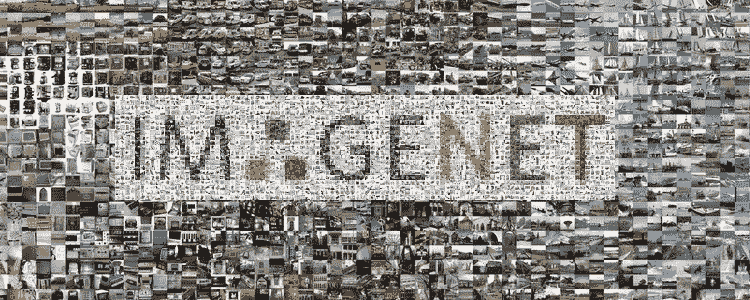

Source: [https://syncedreview.com/](https://syncedreview.com/)

**苹果收购 Siri:**

据报道，苹果以大约 2 亿美元的价格收购了 Siri。该公司立即开始研究如何将 Siri 植入 iPhone。乔布斯亲自动手让人工智能助手变得对用户友好。Siri 是我们今天拥有的虚拟助手的开端。(不过托尼·斯塔克有 2008 年的贾维斯。)

**T21【deep mind】成立 **

Deepmind 科技公司是一家英国人工智能公司，创始人之一是戴密斯·哈萨比斯。这家公司在这十年里对 AI 产生了巨大的影响。

***微软为 Xbox 360 推出 Kinect***

首款使用 3D 摄像头和红外检测跟踪人体运动的游戏设备。 [Kinect](https://www.techradar.com/news/gaming/microsoft-xbox-kinect-release-date-10-november-710465) 可以以每秒 30 帧的速度对人体进行全动作追踪。这是游戏和计算机视觉领域的重大突破。

# **2011 年:**

***IBM 沃森赢得危险***

IBM Watson，自然语言问答计算机，[在 Jeopardy 上比拼！击败了两位前冠军。](https://www.theguardian.com/technology/2011/feb/17/ibm-computer-watson-wins-jeopardy)沃森是机器理解人类语言语境能力的重大飞跃。

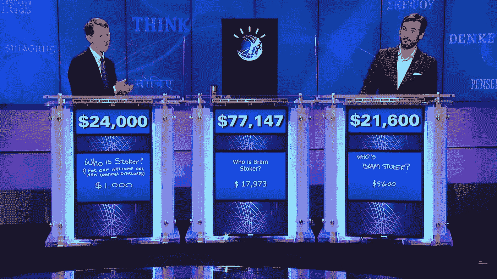

source: youtube.com

***CNN 的崛起***

一个卷积神经网络以 99.46%的准确率(相对于人类的 99.22%)赢得了[德国交通标志识别比赛](https://www.sciencedirect.com/science/article/abs/pii/S0893608012000457)。这是机器获得视觉能力的开始。

# **2012 年:**

***著名的猫 Vs 狗***

杰夫·迪恩和吴恩达训练了一个由 16000 个处理器组成的大型神经网络，通过向它显示来自 YouTube 视频的 1000 万张未标记的图像来识别猫的图像(尽管没有给出背景信息)。

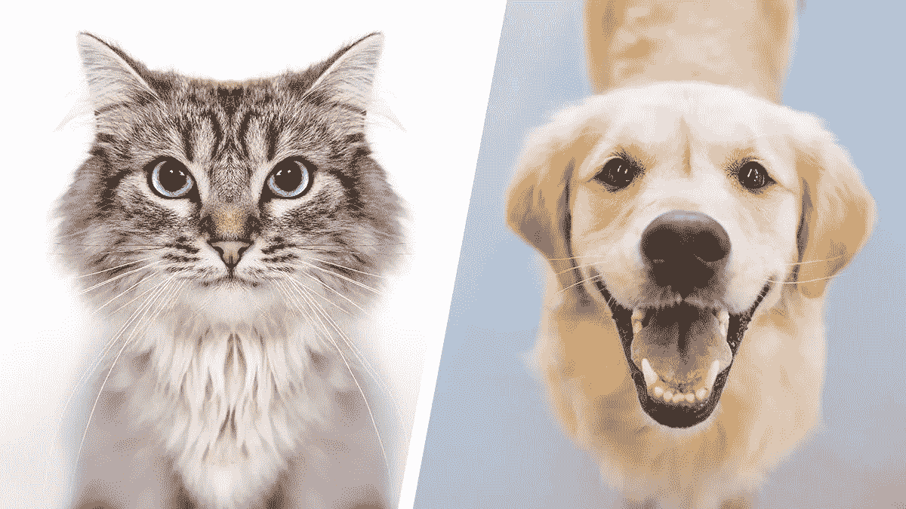

source: youtube.com

***美国有线电视新闻网***ImageNet 竞赛的艺术状态

多伦多大学研究人员设计的[卷积神经网络](https://papers.nips.cc/paper/4824-imagenet-classification-with-deep-convolutional-neural-networks.pdf)在 ImageNet 大规模视觉识别挑战中实现了仅 16%的错误率，与前一年最佳参赛作品实现的 25%的错误率相比有了显著改善。

# **2013:**

***尼尔，永不落幕的形象学习者***

[永无止境的图像学习者(NEIL)](https://computervisiononline.com/blog/never-ending-image-learner) 是一个 24/7 工作的计算机程序，学习关于它在互联网上找到的图像的信息。位于卡内基梅隆大学的 NEIL 并不只是寻找任何类型的信息。相反，它的目标是学习日常生活中的常识性关系。当然，这对人类来说是常识性的信息，但它早已超出了计算机的能力范围。

# **2014:**

***甘的发明***

通过让神经网络相互对抗，伊恩·古德菲勒创造了一个强大的人工智能工具。现在他和我们其他人必须面对后果。[甘](https://papers.nips.cc/paper/5423-generative-adversarial-nets.pdf)给了机器想象力和创造力。

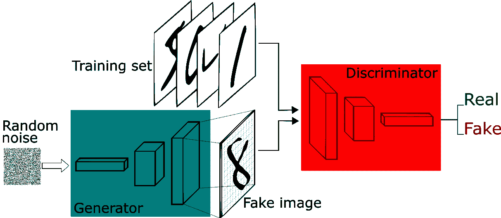

source: pathmind.com

**Alexa**

[Amazons 虚拟](https://www.alexa.com/)助手，最早发布于 echo 和 echo dot。它能够进行语音交互，播放音乐，制作待办事项列表，设置闹钟，播放播客，播放有声读物，并提供天气，交通，体育和其他实时信息，如新闻。Alexa 还可以将自己作为家庭自动化系统来控制几个智能设备。

***特斯拉自动驾驶***

特斯拉汽车公司公布了其第一款[自动驾驶仪](https://www.tesla.com/autopilot)。配备该系统的 S 型汽车能够根据信号图像识别进行车道控制，自动转向、制动和限速调整。该系统还提供自主停车，并可以接收软件更新，以随着时间的推移提高技能。

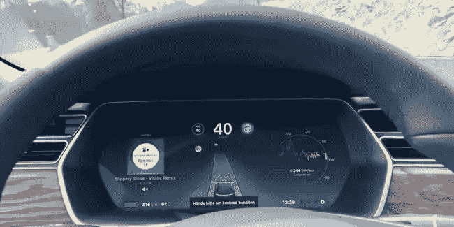

source: inverse.com

***收购 Deepmind***

谷歌以 4 亿欧元收购 deepmind ，facebook 也试图收购这家公司，但谷歌敲定了这笔交易。

我们的十年已经过去了一半，你可以看到人工智能已经开始产生很大影响，科技巨头们正在该领域进行大量投资。让我们看看在这个十年的后五年我们会有什么惊喜。

# **2015:**

***张量流释放***

谷歌开源了其深度学习框架 [Tensorflow](https://www.tensorflow.org/) ，这可以被认为是重要的时刻之一，因为它给了每个人构建伟大模型的工具。TensorFlow 是一个机器学习的端到端开源平台。它有一个全面、灵活的工具、库和社区资源的生态系统，让研究人员推动 ML 的最新发展，开发人员轻松构建和部署 ML 驱动的应用程序。

***Facenet 论文***

谷歌发布了关于人脸识别的论文 [Facenet](https://arxiv.org/abs/1503.03832) ，这标志着面向广大用户的人脸识别的开始。

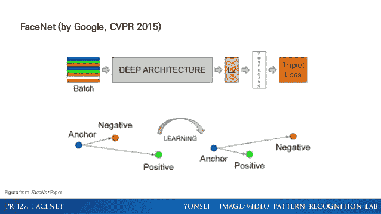

***在 Imagenet 中击败人类***

[在第六届 ImageNet 大规模视觉识别挑战赛上，微软和谷歌机器在图像识别方面击败了人类](https://rethinkresearch.biz/articles/microsoft-google-algorithms-beat-humans-image-recognition/)。这些机器超越了人类，因为深度学习算法使它们能够识别 1000 多种类别的图像和物体。这些算法源自各种版本的模拟人脑工作方式的人工神经网络。这一令人兴奋的新突破允许智能系统自动执行需要识别物体或人的任务，然后根据该识别决定如何进行。

***开启 AI 创立***

[OpenAI](https://openai.com) 是一个研究人工智能领域的非营利组织，由埃隆·马斯克(Elon Musk)创立。它主要在深度强化学习领域发挥作用。

***Yolo 纸***

[YOLO(你只看一次)](https://pjreddie.com/darknet/yolo/)，一种新的物体检测方法。先前关于对象检测的工作重新利用分类器来执行检测。但 YOLO 是一个单一的神经网络，在一次评估中直接从完整的图像预测边界框和类别概率。由于整个检测管道是单个网络，因此可以直接对检测性能进行端到端优化。

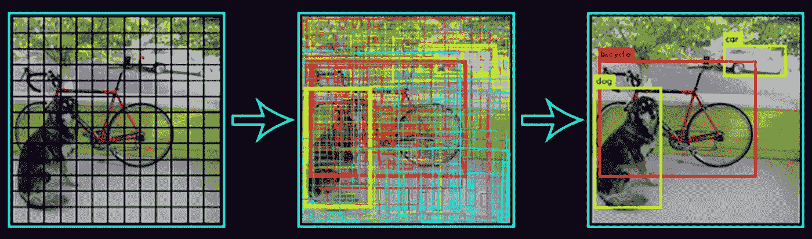

source: Hackernoon.com

# **2016:**

***AlphaGo 击败世界冠军:***

谷歌 DeepMind 的 AlphaGo 五次中有四次击败了世界冠军 Lee Sedol。围棋比国际象棋或西洋跳棋要复杂得多，它拥有巨大的棋盘、多样的策略和近乎无限的走法，除了人类的智慧之外，它从来就不意味着能被任何东西掌握。

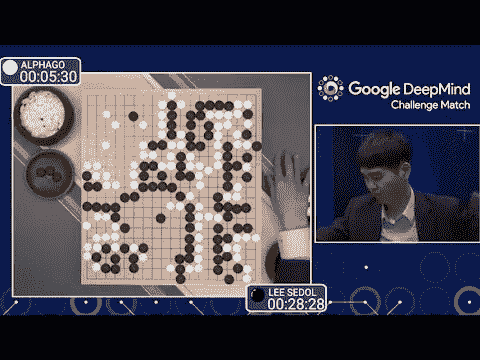

source: youtube.com

***TPU 被释放:***

一个[张量处理单元(TPU)](https://cloud.google.com/blog/products/gcp/an-in-depth-look-at-googles-first-tensor-processing-unit-tpu) 是 Google 专门为神经网络机器学习开发的 AI 加速器专用集成电路(ASIC)。这是在谷歌 IO 中透露的。正是硬件推动了谷歌的突破性技术。

***索菲亚***

索菲亚是由香港汉森机器人公司开发的一款社交人形机器人。索菲亚可以模仿人类的手势和面部表情，能够回答某些问题，并就预先确定的话题进行简单的对话。

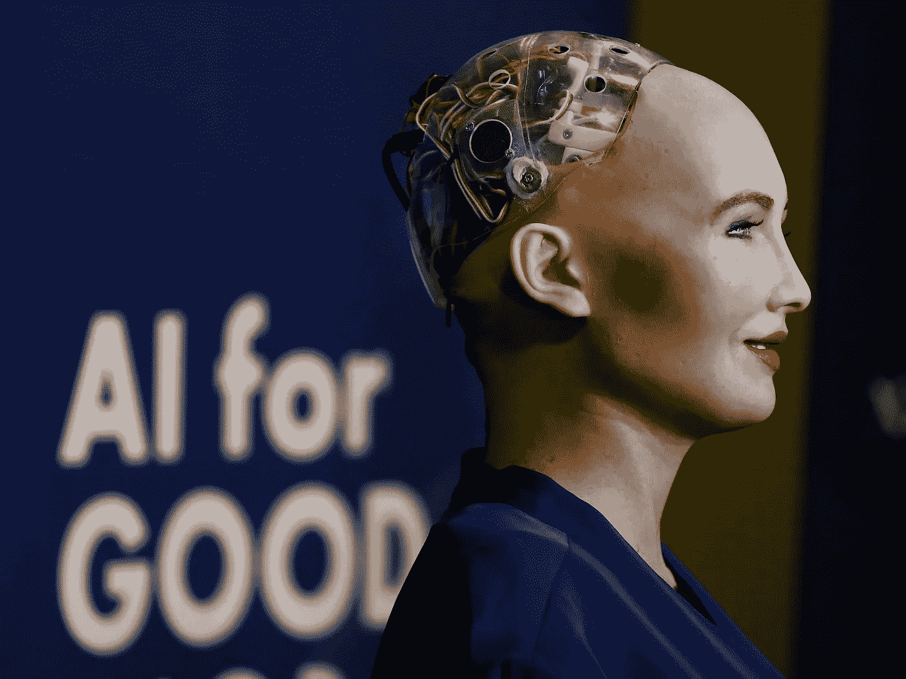

source: businessinsider.com

***释放 PyTorch:***

[PyTorch](https://pytorch.org/) 是基于 Torch 库的开源机器学习库，用于计算机视觉、自然语言处理等应用。它主要由脸书人工智能研究实验室(FAIR)开发。它是在修改后的 BSD 许可下发布的免费开源软件。尽管 Python 接口更加完善并且是开发的主要焦点，PyTorch 也有 C++接口。

***谷歌助手发布:***

谷歌发布了自己的虚拟助手，与 Alexa 和 Siri 竞争。智能音箱使用人工智能作为“个人助理”，帮助用户通过语音记住任务、创建约会和搜索信息。

# **2017:**

***AlphaZero***

继 2016 年击败最佳人类围棋选手后，AlphaGo 在一年后升级为更强大的通用化身， [AlphaZero](https://deepmind.com/blog/article/alphazero-shedding-new-light-grand-games-chess-shogi-and-go) 。除了基本的游戏规则，AlphaZero 在没有任何人类指导的情况下，在短短四个小时内学会了如何独自玩大师级的国际象棋。然后，它在一场 100 局的比赛中击败了斯托克菲什(顶级人工智能国际象棋选手)——一局未输。

***人工智能语言***

脸书人工智能研究实验室训练了两个对话代理人(聊天机器人)互相交流，以学习如何谈判。然而，随着聊天机器人的交谈，它们脱离了人类语言(用英语编程)，发明了自己的语言来相互交流——在很大程度上展示了人工智能。

***ONNX***

脸书和微软联手实现人工智能框架互操作性，这两家科技巨头在合作伙伴社区(包括 AWS、英伟达、高通、英特尔和华为)的帮助下，开发了[开放神经网络交换(ONNX)](https://onnx.ai/) ，这是一种表示深度学习模型的开放格式，也允许模型在一个框架中训练，并转移到另一个框架进行推理。

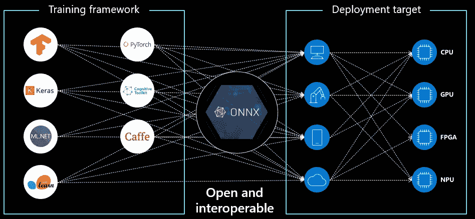

source: [https://microsoft.github.io/](https://microsoft.github.io/)

***变形金刚*** :

[Transformer](https://www.analyticsvidhya.com/blog/2019/06/understanding-transformers-nlp-state-of-the-art-models/) 是一个深度机器学习模型，主要用于自然语言处理(NLP)领域。像递归神经网络(RNNs)一样，转换器被设计为处理有序的数据序列，如自然语言，用于各种任务，如机器翻译和文本摘要。然而，与 rnn 不同，变压器不要求按顺序处理序列。因此，如果所讨论的数据是自然语言，转换器在处理句子结尾之前不需要处理句子的开头。由于这个特性，Transformer 在训练期间允许比 RNNs 更多的并行化。

# **2018:**

***剑桥分析丑闻:***

[脸书-剑桥分析公司数据丑闻](https://www.theguardian.com/news/2018/may/06/cambridge-analytica-how-turn-clicks-into-votes-christopher-wylie)是 2018 年初的一个重大政治丑闻，当时剑桥分析公司被披露在未经同意的情况下收集了数百万人的脸书个人资料，并将其用于政治广告目的。我们从这个问题中得到的一个好处是，人们开始知道他们的数据的重要性和安全性。

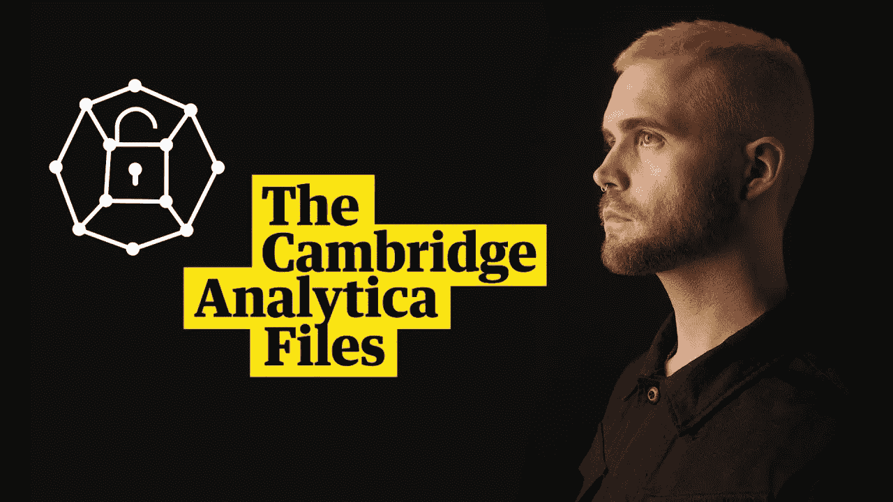

source: thegardian.com

***1000 万英里乘 waymo***

Waymo 正在打造世界上最有经验的司机，在公共道路上的自动驾驶里程超过 1000 万英里，模拟驾驶里程接近 70 亿英里。发现他们一路上看到和学到的东西，从我们前进道路上的文字曲线球，到低能见度沙尘暴的导航，以及更多意想不到的场景。

***deep fakes:***

Deepfakes 是一种媒体，它利用人工神经网络将现有图像或视频中的一个人替换成另一个人的肖像。他们经常使用被称为自动编码器和生成对抗网络(GANs)的机器学习技术将现有媒体组合和叠加到源媒体上。

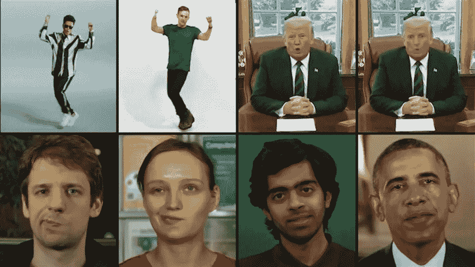

source: miro.medium.com

***AlphaFold:利用 AI 进行科学发现***

[AlphaFold](https://www.nature.com/articles/d41586-019-01357-6) ，建立在使用大量基因组数据预测蛋白质结构的多年前期研究基础上。AlphaFold 生成的蛋白质 3D 模型比以前的任何模型都要精确得多——在生物学的核心挑战之一上取得了重大进展

***伯特***

谷歌开发了 [BERT](https://github.com/google-research/bert) ，这是[第一个双向、无监督的语言表示](https://arxiv.org/abs/1810.04805)，可以通过迁移学习用于各种自然语言任务。

# **2019:**

***用机械手解魔方***

OpenAI 成功训练了一只名为 Dactyl 的机器人手，它在[解魔方](https://openai.com/blog/solving-rubiks-cube/) d 中适应了真实世界的环境。机器人完全在模拟环境中训练，但能够成功地将知识转移到新的环境中。为了提高灵活性，OpenAI 使用了自动域随机技术，并提高了手解魔方的能力。虽然 Dactyl 解决了立方体问题，但关键是能够在机器人未经训练的环境中提供结果。

***Deepfakes 检测挑战***

Deepfake 检测挑战赛邀请世界各地的人们建立创新的新技术，帮助检测 deep fake 和被操纵的媒体。识别被操纵的内容是一项技术要求很高且快速发展的挑战，因此各公司正在合作开发更好的检测工具。挑战的组织者是 AWS、BBC、CBC、脸书、初稿、微软、纽约时报、WITNESS 和 XPrize。

***Tensorflow 2.0 发布***

[TensorFlow 2](https://blog.tensorflow.org/2019/09/tensorflow-20-is-now-available.html) 专注于简单易用，拥有急切执行、直观的高级 API、在任何平台上灵活建模等更新。TF 2.0 的开发考虑到了 Keras。与 TensorFlow 1.x 中默认的静态图形不同，它有动态图形。

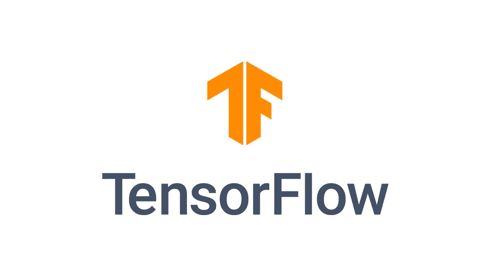

source: tensorflow.org

***比医生更能发现肺癌的 AI***

谷歌研究人员最近与西北医学合作，创造了一个比人类放射科医生更准确地检测肺癌的人工智能系统。一种深度学习算法被用来训练这个系统，它解释计算机断层扫描(CT)扫描，以预测一个人患疾病的可能性。

***项目通过 IP 连接家庭***

苹果、谷歌和亚马逊正在合作开发一个开源智能家居标准[,旨在确保设备协同工作，使新设备的开发更容易，并在此过程中保持一切安全。它的许多董事会成员，包括宜家、三星 SmartThings 和飞利浦 Hue 背后的公司 significance。](https://audioxpress.com/news/project-connected-home-over-ip-create-to-expand-smart-home-device-connectivity)

***OpenAI 一款电竞游戏的五个世界冠军***

DOTA 2 不是个人的游戏，它由一个五人团队组成。因此，重要的是人工智能能够与团队中的其他人工智能协调。 [OpenAI Five](https://openai.com/projects/five/) 在总决赛中背靠背战胜 Dota 2 世界冠军 OG，成为第一个在电竞游戏中击败世界冠军的 AI。

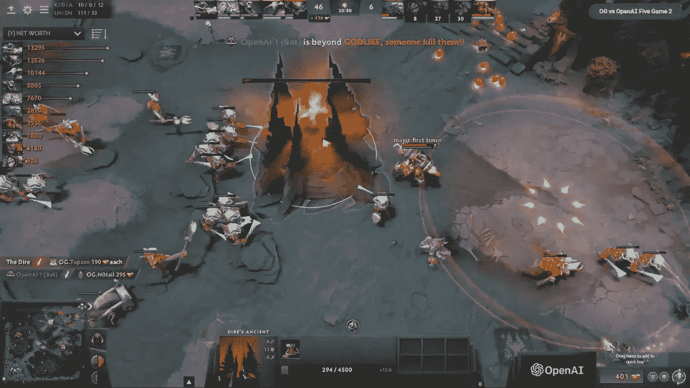

source: openai.com

***可交代艾***

我们允许人工智能做出关键决定，在目前的场景中，理解人工智能做出的决定对我们来说很重要，它不应该再是黑盒了。许多公司发布了服务，允许企业强调导致其机器学习模型结果的主要因素。这是第一次，公司能够清除云，并深入了解黑匣子的工作方式。尽管人们还不能从模型中获得结论的所有方面，但它在民主化人工智能中有着更突出的作用。

# 十年总结

你可以看到人工智能对这十年的影响，大多数是积极的影响，但很少对社会产生负面影响。人工智能本身没有好坏之分，它是一项技术，它取决于我们人类是否将它用于正确的事业。

# 人工智能的未来

人工智能的发展似乎不会很快放缓。人工智能冬天现在似乎不会再发生了。随着该领域数据、计算和研究的增加，人工智能正在快速发展。有一件事是肯定的，人工智能会一直存在，你不能逃避它，所以我们最好适应和它比赛。我们可以想象未来有联网汽车带我们去各个地方，有比任何人都了解我们的虚拟助手，无人驾驶飞机在订购后一小时内交付产品，可能性是无限的。有一天我们可能会达到人工智能。

推进他们在人工智能的伦理、人工智能的偏见和人工智能的民主化方面必须回答的许多问题。政府和公司需要一起制定法律来管理人工智能的发展。我们正在建设未来，让我们确保为每个人建设未来。

感谢阅读这篇博客，我希望它让你对人工智能在过去十年的发展有了一个大致的了解。博客上有很多链接，你可以在那里探索每个事件的更多信息。如果你想对任何事件进行更多的讨论，请在下面留下评论。我祝愿你们都有一个令人敬畏的十年，让我们看到我们在这十年中共同跨越的界限。

您可以在上连接

推特: [suryamaithreyan](https://twitter.com/Suryamaithreya1)

邮件 ID:suryamaithreyan@gmail.com

领英:[迈特瑞恩·凯萨万](https://www.linkedin.com/in/maithreyan-kesavan-707b50169/)