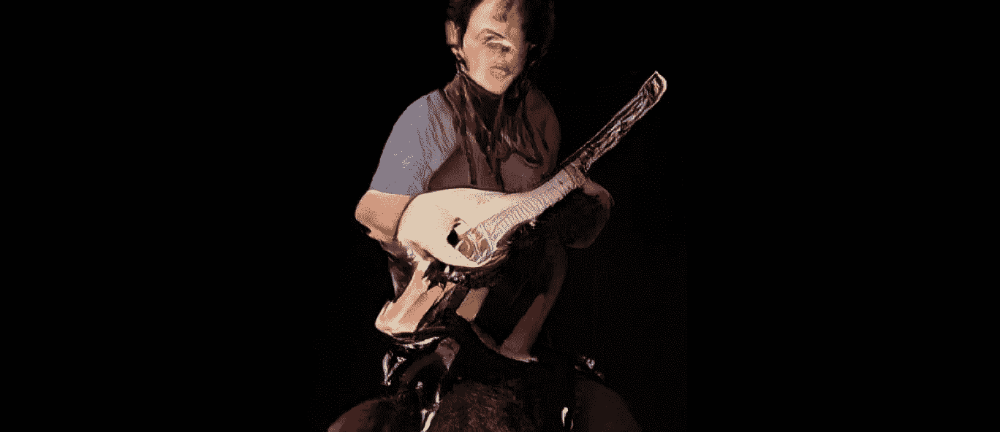
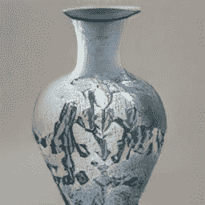
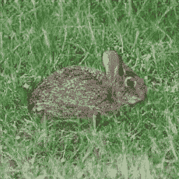
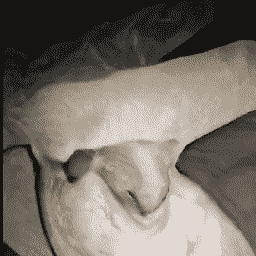
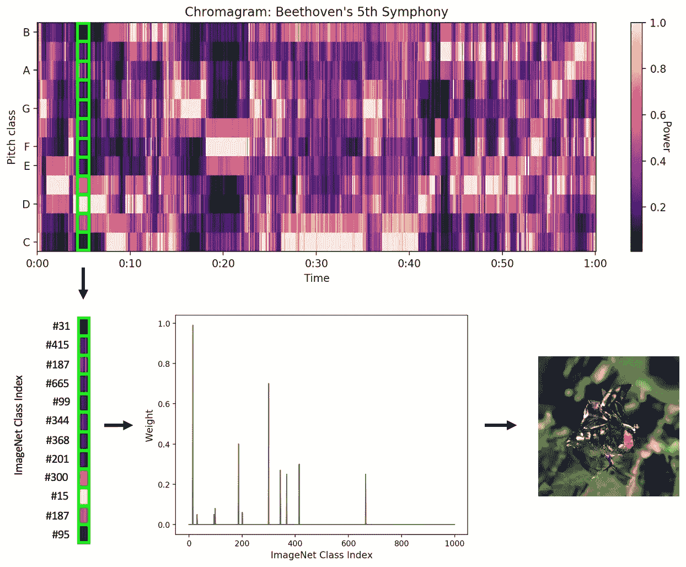

# 深度音乐可视化:用声音探索比根的潜在空间

> 原文：<https://towardsdatascience.com/the-deep-music-visualizer-using-sound-to-explore-the-latent-space-of-biggan-198cd37dac9a?source=collection_archive---------5----------------------->

## 人工智能艺术家、视觉骑师、联觉者和心理学家的工具。



A deep musician

A deep music video

想做一个有深度的音乐视频？把你的思想放在比根身上。由[布洛克等人(2018)](https://arxiv.org/abs/1809.11096) 在谷歌开发的 BigGAN 是生成对抗网络(GANs)的[简史](https://blog.floydhub.com/gans-story-so-far/)中的最近一章。gan 是由两个竞争的神经网络训练的人工智能模型:一个生成器基于从一组示例图像中学习的统计模式创建新图像，一个鉴别器试图将图像分类为真实或虚假。通过训练发生器欺骗鉴别器，甘人学会了创造逼真的图像。

BigGAN 被认为是大的，因为它包含了在数百个谷歌 TPU 上训练的超过 3 亿个参数，估计花费了 6 万美元。结果是一个人工智能模型，它从 1128 个输入参数中生成图像:

I)对应于 1000 个 [ImageNet 类](https://gist.github.com/yrevar/942d3a0ac09ec9e5eb3a)或对象类别的权重{0 ≤ 1}的 1000 单位**类向量**。

ii)128 单位的噪声向量**的值{-2 ≤ 2}，控制输出图像中对象的视觉特征，如颜色、大小、位置和方向。**

在*花瓶*类中，除了 1 以外的 0 的类向量输出一个花瓶:



在不改变噪声向量的情况下在类别之间进行插值揭示了潜在空间中的共享特征，如人脸:



随机向量之间的插值揭示了*更深层次的*结构:



如果你感兴趣，加入艺术家、计算机科学家和神秘动物学家在这个陌生前沿的探险。像[art breader](https://artbreeder.com/)这样的应用程序已经为创建人工智能艺术品提供了简单的界面，当一些用户忙于搜索蒙娜丽莎时[自主人工艺术家](https://medium.com/@genekogan/artist-in-the-cloud-8384824a75c7)出现了。

其他人给比根配乐。

这些“深度音乐视频”获得了不同的反应，在*美丽、迷幻、*和*恐怖*之间变化。平心而论，明智的做法是害怕潜伏在潜在空间中的东西…

还有哪些不太可能的嵌合体、神秘的生物、无价的艺术品和熟悉的梦居住在比根？为了找到答案，我们需要覆盖更多的区域。这就是为什么我建立了 deep music visualizer，一个开源的，易于使用的工具，用声音导航潜在的空间。

一艘隐形飞船，带蓝牙。

带着它转一圈，一路上创作一些很酷的音乐视频。一定要分享你的发现。

# 教程:使用深度音乐可视化工具

克隆 GitHub 库，并遵循[自述文件](https://github.com/msieg/deep-music-visualizer/blob/master/README.md)中的安装说明。

[](https://github.com/msieg/deep-music-visualizer) [## msieg/深度音乐可视化工具

### 深度音乐可视化器使用 BigGAN (Brock et al .，2018)，一种生成神经网络来可视化音乐。像这样…

github.com](https://github.com/msieg/deep-music-visualizer) 

在您的终端中运行以下命令:

```
python visualize.py --song beethoven.mp3
```

就是这样。以下是输出结果:

这是怎么回事？deep music visualizer 将 *pitch* 与类向量同步，将*音量和速度*与噪声向量同步，这样 pitch 控制每一帧中的对象、形状和纹理，而音量和速度控制帧之间的移动。在歌曲的每个时间点，十二个半音音符的色度图确定类别向量中多达十二个 [ImageNet 类别](https://gist.github.com/yrevar/942d3a0ac09ec9e5eb3a)的权重{0 ≤ 1}。独立地，音量(主要是打击乐)的变化率控制噪声矢量的变化率。



# 视频定制

## 解决

*   128、256 或 512
*   **默认值** : 512

比根很大，因此很慢。如果你在笔记本电脑上运行第一个例子，大概需要 7 个小时来渲染。分辨率为 128x128，只需 25 分钟(每分钟视频)。

```
python visualize.py --song beethoven.mp3 --resolution 128
```

然而，我建议你通过在 google cloud 上启动[虚拟 GPU 来生成高分辨率视频，从而将运行时间从大约 7 个小时大幅缩短到几分钟。虽然它不是免费的，但谷歌会奖励新用户 300 美元的积分，而 GPU 的费用是每小时 1 美元。](https://medium.com/@jamsawamsa/running-a-google-cloud-gpu-for-fast-ai-for-free-5f89c707bae6)

## 持续时间(秒)

*   整数≥ 1
*   **默认**:音频全长

在测试一些其他输入参数时，生成较短的视频以限制运行时间可能是有用的。

## 音高敏感度

*   范围:1–299
*   **默认** : 220

音高敏感度是类别向量对音高变化的敏感度。在更高的音高敏感度下，视频中的形状、纹理和对象变化更快，并且更精确地符合音乐中的音符。

## 速度敏感度

*   范围:0 ≤ 1
*   **默认值** : 0.25

速度敏感度是噪声向量对音量和速度变化的敏感度。更高的速度敏感度产生更多的运动。

在本例中，由于音高敏感度较高，类与音高紧密相关，但由于速度敏感度较低，整体运动很少。

```
python visualize.py --song moon_river.mp3 --duration 60
--pitch_sensitivity 290 --tempo_sensitivity 0
```

在本例中，由于音高敏感度较低，类别混合几乎没有变化，但由于速度敏感度较高，整体移动较多。

```
python visualize.py --song moon_river.mp3 --duration 60
--pitch_sensitivity 10 --tempo_sensitivity 0.6
```

## 民数记班

*   1–12
*   **默认** : 12

减少类的数量以混合更少的对象。

## 班级

*   多达 12 个索引{ 0–999 }，对应于 1000 个 ImageNet 类
*   **默认**:12 个随机指数

您可以选择要在视频中包含哪些课程。这些类别按照半音顺序(A、A#、B…)与音高同步。

或者，如果您喜欢按优先顺序输入类，则将 **sort_classes_by_power** 设置为 1。

在这个例子中，视频包括*雏菊* (#985)和*水母* (#107)，但其中*雏菊*比*水母多:*

```
python visualize.py --song cold.mp3 --duration 10 
--pitch_sensitivity 260 --tempo_sensitivity 0.8 --num_classes 2 
--classes 985 107 --sort_classes_by_power 1
```

## 帧长度

*   64 的倍数
*   **默认:** 512

帧长度是每个视频帧中音频样本的数量。默认帧长度为 512，视频帧速率约为 43 fps。减少帧长度会增加帧速率，因此图像会更频繁地更新(但视频会花费更长的时间来渲染)。这对于可视化快速音乐非常有用。

```
python visualize.py --song T69_collapse.mp3 --duration 30 --num_classes 4 --classes 527 511 545 611 --sort_classes_by_power 1 
--frame_length 128
```

我希望你觉得这个教程很有趣，内容丰富。如果你想表达感谢，[发推特给我](https://twitter.com/MattSiegelman)一个你用这段代码创作的深度音乐视频！

你可以在这里找到更多我的视频。

# 开放式问题

*   甘斯*不能*创造什么样的艺术？艺术一定要模仿现实吗？
*   音乐有内在的视觉结构吗？某些声音、乐器、歌曲和流派是否由某些 ImageNet 类更好地表示？有联觉的人可能会这么想。
*   比格根的艺术能力是不是可以用深度神经网络和人类视觉皮层之间的[表征相似性来解释？如果是这样，潜在空间能代表人类想象力的拓扑图吗？BigGAN 能预测物体的可成像性吗？例如，想象一个挂钟。你真的想象过所有的数字吗？](https://www.annualreviews.org/doi/10.1146/annurev-vision-082114-035447)[比根](https://twitter.com/MichaelFriese10/status/1169756130391650306?ref_src=twsrc%5Etfw)也没有。

# 未来项目

*   构建一个实时响应现场音乐的可视化工具。
*   使用自然语言处理基于与歌词(或有声读物)的语义关联来自动选择 ImageNet 类。
*   在 fMRI 中向人们播放音乐，并将类别和噪声向量与神经活动相结合，以创建来自大脑的深度音乐视频。
*   所有这些同时发生吗？

## 参考

[1] A. Brock，J. Donahu 和 K. Simonyan，高保真自然图像合成的大规模 GAN 训练(2018)，第八届学习表示国际会议。

[2] N. Kriegeskorte，深度神经网络:生物视觉和大脑信息处理建模的新框架(2015)，视觉科学年度评论。