# 创建具有行业要求和约束的学术级数据集的明确指南

> 原文：<https://towardsdatascience.com/the-definite-guide-for-creating-an-academic-level-dataset-with-industry-requirements-and-6db446a26cb2?source=collection_archive---------16----------------------->

## 创建您自己的数据的指南，并附有有价值的信息，以帮助您做出关键决策。

Teenagers playing football, Ipanema beach, Rio De Janeiro, Brazil. Ektar 100 Film, by Ori Cohen.

在下面的文章中，我将讨论开始一个研究项目的过程，在这个项目中，一个新的全监督分类模型需要一个学术级别的数据集，如斯坦福大学和其他学术机构共享的数据集。我将分享我们做出的决定，我们创建和购买的工作流程和工具。请记住，即使本指南围绕一个特定的研究，我们在情感分类这个主题上做的许多研究之一，你也可以用它来概括许多其他的研究。但首先，让我们谈谈情感分类，以及我们 [(Zencity](https://zencity.io/) )需要在公司内部开发一个创建学术级数据集的管道的原因。

情感分类是一个经典的任务，已经被研究、讨论和撰写了很长时间。在内部，我们使用了 [VADER](https://github.com/cjhutto/vaderSentiment) ，这是一种已知的情绪算法，使用专门调整的规则和词汇来理解社交媒体情绪。该算法在附加规则方面得到了改进，词典扩展了数千个单词，以支持一年内与城市相关的社交媒体内容。使用我们改进的算法，我们测量的准确率为 89.5%。然而，随着公司的发展，我们对客户需求的理解也发生了变化。因此，我们希望开发一个情感定义和一个新的算法，可以帮助我们更好地根据客户的感受来表达情感的概念。我们还需要保持非常高的精确度，这反过来使我们能够为城市提供可操作的见解。例如，通过使用 VADER，任何带有“警告”一词的帖子都可能被归类为负面情绪。然而，警报不一定是负面的。对于城市，警报可以是中性的，例如交通警报。此外，由于业务限制，到目前为止，每个样本都是由一个人在一本解释什么是城市情感的 4 页代码书的指导下进行标记的。

该项目的要求是了解情感分析的最新水平，以便设定基线，以及生成新数据集的适当标准和工作流程。我们希望根据推荐的最佳实践创建一个新的与城市相关的情绪定义，以简化手动注释的过程，训练并最重要的是验证新模型，并实现非常高的准确度和精确度，特别是对于新的“负面”类，这对于我们的客户非常重要。

# **基线**

那么，社交媒体情感分类的最新水平(SOTA)是什么呢？最近在 ACM Transactions on Management Information Systems 上发表的一篇[评论](https://www.researchgate.net/profile/Ahmed_Abbasi4/publication/323596841_The_State-of-the-Art_in_Twitter_Sentiment_Analysis_A_Review_and_Benchmark_Evaluation/links/5a9f4edda6fdcc22e2cb5324/The-State-of-the-Art-in-Twitter-Sentiment-Analysis-A-Review-and-Benchmark-Evaluation.pdf)和基准评估文章，在 5 个独特的 Twitter 数据集上对 28 个顶级学术和商业系统进行了基准测试，显示跨系统和领域的总体平均情感分类准确率为 61%。最高测量精度为 76.99%，如图 1 所示。在另一项研究中，使用深度学习(图 2)，我们看到高达 87.5%的分类准确率。这些数字让我们对什么是 SOTA 有了一个相对清晰的了解，在不同的领域使用不同的算法不会产生相同的结果。

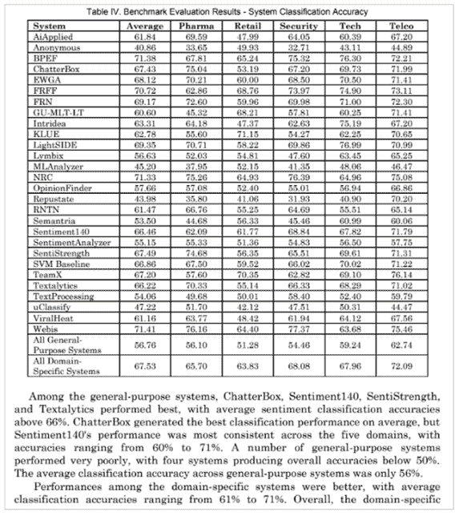

Figure1: sentiment analysis results using 28 algorithms on 5 distinct datasets

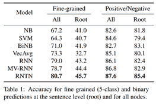

Figure 2: sentiment analysis results using machine and deep-learning algorithms using binary and 5-class sentiment-based datasets.

# **标准和工作流程**

回顾相关文献，学术级注释项目的重点似乎是:

1.  按职位多数表决。
2.  简单的定义和简短的任务描述。
3.  定期测量注释者的表现和注释者之间的一致性。
4.  适当采样并创建数据集。
5.  小心选择注释解决方案
6.  使用一个简单的注释界面来帮助注释者专注于一个简单明了的任务。

# **按样本多数投票**

决定基于多数投票的项目是重要的第一步，这是任何注释项目的关键点，因为它增加了项目性质的复杂性。复杂性，比如在额外的注释器上花费更多的钱，创建一个支持多个注释器的基础设施，开发跟踪进度的脚本，以及在日常分析中投入时间，以确保每个注释器都在正轨上。我们不希望单个注释者影响我们的新数据集，给它添加偏见或引入噪声。例如，共享同一个房间的注释者可以影响他们自己，如果他们在相互交谈时重新解释指令的话。一个注释者可能在某一天醒来，完全改变了他们的方法，因此，拥有一个监控机制并在这种情况发生时微调他们的理解是明智的。

# **简单的定义和简短的任务描述**

我们还想更换我们的 4 页说明书。我们的想法是决定一个新的与城市相关的情感定义，专注于我们客户的需求，并创建一个非常简短的任务描述，即新情感的单行定义和少于半页的说明。最终的定义是“居民对城市中发生的任何事情满意(积极)或不满意(消极)的表示”，如图 3 所示。

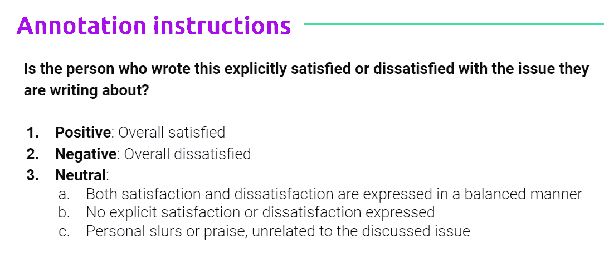

Figure 3: the new sentiment definition and annotator instructions.

如你所见，定义非常清晰，说明也很简短。我们可以在下面的例子中看到，中性的例子在古典情感方面可能被认为是负面的，然而，根据新的定义，它是中性的。作者没有明确地说他们对他们所写的问题是否满意。请注意，反面和正面的例子明显遵循新的定义。

> 中立:贝赛尔县大陪审团周二决定**不**起诉前圣安东尼奥警官，他被指控**在他当时的女友公寓外用石头殴打她**。
> 
> **消极** : **不冷静**。偷包裹的人已经在圣诞老人的淘气名单上了。这家伙从 X 巷 9999 街区的一户人家拿走了一个包裹。如果你认识他，请联系侦探。布兰科，电话 999–999–99999，或发电子邮件至
> 
> 正面消息:阿灵顿警察局很自豪地雇佣了许多现任和前任美国军人。我们感谢他们的服务，我们很荣幸他们选择为我们部门工作。

# **衡量绩效和一致(或不一致)**

在项目期间，我们需要测量几个度量标准，以便理解和控制注释过程的各个方面。衡量标准包括:

1.  自我认同，这有助于我们识别低质量的注释者。我们通过每 K 个样本插入重复的帖子来做到这一点。
2.  相互一致，这是对任务的客观难度的一个很好的估计。对于多注释者，我们使用 Fleischer 的 Kappa，对于两个注释者，我们使用 Cohen 的 Kappa。对我们来说，高于 0.55 的值被认为是一个好的估计值。
3.  所有注释者之间的一致百分比。这是相互一致性的另一个估计值，对我们来说，值 0.65 与 Fleischer 的 kappa 高度相关，被认为是相互一致性的良好估计值。
4.  事实验证。我们使用相同的多数投票程序，将我们内部标记的样本插入数据集。请记住，因为我们创建了新的定义，所以我们是专家，因此，如果我们针对一个小的标记良好的数据集来度量每个注释者，我们可以看到注释者是否同意我们的观点。

请注意，我们可以创建和测量许多其他指标，但这些对我们来说已经足够了。它们帮助我们了解每个标注者每天是否可以使用新标注的数据，以及我们是否需要调整标注者对新标注方案的理解。您可以使用下面的[包](https://github.com/o-P-o/disagree)来度量注释者之间的分歧。

# **采样**

现在我们知道了要测量什么，我们需要创建数据集，这是许多决策对最终数据集质量有贡献的另一点。出现了几个问题:

1.  要采样的数据。
2.  何时遵循哪种抽样分布？
3.  使用哪种采样算法。
4.  要多少样品？

在我们的例子中，我们决定对已经标记的人类认可的数据进行采样，当然，我们不使用标签本身。我们知道最好的选择是遵循每个用例的分布。以下是对我们有用的几个指导原则，它应该为您自己的数据提供一个良好的开端:

1.地面真实样本应每班统一取样。想象一下，在一个类中只有很少的样本，也就是说，您让一个类挨饿，对于一个非常小的样本，您永远无法确定您的注释器在那个类中的表现有多好。

2.应根据生产数据的分布方式对主数据集进行采样，这将允许您的模型学习相同的分布。

请记住，如果您觉得这些规则不符合您的要求、数据或不适合您的需求，应该对它们进行更改。

# **创建数据集**

既然我们已经知道了要采样的数据以及应该遵循的分布，那么就该决定如何进行采样了。您可能会想到许多简单或更复杂的方法，但我们尝试的基本方法有:

1.使用关键字——由了解该领域的人定义。

2.使用算法-它可能是现成的算法，是您可以轻松创建的快速算法，或者是从您的领域附近的数据集进行某种迁移学习。在我们的例子中，我们采用了一个用户评论的数据集，这个数据集与我们的领域有些相似，我们选择了被标为最积极和最消极的评论，并用它们来训练样本选择分类器。

两种方法都很有效。然而，在我们的例子中，关键字方法似乎产生了更好的结果。

现在是时候决定我们项目需要的样品数量了。显然，我们拥有的越多，我们的模型就越好。我发现了一个很好的计算器，如表 1 所示，它最初是为调查而创建的，帮助我估计已知人口规模和您想要保持的置信水平所需的样本数。在我们的例子中，对于 100，000 个不同作者的估计人口规模，置信度为 95%，大约 10，000 个样本就足够了。样本的数量直接影响我们的预算和算法的选择。假设我们有 5 个注释器，每个注释器需要 10，000 个样本，我们总共需要 50，000 个带注释的样本。在某些服务中，正如我们将在后面看到的，这相当于一大笔钱。幸运的是，我的公司愿意投入资金、时间和精力来构建这些数据集。我们知道，高质量的带注释的数据集直接有助于更好、更准确的模型，并最终有助于我们为客户提供价值。样本的数量也会影响我们对算法的选择，在我们的案例中，我们尝试了经典的机器学习和深度学习算法。然而，对于我们尝试的所有深度学习算法来说，我们的数据集似乎仍然很小。

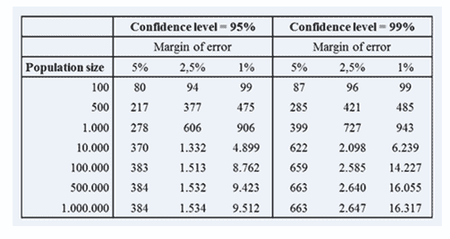

Table 1: sample size calculation for a set population size based on a confidence level.

# **注释解决方案**

有许多注释解决方案可供选择，有些比其他的便宜，有些会给你一个完整的解决方案，而其他的只会给你基础设施或人群。然而，各有利弊。首先，我将列出几个已知的，然后我们将深入几个值得注意的。您可以选择以下服务之一 1。[亚马逊的机械土耳其人(AMT)](https://www.mturk.com/) ，2。[八字](https://www.figure-eight.com/)(人群花)3。众包/劳动力/ Onespace ，5。[勤杂工](https://www.jobboy.com)，6。 [Samasource](https://www.samasource.com/) ，7。外包。此外，您可以选择或以下工具之一:1 . [Lighttag.io](https://www.lighttag.io/) 2[神童](https://prodi.gy/docs/faq) 3。[乳臭未干的小子](http://brat.nlplab.org/?fbclid=IwAR1bDCM3j3nEQb3Hrf9dGCwyRvDVMBXoob4WtVLCWAMBgPraZmkSi123IrI)

下面(表 2)代表了我对总共 50，000 个注释的初步计算。我选择比较 AMT、premium 和外包公司，因为它们代表了我们可用的服务和工具。

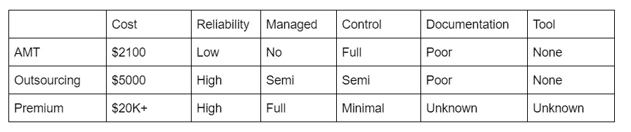

Table 2: various features for each annotation solution

如你所见，这是我们有多少选择的另一个好例子。总的来说，AMT 是最便宜的选择，你可以使用[计算器](https://morninj.github.io/mechanical-turk-cost-calculator/)来计算出你要花多少钱，但是请记住，如果你为每项任务支付基本的 1 美分，你可能不会被任何注释者选中。就可靠性而言，许多研究人员告诉我，这是一种赌博，即使你支付了额外费用。没有什么是可以保证的，因为任何人都可以为 AMT 工作。值得注意的是，文档是混乱和不清楚的，如果你想使用外部工具，你需要一个数据工程师来帮助你。最后，实验是完全管理的，你对过程的控制取决于你自己。

另一方面，高级服务与您合作管理几乎所有的事情。然而，一些人声称他们经历过注释，他们通过承诺超过 80%的真实可信来保持“信任”。您向他们提供您的任务描述，他们训练注释者，直到您对结果满意为止。

两全其美的方法可能是外包给外部注释公司，他们有全职员工，你可以定期与他们交流。他们有裁员计划，也就是说，如果一个员工生病了，其他人会代替他们。然而，你必须签署合同，并承诺雇佣他们一段时间，一旦开始，你就不能停下来。如果想获得最佳结果，还必须开发或提供注释的解决方案。

# **标注工具:**

我找到了几个现成的注释工具，但最有前途的是 Brat 和 Prodigy。Brat 是开源的，似乎很少维护，它主要适合类似于 POS 或 NER 的任务。另一方面，Prodigy 对单个商业用户来说相对便宜(390 美元)，拥有无限的注释器和终身许可，并且适用于 web 和智能手机。我们选择 prodigy 是因为它使用简单，高度可配置，并且在“工厂”模式下工作，专注于单一的超高速键盘快捷键。值得注意的是，prodigy 支持单用户主动学习，但是，如果您计划进行多用户主动学习，您将不得不在所有标注器之间进行同步，而这个特性还不存在。此外，不存在“用户”的概念，因此，支持管理一组注释者并将他们的工作保存到单个数据库需要一个数据工程师。Prodigy 还缺乏性能监控，并且缺少文档。然而，在他们的论坛上有积极的支持，这是一个巨大的优势。图 4。展示了 prodigy 的界面，它简单易用，允许注释者以最少的干扰专注于他的任务，即“工厂风格”。

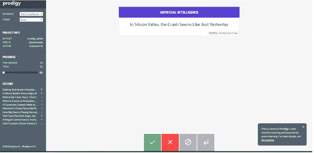

Figure 4: Prodigy’s user interface.

# **成绩:**

我们的项目产生了 14，000 个多数投票的样本，这意味着我们的注释者标记了大约 75，000 个帖子，超过了我们预期的每人 10，000 个帖子。在图 5 中，我们显示了 inter-agreement 和 Fleischer 的 Kappa 之间的相关性，每个都有自己的阈值。阈值有助于确定每日数据是否可信，以及我们是否应该将它包含在最终数据集中。

在图 6 中，我们看到，与注释者每天所做的量相比，基本事实度量之间存在着有意义的关联，我们看到，他们做得越少，基本事实的准确性就越高。我们还可以在图 7 中看到团队在整个时间内的平均地面实况准确性。我们选择了 70%的一致值，这将考虑到地面实况准确性不会是完美的 100%的各种原因，其中一个主要原因是一些地面实况帖子具有依赖于单一投票的多数，即 2:3 对 3:2，并且可能是地面实况中的错误。然而，这是一个过程，这就是为什么我们有门槛。

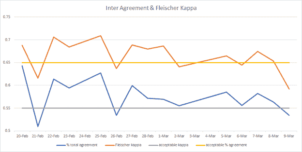

Figure 5: a correlation between Inter-agreement and Fleischer Kappa, showing the threshold we chose for keeping the daily annotated data.

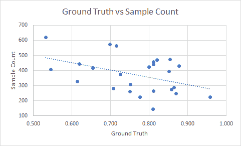

Figure 6: a comparison of sample count vs ground truth accuracy

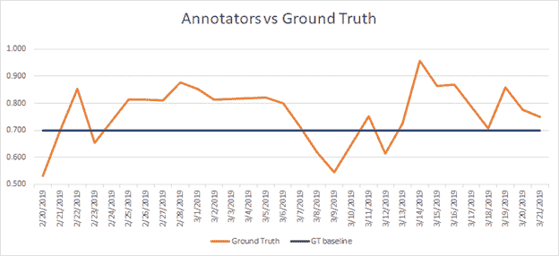

Figure 7: average annotators accuracy throughout time

使用最终数据集，我们使用各种方法(如 TF-IDF、LSA、W2V、深莫吉和 ELMO)创建要素，并使用反向翻译等方法扩充数据。我们训练了相当多的分类算法，例如校准的 SGD、ULMFit、Random Forest、XGboost、LightBoost、Catboost、LSTM、1DCNN，还堆叠了其中的几个。

我们最高的交叉验证模型使用 TF-IDF &校准的 SGD (SVM)实现了 89% 的**准确率，如表 3 所示。**

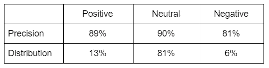

Table 3: precision and distribution figures for each class.

# **数据分析:**

我们对来自美国 22 个城市的 245，469 个样本进行了测试。负面情绪下降了 6%，正面情绪下降了 19%，中性情绪上升了 25%，如图 8 所示。我们预计这些数字会根据新的定义发生变化，我们有效地从不相关的样本中清除了消极和积极的类别，例如类似“警报”的帖子、事故、交通、紧急情况等，这些现在属于中性类别，除非用户不满意出现在帖子中。

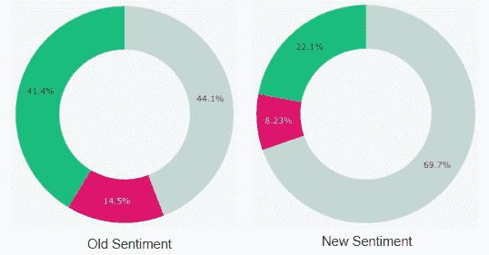

Figure 8: distribution statistics for the old sentiment vs the new sentiment

回过头来看，这个过程效果很好，我们发现了一个为我们创建高质量数据集的工作流程。请注意，我们训练的模型仅在单个时间点有效，必须定期重新训练。为此，我推荐使用具有相同多数投票过程的多注释者主动学习。然而，我们的旅程还没有结束，我们仍然需要在生产就绪环境中分析和验证该模型，并确保它符合我们客户的期望。

我要感谢来自 Zencity 的同事，他们是这个项目的重要组成部分:Samuel Jefroykin(研究)、Polina Sklyarevsky(新定义和数据)、Alon Nisser(工程)、Yoav Talmi、Eyal Feder-Levy、阿娜特 Rapoport、Ido Ivry 和 Gali Kotzer。我还要感谢我在开始这个项目之前咨询过的几位朋友和同事，Orgad Keller 博士、Eyal Shnarch 博士、Hila Zarosim 博士和 Netanel Davidovits。

Ori Cohen 博士拥有计算机科学博士学位，专注于机器学习。他领导着 Zencity.io 的研究团队，试图积极影响市民的生活。