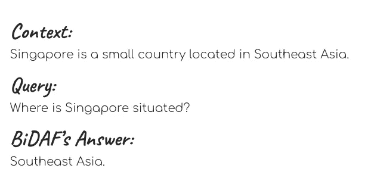
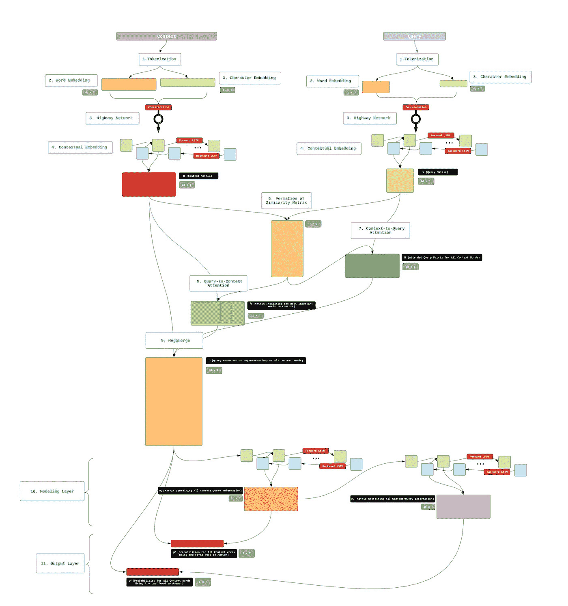

# 双向注意力流动图解指南

> 原文：<https://towardsdatascience.com/the-definitive-guide-to-bi-directional-attention-flow-d0e96e9e666b?source=collection_archive---------5----------------------->

## BiDAF 的权威指南——第 1 部分，共 4 部分

## 本文展示了 BiDAF 的工作方式，BiDAF 是一个 NLP 模型，它在问答领域取得了突破。

Source: [Unsplash](https://unsplash.com/photos/12ea-y_1-UE)

华盛顿大学的一个团队在 2016 年发表了 BiDAF。BiDAF 轻而易举地击败了当时最好的 Q & A 模型，并连续几周在[斯坦福问答数据集(SQuAD)](https://rajpurkar.github.io/SQuAD-explorer/) 的排行榜上名列榜首，这可以说是最知名的 Q & A 数据集。尽管 BiDAF 的性能已经被超越，但这种模式在问答领域仍然很有影响力。BiDAF 的技术创新激发了竞争车型的后续发展，如 [ELMo](https://arxiv.org/abs/1802.05365) 和 [BERT](https://arxiv.org/abs/1810.04805) ，最终 BiDAF 被淘汰。

当我第一次阅读 BiDAF 的原始论文时，我被它的复杂程度所震惊。

> **BiDAF 展示了一个模块化的架构——把它想象成一个由乐高积木组成的复合结构，积木是“标准”的 NLP 元素，如 GloVe、CNN、LSTM 和 attention** 。理解 BiDAF 的问题是有太多的这些模块需要学习，它们的组合方式有时看起来相当“杂乱”。这种复杂性，加上原始论文中使用的令人费解的符号，成为理解该模型的障碍。

在本系列文章中，我将解构 BiDAF 是如何组装的，并以(希望)易于理解的方式描述 BiDAF 的每个组件。将提供大量的图片和图表来说明这些组件是如何组合在一起的。

计划是这样的:

*   第 1 部分(本文)将提供 BiDAF 的概述。
*   [第二部分](https://medium.com/@meraldo.antonio/the-definitive-guide-to-bidaf-part-2-word-embedding-character-embedding-and-contextual-c151fc4f05bb)会讲到**嵌入层**
*   [第三部分](https://medium.com/@meraldo.antonio/the-definitive-guide-to-bidaf-part-3-attention-92352bbdcb07)会讲到**注意层次**
*   第四部分将会谈到**建模和输出层。**它还将包括用非常简单的语言介绍的整个 BiDAF 架构。如果您对技术不感兴趣，我建议您直接跳到第 4 部分。

# **BiDAF 相对于其他 Q & A 车型**

在深入研究 BiDAF 之前，让我们先把它放在更广阔的问答模型中。有几种方法可以对问答模型进行逻辑分类。以下是其中的一些:

*   **开域** *vs* **闭域。**一个*开放域*模型可以访问一个知识库，它将在回答一个传入的*查询*时利用这个知识库。著名的 IBM-Watson 就是一个例子。另一方面，*封闭形式的*模型不依赖于预先存在的知识；相反，这样的模型需要一个*上下文*来回答一个查询。这里有一个术语的快速注释——“上下文”是一个附带的文本，包含回答查询所需的信息，而“查询”只是问题的正式技术术语。
*   **抽象的** *vs* **抽象的。**一个*抽取*模型通过返回与查询最相关的上下文的子串来回答查询。换句话说，模型返回的答案总是可以在上下文中找到。另一方面， *abstractive* 模型走得更远:它在将子串作为查询的答案返回之前，将其解释为一种更易于阅读的形式。
*   **能够回答非陈述性问题。** *仿真陈述*查询是其答案是简短事实陈述的问题。大多数以“谁”、“哪里”和“何时”开头的查询都是仿真陈述，因为它们期望得到简洁的事实作为答案。*非仿真陈述*查询，简单来说就是所有非仿真陈述的问题。非仿真陈述阵营非常广泛，包括需要逻辑和推理的问题(例如，大多数“为什么”和“如何”的问题)以及涉及数学计算、排名、排序等的问题。

那么 BiDAF 在这些分类方案中处于什么位置呢？BiDAF 是一个封闭领域的抽取式 Q 模型，它只能回答仿真问题。这些特征意味着 BiDAF 需要一个上下文来回答一个查询。BiDAF 返回的答案总是所提供的上下文的子字符串。

An example of **Context**, **Query** and **Answer.** Notice how the Answer can be found verbatim in the Context.

另一个小提示:你可能已经注意到了，我一直在大写单词“上下文”、“查询”和“回答”。这是故意的。这些术语既有技术含义也有非技术含义，大写字母是我用来表示我是在用它们的专业技术能力来使用这些词的方式。

有了这些知识，我们现在准备探索 BiDAF 是如何构建的。让我们开始吧！

# **BiDAF 结构概述**

> BiDAF 在上下文中精确定位答案的能力源于它的分层设计。这些层中的每一层都可以被认为是一个转换引擎，由*转换*单词的矢量表示；每个转换都伴随着附加信息的包含。

BiDAF 论文将模型描述为有 6 层，但是我认为 BiDAF 有 3 个部分。这三个部分及其功能简述如下。

## **1。嵌入层**

BiDAF 有 3 个嵌入层，其功能是*将查询和上下文中的单词*的表示从字符串转换为数字向量。

## **2。注意力和建模层**

这些查询和上下文表示然后进入关注和建模层。这些层使用几个矩阵运算来融合查询和上下文中包含的信息。这些步骤的输出是包含来自查询的信息的上下文的另一种表示。这个输出在本文中被称为“查询感知上下文表示”

## **3。输出层**

然后，查询感知上下文表示被传递到输出层，输出层将*将其转换为一组概率值*。这些概率值将用于确定答案的起点和终点。

描述 BiDAF 架构的简图如下:

Architecture of BiDAF. Source: author

如果这些都还没有意义，不要着急；在接下来的文章中，我将详细研究每个 BiDAF 组件。第二部再见！

# 参考

[1] [机器理解的双向注意力流(闵俊 Seo *et。阿尔*，2017)](https://arxiv.org/abs/1611.01603)

如果你对这篇文章有任何意见或者想联系我，请随时通过 LinkedIn 给我发一个联系方式。另外，如果你能支持我通过[我的推荐链接](https://medium.com/@meraldo.antonio/membership)成为媒介会员，我会非常感激。作为一名会员，你可以阅读我所有关于数据科学和个人发展的文章，并可以完全访问所有媒体上的故事。