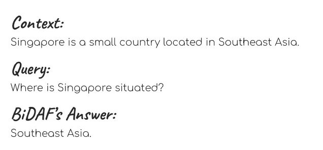

# BiDAF 中的单词嵌入、字符嵌入和上下文嵌入——图解指南

> 原文：<https://towardsdatascience.com/the-definitive-guide-to-bidaf-part-2-word-embedding-character-embedding-and-contextual-c151fc4f05bb?source=collection_archive---------1----------------------->

## BiDAF 的权威指南——第 2 部分，共 4 部分

## **BiDAF 是**一种用于问答任务的流行机器学习模型。本文展示了 BiDAF 如何使用三种嵌入机制将单词转换成它们的向量表示。

Source: Brett Jordan from [Unsplash](https://unsplash.com/photos/7PYqjNzvrc4)

T 他的这篇文章是一系列四篇文章中的第二篇，旨在说明 [**双向注意力流(BiDAF)**](https://arxiv.org/abs/1611.01603)**一种流行的问答机器学习模型(Q & A)的工作原理。**

**概括地说，BiDAF 是一个*封闭领域，抽取的* Q & A 模型。这意味着为了能够回答一个**查询**，BiDAF 需要查阅一个附带的文本，该文本包含回答查询所需的信息。这个附带的文本被称为**上下文。** BiDAF 的工作方式是提取上下文中最能回答查询的子串——这就是我们所说的对查询的**回答** 。我有意将“查询”、“上下文”和“回答”这几个词大写，以表明我是在用它们的专业技术能力来使用它们。**

****

**An example of **Context, Query,** and **Answer.** Notice how the Answer can be found Verbatim in the Context.**

**本系列的第一篇文章提供了 BiDAF 的高级概述。在本文中，我们将关注 BiDAF 架构的第一部分——当模型接收到一个传入的查询及其伴随的上下文时发生的第一件事。为了方便您的学习，最后提供了一个词汇表，其中包含了这些步骤中涉及的数学符号。让我们开始吧！**

# ****第一步。标记化****

****在 BiDAF 中，传入的查询及其上下文首先被标记化，即这两个长字符串被分解成它们的组成单词。**在 BiDAF 论文中，符号 **T** 和 **J** 分别用于表示上下文和查询中的字数。以下是对标记化的描述:**

****

**Step 1\. The incoming Query and its accompanying Context are tokenized into their constituent words.**

# ****步骤二。单词级嵌入****

**产生的单词然后经过嵌入过程，在那里它们被转换成数字向量。这些向量捕捉单词的语法功能(*句法*和含义(*语义*)，使我们能够对它们执行各种数学运算。在 BiDAF 中，嵌入是在三个粒度级别上完成的:字符、单词和上下文级别。现在让我们关注第一个嵌入层——单词 embedding。**

****原 BiDAF 中使用的单词嵌入算法是** [**手套**](https://nlp.stanford.edu/projects/glove/) **。**在本文中，我将只给出 GloVe 的一个简要概述，因为已经有几个[优秀的](http://mlexplained.com/2018/04/29/paper-dissected-glove-global-vectors-for-word-representation-explained/)资源解释了该算法是如何工作的。但是如果你时间不够，这里有一个非常简单的 GloVe 总结:**

> ****GloVe 是一种无监督学习算法，它使用语料库中单词的共现频率来生成单词的向量表示。**这些向量表示在数字上代表了单词含义的各个方面。**

**由于组成手套向量的数字封装了它们所代表的单词的语义和句法信息，我们可以使用这些向量做一些很酷的事情！例如，我们可以使用手套向量减法来寻找单词类比，如下所示。**

****

**Pairwise distances of concepts such as aunt-uncle and woman-man are similar. Source: [Stanford's NLP Group](https://nlp.stanford.edu/projects/glove/)**

****BiDAF 使用预训练的手套嵌入来获得查询和上下文中单词的向量表示。**“预训练”表示此处使用的手套表示已经过训练；他们的值被冻结，在训练期间不会更新。因此，您可以将 BiDAF 的单词嵌入步骤看作一个简单的字典查找步骤，我们用向量(字典的“值”)替换单词(手套“字典”的“键”)。**

**单词嵌入步骤的输出是两个矩阵——一个用于上下文，一个用于查询。这些矩阵的长度等于上下文和查询中的字数(对于上下文矩阵为 **T** ，对于查询矩阵为 **J** )。同时，它们的高度 **d1** 是预设值，等于从手套开始的向量尺寸；这可以是 50、100、200 或 300。下图描述了上下文的单词嵌入步骤:**

****

**Step 2\. The word embedding step converts Context tokens into a **d1**-by-**T** matrix and Query tokens into a **d1**-by-**J** matrix**

# ****第三步。字符级嵌入****

**好了，有了 GloVe，我们得到了大多数单词的向量表示。然而，手套的表现对我们的目的来说是不够的！**

**预训练手套“字典”是巨大的，包含数百万个单词；然而，总有一天我们会在训练集中遇到一个单词，而这个单词不在 GloVe 的词汇表中。这样一个词被称为一个词汇外(OOV)词。GloVe 通过简单地给它们分配一些随机向量值来处理这些 OOV 单词。如果不加以纠正，这种随机分配最终会混淆我们的模型。**

**因此，我们需要另一种能够处理 OOV 词的嵌入机制。这就是字符级嵌入的用武之地。**字符级嵌入使用一维卷积神经网络(1D-CNN)，通过查看单词的字符级组成来找到单词的数字表示。****

> **你可以把 1D-CNN 想象成一个过程，我们有几台扫描仪一个字符一个字符地扫描一个单词。**这些扫描仪可以一次聚焦几个字符。当这些扫描仪扫描时，它们从聚焦的字符中提取信息。**在这些扫描过程的最后，来自不同扫描仪的信息被收集以形成单词的表示。**

**字符嵌入步骤的输出类似于单词嵌入步骤的输出。我们获得两个矩阵，一个用于上下文，另一个用于查询。这些矩阵的长度等于上下文和查询中的字数——T**T**和 J——而它们的高度取决于 1D-CNN 中使用的*卷积滤波器*的数量(要知道什么是“卷积滤波器”，请阅读下一节)。高度在图中表示为 **d2** 。这两个矩阵将与我们从单词嵌入步骤中获得的矩阵连接在一起。**

****

**Step 3\. The character embedding step converts Context tokens into a **d2**-by-**T** matrix and Query tokens into a **d2**-by-**J** matrix**

## ****1D CNN 的更多细节****

**上一节只是对 1D 有线电视新闻网的运作做了一个概念性的概述。在这一部分，我将详细解释 1D-CNN 是如何工作的。严格来说，这些细节对于理解 BiDAF 的工作方式并不是必需的；因此，如果你时间不够，可以随意跳下去。然而，如果你是那种不理解你正在学习的算法的每一个运动部分就睡不好觉的人，这一节是为你准备的！**

> **使用 1D 有线电视新闻网的想法是，不仅单词作为一个整体有意义——单词的各个部分也可以表达意义！**

**例如，如果你知道“低估”这个词的意思，你就会理解“错误低估”的意思，尽管后者实际上并不是一个真正的单词。为什么？因为你从你的英语知识中知道前缀“mis-”通常表示“错误的”概念；这让你可以推断出“错估”指的是“错误地低估”某件事。**

**1D-CNN 是一种模仿人类理解单词部分能力的算法。更广泛地说，1D-CNN 是一种能够从长输入序列的较短片段中提取信息的算法。这个输入序列可以是音乐、DNA、录音、博客等。在 BiDAF 中，这个“长输入序列”是单词，而“较短的片段”是组成单词的字母组合和词素。**

**为了理解 1D-CNN 是如何工作的，让我们看看下面的一系列插图，这些插图摘自 Yoon Kim 等人的[幻灯片](https://nlp.seas.harvard.edu/slides/aaai16.pdf)。艾尔。哈佛大学的一个小组。**

1.  **比方说，我们想把 1D-CNN 应用到“荒谬”这个词上。我们做的第一件事是将单词中的每个字符表示为一个维数为 **d** 的向量。这些向量是随机初始化的。这些向量合起来就形成了一个矩阵 **C. *d*** 就是这个矩阵的高度，而它的长度， ***l*** *，*简单来说就是这个字的字符数。在我们的例子中， ***d*** 和 ***l*** 分别是 4 和 9。**

****

**2.接下来，我们创建一个*卷积滤波器*H。这个卷积滤波器(也叫“内核”)就是一个矩阵，我们会用它来“扫描”单词。它的高度， ***d*** *，*与 **C** 的高度相同，但它的宽度 **w** 是一个比 ***l*** *小的数。*在 **H** 内的值是随机初始化的，并且将在模型训练期间被调整。**

****

**3.我们将 **H** 叠加在 **C** 的最左边，取一个 **H** 及其在 **C** 上的投影的元素式乘积(描述这个过程的一个有趣的词是取一个 **H** 的 *Hadamard 乘积*及其在 **C** 上的投影)。这个过程输出一个与 **H** 相同维数的矩阵——a***d***x***l***矩阵。然后，我们将输出矩阵中的所有数字相加，得到一个标量。在我们的例子中，标量是 0.1。这个标量被设置为名为 **f** 的新向量的第一个元素。**

****

**4.然后，我们将 **H** 向右滑动一个字符，并执行相同的操作(获得 Hadamard 乘积并对结果矩阵中的数字求和)以获得另一个标量 0.7。这个标量被设置为 **f.** 的第二个元素**

****

**5.我们一个字符一个字符地重复这些操作，直到到达单词的末尾。在每一步中，我们给 **f** 增加一个元素，并延长向量，直到它达到最大长度 **l - w+1。**向量 **f** 是单词“荒谬”的数字表示，当我们一次看这个单词*三个字符*时获得。需要注意的一点是，卷积滤波器 **H** 内的值不会随着 **H** 滑过单词而改变。用更好的术语来说，我们称 **H** 为“位置不变量”。**卷积滤波器的位置不变性使我们能够捕捉某个字母组合的含义，无论这种组合出现在单词的什么地方。****

****

**6.我们在 **f.** 中记录最大值，这个最大值可以认为是 **f.** 的“汇总”，在我们的例子中，这个数字是 0.7。我们将这个数称为 f 的*【汇总标量】*，这个取向量 **f** 的最大值的过程也称为*【最大池】*。**

****

**7.然后，我们用另一个卷积滤波器重复上述所有步骤(又一个 **H** ！).这个卷积滤波器可能具有不同的宽度。在下面的例子中，我们的第二个 **H** ，标为**H’**，宽度为 2。与第一个过滤器一样，我们沿着**H’**滑过单词以获得向量 **f** ，然后对 **f** 执行最大池化(即获得其汇总标量)。**

****

**8.我们用不同的卷积滤波器重复这个扫描过程几次，每个扫描过程产生一个汇总标量。**最后，收集这些不同扫描过程的汇总标量，形成单词的字符嵌入。****

****

**这就对了——现在我们已经获得了一个基于字符的单词表示，可以补语的是基于单词的表示。1D-CNN 的这个小小的题外话到此结束；现在让我们回到 BiDAF 的话题上来。**

# ****第四步。公路网****

**在这一点上，我们已经为我们的单词获得了两组向量表示——一组来自手套(单词)嵌入，另一组来自 1D-CNN(字符)嵌入。下一步是垂直连接这些表示。**

**这种连接产生两个矩阵，一个用于上下文，另一个用于查询。他们的身高是 **d** ，是 **d1** 和 **d2** 的总和。同时，它们的长度仍然与它们的前任矩阵相同(对于上下文矩阵为 **T** ，对于查询矩阵为 **J** )。**

****

**Step 4\. The concatenated matrices from the word embedding and the character embedding steps are passed into a highway network**

****这些矩阵然后通过所谓的高速公路网。**高速公路网络非常类似于前馈神经网络。你们可能已经熟悉前馈神经网络了。提醒您，如果我们将输入向量 **y** 插入到单层前馈神经网络中，在产生输出 **z** 之前会发生三件事:**

1.  ****y** 将乘以 **W** ，即该层的权重矩阵**
2.  **偏置量 **b** 将被加到 **W*y** 上**
3.  **非线性函数 ***g*** ，如 ReLU 或 Tanh 将被应用于 **W*y + b****

****

****在高速公路网络中，只有一小部分输入将经过上述三个步骤；剩余部分被允许不经转换地通过网络。**这些分数的比率由 **t** 转换门和 **1-t** 进位门*管理。*使用 sigmoid 函数计算 **t** 的值，该值始终在 0 和 1 之间。现在，我们的等式变成如下:**

****

**在退出网络时，输入的变换部分与其未变换部分相加。**

****

****高速公路网络的作用是调整单词嵌入和字符嵌入步骤的相对贡献。**逻辑是，如果我们正在处理一个 OOV 单词，比如“错误低估”，我们会想要增加该单词的 1D-CNN 表示的相对重要性，因为我们知道它的手套表示很可能是一些随机的乱码。另一方面，当我们在处理一个常见的、明确的英语单词时，比如“table ”,我们可能希望 GloVe 和 1D-CNN 做出更多的贡献。**

**高速公路网络的输出也是两个矩阵，一个用于上下文(a **d** -by- **T** 矩阵)**T5)，一个用于查询(a **d** -by- **J** 矩阵)。它们表示查询中单词的调整后的矢量表示，以及单词和字符嵌入步骤中的上下文。****

## ****第五步。上下文嵌入****

**原来这些表象对于我们的目的还是不够的！**问题是这些单词表示没有考虑单词的上下文含义——从单词的周围环境中获得的含义。**当我们单独依赖于单词和字符嵌入时，一对同音异义词，如单词“tear”(从眼睛排出的水样分泌物)和“tear”(撕开)，将被分配完全相同的向量表示，尽管这些实际上是不同的单词。这可能会混淆我们的模型并降低其准确性。**

**因此，我们需要一种嵌入机制，能够根据上下文理解单词。这就是上下文嵌入层的用武之地。**上下文嵌入层由长短期记忆(LSTM)序列组成。**下面是对 LSTM 的一个快速介绍:**

> ****LSTM 是一种可以记忆长期依赖关系的神经网络架构。**当我们将一个输入序列(例如一串文本)输入到一个正常的前向 LSTM 层时，每个时间步长的输出序列将对来自该时间步长以及过去时间步长的信息进行编码。换句话说，每个单词的输出嵌入将包含来自之前单词的上下文信息。**

****BiDAF 采用双向 LSTM (bi-LSTM ),其由前向和后向 LSTM 序列组成。**来自前向和后向 LSTM 的组合输出嵌入同时编码来自过去(后向)和未来(前向)状态的信息。换句话说，从这一层出来的每个单词表示现在都包括关于单词周围短语的上下文信息。**

**上下文嵌入步骤的输出是两个矩阵——一个来自上下文，另一个来自查询。BiDAF 论文将这些矩阵分别称为 **H** 和 **U** (术语提醒——这个矩阵 **H** 不同于前面提到的卷积矩阵**H**；这是一个不幸的巧合，两个来源为两个不同的概念使用相同的符号！).上下文矩阵 **H** 是一个 **d** -by- **T** 矩阵，而查询矩阵 **U** 是一个 **d** -by- **J** 矩阵。**

****

**Part 5\. The contextual embedding step uses bi-LSTM to embed contextual information into the output matrices H and U.**

**这就是 BiDAF 中嵌入层的全部内容！由于三个嵌入层的贡献，嵌入输出 **H** 和 **U** 在其中携带来自查询和上下文中所有单词的句法、语义以及上下文信息。我们将在下一步使用 **H** 和**U**——注意力步骤——我们将把来自它们的信息融合在一起。关注步骤是 BiDAF 的核心技术创新，将是本系列的下一篇文章[的重点——请查看！](/the-definitive-guide-to-bidaf-part-3-attention-92352bbdcb07)**

## **词汇表**

*   ****上下文:**包含查询答案的查询附带文本**
*   ****查询:**模型应该给出答案的问题**
*   ****答案:**包含可以回答查询的信息的上下文的子字符串。这个子串将被模型提取出来**
*   ****T** :上下文中单词/记号的数量**
*   ****J** :查询中单词/记号的数量**
*   ****d1** :单词嵌入步骤(手套)的尺寸**
*   ****d2** :字符嵌入步骤的尺寸**
*   ****d** :垂直串联单词和字符嵌入得到的矩阵的维数。 **d** 等于 **d1** + **d2。****
*   ****H** :上下文嵌入步骤输出的上下文矩阵。 **H** 的尺寸为 **2d** 乘 **T****
*   ****U** :上下文嵌入步骤输出的查询矩阵。 **U** 的尺寸为 **2d** -by- **J****

# **参考**

**[1] [机器理解的双向注意力流(闵俊 Seo *et。艾尔*，2017)](https://arxiv.org/abs/1611.01603)**

**[【2】人物感知神经语言模型(Yoon Kim *et。艾尔*，2015)](https://arxiv.org/abs/1508.06615)**

**以上所有图像和图表属于我，除非另有说明。**

**如果你对这篇文章有任何意见或者想联系我，请随时通过 LinkedIn 给我发一个联系方式。另外，如果你能支持我通过[我的推荐链接](https://medium.com/@meraldo.antonio/membership)成为媒介会员，我会非常感激。作为一名会员，你可以阅读我所有关于数据科学和个人发展的文章，并可以完全访问所有媒体上的故事。**