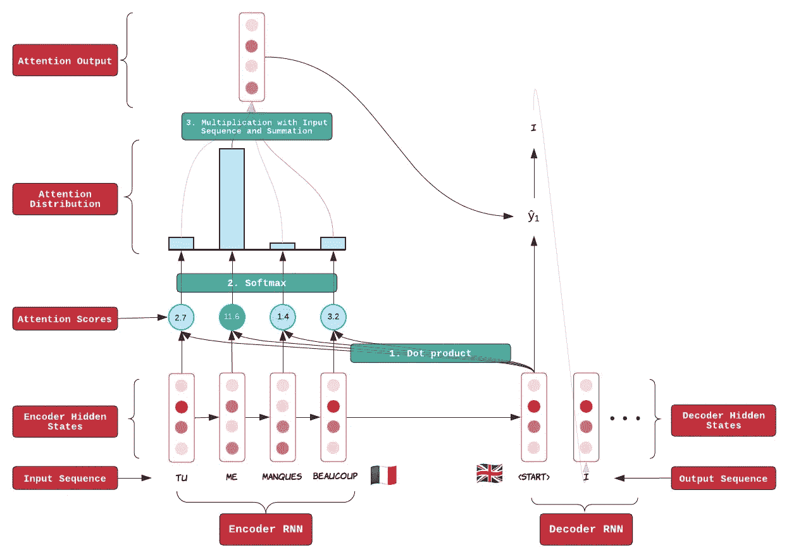
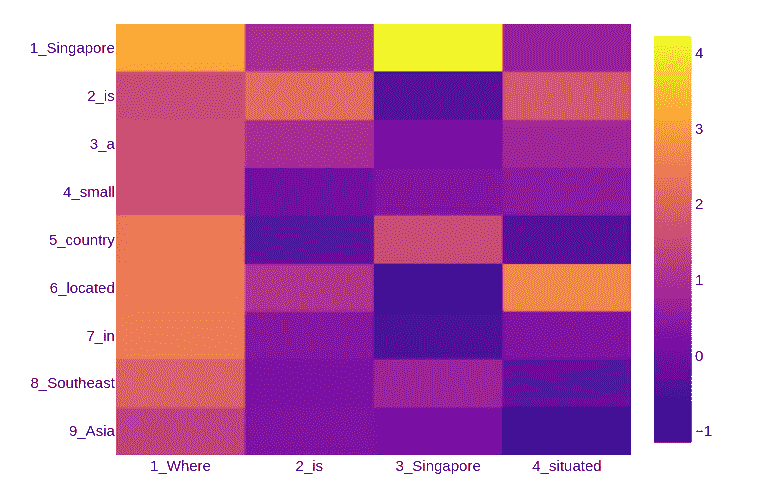
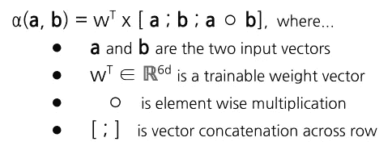
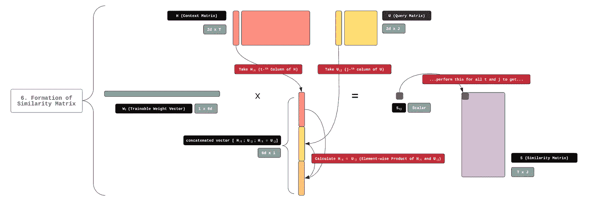
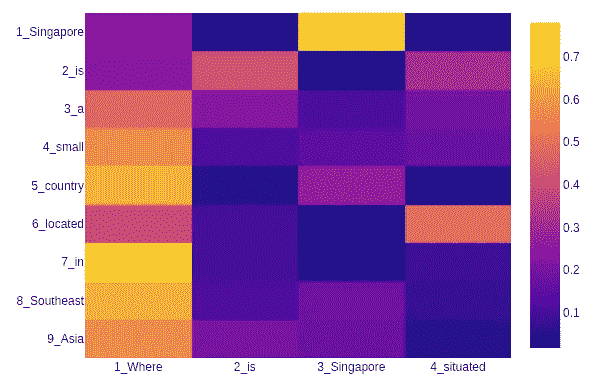
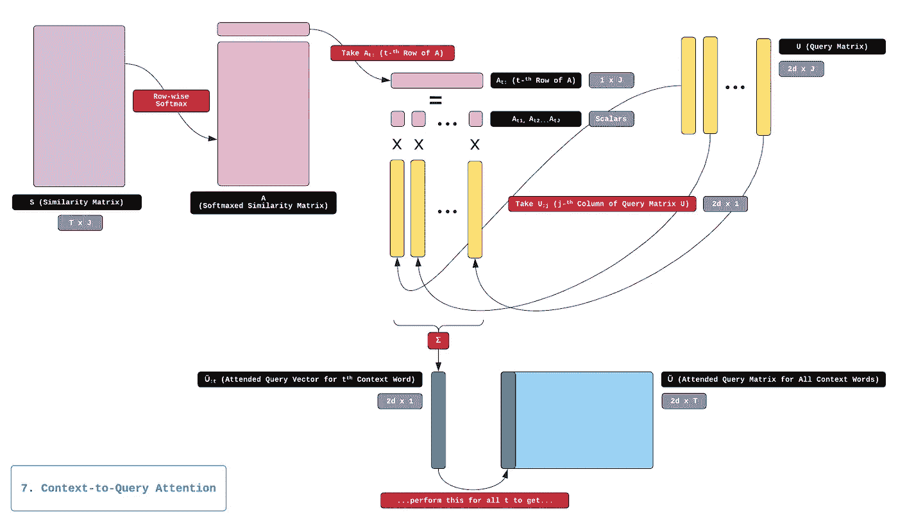
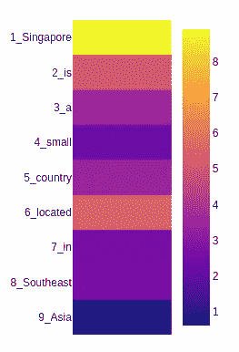
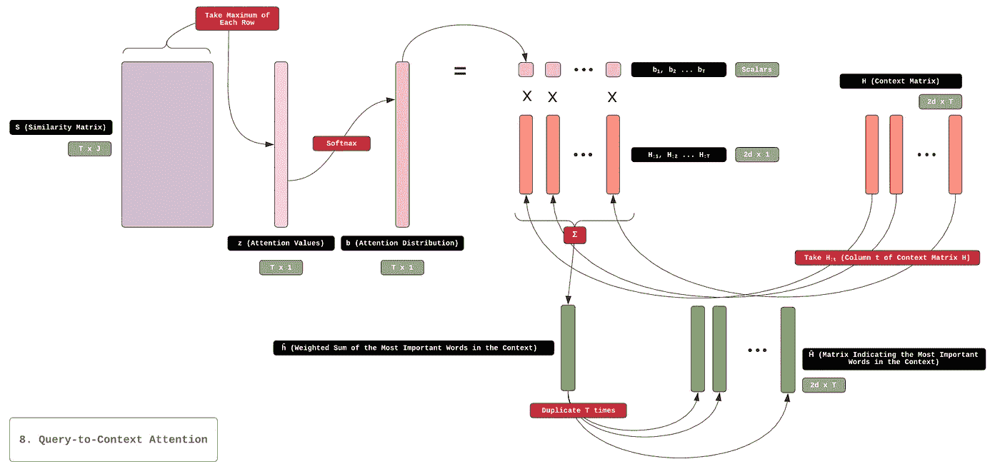
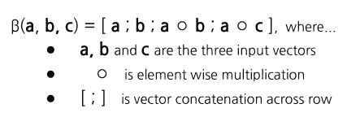

# Seq2Seq 和 BiDAF 中的注意机制——图解指南

> 原文：<https://towardsdatascience.com/the-definitive-guide-to-bidaf-part-3-attention-92352bbdcb07?source=collection_archive---------5----------------------->

## BiDAF 的权威指南——第 3 部分，共 4 部分

## 序列对序列(seq2seq)和**双向注意流(BiDAF)是有影响力的自然语言处理模型。这些模型利用了一种叫做“注意力”的技术，这种技术涉及到两个序列的比较。在这篇文章中，我解释了在这两个模型中注意力机制是如何工作的。**

T 他的这篇文章是一系列四篇文章中的第三篇，旨在说明 [**双向注意力流(BiDAF)**](https://arxiv.org/abs/1611.01603)**一种流行的问答机器学习模型(Q & A)的工作原理。**

**概括地说，BiDAF 是一个*封闭领域，抽取的* Q & A 模型。这意味着为了能够回答一个**查询**，BiDAF 需要查阅一个附带的文本，该文本包含回答查询所需的信息。这个附带的文本被称为**上下文。** BiDAF 的工作方式是提取上下文中最能回答查询的子串——这就是我们所说的对查询的**回答** 。我有意将“查询”、“上下文”和“回答”这几个词大写，以表明我是在用它们的专业技术能力来使用它们。**

****

**An example of **Context, Query,** and **Answer.** Notice how the Answer can be found verbatim in the Context.**

**在本系列的第一篇文章中，我展示了 BiDAF 的高层次概述。在第二篇文章中，我谈到了 BiDAF 如何使用 3 个嵌入层来获得上下文和查询的向量表示。这些嵌入步骤的最终输出是两个矩阵— **H** (表示上下文中的单词)和 **U** (表示查询中的单词)。 **H** 和 **U** 是关注层的输入，其功能是组合它们的信息内容。**

**这些注意力层是 BiDAF 的核心组成部分，使其区别于早期的模型，并使其能够在团队排行榜中获得高分。关注层的工作方式将是本文的重点。让我们开始吧！**

# ****注意力机制的概念介绍****

**在深入 BiDAF 中使用的注意机制的细节之前，我们应该先了解一下什么是注意。注意力于 2016 年首次作为[序列到序列](https://arxiv.org/abs/1409.0473) (seq2seq)模型的一部分引入。**顾名思义，seq2seq 是一个神经网络模型，其目的是将一个序列转换成另一个序列。**seq 2 seq 的一个应用示例是将🇫🇷法语句子翻译成英语🇬🇧句子，如下所示:**

****

**A sample translation task for seq2seq model.**

**seq2seq 模型由两个递归神经网络(rnn)组成:**

*   **第一个 RNN 称为*“编码器”*，负责理解输入序列(在我们的例子中，是一个法语句子)，并将其信息内容转换为固定大小的中间向量。**
*   **第二个 RNN 称为*“解码器”*，然后使用这个中间向量生成一个输出序列(在我们的例子中，是法语句子的英语翻译)。**

****在整合注意机制之前，seq2seq 模型只能处理短序列。**出现这种限制是因为“普通”seq2seq 模型只能将有限数量的信息放入中间向量，并且在此过程中会丢失一些信息内容。**

**这种情况类似于试图翻译一本法语书，首先阅读整本书，记忆其内容，然后根据记忆将其翻译成英语。你可以想象，这样的尝试注定要失败——我们可怜的译者在开始写英文翻译的时候会忘记这本书的大部分内容！**

> **注意力机制就是为解决这一信息瓶颈而开发的。注意力的核心思想是，在解码过程的每一步，我们都要直接连接到编码器的特定部分。**

**在我们的法语-英语翻译任务的上下文中，这意味着在 e **时刻，我们的模型将生成下一个英语单词，它将只关注输入法语句子的最相关部分。****

**从概念上讲，seq2seq 翻译模型的工作原理就像普通的人类翻译人员翻译法语文本一样。他会读法语文章的第一段，然后翻译成英语，接着读第二段，然后翻译这一段，等等。通过这样做，他不必把这本书的全部内容都记在脑子里，也不必冒忘记大部分内容的风险。**

# **注意在序列对序列模型中的实现**

**实际上，我们可以通过执行下图中描述的以下三个步骤，在 seq2seq 模型中包含一个注意机制:**

****

**Attention mechanism in seq2seq**

## ****1。序列的比较和注意力分数的计算****

***在解码过程中的每个时间步，我们将比较解码器隐藏状态和所有编码器隐藏状态。* 这种比较可以使用任何函数来完成，该函数采用两个向量并输出反映它们相似性的标量。这种函数中最简单的是一个简单的点积。相似性函数的标量输出被称为一个 ***“注意力得分”；*** 这些注意力得分用蓝色圆圈表示🔘在上图中。**

## ****2。注意力得分到注意力分布的转换****

***然后我们取所有这些注意力分数的最大值。***soft max 函数将这些注意力分数归一化成一个概率分布(一组加起来等于 1 的数)。这种概率分布称为****注意力分布***；它表示输入序列中与当前解码过程最相关的部分。*****

*****上图中的蓝条显示了注意力的分布。我们看到，第二个🇫🇷法语单词对应的杠，“ *me”，*最高；这是因为这个单词在🇬🇧英语中被翻译成“I”，这是我们输出序列中的第一个单词。*****

## *******3。将注意力分布与编码器隐藏状态相乘得到注意力输出*******

******然后，我们将注意力分布的每个元素与其对应的编码器隐藏状态相乘，并将所有这些乘积相加，以产生称为* ***“注意力输出”的单个向量。*** 你可以把注意力输出看成是对输入序列的选择性总结。注意力输出将成为下一个解码步骤的输入。*****

*****尽管上述三个注意步骤首先应用于 seq2seq，但它们也适用于其他应用程序。正如我们将在后面看到的，BiDAF 在实现注意力时使用了相同的三个步骤，尽管有一些小的修改。*****

*****通过对 seq2seq 中的注意力机制及其实现的快速概述，我们现在可以看到这个概念是如何在 BiDAF 中应用的。这是 parti！*****

# *******第六步。相似矩阵的形成*******

*****只是为了提醒您我们在[上一篇文章](https://medium.com/@meraldo.antonio/the-definitive-guide-to-bidaf-part-2-word-embedding-character-embedding-and-contextual-c151fc4f05bb)中停止的地方——我们的最后一步(步骤 5)是一个上下文嵌入步骤，它产生两个输出矩阵: **H** 用于上下文，而 **U** 用于查询。我们关注步骤(步骤 6 到 9)的首要目标是将来自 **H** 和 **U** 的信息融合在一起，以创建上下文的几个矩阵表示，其中也包含来自查询的信息。*****

********我们的第六步——第一个与注意力相关的步骤——是形成所谓的相似性矩阵* S *。*** **S** 是一个高瘦矩阵，维数为 **T** -by- **J** (上下文中的字数除以查询中的字数)。*****

*****相似性矩阵 **S** 的生成对应于上述 seq2seq 注意机制中的第一步。它需要对 **H** 中的每一列和 **U** 中的每一列应用比较函数。*矩阵* **的行**和列* **j** *中的值代表* **S** *的* **t** *第个上下文词与* **j** *第个查询词的相似度。*********

****让我们来看一个相似性矩阵的例子。假设我们有这样一个查询/上下文对:****

*   ******语境** : *“新加坡是位于东南亚的一个小国。”* ( **T** = 9)****
*   ******查询** : *“新加坡位于哪里？”* ( **J** = 4)****

****从上述查询/上下文对产生的相似性矩阵 **S** 如下所示:****

********

****An example of similarity matrix **S******

****我们可以从上面的矩阵 **S** 中得出一些观察结果:****

*   ****如我们所料，矩阵的维度为 9 乘 4，9 是上下文的长度( **T** ) )，4 是查询的长度( **J** )。****
*   ****第 1 行第 3 列中的单元格包含相对较高的值，如其亮黄色所示。这意味着与该坐标相关联的查询单词和上下文单词彼此高度相似。这些单词结果是完全相同的单词——“新加坡”——因此它们的向量表示非常相似是有道理的。****
*   ****仅仅因为一个上下文单词和一个查询单词是相同的，并不一定意味着它们的向量表示非常相似！查看第 2 行第 2 列的单元格—该单元格对上下文单词“is”和相同的查询单词“is”的相似性进行编码。然而，它的价值并没有上面提到的“新加坡”那么高。这是因为这些向量表示也包含了来自周围短语的信息。这种语境贡献对于“是”这样的小系词尤其重要。****
*   ******另一方面，我们可以看到，语义和语法意义相近的两个截然不同的词，如“坐落”和“位于”的相似度值相对较高。**这要归功于我们的单词和字符嵌入层，它可以生成非常准确地反映单词含义的矢量表示。****

****现在让我告诉你我们如何计算 **S** 中的值。*用于执行该计算的比较函数称为* **α** *。* **α** 比 seq2seq 中使用的点积更复杂；以下是 **α** 的方程式:****

********

****因为函数 **α** 包含一个行向量和一个大小相等的列向量的乘积，所以它总是返回一个标量。****

****下图显示了此步骤中执行的所有矩阵运算。****

********

****Step 6\. Using the similarity function **α**, we combine context matrix **H** and query matrix **U** to form similarity matrix **S.******

# ******步骤 7。上下文查询**关注 **(C2Q)******

****相似性矩阵 **S** 用作下两个步骤的输入:上下文到查询注意(C2Q)和查询到上下文注意(Q2C)。****

> *******在这一节，我们将重点介绍 C2Q。这一步的目标是找到哪些查询单词与每个上下文单词最相关。*******

****执行 C2Q 类似于执行 seq2seq 注意的第二步和第三步。首先，我们使用 **S** 中的标量值来计算注意力分布。这是通过取 **S** 的行向 softmax 来完成的。结果是另一个矩阵。这个矩阵在 BiDAF 论文中没有明确命名，但是让我们称它为矩阵 **A** 。****

****矩阵 **A** ，其维数与 **S** 相同，指示哪些查询词与每个上下文词最相关。让我们来看一个 **A** 的例子:****

********

****An example of matrix **A**, the row-wise softmaxed version of **S******

****通过观察上面的热图，我们可以得出以下结论:****

*   ****语义相似性对相关性有很大的贡献。我们看到，对于上下文单词[“新加坡”、“是”、“位于”]，最相关的查询单词是[“新加坡”、“是”、“位于”]。这些词也有很强的语义相似性。****
*   ******语境词“理解”查询词所请求的信息。**我们看到，查询词“Where”是上下文词[“a”、“small”、“country”、“in”、“Southeast”、“Asia”]-与地理位置相关的词的最相关查询词。****

****然后我们取 **A** 的每一行，得到一个在的注意力分布**，它的维度为 1 乘 **J** 。 **At:** *反映每个查询词对于第 t 个上下文词的相对重要性。*******

****然后，我们计算查询矩阵 **U** 相对于注意力分布**中每个元素的加权和。**这一步的结果就是名为**ũ**的注意力输出矩阵，它是一个 **2d** -by- **T** 矩阵。****

> ******ũ**，就像 **H** 一样，是上下文的矩阵表示。然而，**ũ**包含了与 **H** 不同的信息！ **H** 封装了每个上下文单词的语义、句法和上下文含义，**ũ**封装了关于每个查询单词与每个上下文单词的相关性的信息。****

****从相似矩阵 **S** 和查询矩阵 **U** 生成**ũ**的整个过程如下图所示:****

********

****Step 7\. Context-to-Query attention****

# ******第八步。查询到上下文(Q2C)注意******

> ****下一步是 Q2C，它和 C2Q 一样也是从相似矩阵 **S** 开始的。 ***在这一步，我们的目标是找到哪个上下文单词与查询单词最相似，因此对于回答查询是至关重要的。*******

****我们首先取相似性矩阵 **S** 的行的最大值，以获得列向量。这个列向量在论文中没有明确命名，姑且称之为 **z** 。****

****现在让我们后退一步，想想 **z** 象征着什么。记住，我们的相似度矩阵 **S** 记录了每个上下文单词和每个查询单词之间的相似度。让我们再来看看我们上面创建的例子 **S** 。****

********

****Similarity matrix **S******

****现在让我们把注意力集中到这个矩阵的第四行，它对应于上下文单词“small”。可以看到，在这一行中没有任何明亮的细胞！这表示查询中没有与上下文单词“small”意思相似的单词。当我们取这一行的最大值时，得到的最大值将接近于零。****

****与单词“Singapore”和“situated”形成对比，在它们的行中，我们确实找到了至少一个明亮的单元格，表明存在与这些单词相似的查询单词。当我们取这两行中的最大值时，这两行的向量 **z** 中的对应值也会相对较高。****

****以下是我们的示例中获得的 **z** :****

********

****在 Q2C， **z** 中的值服务于我们的注意力值。我们在 **z** 上应用 softmax 来得到一个叫做 **b** 的注意力分布。然后我们使用 **b** 对上下文矩阵 **H.** 进行加权求和，得到的注意力输出是一个 **2d** 乘 1 的列向量，称为 **ĥ.******

> ****Q2C 的最后一步是复制粘贴 **ĥ** T 次，并将这些副本组合成一个**2d**by-**t**矩阵，称为**ĥ.ĥ是上下文的另一种表示，它封装了关于查询的上下文中最重要的单词的信息。******

****从相似矩阵 **S** 和上下文矩阵 **H** 生成**ĥ**的整个过程描述如下:****

********

****Step 8\. Query-to-Context attention****

# ******第九步。******

****然后将步骤 5、7 和 8 中产生的矩阵组合成一个大矩阵 **G.** 为了刷新你的记忆，这三个矩阵如下:****

*   ******H** :封装*语境词的语义、句法和语境意义的原始语境矩阵。*****
*   ******ũ**:封装了*每个查询单词与每个上下文单词的相关性的上下文矩阵。*****
*   ******ĥ**:上下文矩阵，它封装了关于查询的上下文中最重要的单词的信息*。*****

****这三个矩阵具有相同的维数—**2d**—by—**t .******

****这个“大合并”，很遗憾，并不是这三个矩阵垂直叠加那么简单！这里，我们使用了另一个名为 **β** 的自定义函数。下面是 **β** 的方程式:****

********

****我们通过 **G:t** = β( **H** :t，**ũ**:t，**ĥ**:t)来定义我们的大合并矩阵 **G** ，其中 **G:t** 是对应于第 t 个上下文单词的 **G** 的第 t 个列向量。 **G** 的尺寸为 **8d** -by- **T.******

****从 **H** 、**ũ**和**ĥ**生成 **G** 的全过程如下图所示:****

********

****Step 9\. Merging of the three Context matrices **H**, **Ũ** and **Ĥ** to form **G******

****巨型矩阵 **G** 包含了 **H** 、**ũ**和**ĥ.中的所有信息** *也就是说，你可以把* ***G*** *中的每一列向量想象成一个上下文词的向量表示，它“意识到”查询的存在，并且已经从中合并了相关信息。*****

****这就是 BiDAF 中注意力层的全部内容！我知道这可能很难理解，尤其是涉及到无数的符号和矩阵运算。如果你真的想详细研究 BiDAF，我建议你打印出下面的术语表以及上面所有的图表，并把它们放在一起研究。****

****在[下一篇文章](/modeling-and-output-layers-in-bidaf-an-illustrated-guide-with-minions-f2e101a10d83)中，这将是该系列的最后一篇文章，我将讨论 **G** 如何作为建模和输出层的输入。输出层将给出每个上下文单词被包含在答案范围中的概率。希望能在那篇[上篇](/modeling-and-output-layers-in-bidaf-an-illustrated-guide-with-minions-f2e101a10d83)看到你！****

# ****词汇表****

*   ******上下文:**包含查询答案的查询附带文本****
*   ******查询:**模型应该给出答案的问题****
*   ******答案:**包含可以回答查询的信息的上下文的子字符串。这个子串将由模型提取出来。****
*   ******T** :上下文中的字数****
*   ******J** :查询中的字数****
*   ******U** :封装了查询词的语义、句法、上下文含义的原始上下文矩阵。 **U** 的尺寸为 **2d** -by- **J******
*   ******H** :封装语境词的语义、句法、语境意义的原始语境矩阵。 **H** 的尺寸为 **2d** 乘 **T******
*   ******S** :相似度矩阵，记录每个上下文词和每个查询词的相似度。 **S** 的维度为 **T** -by- **J** (上下文中的字数除以查询中的字数)。****
*   ******α :** 用于获取 **S.** 中相似度值的比较函数****
*   ******A :** 由 **A** 的逐行 softmax 产生的矩阵，指示哪些查询单词与每个上下文单词最相关。 **A** 的尺寸为 **T** -by- **J.******
*   ******z :** 取相似矩阵 **S. z** 的跨行最大值得到的列向量的维数为**T**-乘-1。****
*   ******b :** 对 **z. b** 应用 softmax 得到的注意力分布向量的维数为**T**-1。****
*   ******ĥ :** 将 **b** 乘以上下文矩阵 **H 得到的注意力输出ĥ** 的维数为**2d**-1。****
*   ******ũ**:上下文矩阵，封装了每个查询词与每个上下文词的相关性。**ũ**的尺寸为 **2d** -by- **T.******
*   ******ĥ**:上下文矩阵，封装了关于查询的上下文中最重要的单词的信息。**ĥ**的尺寸为 **2d** -by- **T.******
*   ******G** :一个大的、 **8d** -by- **T** 矩阵，包含 **H** 、**ũ**和**ĥ.中的所有信息 G** 是建模层的输入。****
*   ******β :** 一个自定义串联函数，用于构建 **G******

# ****参考****

****[1] [用于机器理解的双向注意力流。阿尔，2017)](https://arxiv.org/abs/1611.01603)****

****[[2]神经机器翻译通过共同学习对齐和翻译(Bahdanau *et。艾尔*，2015)](https://arxiv.org/abs/1409.0473)****

****除非另有说明，所有图片均由我创作/设计。****

****如果你对这篇文章有任何意见或者想联系我，请随时通过 LinkedIn 给我发一个联系方式。此外，如果你能通过我的推荐链接支持我成为一名中级会员，我将非常感激。作为一名会员，你可以阅读我所有关于数据科学和个人发展的文章，并可以完全访问所有媒体上的故事。****