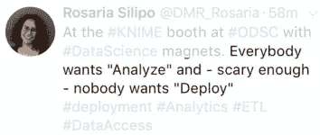

# 部署的痛苦

> 原文：<https://towardsdatascience.com/the-deployment-pain-cb1dd2a471b2?source=collection_archive---------13----------------------->

## 部署焦虑的可能原因

本文与帕特里克·斯拉文伯格合著

The data science cycle in magnets: data access, data processing, model training, and deployment

2017 年 10 月，我在 [ODSC 伦敦会议](https://odsc.com/london)上经营 [KNIME](http://www.knime.com) 展台。在展位上，我们有通常的会议材料要分发:信息丰富的文件，各种小工具，甚至瑞士巧克力。在这些小工具中，我们有磁铁，更具体地说，四种类型的磁铁代表数据分析抽象工作流中的抽象节点:*读取*、*转换*、*分析*，以及*部署*。这些磁铁很受欢迎。与会者会来玩它们，把它们组装成工作流程，或者把一些带回家放在冰箱里。

我记得大多数人被磁瓦*吸引去分析*，而同样的大多数人在*部署*前皱着眉头耸耸肩。我甚至清楚地记得一个与会者，当被提供*展开*瓷砖时，他退缩了，并开玩笑地(？)语气声明:“我不希望*部署*。身体上很痛”。我非常惊讶(我甚至发了一条关于这件事的微博)。一个据称花了相当多时间来构建和完善机器学习模型的数据科学家，怎么可能不想部署它们，将它们发布到现实世界中呢？那是因为部署确实是一件痛苦的事情！

The pain of deployment is all in this tweet

为什么部署这么难？这仅仅是对一些数据科学项目自然消亡的失望吗？还是真的有一些数据科学家无法克服的额外障碍？当然，我对这个话题有自己的看法，但我可能会因自己的态度和过去的经历而有所偏颇。因此，我和 Patrick Slavenburgh 在 LinkedIn 上询问了我们的同事关于数据科学项目中部署失败的最常见原因。本文旨在总结答案。

1.  **婴儿死亡率**

众所周知，一个数据科学项目包括几个主要的标准阶段，例如在 [CRISP-DM](https://en.wikipedia.org/wiki/Cross-industry_standard_process_for_data_mining) 循环中总结的:业务案例理解；数据探索；数据清理和数据准备；模型训练、模型优化和模型测试；最后，如果前几个阶段一切顺利，就部署。“如果一切顺利”的意思是:

*   如果我们清楚地理解了业务规范
*   如果数据质量对于我们的任务来说足够好
*   如果我们能够正确地清理和准备数据
*   如果我们训练、优化并测试了一个足够好的模型

如果所有这些都成功了，我们就可以开始部署了。

部署阶段位于食物链的末端。它收集该过程的前几个阶段产生的所有垃圾。也就是说，在部署阶段，所有先前创建的和未检测到的问题都可能出现，从而扼杀整个项目。这是部署失败的首要原因:婴儿死亡率。婴儿死亡是由于在之前的任何阶段中未被发现的深层问题。

[例如，Kenneth Longo](https://www.linkedin.com/in/kennethlongo) 报告称，对原始业务问题的误解是数据科学项目在部署过程中失败的最常见原因之一。肯尼斯这样描述这个问题:“机器学习模型最终回答的问题与最初的业务问题不一致，或者业务问题在开发过程中发生了变化。”

有时候，尽管尽了最大努力，模特的表现还是低于预期。在这种情况下，要么期望值太高(数据科学被当作魔术出售)，要么用于训练模型的数据质量不够好(训练集可能太小和/或没有覆盖所有可能的事件)。有时在数据探索阶段可能会发现这个数据质量问题，例如一些统计数据探索，但有时这个问题会被忽略，直到部署前才变得清晰。

由于婴儿死亡率而导致的项目部署失败令人失望，但实际上这本身并不是部署失败。它只是发生在部署阶段。我不认为这是部署痛苦的原因，而是部署阶段令人失望的后期发现。

**2。缺少 IT 技能**

部署需要一些 IT 技能。无论您需要将最终结果写入数据库、计划每 X 小时执行一次作业、使用不同的连接参数从远程服务器运行应用程序，还是作为 REST 服务运行应用程序，您都需要 it 部门的帮助，至少需要获得服务器 URI 和访问资源的正确凭证。根据我的经验，这是部署的第二个阻碍因素:数据科学团队和 IT 部门之间缺少协作。

IT 部门的任务是保护数据。数据科学组的任务是访问相同的数据。这两个相反的任务可能不会促成最好的合作。

在这种情况下，如果数据科学团队中的一个团队获得了必要的 it 技能来与 IT 部门沟通，并负责来自该团队并进入生产的所有(部分)应用程序，例如在专用服务器上，这可能会有所帮助。

在需要极度保护原始数据的情况下，专用服务器可以托管数据科学应用程序的所有中间和最终结果，甚至可能是原始数据的副本。通过这种方式，一般 IT 和数据科学 IT 几乎完全分离，数据科学组的 IT 团队可以全面负责机器和应用程序。

当然，选择正确的工具在远程服务器上部署、调度和执行您的应用程序可能会节省您大量的时间、精力和与 IT 部门无休止的讨论。有许多工具，允许服务器部署、REST 服务部署、调度和最终在 web 浏览器上显示仪表板。选一个，最符合你需求和群体技能的，但是认真选一个！把一个机器学习模型训练到 99.99%的准确率，这是一个很大的学术成就。然而，将同样的模型投入到现实生活中才能让它达到目的。这是一个不容低估的挑战。因此，从合适的工具中获得所有可能的帮助！

**3。真实世界的生活比实验室的生活更加复杂**

现实生活是一片丛林，把你的预测器扔在那里意味着要面对治理规则和数据隐私问题的丛林，而这些在模型训练中是没有考虑到的。

您的预测器应用程序必须随时对所做的决策负责。这意味着现实世界中的所有预测都必须在规定的时间内(通常是法律规定的时间内)进行存储、可追踪和存档。

许多国家，尤其是欧洲，都有关于数据隐私的严格法律。通常，在最初的头脑风暴中看起来不错的想法与你可以用单个人的数据做什么的法律现实相冲突。基于大量数据训练的模型通常不会显示可以追溯到原始数据所有者的信息。然而，如果训练集太小，或者如果应用程序被设计为跟踪每个人，这可能会变成一个法律问题。

[Lakshmi Krishnamurthy](https://www.linkedin.com/in/lakshmikrishnamurthyuae/) 指出“在实验室约束条件下，使用训练数据进行构建、调优和性能测试是可管理的；但是，集成“实时”数据和质量、治理、企业架构约束的人员问题，以及最后但同样重要的是，让客户接受您的模型是/应该做什么并不总是“可预测的”。这就是挑战所在！!"

同样， [Sam Taha](https://www.linkedin.com/in/samtaha) 认为，与公司内部现有数据管道的整合可能会比最初想象的更加困难。从具有理想输入和管道的 POC 到在整个解决方案空间中工作的解决方案，需要与业务和上游系统紧密配合，以便模型成为生产“产品”的一部分。

[Paige Roberts](https://www.linkedin.com/in/robertspaige/) 也同意这一观点，并表示“未能考虑到为模型创建生产数据管道所涉及的数据工程工作是导致部署失误的另一个原因”。

**4。数据泄漏**

Ruben Ten Cate 将数据泄露列为部署的另一大障碍。数据泄漏确实是一个严重的问题，在训练期间并不总是容易检测到。当训练集中的数据包含现实世界中不可用的特征时，例如在要分类的事件之后或之后收集的特征，就会发生这种情况。

引用鲁本的话:“再加上一个部署失误的原因:一个‘数据泄露’。不是隐私泄露意义上的泄漏，而是数据泄漏到训练数据中，这在操作环境中是不存在的。例如:通常客户服务互动越多，客户流失的机会就越大。这是一个有效的相关性，并且是不满意的客户经常打电话给客户服务来投诉或实际停止他们的合同(流失)的事实的结果。基于这一特征的模型的问题是，在现实生活中，我们希望在客户变得不高兴并呼叫客户支持(以流失)之前预测流失的客户，因此更高的交互率尚未发生，也不存在于运营环境中。因此，该模型表现不佳，并在生产中增加价值之前被丢弃。”

数据泄漏的一个经典例子是当我们试图预测旅行延迟(包括到达目的地的延迟)时。当然，如果交通工具延迟了 x 分钟，这就被定义为行程延迟。但是我们怎么能在到达之前知道到达延迟呢？还有更多这样的例子，随着事后知识变得不言而喻，但在培训期间却不那么清晰。清楚地命名和描述数据列可能有助于防止这种问题。

**5。设计思维、精益创业和敏捷(或缺乏)**

帕特里克·斯拉文伯格(Patrick slaven burg):软件开发——以及越来越多的其他团队营销&销售——转向了像设计冲刺或 Scrum 这样的迭代过程。数据科学中的敏捷过程仍然是相当新的，但越来越受欢迎。

然而，用户故事不是静态的。更有问题的是，企业通常很难明确表达他们希望从人工智能中获得哪些商业价值。并且哪个具有最高优先级。常年产品经理的困境:“我们应该构建这个吗？”以及“为什么？”。

敏捷和设计思维可能不是典型的数据科学家的背景——相反，他们使用更长期的“科学方法”。最终，他们可能解决了这个问题。但是这个问题不再符合业务需求。或者根本就不存在。

**6。公司政治**

最后， [Patrick Slavenburg](https://www.linkedin.com/in/patrick-slavenburg/) 报告了“组织问题——以及部落主义——作为部署的一个问题”。这不仅仅是我们在呆伯特的漫画中常见的办公室政治，不幸的是，在现实生活中也是如此。

也是 OT 和 It 之间常年的中国墙。无论是业务部门还是运营中的主题专家:都将 IT 视为满足其需求的促成因素。这也意味着，如果通过它引入数据科学，它将停留在其中，永远不会被广泛采用。而我们需要的是公民数据科学家来推动这种适应。

另一个例子是 IT 部门和数据科学组之间缺乏协作，如本文前面所述(在关于缺少 IT 技能的部分)。在最糟糕的情况下，这甚至可能演变成一场丑陋而不愉快的战争。

管理层的支持也很难赢得。这有时与管理层对数据科学应用的期望过高有关。或者相反:那台机器永远代替不了人类。有时很难找到中间立场。

**结论**

没错，部署伤人。我在这里列出了一些最常见的导致部署困难的原因。不要低估这些问题中的任何一个，选择一个简化您生活的工具，并从项目开始就投入足够的时间、资源、技能、预算和早期规划，就可以治愈痛苦。

如果你想阅读 LinkedIn 讨论中的原始评论，你可以在这两个部分找到它们:

[https://www . LinkedIn . com/feed/update/activity:6499327120198627329/](https://www.linkedin.com/feed/update/activity:6499327120198627329/)

【https://www . LinkedIn . com/feed/update/urn:李:活动:6499534506897211392

我希望我没有扼杀实施和部署数据科学解决方案的热情。我的目标实际上是让你意识到陷阱，而不是吓你。我希望你们能珍惜我们的经验，继续部署更多的数据科学应用。