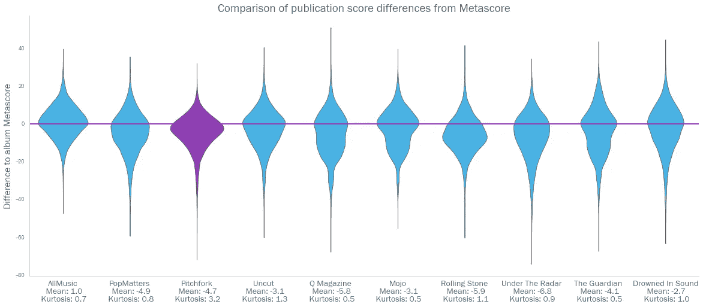

# 魔鬼的音乐

> 原文：<https://towardsdatascience.com/the-devils-music-622d29028c0b?source=collection_archive---------21----------------------->

## [数字音乐](https://towardsdatascience.com/tagged/music-by-numbers)

## Pitchfork 真的是互联网最苛刻的乐评人吗？

Music fans celebrating an above-average Pitchfork review (image: Pitchfork)

> “音乐经历了令人筋疲力尽的 7，000 年，被太多的中速音乐所拖累，最著名的是弗朗茨·李斯特的《降 A 大调第三乐章》和 90 年代另类摇滚组合 Semisonic 的《关门时间》……最终，尽管音乐有时会很精彩，但整个媒体都成了人行道的衍生物……”

[Pitchfork 对音乐](https://entertainment.theonion.com/pitchfork-gives-music-6-8-1819569318)(正如《洋葱》所想象的)的评论如是说，该评论给“通过时间表达的由声音和沉默组成的创造性表达模式”打了一个普通的 6.8 分(满分 10 分)。

[Pitchfork](https://pitchfork.com/) 成立于 21 世纪中期，专门报道美国中西部的独立音乐和地下音乐。从卑微的开始，它发展了重要的文化资本。它现在拥有近 25 万的每日读者，并在许多乐队成为家喻户晓的名字的早期成功中发挥了不小的作用(Arcade Fire 的首张 LP“葬礼”在 Pitchfork 的[热情洋溢的评论](https://pitchfork.com/reviews/albums/452-funeral/)之后短暂绝版)。

然而，正如《洋葱》的恶搞所暗示的那样，这种毫无保留的赞美被认为是反常的。这位自称“音乐界最值得信赖的声音”的人一方面给予了什么，另一方面肯定也能得到什么(我的[自己的](https://pitchfork.com/reviews/albums/6586-a-fever-you-cant-sweat-out/) [最喜欢的](https://pitchfork.com/reviews/albums/14611-man-alive/) [乐队](https://pitchfork.com/reviews/albums/14138-omni/)中的许多乐队这些年来都受到了猛烈抨击)。

Pitchfork 经常被指责为为了吸引注意力而故意挑衅和逆势评论。Pitchfork 的十进制评分系统进一步推动了对自命不凡的指责(由该网站通常冗长、离题的风格引发)，这意味着它在 0-100 的范围内给专辑评分，而不是大多数传统评论家部署的简单的 5 星评级。人们常常会觉得，这仅仅是为了更精确地记录下你最喜欢的专辑。

当然，要找出这些指控是否合理，看一下数据是有意义的。

# 正在引入数据…

我们将用于此分析的数据集是通过抓取评论聚合网站 Metacritic 生成的(这一过程在之前的博客中有所介绍)。

完成此操作后，我们获得了大约 202，000 个专辑评论的以下信息:

*   **艺术家:**我们的数据集中有 8415 位独特的艺术家
*   **专辑名称:**共有 17727 张独特的专辑(注意——只有至少有四个评论的专辑才会被包括在内，以确保更公平的跨出版物比较)
*   这张专辑的发行日期:这些数据涵盖了从 1999 年 2 月到 2019 年 7 月二十年的在线评论
*   **专辑的风格:**共有 689 种独特的风格，有些专辑的标签多达 5 或 6 种
*   **撰写评论的出版物:**数据集中有 131 种不同的出版物
*   **出版物的审查分数:**标准化为满分为 100 分的整数分
*   **该专辑的‘Metascore’**

“ [Metascore](https://www.metacritic.com/about-metascores) ”是一张专辑的不同评论家评论的加权平均。虽然 Metacritic 用来创建 Metascore 的确切方法尚不清楚，但 Metacritic 建议“根据[出版物的]质量和整体地位”给予额外的权重。然后将这些分数标准化(类似于大学里的“曲线评分”),以防止分数聚集在一起。无论如何，Metascore 是衡量任何一张专辑“真实”质量的最佳标准。

# 乍一看…

Pitchfork 是过去二十年中最多产的音乐出版物之一。只有另外两个在数据集中有更多的评论，自 2018 年以来，Pitchfork 每月发布的评论比任何人都多，除了 AllMusic。

The trends here are interesting in and of themselves — what causes this jump around 2011, and the fall in the following years? This is something we will investigate in a future blog. Note — we use a rolling average here since album releases are highly seasonal, with very few albums being released in December.

有一个非常简单的方法来衡量一个出版物的苛刻程度——取每个出版物的评论分数的平均值，并对它们进行排名。这样做，我们看到有许多比 Pitchfork 更严厉的批评，Pitchfork 只是刮到顶部(或底部？)三十种出版物。

当然，这种分析是有缺陷的。我们已经看到出版物评论了不同数量的专辑——考虑到其目录的广度，Pitchfork 可能只是评论了更多好的专辑。因此，我们需要引入一个更强有力的衡量标准。

# **与 Metascore 的差异**

我们已经说过 Metascore 可能是衡量一张专辑真实质量的最好方法。因此，我们可以通过比较 Metascore 和个人评审分数来识别苛刻的评审。

我们来孤立一下 Pitchfork 的评论。我们可以根据相应的 Metascore 绘制每个评论的 Pitchfork 分数。Pitchfork 评论为“苛刻”的专辑因此低于紫色的“ *x=y* ”线。我们可以看到许多点落在这条线以下——事实上超过三分之二。

67% of Pitchfork’s scores are below the Metarating. 28% are above, and 5% are exactly the same.

我们可以将这个“苛刻”的概念归结为一个单一的 KPI——一个评审的“与 Metascore 的区别”。这很容易计算为两个数字之间的差异。在上面的图表中，它将作为点和紫色线之间的垂直距离给出。

因此，对于 Pitchfork 对小马驹乐队最新专辑的评论，与 Metascore 的差异将是 60 减去 78，即-18(看起来相当苛刻！)

The album’s metacritic summary, with Metascore

The same album’s Pitchfork review…

因此，出版物的“与 Metascores 的差异”越负面，我们就越能判断它的苛刻程度。如果我们绘制 Pitchfork 得分差异的直方图，我们会看到大多数差异都是负的(我们从上面的散点图中知道)。

平均而言，Pitchfork 的得分比我们预期的低了将近半颗星，考虑到它已经评论过的专辑的 Metascores。

如果你想知道哪些专辑可以在左边的长尾中找到，那么我们只能希望你不是北方州[的粉丝](https://pitchfork.com/reviews/albums/5841-dying-in-stereo/)

# 出版物之间的比较

“与 Metacritic 不同”KPI 的一个优点是，我们可以公平地比较不同的出版物。

如果我们将每个出版物的平均得分差异绘制到 Metascore 上，我们实际上看到 Pitchfork 看起来并不特别显著——特别是相对于具有类似数量的已发表评论的其他出版物。

许多处于苛刻和慷慨极端的出版物(即，在上述散布图的最左边和最右边)是小得多的关注点。最苛刻的三家(抽屉 B、精选、秃鹫)之间只发表了 318 条评论。最慷慨的往往是“一周记录”风格的专栏，从中我们可以期待高分。

如果我们分离出排名前三十的出版物(每个出版物在数据集中有超过 2000 条评论)，我们会看到只有六分之一的出版物的评论比 Metascores 建议的更慷慨——其中唯一特别慷慨的评论家是《娱乐周刊》(随你怎么说)。无论如何，根据这一标准，Pitchfork 的评论得分看起来并不特别显著。

# 这是峰度，笨蛋…

然而，如果我们超越每个出版物的平均分数差异，而是查看这些差异的*分布*，就会发现一些有趣的事情。如果我们要为一个出版物做直方图(就像我们在几段前为 Pitchfork 做的那样)，但是要并排比较多个分布，我们可以使用 Seaborn 的 [violinplot](https://seaborn.pydata.org/generated/seaborn.violinplot.html) 函数。下面，我们绘制了数据集中十个最多产出版物的分布图。

Each violin should be read like a ‘vertical’ distribution curve — the wider the violin is at a given point, the more reviews we have clustered at that point.

如果我们比较这些出版物的分数差异分布，Pitchfork 有一些突出的东西——分布的峰度。

[峰度](https://en.wikipedia.org/wiki/Kurtosis)是一种对分布“尾部”的度量，它告诉我们异常值有多极端。峰度公式的构建使得分布均值的一个标准差内的任何数据点贡献都非常小。因此，同时具有低标准差和长尾的分布可能具有高峰度。

事实上，在上面的图中查看 Pitchfork 的“小提琴”,我们看到它紧紧围绕着平均值(导致一个宽的小提琴，在波峰的两侧都有陡峭的斜坡)。它也有一个很长的负尾巴。

只有在雷达下，其分布范围内有更负的分数差异(他们给狼眼的“燃烧的头脑”打了一个大大的零分，对此，永远迟钝的 Pitchfork 给了高度[值得称赞的 8.0](https://pitchfork.com/reviews/albums/8730-burned-mind/))，然而他们的分数差异更加松散。

如果我们将所有出版物绘制成散点图，我们会看到 Pitchfork 在数据集中的所有评论家中拥有最高的峰度分数之一——当然是所有大标题中最高的。

# 那么，Pitchfork 是互联网上最苛刻的乐评人吗？

根据我们所看到的，似乎不是这样。在数据集中的主要出版物中，这个奖项可能会授予 Under The Radar，他在近 5000 篇评论中，平均得分低近 7 个百分点。

然而，关于 Pitchfork，我们*所能说的是，它实际上是相当一致的。它倾向于降低专辑的评分，但相对于其他类似规模的出版物来说，并没有高得离谱。事实上，在排名前三十的出版物中，Pitchfork 在 Metascore 的“半星”范围内拥有最高的评论分数。换句话说，它似乎很擅长判断一张专辑的“真实质量”。*

然而，Pitchfork 的评论评分包含少量重要的异常值(如'[死于立体声](https://pitchfork.com/reviews/albums/5841-dying-in-stereo/)'、[纽约鬼&花](https://pitchfork.com/reviews/albums/7342-nyc-ghosts-flowers/)'和'[两个违背自然](https://pitchfork.com/reviews/albums/7486-two-against-nature/)')，其峰度评分表明这些异常值比我们预期的更极端(当然也比大多数其他出版物更极端)。

所有这些都支持这样一种观点，即 Pitchfork 通常是一个值得信赖的音乐评论来源，但它有一种不必要的逆势行为来引起注意的习惯。

总而言之，我给 Pitchfork 打了 6.8 分。

> 这是我新的“[数字音乐](https://towardsdatascience.com/tagged/music-by-numbers)”专栏的第一篇博客，它将利用数据讲述现代音乐产业的故事。流派品味的变化如何影响节日？音乐新闻业的未来如何？制作《困难的第三张专辑》有人们想象的那么难吗？我很乐意听到对上述分析的任何评论，或者对数据集本身的任何想法。欢迎在下面留言，或者通过 [LinkedIn](https://www.linkedin.com/in/callum-ballard/) 联系我。