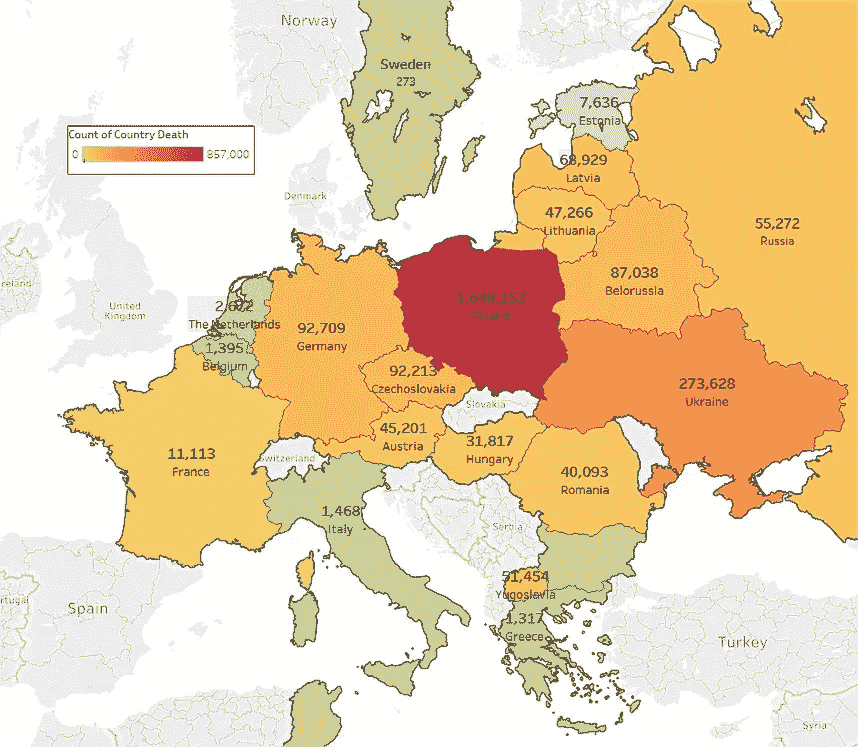
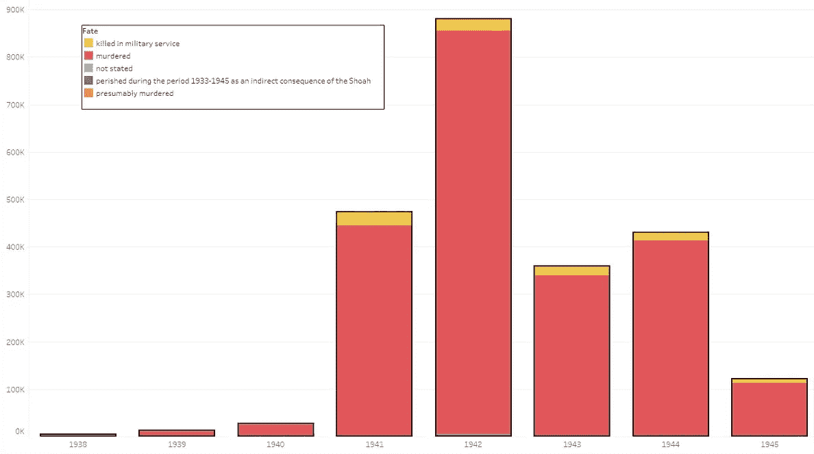
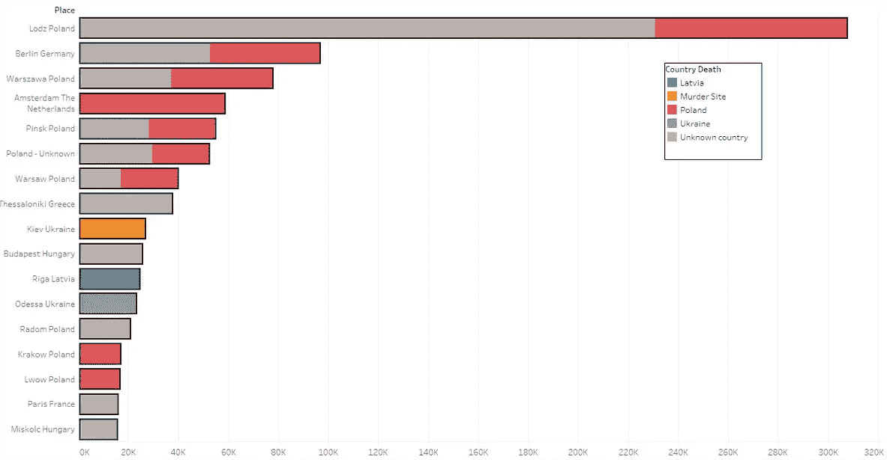

# 数字幸存者——大屠杀的分析视角

> 原文：<https://towardsdatascience.com/the-digital-survivors-dc3311cb9602?source=collection_archive---------25----------------------->

> *“很快，将没有幸存者讲述他们的故事，你的孩子将只能通过书籍和视频了解大屠杀”*

大约 18 年前，我的老师在给我们班放映了一部关于大屠杀幸存者的纪录片后说了这句话。

Photo by [Alessio Maffeis](https://unsplash.com/@maffeis?utm_source=medium&utm_medium=referral) on [Unsplash](https://unsplash.com?utm_source=medium&utm_medium=referral)

大屠杀，也被称为“Shoah”(希伯来语:השואה)，是第二次世界大战期间的一场种族灭绝，在这场种族灭绝中，纳粹德国在当地合作者的帮助下，有计划地屠杀了大约 600 万犹太人。

作为一个大屠杀幸存者的孙子和一个狂热的数据研究者，我对自己说，在当今的“数据科学”时代——大数据可以通过小努力找到——我可以通过简短的谷歌搜索找到一些关于大屠杀受害者的原始数据。

令人惊讶的是——我的谷歌搜索几乎一无所获。

我能找到的唯一重要的“大屠杀数据库”是“Yad Vashem”——世界大屠杀纪念中心，它包含数百万份记录，其中有大屠杀受害者的传记细节，这些记录是从 2004 年至今精心收集的。

尽管这个数据库是[公众可访问的](https://yvng.yadvashem.org/index.html?language=en)，但访问是通过在线(和有限的)查询形式，这使得不可能用更合适的分析工具来操纵数据。

难道世界历史上最重要的事件之一的数据不能以原始形式用于非营利研究？

所以我决定调查“犹太大屠杀纪念馆”网站(技术说明:通过 chrome DevTools 过滤 XHR 和获取请求来了解“隐藏的 API”)，并能够创建一个 Python 脚本来自动查询和存储约 750 万个大屠杀受害者条目的数据(注意:这一切都是根据“犹太大屠杀纪念馆”网站的“正确使用”和“隐私”条款完成的)。

尽管“亚德韦谢姆”的信息远非完整(重复条目、缺失条目、来源不明等。)——它仍然是最好的，有了这个独家数据，我现在可以从一个方便但令人不安的角度来看待大屠杀:

*Europe heat map — victims per country of death (note: borders are not accurate as I used a modern geocoding engine instead of a 1938 one)*

*Reason of death — per country of residence*

*Number of victims between 1938–145 — colored by documented fate*

*Top originating cities of the victims — colored by country of death*

Main traffic routes of victims between 1938–1945

不用说，这只是冰山一角；这些只是我用“Tableau”和“Python”做的一些总结，它们并不声称是准确的，而是强调如何利用这些数据。

想象一下，我们会考虑受害者的姓氏和地理位置之间的关系，或者我们会根据受害者在特定日期的位置相似性对他们进行分组。
人们可以想象，一项全面的研究可能会提供有益于国际社会的新见解，从关于战争的历史见解到发现关于一个人家庭命运的进一步信息。

不幸的是，几乎没有大屠杀幸存者了，时间并没有让它变得更好。但是在人类幸存者消失的现实中，让我们至少利用“数字幸存者”来讲述他们的故事。

由犹太大屠杀幸存者的孙子 Yoav Tepper 撰写。

我联系了“犹太大屠杀纪念馆”，询问他们是否允许我发布他们的数据库。我真的相信，如果世界上有任何人可以获得这个独家的重要信息，它可能会启动/鼓励新的研究，而这些研究从来没有为纪念这些受害者而进行过。我仍在等待“亚德韦谢姆”的官方回应，但如果他们批准我的请求，我会在评论区发布更新。

*================*

*根据“犹太大屠杀纪念馆”网站的条款和条件，我声明我对这些数据不拥有任何权利。“Yad Vashem”数据仅用于个人和教育目的。该数据属于“亚德韦谢姆”，唯一有效的数据是* [*“亚德韦谢姆”网站*](https://www.yadvashem.org/) *中呈现的数据。在这篇文章中，我使用了国家名称、年份和死亡原因。没有使用与受害者身份相关的个人信息。*

*===============*