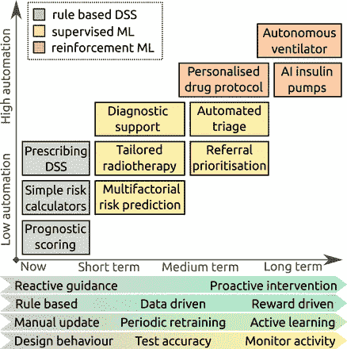
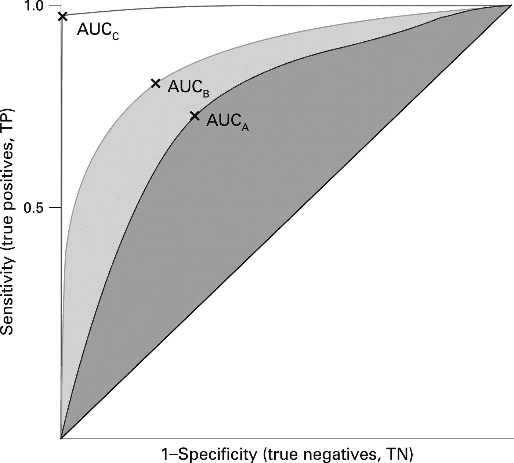

# 伦理人工智能的维度改变了医疗保健的面貌

> 原文：<https://towardsdatascience.com/the-dimensions-of-ethical-ai-changing-the-face-of-healthcare-3b72df1161e5?source=collection_archive---------13----------------------->

## —我们当前的人工智能医疗保健反面乌托邦

尽管许多人可能认为… **“人工智能将会接管一切！偷走我们所有的工作，并打算取代我们所有人！”**

不打算粉饰这一点。这在一定程度上可能是真的，当在医疗领域讨论它的含义时，仍然有大量的伦理上的缺陷需要首先考虑。

> “人工智能很可能会导致世界末日，但与此同时，也会有伟大的公司出现。”—山姆·奥特曼

*趁我们还在食物链的顶端，充分利用我们的时间怎么样😉*

# 医疗人工智能——为什么和为什么不

人工智能(AI)包括深度学习、机器学习、自然语言处理等领域，几乎可以应用于医学的任何领域，它对生物医学研究、医学教育和医疗保健的潜在贡献似乎是无限的。

凭借整合和学习大型患者数据集和临床数据的能力，人工智能可以在诊断、临床决策和个性化医疗过程中发挥重要作用。在许多情况下，这些形式的人工智能可以用来优化整个治疗过程，更好地帮助和康复病人。例如，应用于乳房 x 光片的基于人工智能的诊断算法正在帮助检测乳腺癌，为放射科医生提供“第二意见”。

此外，先进的虚拟人化身能够参与有意义的对话，这对于精神疾病的诊断和治疗具有意义。人工智能应用还扩展到物理领域，包括机器人假肢、物理任务支持系统和移动机械手，以帮助提供远程医疗。

随着这些进步为医疗保健领域带来了更强的整合和贡献，仍然有一个伦理层面需要考虑解决隐私、安全和特殊监管规定的问题。随着这项技术的不断进步，许多人都专注于强调医疗保健领域的未来会是什么样子，让医疗界对新兴人工智能技术可能带来的道德复杂性知之甚少。

忽视其有害影响。

Ignoring the ethical complexities of AI

# 人工智能的反乌托邦未来——伦理人工智能的挑战

对人工智能对全球更广泛经济的影响的估计大相径庭，最近的一份报告表明，到 2030 年，人工智能将对全球国内生产总值产生 14%的影响，其中一半来自生产率的提高。这些预测为人工智能行业的快速发展创造了政治胃口

## 有偏见的人工智能从错误的数据集开始

多样性不仅有助于解决平等的原因，也有助于抵消数据和人类判断中的潜在偏见。

众所周知，临床医生会受到潜意识偏见的影响。通常这些偏见是如此根深蒂固，以至于我们对它们视而不见。健康数据中的偏差也很常见，如果处理不当，可能会危及生命。

例如，心脏病在男性中更常见，但也是女性死亡的主要原因——至少在西方社会如此。尽管如此，女性心脏病更容易被医生忽视，不被认识，因此得不到治疗。这不仅仅是因为它被认为不太可能，还因为它在女性身上的症状表现与男性不同。

同样，人工智能在医疗保健领域的表现取决于它从中学习的人和数据。这意味着在人工智能模型的开发中缺乏多样性会极大地降低其有效性。根据有偏见的数据训练的人工智能只会放大这种偏见。例如，IBM Watson 对癌症治疗的建议是基于一家医疗机构的少数医生的培训。这就产生了有偏见的建议，这些建议不是基于官方的指导方针，而是基于少数人的经验和观点，这些人可能非常相似。

*Figure 1*

—图 1 总结了医学中 ML 研究的预期趋势，从短期到长期，侧重于反应性系统的进一步发展，经过培训，以可测量的准确度和前瞻性系统对患者进行分类。由于这些形式的最大似然算法将处理、诊断和治疗医学领域内的大范围流行领域，因此必须使用无偏见决策功能来确保安全性。

## 到底是谁的错？

在治疗方法、诊断和/或患者疾病分类过程中的并发症，强调了人工智能伦理方面讨论最多的话题之一。

总的来说，人工智能(在高层次上)只是计算统计学的一种形式。它在医疗保健领域的应用侧重于提供给定数据集的输出，做出最佳建议/决策。我们在医疗行业内测量准确度的过程将受试者操作曲线(ROC 曲线)置于焦点。这些 ROC 曲线主要由比较数据集组成，这些数据集展示了在特定任务中表现最佳的系统。

The better a system performs, the further up and towards the left the curve goes. A perfect 100% accurate system would not even be a curve, it would be a right angle in the top left-hand corner of the graph.

随着这些人工智能系统对病人的诊断和治疗具有更高的准确率，我们必须考虑到利用人工智能系统在病人护理方面有更高的表现率。

但是我们如何确保我们做出最好的决定，把我们的生命放在这些算法的功能上。

努力确保和概述这些 ML 算法的最佳决策模型在很大程度上依赖于两个强大的假设: **AI 必须能够访问全人口的电子健康记录(EHR)并且这些 EHR 必须能够被 AI 解释。**

或者我们可以停止生病。

但那是另一天的话题😉。

# 所以你的意思是…“我们完蛋了”

## 不完全是。

有许多人实际上意识到了解决这个问题的重要性，并且目前正在致力于专注于伦理人工智能维度的解决方案。

像多伦多创业公司 Winterlights Labs 这样的公司正在研究实际解决有偏见的数据集的方法，为阿尔茨海默病、帕金森病和多发性硬化症等神经系统疾病建立听觉测试。

努力消除所有形式的诊断中的偏见，避免根据性别或种族进行定性，但有时会根据其他特征进行定性，如语言、皮肤类型、谱系或来自有缺陷的数据集的生活方式。

收集大量以前患者的数据集，输入到他们的人工智能算法中，以获得患者的最佳特征，并帮助康复过程。但是这个过程最独特的地方在于，Winterlight 实验室非常注重收集以英语为母语的人的数据，以进行有针对性的治疗。

这不仅仅是 Winterlight Labs 试图解决医疗保健中道德人工智能的复杂性，而是致力于解决一个严重的问题，并为其他公司继续创新和寻找新的方法来彻底改革医疗保健领域树立**先例**。