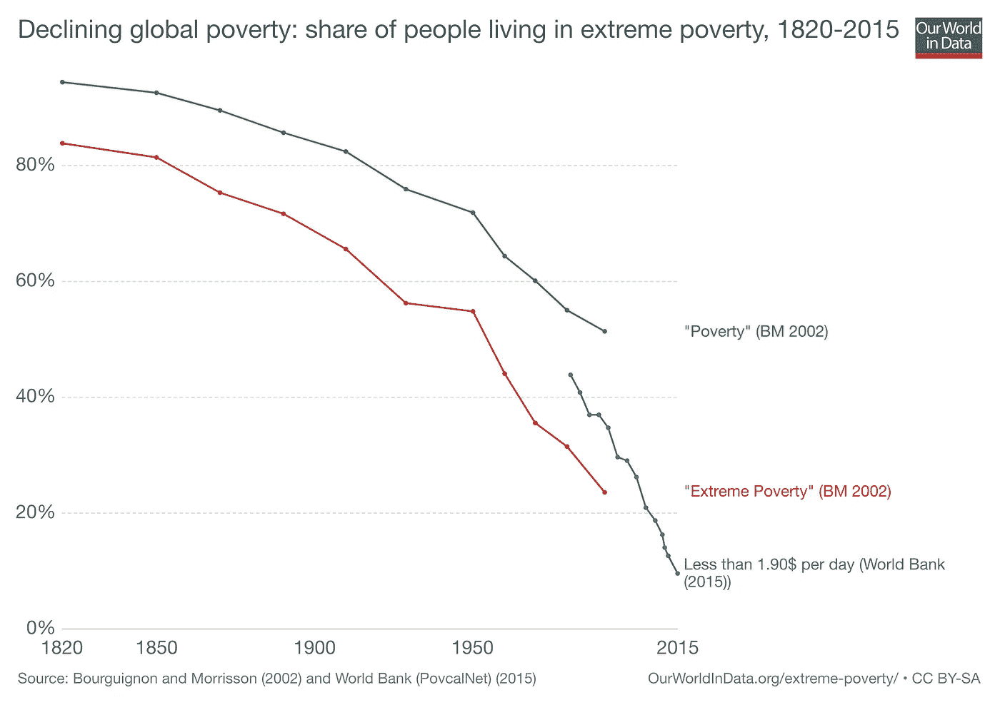
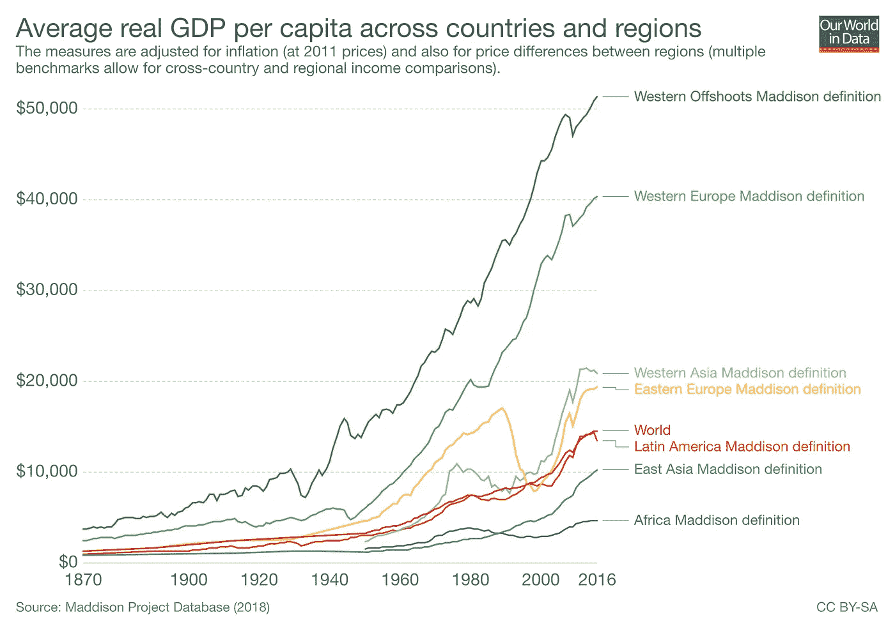
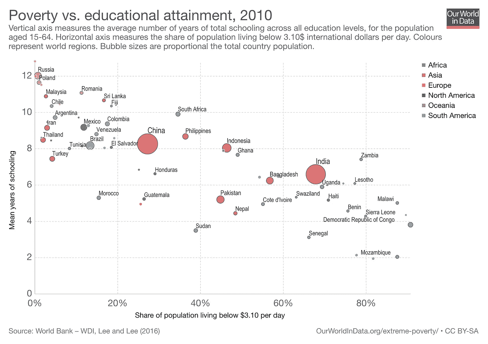
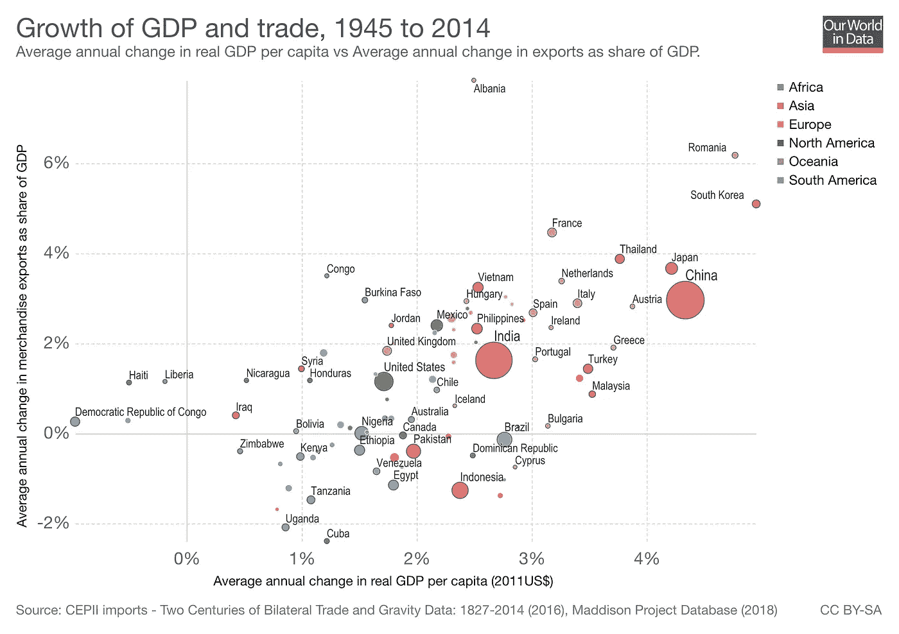
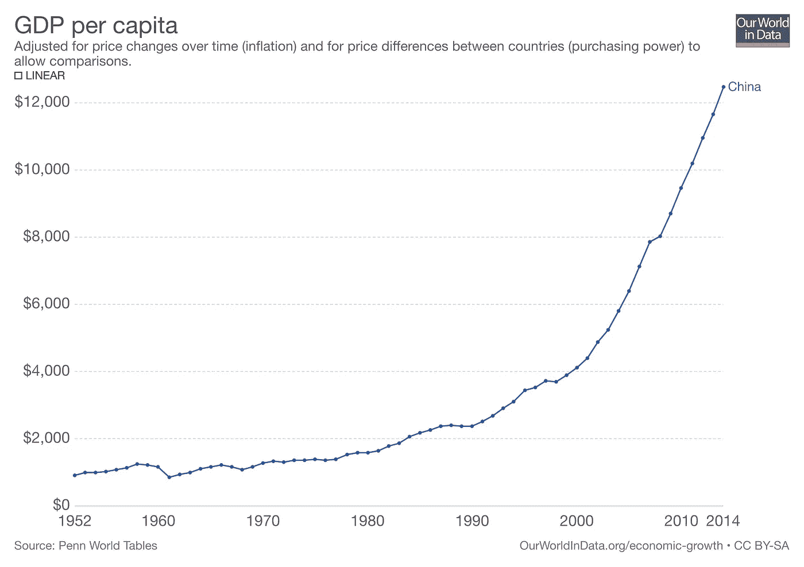
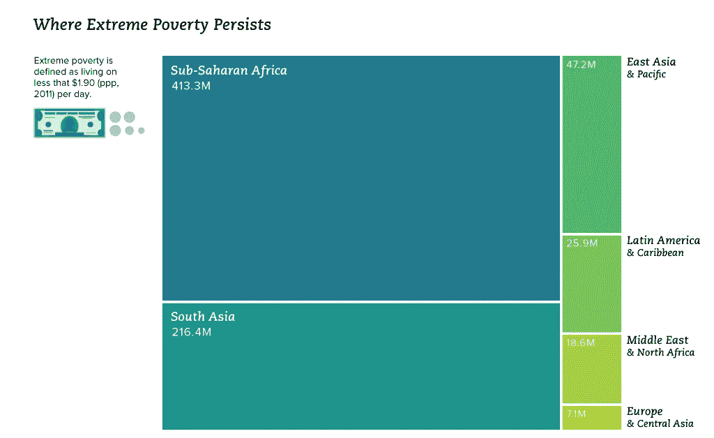
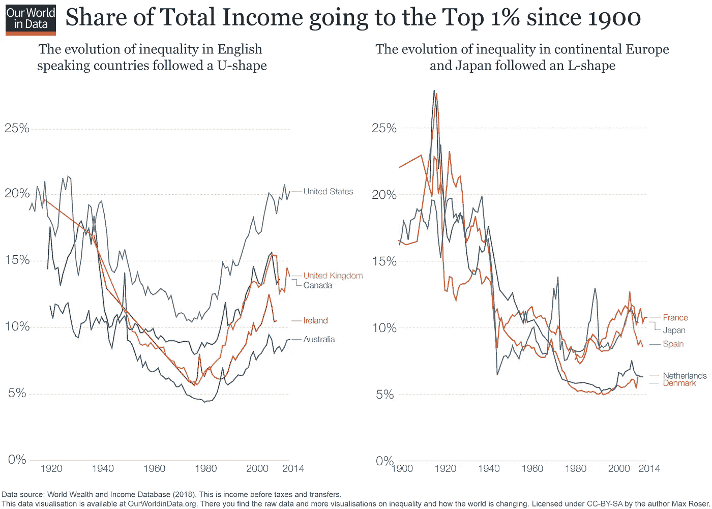
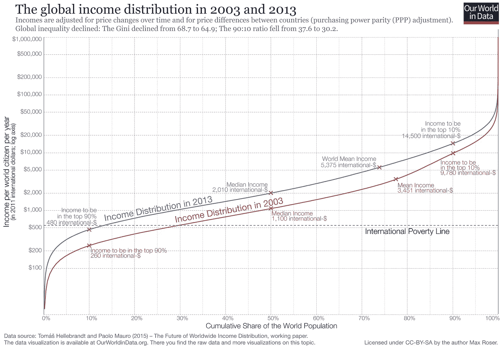

# 正在消失的穷人

> 原文：<https://towardsdatascience.com/the-disappearing-poor-6c68789e5a53?source=collection_archive---------16----------------------->

[(Source)](https://www.pexels.com/photo/beach-dawn-dusk-ocean-189349/)

## 探索令人难以置信的全球繁荣收益:现实项目第 1 集

25 年来的每一天，报纸都可以正确地刊登“昨天 13 万人摆脱极端贫困”的标题[(来源)](https://ourworldindata.org/extreme-poverty)。相反，据我所知，这已经出现在一个主要报纸的头版整整 0 次。也许这解释了人们在这个简单问题上记录的令人难以置信的可怕结果(来自 [Gapminder](http://forms.gapminder.org/s3/test-2018) ):

Question 1\. of the Gapminder test

在美国问这个问题的时候， [5%的人类得到了正确答案](https://www.youtube.com/watch?v=Sm5xF-UYgdg)， **C:几乎减半**。而动物回答这个问题有 33%的准确率(因为是随机猜的)。

在像美国这样一个理应有文化的社会里，人们怎么可能对现实如此误解？我不喜欢指责，但在这种情况下，这可能是合理的:媒体成功地向我们提供了关于世界的错误信息。他们没有报道事实，而是选择激发我们天生的仇外心理(害怕外来者)，让我们相信有一个富裕的“发达世界”，然后是其他所有人，一群永远无法摆脱贫困的穷人。

> 幸运的是，有了正确的数据，我们可以纠正对贫困的错误看法。在这样做的时候，我们发现了一个显著的事实:在过去的几十年里，世界各地的人们都经历了显著的繁荣，导致数十亿人的生活水平明显提高。

这是[现实项目的第一集，](https://medium.com/@williamkoehrsen/announcing-the-reality-project-e16cc71abb64)致力于用数据减少对世界的误解的每周系列。

# 关于全球贫困和收入的事实

首先，我们需要看看统计数据。关于这个主题的最佳资源是[我们的世界数据“全球极端贫困”页面。你可以在那里看到所有的数字，但有一张图表足以显示贫困人口的急剧下降:](https://ourworldindata.org/extreme-poverty)

Global share of the world population in extreme poverty.

我们可以看到，贫困的定义因机构而异，但无论我们使用哪种定义，比率都急剧上升。当然，*率*在下降，但是因为人多了，不就意味着还有更多的人穷吗？

> 晚间新闻是个不错的尝试，但是 T2 生活在贫困中的人口数量也急剧下降，自 1990 年以来已经减少了超过 12 亿。

Number of people living in extreme poverty.

这些人从极端贫困中崛起后会走向何方？简单:融入全球中产阶级。在撰写本文时，[世界上大约 85%的人(70 亿人中的 60 亿人)](https://www.gatesnotes.com/Books/Factfulness?WT.mc_id=04_03_2018_10_Factfulness_BG-media_&WT.tsrc=BGmedia)处于或超过全球收入水平的中间部分。区分“发达”和“发展中”是看待世界的错误方式:不存在两种收入水平，而是一个平稳的标尺，世界各地的人们都在快速攀升。

我们可以从数字上观察到全球财富的急剧增长。随着全球贫困人口的减少，收入会随着时间的推移而增加，如人均国内生产总值所示([摘自《我们的世界》数据“经济增长”第](https://ourworldindata.org/economic-growth)页):

Gross Domestic Product Per Capita around the world.

因此，事实是，贫困在减少，收入在以极快的速度增加，但这真的重要吗？有可能人们赚了更多的钱，却没有过上更好的生活？

## 为什么财富很重要:富裕国家是更好的居住地

所有这些看起来都不错，但你可能会想，财富的增加是否真的意味着人们过得更好。嗯，根据下面这张显示生活不满意度与人均 GDP 的图表，答案是响亮的“是”。

Dissatisfaction in Living vs GDP [(Source)](https://ourworldindata.org/extreme-poverty)

随着财富的增加，人们对生活越来越满意。金钱不是治疗所有疾病的灵丹妙药，其影响只持续到一定的收入水平，但财富是积极的，因为它带来了副作用:婴儿死亡率更低，受教育机会更多，工作时间更少。

人们很容易在所有的数字中忽略人类，所以记住每个数据点的背后都有一个人是很重要的。数十亿人摆脱了贫困，这意味着母亲们不必埋葬她们的孩子，因为随着财富的增加，护理质量会提高，女孩们能够上高中，家庭生活更加健康、幸福。我不太擅长谈论个人，但是汉斯·罗斯林在他的优秀著作《真实》中提供了故事(除了事实之外)。

对我来说，我将用《我们的世界》中的另一张数据图表来结束这一部分，这张图表展示了为什么减少贫困是积极的:

Average Number of Years of Schooling vs Poverty Levels

数据再清楚不过了:在世界各地，人们正在摆脱贫困，步入中产阶级。因此，他们活得更长，上学更多，工作更少，生活更愉快。

# 全球贫困减少的原因

这种下降背后可能有许多因素在起作用(就像任何人类现象一样)，但我将集中讨论最令人信服的论点:商业。(关于这个主题的完整论述，请参见马特·里德利的《理性乐观主义者》。

几十万年来，人类从事零和互动:一个人偷了或杀了另一个人，所以有人的收获被另一个人的损失抵消了。在这个系统中，人类的整体状态只能得到冰山般的改善(当交流仅限于步行速度时，[提高生活水平的新工具](https://www2.palomar.edu/anthro/homo/homo_4.htm)传播非常缓慢)。

然而，[大约从公元 1000 年的欧洲](https://www.cambridge.org/core/books/commercial-revolution-of-the-middle-ages-9501350/27C2AF7F2C913BADCDC29631B71EA7BF)开始，一种新的互动形式出现了:经济交流，双方都从中受益。这项被称为商业的发明完全改变了游戏规则:人们现在能够进行正和交易，双方都获利。这是文明的一个基本组成部分:在商业中，卖商品的人和买商品的人都会胜出。

在历史的大部分时间里，人类拥有恒定数量的物质财富，这些财富可以转手，但总体上不会增加。随着商业的发明，随着人们进行商品交易和专业化分工，经济蛋糕本身的规模也在扩大。国家内部和国家之间的交流导致了劳动分工，人们或国家专门扮演一个角色，导致效率的大幅度提高。人类花了很长时间才弄明白，但一旦我们创造了交易所和市场经济，我们就开始了持续至今的不可思议的财富上升之旅。

我们可以从下面的图表中看到近年来贸易的有利影响。随着国家贸易的增加，它们变得更加富有:

Change in trade 1945–2014 versus change in wealth

不要把我误认为自由市场的传道者。在我开始努力通过数据减少对世界的误解之前，我是一个公开的社会主义者，支持北欧国家作为效仿的典范。然而，我对这些数字的研究得出了一个结论:自由市场及其促成的交换是摆脱贫困的驱动力。我仍然相信政府的作用:[政府在环境保护和工人权利等领域的严格控制对于确保财富的增加不以环境破坏为代价是至关重要的。](https://ourworldindata.org/air-pollution#dirty-then-clean-the-environmental-kuznets-curve-in-air-pollution)

商业让人们摆脱贫困的非凡能力在中国可见一斑，在过去 40 年里，中国经历了历史上最令人难以置信的财富增长。正如《中国如何摆脱贫困陷阱》 [*中所描述的，随着共产党领导人逐渐开放中国的商业，尤其是与其他国家的贸易，中国摆脱贫困的过程非同寻常。1978 年，中国允许对外贸易，40 年后，中国再次成为世界强国。一路走来，数亿人的生活水平得到了提高。*](https://www.amazon.com/gp/product/1501700200/ref=as_li_tf_til?tag=foreaffamaga-20&camp=0&creative=0&linkCode=as1&creativeASIN=1501700200)

China’s incredible rise in GDP per capita

(商业不仅导致收入增加，还导致国家内部和国家之间的暴力发生率下降。正如史蒂芬·平克在《我们本性中的善良天使》一书中所记载的，当从别人那里买东西比偷东西便宜时，经济学就赢了。我们的邻居活着比死了对我们更有价值，这意味着更少的杀戮和更多的交易。这就是所谓的*温和商业理论*。)

# 警告

虽然长期前景非常乐观，但关注仍需改善的现实也很重要。目前，全球仍有数亿人处于极端贫困之中，这些人中的每一个人都应该成为中产阶级。不幸的现实是，世界上绝大部分的穷人在非洲，像联合国这样的组织正在通过有针对性的支出项目和社会安全网制度来努力消除贫困。

Where extreme poverty still exists ([source](https://www.visualcapitalist.com/decline-extreme-poverty-perspective/))

今天，大约有 7.5 亿人仍然处于极端贫困之中。尽管如此，考虑到 1990-2015 年间有 12 亿人脱离了极端贫困，所有迹象表明*极端贫困可以终结*。

此外，任何时候提到收入问题，我们都必须提到收入不平等。如果国家变得越来越富裕，但财富却流向了更少的人，那么人类真的过得更好吗？

再一次，值得看看数据，这次是关于国家内部和国家之间的不平等。我们将转向数据文章“[收入不平等”](https://ourworldindata.org/income-inequality)和[“全球经济不平等”](https://ourworldindata.org/global-economic-inequality)中的“我们的世界”来了解事实。幸运的是，数字再次提供了一个乐观的答案。虽然*一些国家的国内不平等现象有所增加*，但总体而言*全球不平等现象有所减少*，并且预计将继续减少。

从下面的图中，我们可以看到，如果我们将不平等定义为收入最高的 1%的人占总收入的比例，一些国家的不平等程度有所增加。(这个定义[可能有一些问题](https://ourworldindata.org/income-inequality#within-country-inequality-in-rich-countries))。

Share of income going to top 1% in selected nations.

另一方面，全球经济不平等有所下降:

Global income distribution showing decline in [Gini coefficient](https://en.wikipedia.org/wiki/Gini_coefficient).

总的来说，从不平等的角度来看，一些国家的财富分配可能越来越不平衡，但总的来说，由于最贫穷国家的总体财富水平增长最快，即使是收入水平最低的国家也变得更富裕。我不会就不平等是否是负面的展开辩论，但是，从长期的全球视角来看，现在似乎并没有变得更糟。

# 结论

新闻不仅误导了你对这个世界的认识，而且通过宣传一幅虚假的画面，它偷走了一些有价值的东西:随着看到这个世界变得更好而带来的快乐。虽然对我们短期内面临的挑战持现实态度很重要，但放眼全局并认识到我们所有的集体努力都在发挥作用也很重要。

> 世界各地的人们正在脱离贫困，步入中产阶级，因此，他们的寿命更长，更健康，生活更愉快。

我想用最后一张图表来结束我的演讲，这张图表强调了现实项目最重要的部分:当我们意识到世界范围内的贫困正在减少时，它应该给我们信心，消除贫困的努力并不是愚蠢的。虽然减少贫困的最大贡献者(很可能)是商业，但像联合国倡导的[那样的减贫努力也是至关重要的。如果你认为贫困率在上升，那么你唯一的结论就是这些项目不起作用。另一方面，如果你像我们一样挖掘数据，发现了世界的真实状况，你会意识到这些努力已经产生了影响。](http://www.un.org/en/sections/about-un/funds-programmes-specialized-agencies-and-others/)

Effectiveness of anti-poverty programs ([source)](https://ourworldindata.org/extreme-poverty)

减贫计划给受益者带来的好处远远超过成本(详见[“一个多层面的计划为非常贫困的人带来持久的进步:来自六个国家的证据”](http://science.sciencemag.org/content/348/6236/1260799))。下一次有人声称总会有穷人，帮助他们没有用，温和地纠正他们，不是用观点，而是用数据。

# 来源

除了整篇文章中列出的资源，这里还有一些供你自己研究的资源。我欢迎任何讨论。

1.  [数据中的世界:极度贫困](https://ourworldindata.org/extreme-poverty)
2.  [我们的数据世界:经济增长](https://ourworldindata.org/economic-growth)
3.  [原始数据:世界银行](https://databank.worldbank.org/data/source/poverty-and-equity)
4.  [“透视极端贫困的减少”](https://www.visualcapitalist.com/decline-extreme-poverty-perspective/)
5.  [*真实性:我们看错世界的十个理由——以及为什么事情比你想象的好*](https://us.macmillan.com/books/9781250107817) 作者汉斯·罗斯林
6.  [*《理性的乐观主义者:繁荣如何演变》*作者马特·里德利](http://www.rationaloptimist.com/)

一如既往，我欢迎反馈、对话和建设性的不同意见。可以在 Twitter [@koehrsen_will](http://twitter.com/@koehrsen_will) 上找到我。