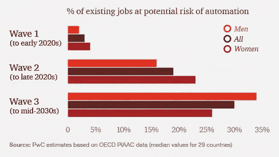
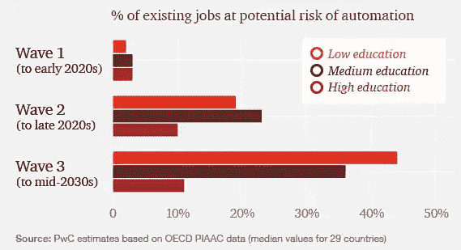

# 设计人工智能的人和受其影响最大的人之间的脱节

> 原文：<https://towardsdatascience.com/the-disconnect-between-those-who-design-artificial-intelligence-and-those-most-affected-by-it-94871f5ae9b5?source=collection_archive---------15----------------------->

Photo by [Katarzyna Pe](https://unsplash.com/photos/Twe3VxJlDiY?utm_source=unsplash&utm_medium=referral&utm_content=creditCopyText) on [Unsplash](https://unsplash.com/search/photos/robot?utm_source=unsplash&utm_medium=referral&utm_content=creditCopyText)

人工智能和自动化正在继续深入我们的社会。

*   在**商业行业**，公司现在利用智能个人助理(如 Alexa、Cortana 和 Siri)提供的语音识别来加快他们的任务。
*   在**交通行业，**人工智能为即将到来的无人驾驶汽车提供动力，并帮助管理交通流量。
*   在**教育部门**，人工智能被用于支持个性化学习系统。
*   在**医疗保健**领域，人工智能正在推动新的诊断工具和决策支持技术。
*   在**零售部门**，人工智能正在改进仓库设施的设计，使流程更加高效。
*   在**电影业**，人工智能正被用于创作管弦乐和制作电影短片
*   在**人道主义领域**，人工智能正被用于支持可持续发展目标的实现。

> 然而，在设计和实施这些系统的人和那些受结果影响最大的人之间似乎存在脱节。

据报道，2019 年英国人工智能程序员的平均年薪目前约为 6 万英镑。与此同时，据报道，英国所有工人的平均年薪约为 36611 英镑。

## 广泛自动化的结果

自动化日常操作有很多好处。它为人们提供了从重复性任务转向更有益、更具挑战性的工作的机会，让他们能够发挥自己的情商。

但目前，情况远非如此:

> 相反，低技能工人发现自己不断被降级为越来越不安全、收入越来越低的角色。

对于一些人来说，他们的工作已经完全被取代了。

2013 年，牛津大学的研究人员研究了 702 个职业群体。他们发现，47%的美国工人很有可能在未来 20 年内看到自己的工作自动化。最近在 2017 年，[麦肯锡的一份报告](https://www.mckinsey.com/~/media/mckinsey/featured%20insights/future%20of%20organizations/what%20the%20future%20of%20work%20will%20mean%20for%20jobs%20skills%20and%20wages/mgi-jobs-lost-jobs-gained-report-december-6-2017.ashx)预测，到 2030 年，30%的“工作活动”将实现自动化——这一变化将影响全球多达 3.75 亿工人。这是相当多的人。

纵观历史，新的技术创新浪潮总是会导致关于自动化的公共辩论激增。这场运动可与整个工业革命中脱离农业社会的转变相提并论。这方面的证据可以给我们一些启示，为今天的政策辩论提供信息。

早在 20 世纪，人们就一直担心自动化会让人类失业。1950 年，约翰·肯尼迪将自动化描述为一个会给人类带来“困难”的“问题”。

15 年后的 1965 年，IBM 的一位经济学家说，自动化将导致每周工作 20 小时。考虑到普通美国人仍然平均每周工作 34.4 小时(T4 时间为 T5)，这个预测显然还很遥远。

但是，解决工业革命的不公正用了几十年的时间。这一次，我们等不起那么久。

如果就业水平大幅下降，人们担心西方民主国家可能会诉诸威权主义，这种情况早在上世纪 30 年代大萧条之后就在一些国家蔓延开来，如今许多经历了高度收入不平等的国家也是如此。

## 真正的挑战是管理过渡

西方政治已经变得越来越动荡。收入不平等正慢慢开始进一步扩大，加剧了本已岌岌可危的政治不稳定。很大一部分人将需要为新职业接受再培训。他们不再年轻，而是中年专业人士。发达经济体可能会受到转型的最大冲击，因为平均工资的提高会进一步刺激自动化。

自动化会有很大的不同，取决于工业部门。医疗保健等行业的工作岗位将会增加，以应对人口老龄化，而涉及体力劳动和数据处理的工作岗位将会减少。

不可能确切知道有多少工作将受到人工智能的影响，因为根据对输入数据的处理，研究给出了非常不同的估计。

普华永道的一份报告表明将会有三次主要的自动化浪潮。

[Source](https://www.pwc.co.uk/services/economics-policy/insights/the-impact-of-automation-on-jobs.html)

第一波将发生在 21 世纪 20 年代初，预计将取代很低比例的工作岗位——约 3%。

第二波浪潮预计将在 21 世纪 20 年代末到来，预计将取代文书和行政部门的许多工作岗位。

第三次浪潮预计将在 21 世纪 30 年代中期到来，可能会导致今天 30%的工作自动化——特别是那些涉及汽车设备和机器的工作。

受教育程度较低的工人更容易被机器取代:

[Source](https://www.pwc.co.uk/services/economics-policy/insights/the-impact-of-automation-on-jobs.html)

## **我们如何解决这个问题？**

麦肯锡在[的报告](https://www.axios.com/mckinsey-automation-may-throw-800m-people-out-of-work-by-2030-2513416488.html)中以美国在工业革命期间从农业转型为例。随着农业就业机会的减少，中等教育的支出大幅增加，新的法律规定必须上学。

> 1910 年，14 至 17 岁的孩子中有 18%上了高中。
> 
> 到 1940 年，73%的 14 到 17 岁的孩子上了高中。

教育水平的提高有助于创造一个繁荣的制造业。

如果我们希望自动化的未来取得成功，显然今天也需要类似的推动。越来越清楚的是，人工智能不会导致“工作的终结”。它可以创造尽可能多的工作岗位。相反，未来的工作只需要不同的技能组合。

政府建议网络需要支持更多的企业使用机器学习。我们需要培养各个层次的技能——从学校到行业专业人士，到本科生和研究生。

遗憾的是，事实似乎并非如此。事实上，在过去几十年中，用于培训和支持劳动力的支出一直在下降。此外，许多学校仍未能向学生传授技术的关键概念。

## 自动化不一定是一场灾难——但如果政治家们不理解我们对变革的需求并对此做出反应，它将是一场灾难

如果我们希望技术让每个人受益，而不是进一步扩大不平等，我们需要立即开始为未来培训我们的劳动力。无所作为将导致社区之间更大的分裂和两极分化。

如果政治家、工会和商界领袖想要确保技术变革的结果是好的，他们现在就需要行动起来。