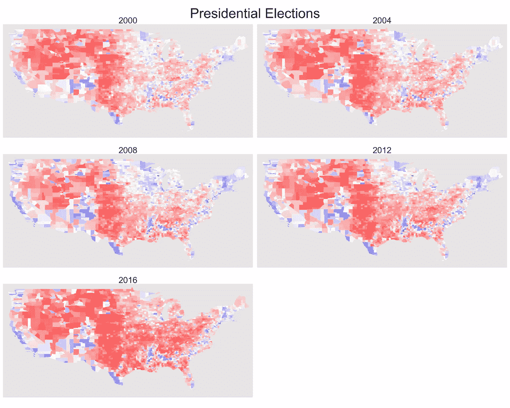
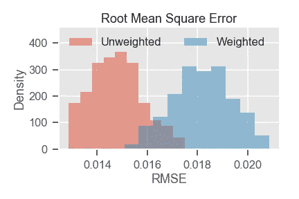
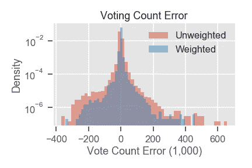
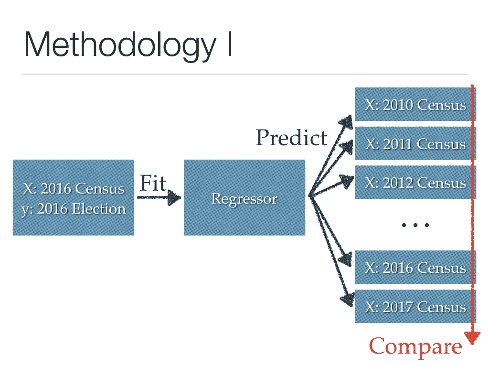
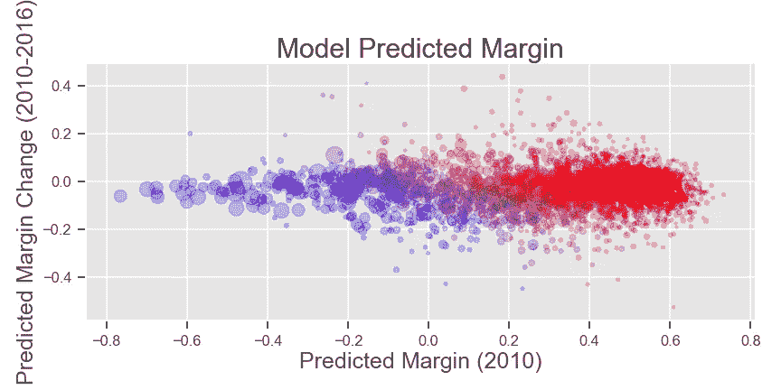
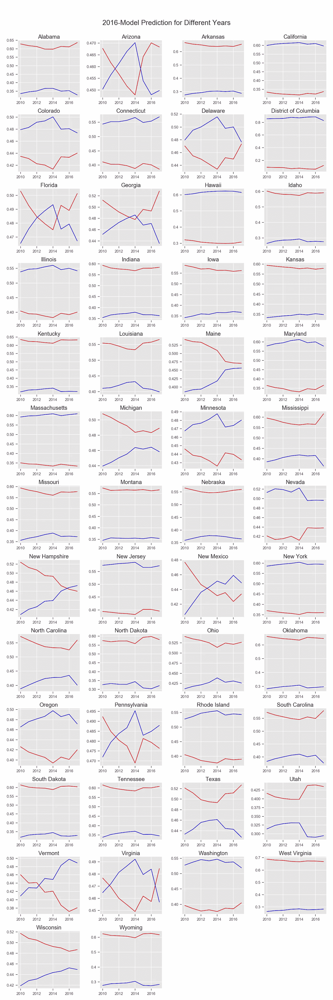
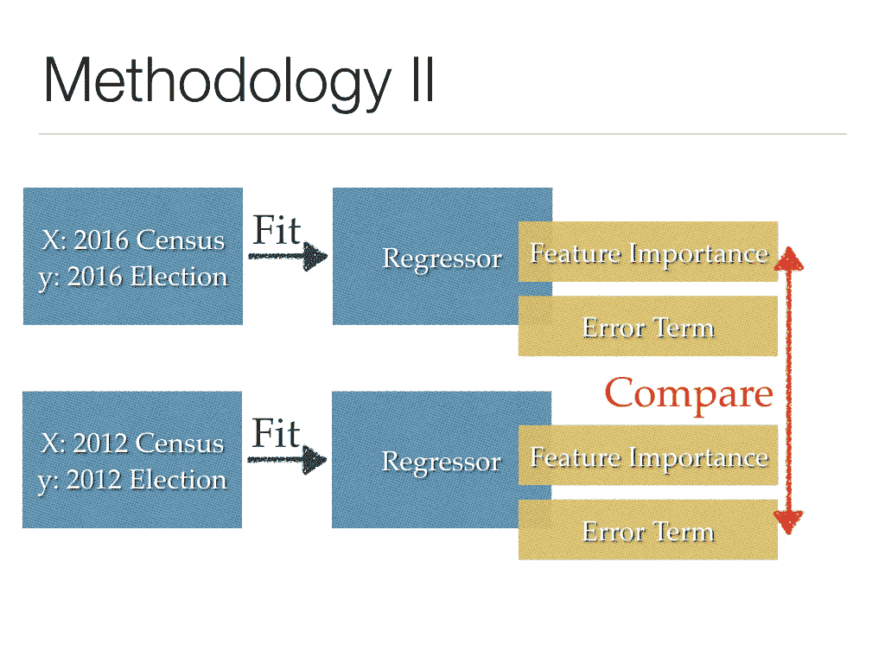
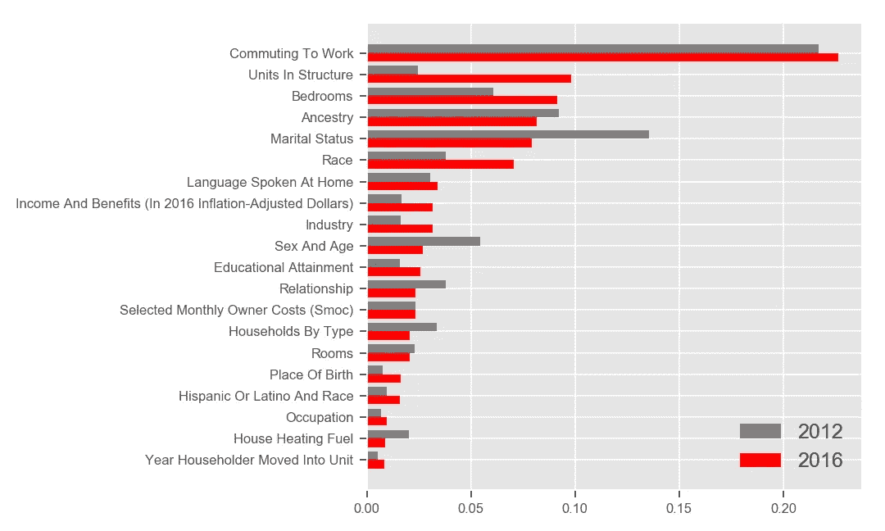
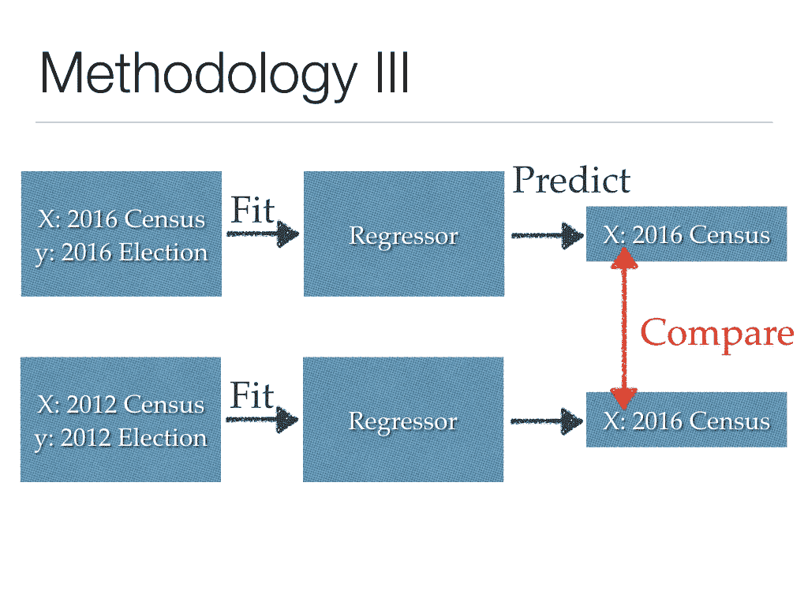

# 美国分裂的州——历史透视

> 原文：<https://towardsdatascience.com/the-divided-states-of-america-historical-perspectives-4b0ff53cf073?source=collection_archive---------41----------------------->

这个国家在现代史上从未像今天这样两极分化。据说，在过去的总统选举中，民主党和共和党候选人之间的差距要大得多。下面的地图描绘了过去五次总统选举的趋势，你可以发现更多的白人县在 2000 年比 2016 年差距缩小。随着时间的推移，一些明显的变化包括中西部的红色加深，而沿海的加利福尼亚则相反。

Darker colors indicate wider margins (blue: Democrats, red: Republican)

Voting share margin between Republican and Democratic candidates

在许多县，共和党和民主党候选人的投票份额差距已经扩大。过去几年，利润率的标准差一直在不断增加:2000 年为 0.26，2008 年为 0.29，2016 年为 0.35。在此期间，分布尾部，即无竞争力的县大幅增加。

在[我之前的文章](https://medium.com/keita-starts-data-science/the-divided-states-of-america-f42e904e76f0)中，我发现人口和社会概况数据有很强的力量来讲述 2016 年县级总统选举结果。这篇文章提出的问题是人口的变化是否导致了美国政治的两极分化。例如，如果城市有价值观与民主党一致的人流入，它们可能会变得更蓝。与此同时，如果与共和党有密切关系的人留在农村，这些县会变得更红。

然而，我发现，至少在 2010-2017 年期间，人口的变化并没有推动国家的两极分化，而选举的特征(如候选人、问题)更能解释两极分化的趋势。

在这项分析中，我使用了 2010 年至 2017 年美国人口普查美国社区调查(五年数据)的数据概况表，选择了 292 个在县一级一贯可用的变量。缺失值由 XGBoost 回归器估算。在此期间，举行了两次总统选举。我构建了回归模型，自变量来自美国人口普查 ACS，因变量来自总统选举中共和党和民主党候选人之间的投票份额差额。

XGBoost Regressor 还被选为其他机器学习回归模型中得分最高的基础模型。样本按县总投票数加权。如左图所示，施加重量会增加标称误差。

然而，加权样本在投票计数方面导致更小的误差。该模型提高了较大县市的准确性，但代价是较小县市的准确性。因此，在这个分析中，我将根据各县的总票数使用一个具有样本(县)权重的模型。

首先，我将 2016 年的人口普查数据和同年的选举结果拟合到模型中，并用不同年份的人口普查数据进行预测。这样，我们可以想象 2016 年选举在不同年份的人群中发生的假设情况。如果县一级人口结构的变化导致了两极分化，那么 2010 年人口普查数据中的红色县在以后几年的人口普查数据中会更红。

结果并不令人信服。在下面的图表中，您可以看到 x 轴上有 2010 年人口普查数据的模型的预测利润，以及 2010 年和 2016 年数据的模型预测之间的差异。如果有一个向上的斜坡，我们可以说 2010 年红色县在 2016 年有更大的优势支持共和党候选人，反之亦然。相反，我们看到的是下面的平面图；这意味着由人口变化引起的投票份额差额的变化与初始条件没有明显的相关性，总体而言，人口不是两极分化的明确驱动因素。

Voting share margin between Republican and Democratic candidates. Source: US Census

话虽如此，了解摇摆州各县市的人口结构和社会状况的变化可能是有用的。以下图表描述了 2016 年模型预测的民主党和共和党候选人的投票份额，以及 2017 年之前不同年份的人口数据。在佛罗里达州，特朗普以 1.2%的微弱优势赢得了 29 张选举人票，2016 年至 2017 年的人口结构变化有利于共和党，而我们看到的情况相反，这有利于宾夕法尼亚州的民主党人，他们在 2016 年以 0.7%的优势赢得了 20 张选举人票。2018 年美国人口普查 ACS 数据将于 12 月 19 日公布，看看最新数据的预测会很有趣。

Voting share of Democratic (blue) and Republican (red) candidates. Source: US Census

其次，我比较了用 2012 年和 2016 年数据集构建的两个模型，并检查了每个模型的重要特征和错误。

我发现 2012 款和 2016 款有很多共同点，如下图。乘坐公共交通工具或自己开车上下班很重要，因为城市(有公共交通的地方)往往比农村更蓝。结构单元(即居住在独立房屋或多单元公寓)和卧室数量也与城乡差别相关。这些变量在 2016 年比 2012 年更重要；在过去的四年里，城市和农村之间的差异加深了。人们还注意到，种族(包括“西班牙裔和拉丁裔以及种族”)在 2016 年拥有更大的权力，因为共和党在白人县加强了支持，而民主党在种族更加多样化的县市增加了支持。驱动 2016 年选举结果的特征的详细分析可以在我之前的文章中找到。

Feature importances in 2012 and 2016 models. Source: US Census

Root Mean Square Error of 100 trials of both models. Source: US Census

不出所料，2016 年的模型误差在统计上明显小于 2012 年，如左图所示。县一级的人口和社会概况比上次更能说明 2016 年总统选举的结果。这一事实是该国社会分裂加深的证据之一。

最后，我将 2012 年和 2016 年模型的预测利润率与 2016 年的人口数据进行了比较。2012 年-2016 年数据的模型将告诉我们，如果奥巴马和罗姆尼在 2016 年参加总统竞选，会发生什么。

很明显，2016 年的模型结果(y 轴)比假设的 2012 年选举结果(x 轴)更加两极化。在人口不变的情况下，2016 年的选举导致共和党候选人在红色县更强大，民主党候选人在蓝色城市获得更多支持。

Voting share margin between Republican and Democratic candidates. Source: US Census

如上所述，我没有发现任何证据支持县人口结构的变化导致了美国的政治两极分化，尽管监测摇摆州的人口和社会概况的变化可能是有用的。两极分化的原因是总统候选人、问题和选举本身的特点发生了变化。2020 大选在即，至今我们还没有看到任何两极化缓解的线索。