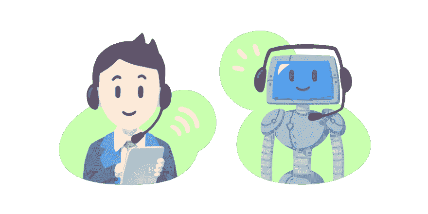

# 客户服务自动化的注意事项

> 原文：<https://towardsdatascience.com/the-dos-and-donts-of-customer-service-automation-a1f3bb866330?source=collection_archive---------12----------------------->

## 权威指南

在这个快速发展的数字时代，人们几乎没有时间去杂货店购物或去 10 英里外的办公室工作。随着世界继续变得更加数字化，21 世纪的人类变得比以往任何时候都更加懒惰。这种数字化不仅影响了普通人；它还为公司提供了尽可能高效地服务客户的机会。只需点击一下鼠标，任何事情都需要一个即时的解决方案，这种需求导致更多的公司选择自动化，并尽可能多地用人工智能取代人类与客户的互动，来为他们做这项工作。

> “信息技术和商业正变得密不可分。我不认为任何人可以有意义地谈论一个而不谈论另一个”——比尔·盖茨。

因此，当我们谈论出色的客户互动时，我们谈论的是基于清晰沟通、短响应时间和跨渠道一致性的客户体验。客户体验对客户来说必须是非凡的，任何客户参与的行为必须总是感觉良好。对于组织而言，与客户接触应该是一个平稳且经济高效的过程。

75% and 55% of customers prefer short response times and cross-channel consistency, respectively. Automation has enabled companies to become fast, efficient, and accessible to their customers.

在这个时代，公司必须时刻保持警觉，以适应快速变化的客户需求和市场趋势。如今，一家企业**必须**提供卓越的客户体验，才能在全球市场中保持竞争力。幸运的是，人工智能的智能功能使公司能够通过每次客户互动了解客户的需求，同时牢记组织的业务目标。因此，现在，企业将人工智能视为向客户提供难忘体验的重要因素。

然而，许多人仍然害怕自动化。有一种观点认为，有了那些花哨的机器人之类的东西，工作场所的事情可能会变得疯狂。然而，以下是所有害怕自动化的人不喜欢做的事情:等待电话接通客服代表，在车管所排队等候几个小时，没有人帮助他们网上购物。

> 答根据[埃森哲战略公司的调查](https://www.accenture.com/sa-en/insight-exceed-expectations-extraordinary-experiences)，61%的客户去年因为糟糕的客户体验而停止了与至少一家公司的业务往来。

在提供无缝客户体验方面，效率太低了，因此现在企业向人工智能寻求帮助至关重要。尽管雇用人工智能来做这项工作是明智的，但公司必须在使用人工智能和人类互动之间找到正确的平衡，以服务于他们的客户。不是所有的问题都可以通过自动化服务解决，因为它有一系列的限制。埃森哲战略的研究显示，大约 60%的顾客由于糟糕的客户服务而没有购买他们想要的东西。

因此，当务之急是要有一个清晰的“客户服务自动化的注意事项”列表，以了解企业如何使用自动化客户服务来增强客户体验。

# 当自动化客户服务时，这是企业应该做的

*   **有一个自动处理常见问题的系统:**
    常见问题是客户在联系企业客户代表时最常问的问题。理想情况下，人工智能应该处理常见问题。拥有一个自动的 FAQ 部分(或聊天机器人)可以有效地回答这些问题，这为客户和公司带来了巨大的好处，因为它可以快速解决客户的疑问，并减轻客户服务团队的负担。
*   确保自动跟进将潜在客户转化为付费客户往往需要不止一次的接触。因此，跟进技巧对成功销售至关重要。然而，跟进的艺术并不适合所有人。许多人觉得无聊乏味。此外，跟进越快越有效，因为线索可能在几小时内枯竭，如果不是几分钟的话。自动跟进系统通过自动跟进潜在客户和付费客户来解决这个问题，而您只需做很少或根本不做任何工作。他们还在提高 CX 方面发挥着关键作用，在每次客户互动后都会发送客户服务调查，以揭示服务中的差距。
*   **预测客户的行为**
    系统应该包含根据客户的行为预测代理所需的下一步行动的技术。它应该能够从每次交互中收集数据，并准备好处理预期的问题。然后，收集的信息可用于预测未来的客户问题、代理的响应和后续问题，从而通过采用预先计划的方法来增强客户体验。
*   **拥有一个在自动代理和人工代理之间无缝传输的系统**
    实时聊天和自动支持之间应该有一个联盟。标准化的回答不能解决每个客户的问题。人类输入的整合对系统的成功至关重要。

Seamless transfer between the automated and human agent is essential to address all types of customer concerns

*   **开发信心评分机制** 该机制可以评估客户对自动化系统的感受和信心。人工智能系统应该知道顾客什么时候不高兴和不满意，这样就可以把行动转向人类。
*   **为每个客户准备一个可更新的知识库**
    应该有一个知识库，它可以在每次客户互动后自我更新。更新的信息理想地包括顾客的位置、身份、过去的购买和偏好，这使得系统更擅长迎合顾客的特定需求，并且帮助管理员组织和管理内容以及控制用户的访问。
*   **征求反馈**
    自动化不是一件容易的事情。它需要定期测试并根据反馈进行改进。寻求反馈会让顾客感到受到重视，并帮助企业想出更好的方法来服务顾客。

虽然客户服务自动化承诺了高利润、增加的客户满意度和最大的生产率，但是它仍然不能用于处理特定和复杂的情况。尽管人工智能是一项超级智能的技术，但如果处理不当，它可能会导致客户不满。因此，企业家应该能够区分自动化可以胜任的任务和需要人工协助的任务。

# 自动化客户服务时，企业不应

*   **更换一个系统；相反，自动化系统应该与客户服务代表合作。它不可能回答客户的所有问题。因此，系统应该知道什么时候需要人工输入，什么时候不需要。**
*   **依靠一个渠道** 客户通过各种渠道联系公司客服。这是他们的选择，给他们这样做的自由。一个公司的自动化系统应该能够从多个渠道而不是一个渠道提取重要的客户信息，所有的自动化渠道应该相互连接，并与销售代表连接。
*   **使用自动化解决复杂的支持问题** 自动化系统可用于解决简单的客户问题，如账单、采购和产品查询。有时问题过于复杂，人类的参与对于理解、协商和解决问题变得至关重要。
*   **接受过时的系统**
    系统应定期更新和维护，以避免对客户作出多余和不相关的回应。如果客户服务成功实现自动化，经理们就可以把时间花在企业的其他核心活动上。

# 一锤定音

客户服务自动化(CSA)是一个不可思议的工具，它保证了高利润、增加的客户满意度和最大的生产力。遵循上面提到的原则，它可以发挥最大的潜力。然而，如果管理不当，CSA 会给企业带来弊大于利的影响。自动化最有益的用途是在人工智能和客户服务中的人工支持之间取得平衡。