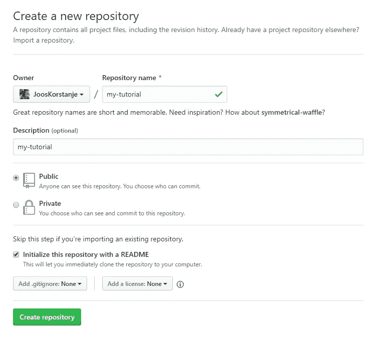
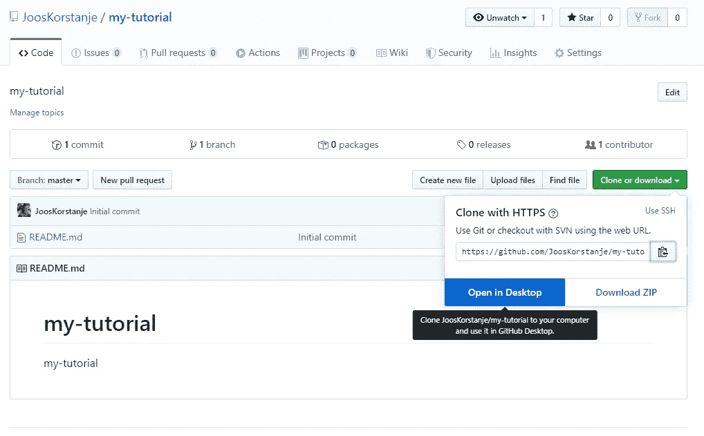
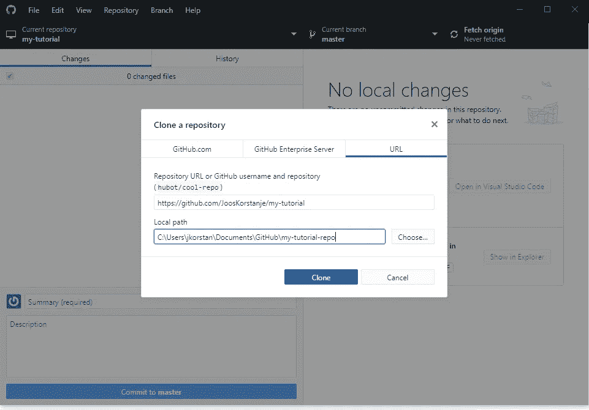
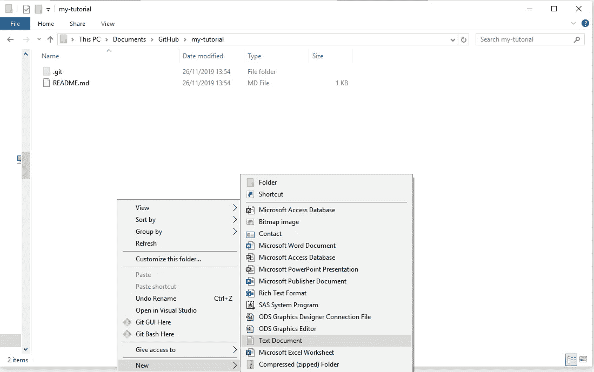
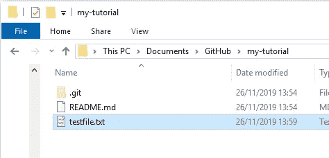
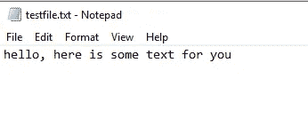
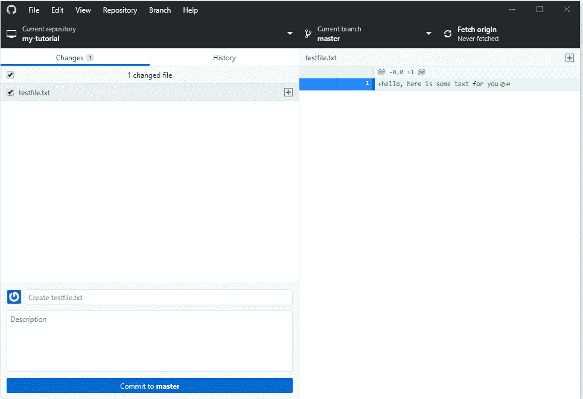
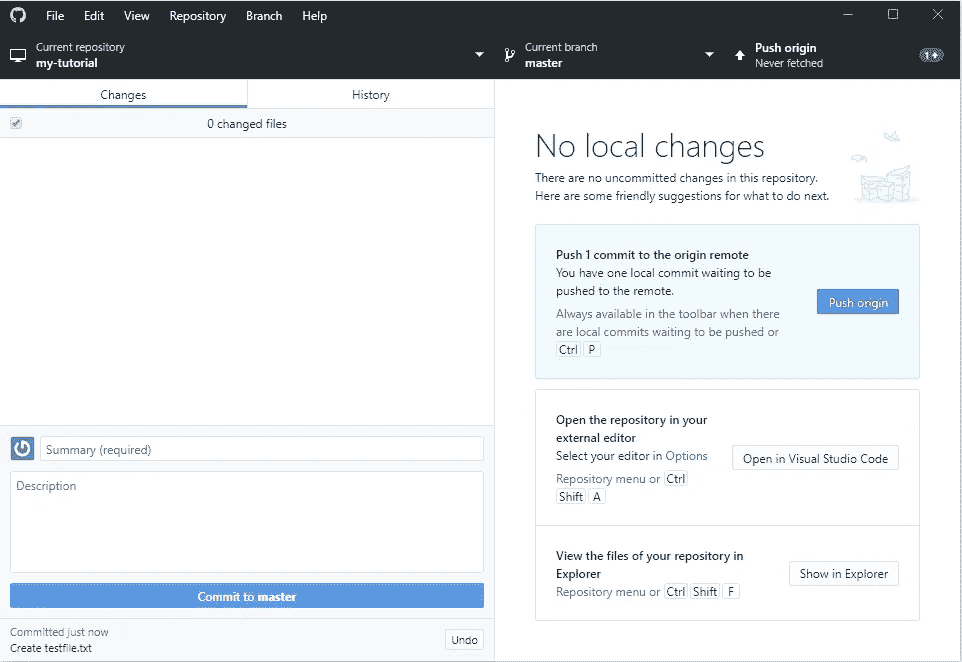
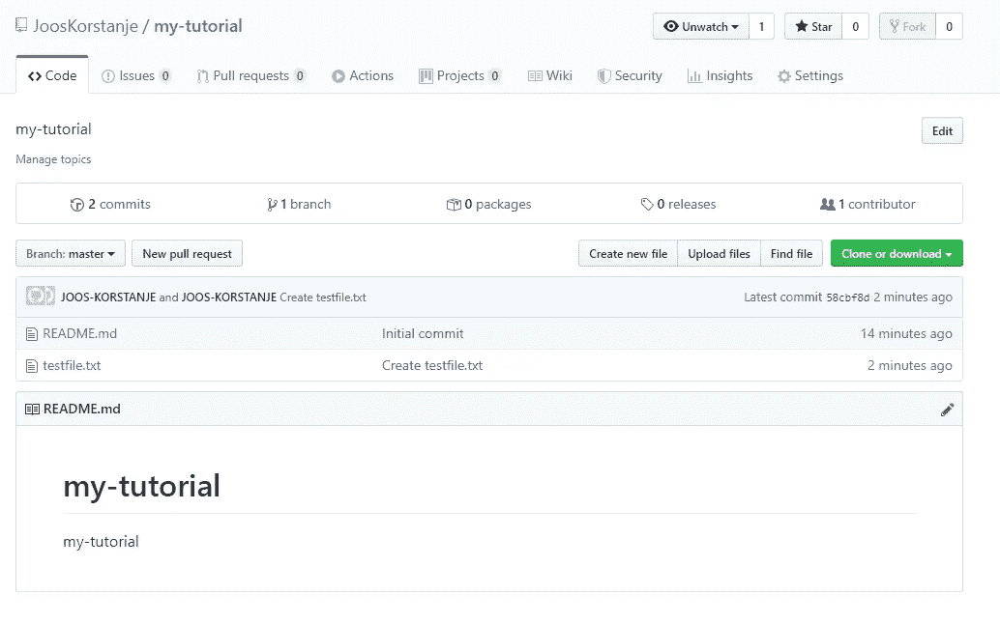

# 有史以来最简单的 GitHub 教程

> 原文：<https://towardsdatascience.com/the-easiest-github-tutorial-ever-4a3aa0396039?source=collection_archive---------25----------------------->

对于那些对 Git 和 GitHub 不放心的人，我制作了这个超级简单的教程来入门并了解 Git 和 GitHub 的优势可以是什么。

通过这五个超级简单的步骤，你将对 GitHub 有一个非常基本但非常重要的理解。

这是一个实用教程。如果你想更深入地了解 GitHub，可以在这里查看我的另一篇文章: [***在开始使用 GitHub 之前你需要知道的一切*** *。*](/all-you-need-to-know-before-starting-with-github-ada7cf62dae2)

## 1.在 GitHub 上创建一个资源库

转到 GitHub.com，点击“创建存储库”。

给你的存储库一个名称和描述。

选中用自述文件初始化此存储库复选框(自述文件是一个简单的文本文件，您可以在其中放置有关当前项目的信息)

然后单击“创建存储库”。

## 2.将存储库克隆到您的本地 pc 上

我处理你的代码，你需要把这个库放到你的电脑上。这是通过克隆它来实现的。

最简单的方法是通过 GitHub 桌面。

Cloning a repository through GitHub Desktop

当你这样做的时候(当然你应该已经安装了 GitHub 桌面),你会看到下面的屏幕:

选择正确的位置并克隆您的存储库。

你现在可以在你的电脑上找到它。

## 3.将代码文件添加到您的存储库中

对于这一步，忽略 GitHub。只需在您的 pc 上浏览到您克隆存储库的位置，并创建一个测试文件:

将文件命名为“testfile”:

在其中输入一些文本并保存文件:

## 4.提交并推送代码

我们的库现在已经改变了，我们应该把新版本更新到 GitHub。

回到 GitHub 桌面，看到它已经注意到你改变了一些东西:

上传代码需要采取两个步骤:

首先，键入一个类似“Create testfile.txt”的小注释，然后单击“Commit to master”。

其次，点击“推送原点”:

## 5.验证 GitHub 上的代码是否已更改

已经完成了！为了验证它是否真的有效，您现在可以在 GitHub 上看到您的更改。只要进入你的库的 GitHub 页面，你就会看到代码已经改变了！

您刚刚迈出了 GitHub 世界的第一步。当然，还有更多需要了解的，敬请关注。感谢阅读！