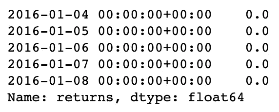

# 评估 Python 中交易策略性能的最简单方法

> 原文：<https://towardsdatascience.com/the-easiest-way-to-evaluate-the-performance-of-trading-strategies-in-python-4959fd798bb3?source=collection_archive---------3----------------------->


Source: [unsplash](https://unsplash.com/photos/dBI_My696Rk)

## 了解如何用一行 Python 代码生成全面的性能报告！

这是 Python 中回溯测试交易策略系列文章的第三部分。之前的文章描述了以下主题:

*   介绍`zipline`框架并展示如何测试基本策略([链接](/introduction-to-backtesting-trading-strategies-7afae611a35e))
*   导入自定义数据以使用`zipline` ( [链接](/backtesting-trading-strategies-using-custom-data-in-zipline-e6fd65eeaca0))

这一次，本文的目标是展示如何使用名为`pyfolio`(由`zipline`的创造者 Quantopian 开发)的库快速有效地评估我们的策略的性能。`pyfolio`可以作为一个独立的库使用，只根据一系列的回报提供性能结果。然而，它与`zipline`一起有效地工作，我在本文中介绍了这种组合。

# 简单移动平均策略

在本文中，我只展示了一个基本策略，因为主要重点是评估性能。为此，我选择了基于简单移动平均线(SMA)的策略。该战略的逻辑可以总结如下:

*   当价格向上穿过 20 日均线时，买入 20 股
*   当价格向下穿过 20 日均线时，卖出所有股票
*   我们在任何时候最多只能有 20 股
*   策略中没有卖空

我使用 IBM 2016 年至 2017 年的股票对该策略进行了回溯测试。关于如何创建这样一个策略以及特定组件实际上做什么的细节，请参考我的[上一篇文章](/introduction-to-backtesting-trading-strategies-7afae611a35e)。

我首先加载所需的库:

```
import numpy as np
import matplotlib.pyplot as plt
import pandas as pd
import zipline
import warnings
import pyfolio as pf
```

然后，我运行策略:

`zipline`自动创建一个性能数据帧，您也可以在代码的输出中看到。为了方便起见，我将输出存储在一个名为`simple_moving_average.pkl`的 pickle 文件中。为了尽可能平滑地进行分析，我们可以使用`pyfolio`提供的效用函数，加载业绩数据框架中最重要的 3 个元素——回报、头寸和交易。为此，我使用了`pf.utils.extract_rets_pos_txn_from_zipline`。

```
sma_results = pd.read_pickle('simple_moving_average.pkl')
returns, positions, transactions = pf.utils.extract_rets_pos_txn_from_zipline(sma_results)
```

我们现在可以检查提取的元素:

```
returns.head()
```



2016 年的前 20 个交易日可能不会有回报，因为目前仍是均线的预热期。

```
positions.head()
```


`positions`数据框架包含我们在考虑的资产中有头寸的每一天的条目，并显示股票和现金之间的资本分割。我们可以看到，通过购买 20 股 IBM 股票，我们仍然以现金形式持有大部分资本。对于更高级的策略，我们可以通过使用`order_percent`为每个订单分配一定比例的资金。

```
transactions.head()
```


`transactions`数据框架包含交易策略执行的所有交易——我们看到买卖订单。

# 简单撕纸

为了评估策略、投资组合甚至单个资产的表现，我们使用`pyfolio`来创建一个模板。样张是一种简洁的文档(通常是单页的)，包含关于上市公司的最重要的信息，如财务指标。`pyfolio`提供的功能比一张纸所能包含的要多得多，但为了简单起见，我们从一张简单的便笺开始，它只包含最重要的信息。

为了创建它，我们运行以下命令:

```
pf.create_simple_tear_sheet(returns)
```

``pyfolio`'真正了不起的地方在于它只用一行代码就产生了如此多的信息！


我们看到的第一个表格显示了测试的日期、持续了几个月以及许多财务指标，例如:

*   年回报率/标准差
*   偏斜度-第三个矩描述了分布的偏斜程度
*   峰度——第四个矩表示分布的尾部是否有更多的质量
*   夏普比率——一个非常受欢迎的风险指标。它表示每单位风险(用标准差衡量)的超额收益(超过无风险利率)。
*   Sortino 比率——夏普比率的修改版本，其中标准差被下行偏差取代。下跌背离只衡量系列的负波动性，严格来说，低于一个预定义的水平，称为最小可接受回报。
*   ω比率——另一种风险回报绩效指标。与夏普比率相比，它最大的优势在于——从结构上来说——它考虑了所有的统计矩，而夏普比率只考虑了前两个。
*   最大压降—表示波峰和波谷之间的最大压降(以百分比表示)
*   每日风险值——另一个非常流行的风险指标。在这种情况下，它表明在 95%的情况下，我们将头寸/投资组合多保留 1 天，损失不会超过 0.5%。

前 3 个要点与资产回报的程式化事实有关，我在[之前的一篇文章](/introduction-to-quantitative-finance-part-i-stylised-facts-of-asset-returns-5190581e40ea)中描述过。


下一张图展示了我们策略的累积回报——我们可以观察我们的投资组合在实施这一策略的两年中的价值演变。平稳期代表我们不持有资产的时期。


我们还可以看到滚动夏普比率，这为我们的战略稳定性提供了更多的见解。我们看到报告的总体夏普比率为 0.84，但是，当我们查看滚动比率时，我们会看到它随时间的波动性(使用滚动 6 个月的数据计算，而不是整个样本！).

最后一张图表——水下图——从悲观的角度展示了这项投资。我所说的悲观，是指它专注于亏损。它描述了提款，并显示了投资组合的价值在遭受损失后恢复到之前的峰值需要多长时间。这个图表很容易区分正常和长期的损失。


我们通过只将`returns`对象传递给函数来创建所有这些图。我们还可以通过之前提取的头寸和交易，在简单的撕单上自动接收更多信息！此外，我们还可以指定一个`live_start_date`，它将时段分为回溯测试时段和实时交易时段(`zipline`提供了这种可能性)。为此，我们只需运行:

```
pf.create_simple_tear_sheet(returns, positions, transactions, live_start_date='2017-01-01')
```

在下表中，我们可以立即看到变化:

*   有两个独立的分析阶段
*   提供头寸和交易相关数据会产生额外的指标，如总杠杆和额外营业额

简单的撕页还包含更多与头寸和交易相关的图，但是，为了简洁起见，我没有显示它们。


# 全撕裂片

在上一部分中，我们只创建了一个简单的模板，它给出了策略性能的简明概述。通过创建完整的样张，可以轻松获得更多信息(样张的详细程度也取决于所提供的信息，此处我们仅使用退货)。

```
pf.create_full_tear_sheet(returns)
```

我在完整的样张中展示了一些新的表格/图表:

*   一个表格，列出了 5 个最严重的亏损，以及峰谷日期和持续时间等信息


*   累积回报之上的前 5 个提款期。在我们的案例中，提款期几乎涵盖了整个投资期。其中一个原因是，在很长一段时间内，我们没有未平仓头寸，因此累计回报没有变化，从而延长了恢复时间。


*   一个简单的图表显示了一段时间内的每日回报。平坦期反映了我们在标的资产中没有头寸的时期。


*   通过将策略回报细分为:月度回报(每年分别计算)、年度回报(每年)，一个呈现月度回报分布的直方图，以及以不同频率表示的最终回报分位数，对策略回报进行了汇总。


# 结论

在本文中，我展示了如何使用`pyfolio`轻松获得大量描述资产/战略/投资组合表现的财务指标和图表。这篇文章给出了一个高层次的介绍，但仍然有许多方面要涉及。

`pyfolio`的其他一些功能包括:

*   无需创建简单/完整的分析表，即可手动访问图表——例如，我们可以通过运行`pf.plot_drawdown_periods(returns, top=5)`来创建一个“前 5 名最差提款图表”
*   我们可以在创建样张时考虑滑动
*   创建贝叶斯活页(基于 PyMC3，需要安装独立的依赖项)

Quantopian 还发布了一个名为`empyrical`的库，用于计算`pyfolio`中使用的所有风险指标。使用它的一个可能的好处是当我们纯粹对计算一个度量感兴趣时，比如欧米伽比率或索提诺比率。如果是这样的话，我当然推荐`empyrical`做这个任务。

Quantopian 创建了`zipline`、`pyfolio`和`empyrical`这样的综合库，值得称赞！

一如既往，我们欢迎任何建设性的反馈。你可以在推特上或者评论里联系我。您可以在我的 [GitHub](https://github.com/erykml/medium_articles/blob/master/Quantitative%20Finance/evaluating_trading_strategies.ipynb) 上找到本文使用的代码。

以下是该系列的其他文章:

*   基于技术分析建立算法交易策略([链接](/algorithmic-trading-based-on-technical-analysis-in-python-80d445dc6943))
*   基于均值-方差分析建立算法交易策略([链接](/algorithmic-trading-based-on-mean-variance-optimization-in-python-62bdf844ac5b))

我最近出版了一本关于使用 Python 解决金融领域实际任务的书。如果你有兴趣，我贴了一篇文章[介绍这本书的内容。你可以在亚马逊或者 T21 的网站上买到这本书。](/introducing-my-book-python-for-finance-cookbook-de219ca0d612)

# 参考

*   [https://github.com/quantopian](https://github.com/quantopian)
*   【https://www.youtube.com/watch?v=BCLgXjxYONg 号