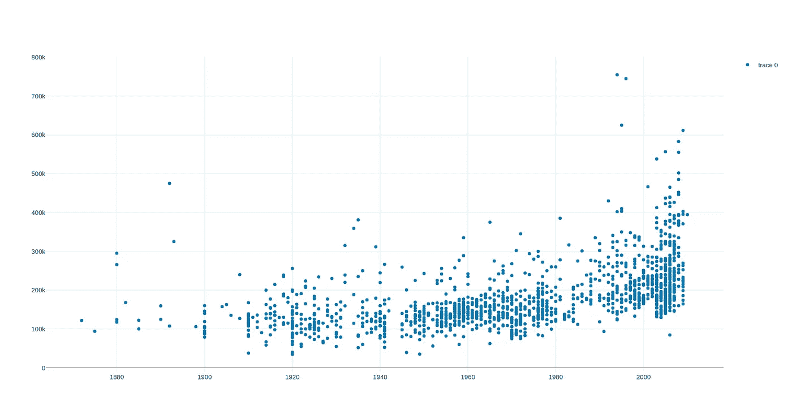
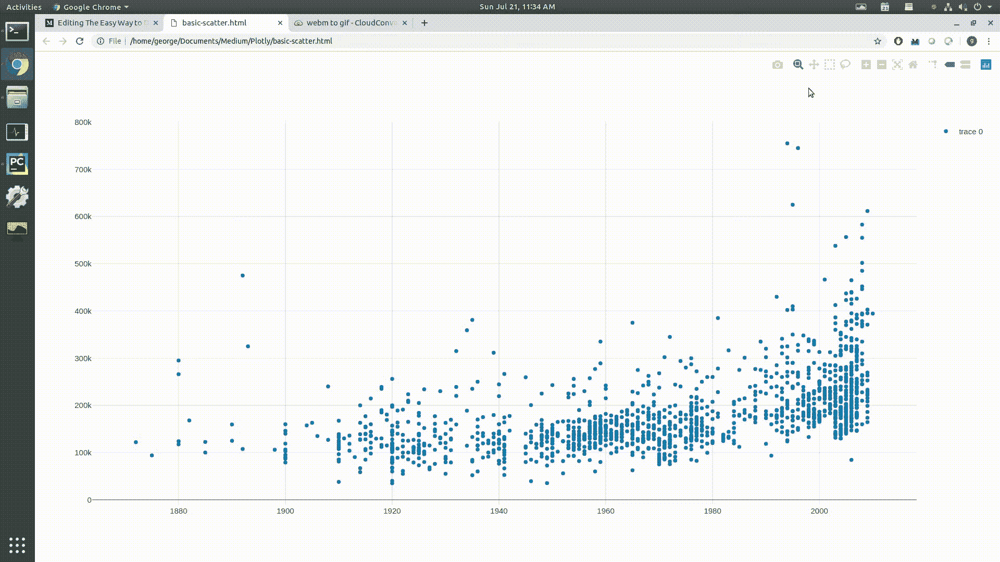
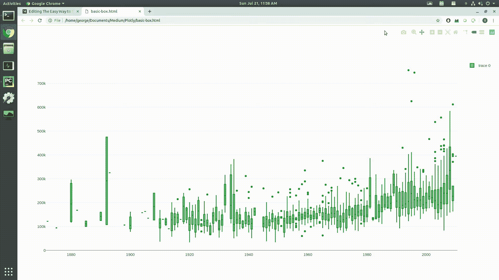
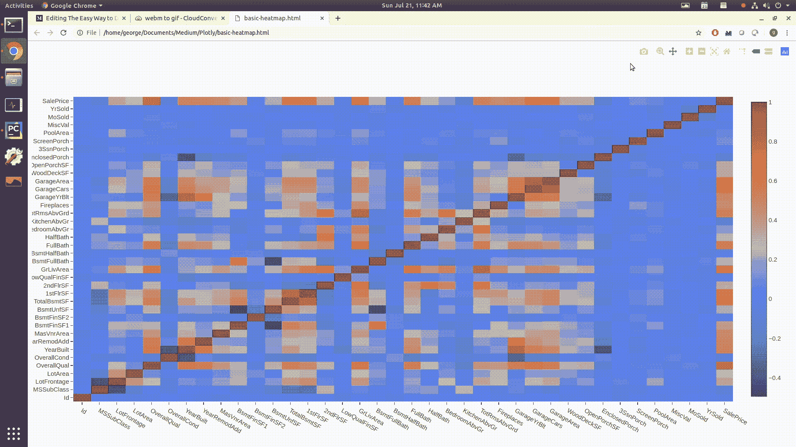

# 数据科学家实现高级数据可视化的简单方法

> 原文：<https://towardsdatascience.com/the-easy-way-to-do-advanced-data-visualisation-for-data-scientists-bbc852e26fb6?source=collection_archive---------18----------------------->


Show off your data’s true colors!

> 想获得灵感？快来加入我的 [**超级行情快讯**](https://www.superquotes.co/?utm_source=mediumtech&utm_medium=web&utm_campaign=sharing) 。😎

创建有效的[数据可视化](/5-quick-and-easy-data-visualizations-in-python-with-code-a2284bae952f?source=friends_link&sk=8fbe300478bad4343aafa0e009439e12)是数据科学家能够拥有的最有价值的技能之一。

可视化不仅仅是制作精美的图表，它还是一种以人们易于理解的方式交流数据集信息的方式。有了良好的可视化，人们可以最清楚地看到隐藏在数据中的模式和信息。

在项目的早期阶段，您通常会进行探索性数据分析(EDA ),以获得对数据的一些见解。创建可视化将有助于您加快分析速度。

在项目接近尾声时，能够以一种清晰、简洁、有说服力的方式呈现最终结果是很重要的，这样观众(通常是非技术风险承担者)才能理解。

毫无疑问:将你的可视化提升到一个新的水平将会增强你的分析——并帮助你在下一次演讲中脱颖而出。

这篇文章将是一篇关于如何轻松创建高级数据可视化的教程！我们将使用 [plotly](https://github.com/plotly/plotly.py) ，一个用于创建交互式可视化的 Python 库！

# 介绍 plotly

Plotly 是一个交互式的、开源的、基于浏览器的 Python 图形库！它构建在 [D3.js](https://d3js.org/) 之上，使得它的可视化能力比标准的 Matplotlib 更加广泛和灵活。

与其他能够绘图的 Python 库(如 Matplotlib、Seaborn 和 Pandas)相比，使用 Plotly 有两个主要优势。这些是:

**(1)易用性** —创建交互式绘图、3D 绘图和其他复杂图形只需几行代码。在其他绘图库中做同样的事情需要更多的工作。

**(2)更多功能** —由于 Plotly 是基于 D3.js 构建的，所以它的绘图功能比其他绘图库要大得多。旭日图、烛台图、地图等等都可以用 Plotly 实现。点击查看完整列表[。](https://plot.ly/python/)

我们可以用一个 pip 命令安装 Plotly:

```
pip install plotly==4.0.0
```

在本教程的剩余部分，我们将创建[房价数据集](https://www.kaggle.com/c/house-prices-advanced-regression-techniques)的可视化，你可以从 [Kaggle](https://www.kaggle.com/c/house-prices-advanced-regression-techniques) 中获取。

# 用 Plotly 制造奇特的情节

我们可以用 Plotly 创造一些非常奇特的情节！

首先，让我们导入`plotly`及其内部图形对象组件。我们还将导入熊猫来加载我们的数据集

```
*import* plotly
*import* plotly.graph_objs *as* goimport pandas as pd
```

在我们的数据集中阅读当然只是熊猫的一行程序:

```
data = pd.read_csv('train.csv')
```

# 散点图

在本练习中，我们将在散点图中绘制*销售价格与年度生产*的对比图。为此，我们将创建一个 plotly `Scatter`图形对象，并将其放入一个`trace`。

```
trace = go.Scatter(
    x = data['YearBuilt'],
    y = data['SalePrice'],
    mode = 'markers',
    showlegend = *True* )
plot_data = [trace]
```

然后，绘图只是一行之遥！

```
plotly.offline.plot(plot_data, filename='basic-scatter')
```

上述命令将在您的浏览器中打开一个新的选项卡，其中包含该图。



还没有什么新奇的东西…但是你等着吧！

Plotly 自动内置了图形交互性。看看下面的 gif，看看它能做什么！所有命令都在浏览器的右上角:

*   悬停在每个点上会显示该点的 x-y 坐标
*   你可以放大某个数据框
*   您可以使用框或套索选择并高亮显示某些点
*   您可以平移整个地块以更好地查看事物
*   你可以下载一个图片文件！



# 箱线图

这次我们要做一个方框图。

过程也差不多。我们将创建一个 graph 对象，将其放入跟踪中，然后在浏览器中绘制它:

```
*import* plotly
*import* plotly.graph_objs *as* go

*import* pandas *as* pd

data = pd.read_csv('train.csv')

trace = go.Box(
    x = data['YearBuilt'],
    y = data['SalePrice'],
    marker = {'color': 'green'},
    showlegend = *True*,
)
plot_data = [trace]

plotly.offline.plot(plot_data, filename='basic-box')
```

看看下面的 gif 图，看看盒子图的一些奇特的 Plotly 特性！

默认情况下，我们获得相同的平移、缩放和点选择。由于我们现在有一个方框图，将鼠标悬停在每个方框上会显示:

*   中位数
*   第一和第三四分位数
*   数据范围的最小值和最大值
*   存在异常值时的上限和/或下限



# 热图

热图是任何伟大的数据科学家工具箱中的另一个强大工具。它们对于在一个图中显示多个特征变量之间的关系以及每个关系的**相对重要性**特别有效。

为了真正展示如何使用 Plotly 增强您的热图，我们将把房价数据集的相关矩阵绘制为热图。绘制数据集的相关矩阵是了解要素变量如何影响目标的一种快速简便的方法。

对于 plotly，我们将 *x* 和 *y* 设置为列名，将 *z* 设置为矩阵中的值。

在我们的浏览器中绘制这一切又是一件轻而易举的事情。

```
*import* plotly
*import* plotly.graph_objs *as* go

*import* pandas *as* pd

data = pd.read_csv('train.csv')

corrmat = data.corr()

trace = go.Heatmap(z=corrmat, x=corrmat.columns.tolist(), y=corrmat.columns.tolist())

plot_data = [trace]

plotly.offline.plot(plot_data, filename='basic-heatmap')
```

Matplotlib 中的热图可能有点棘手，因为您无法看到每个单元格的确切值——您只能从颜色中看出一点。您可以编写代码使其具有交互性，但这在 Matplotlib 中相当麻烦。

Plotly 为我们提供了开箱即用的交互性，因此当我们绘制热图时，我们可以获得直观的概览，但如果需要，还可以选择检查确切的值。Plotly 的平移和缩放功能也非常简洁，允许从视觉角度进行更详细的探索！



# 喜欢学习？

在 twitter 上关注我，我会在这里发布所有最新最棒的人工智能、技术和科学！也在 [LinkedIn](https://www.linkedin.com/in/georgeseif/) 上和我联系吧！