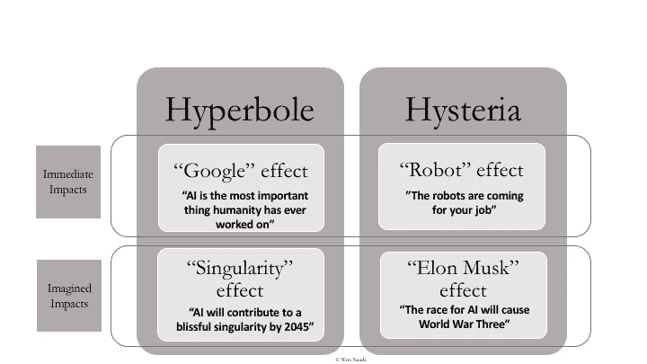

# 人工智能的经济和商业影响:现实，而不是炒作

> 原文：<https://towardsdatascience.com/the-economic-and-business-impacts-of-artificial-intelligence-reality-not-hype-ee851dfd258e?source=collection_archive---------22----------------------->

Image by [Michael Gaida](https://pixabay.com/users/MichaelGaida-652234/?utm_source=link-attribution&utm_medium=referral&utm_campaign=image&utm_content=1719531) from [Pixabay](https://pixabay.com/?utm_source=link-attribution&utm_medium=referral&utm_campaign=image&utm_content=1719531)

# 关于人工智能(AI)的辩论的特点是夸张和歇斯底里。

这种夸张是由于两种影响:首先，自利投资者对人工智能的推动。它可以被称为“*谷歌效应*”，以其首席执行官桑德尔·皮帅的名字命名，他宣称人工智能“可能是人类有史以来最重要的东西”。他会这么说。第二，技术传播者将人工智能作为解决人类根本问题甚至死亡的方法。它可以被称为“*奇点效应*，以雷·库兹韦尔命名，他认为人工智能将在 2045 年导致“奇点”。

这种歇斯底里同样源于两种影响:首先，来自 AI 构成现实[威胁](https://futureoflife.org/ai-open-letter/)的警告。这可以被称为“*埃隆-马斯克效应*”，这是在一位亿万富翁企业家[发推文](https://twitter.com/elonmusk/status/904638455761612800?ref_src=twsrc%5Etfw%7Ctwcamp%5Etweetembed%7Ctwterm%5E904638455761612800&ref_url=https%3A%2F%2Ffuturism.com%2Felon-musk-competition-for-ai-superiority-at-national-level-will-be-the-most-likely-cause-of-ww3)称“国家层面的人工智能优势竞争最有可能导致 WW3 imo”之后。第二，来自人工智能可能通过工作自动化导致大规模失业的警告。这可以被称为“机器人效应”，源自马丁·福特的畅销书《机器人的崛起:技术和大规模失业的威胁》。

The Immediate and Imagined Impacts of AI © Wim Naudé

在最近的[讨论论文](https://www.iza.org/publications/dp/12218/the-race-against-the-robots-and-the-fallacy-of-the-giant-cheesecake-immediate-and-imagined-impacts-of-artificial-intelligence)中，我对*谷歌-奇点-埃隆-马斯克*-和- *机器人-效应*进行了批判性调查，并认为缺乏支持夸张和歇斯底里的确凿证据。

早在 2013 年，据[估计](https://www.oxfordmartin.ox.ac.uk/downloads/academic/The_Future_of_Employment.pdf)在 10-20 年内，美国 47%的工作可以自动化，在[欧盟](http://bruegel.org/2014/07/the-computerisation-of-european-jobs/)和[发展中国家](http://www.worldbank.org/en/publication/wdr2016)甚至更多。六年后，发达经济体的失业率事实上处于历史低位，而不是大规模失业。[表明](https://www.zew.de/en/publikationen/revisiting-the-risk-of-automation/)用于计算人工智能导致的潜在失业的方法对假设很敏感。此外，证据表明自动化在 1999 年到 2010 年间在欧洲创造了 150 万个新的工作岗位。

与此同时，我们看到劳动生产率增长持续下降。英国自 2007 年以来的十年平均劳动生产率增长是自 1761 年以来的最低水平。即使是从人工智能中受益最大的全球超级公司，也没有变得更有生产力。这让人对人工智能已经并将会显著提高生产力的说法产生了怀疑。

为什么*机器人和谷歌效果*没有实现？至少有三个原因:

首先，人工智能在经济中的扩散速度比大多数人想象的要慢。对 T2 的小公司来说，经济地实施人工智能尤其困难。成长中的[伪 AI](https://www.theguardian.com/technology/2018/jul/06/artificial-intelligence-ai-humans-bots-tech-companies) 就是这样的结果。《卫报》指出“很难建立一个由人工智能驱动的服务。事实上，这太难了，以至于一些初创公司已经发现，让人类像机器人一样行动比让机器像人类一样行动更便宜、更容易。

第二，AI 创新[越来越难](https://academic.oup.com/restud/article-abstract/76/1/283/1577537)；它主要用于微调和瓦解现有产品，而不是推出全新的产品。玩谷歌的巴赫涂鸦可能很有趣，但它几乎不会提高生产率。应用机器学习(ML)的唾手可得的果实可能已经[收获](https://voicebot.ai/2017/11/05/gartner-hype-cycle-suggests-another-ai-winter-near/)，[收益递减](https://www.technologyreview.com/s/612768/we-analyzed-16625-papers-to-figure-out-where-ai-is-headed-next/)似乎已经开始，最重要的是，ML 正面临[可复制性危机](https://www.technologyreview.com/the-download/612982/machine-learning-is-contributing-to-a-reproducibility-crisis-within-science/)。摩尔定律的终结可能就在眼前。

第三，鉴于大多数西方国家的消费者需求增长缓慢，企业投资人工智能无利可图。大多数人工智能创新都是在自动驾驶汽车的视觉系统中。尽管如此，自动驾驶汽车最引人注目的是它们没有出现在我们的道路上。这种情况可能会在[持续很长一段时间](https://www.theverge.com/2018/7/3/17530232/self-driving-ai-winter-full-autonomy-waymo-tesla-uber)，由于[的技术原因](https://knowledge.wharton.upenn.edu/article/self-driving-cars/)，以及由于[的沉没投资](https://www.technologyreview.com/s/609048/the-seven-deadly-sins-of-ai-predictions/)。

有人可能会说，仅仅因为人工智能的影响在过去很小，这并不排除大规模的影响在未来仍然会发生。也许机器人大战是不可避免的，因为人工智能的进步。这样的论调是基于对 AI 的误解。“人工智能”这个词本身就有误导性。现在的 AI，用 ML，并不智能。关于人工智能的一个笑话是:“当你筹款时，它就是人工智能。当你在招人的时候，就是 ML。当你实施时，这是逻辑回归”。有各种各样的[理由](https://www.technologyreview.com/s/602410/no-the-experts-dont-think-superintelligent-ai-is-a-threat-to-humanity/)怀疑非人工智能研究是否会很快产生超级智能，而不仅仅是目前人工智能应用的[一招小马](https://www.technologyreview.com/s/608911/is-ai-riding-a-one-trick-pony/)。

由于大肆宣传和歇斯底里，许多政府都在争先恐后地制定国家“人工智能战略”。全球治理组织争相采取行动。举行[会议](http://fiw.merit.unu.edu/)并发布关于“[工作未来](https://www.weforum.org/reports/the-future-of-jobs-report-2018)”的旗舰报告已经成为一种时尚。

联合国秘书长有史以来第一次发布了“新技术战略”，挑出包括人工智能在内的某些技术给予特别关注，其依据是“自动化、人工智能和机器人有望促进经济增长，但它们也可能加剧国家内部和国家之间的不平等，并可能导致失业”。受这一战略的启发，联合国大学政策研究中心( [CPR](https://cpr.unu.edu/tag/artificial-intelligence) )更进一步为联合国在人工智能领域的计划干预辩护，声称人工智能正在“*改变地缘政治秩序*”，更令人难以置信的是“智能机器和人类之间的力量平衡已经明显转变。其博客[称](https://cpr.unu.edu/ai-global-governance-why-we-need-an-intergovernmental-panel-for-artificial-intelligence.html)为“*政府间人工智能小组*”[，](https://cpr.unu.edu/ai-global-governance-developing-resilient-economies-in-the-age-of-ai.html)为“*联合国领导的多利益相关方全球治理机制*”。是的，它认为人工智能与气候变化具有同样的复杂性和重要性。还有许多其他人工智能夸张和歇斯底里导致疯狂提议的例子。

挑出人工智能由联合国、各国政府，甚至一个政府间人工智能小组来控制和监管，无助于将焦点转移到技术而不是真正的问题上。技术是一个“移动的目标”:想象一下，如果在第二次工业革命期间，一个政府间小组被召集起来“全球治理”电力会怎样？19 世纪晚期的电力案例实际上提供了相关的历史警示。正如卡洛琳·托马斯·德拉佩纳所述(第 113 页)，某些地方爆发了歇斯底里:“*末日预言是由那些害怕电力偏离他们感知的自然秩序的人做出的。牧师们特别倾向于这种观点……根据特纳主教的说法……从‘白人控制电力的发明’中有很多东西是令人恐惧的”。*

政府对技术和创新的监管在最好的时候也充满了困难和意想不到的后果。当它建立在歇斯底里和夸张的基础上时，任务可能会特别成问题。当这样一个有问题的任务由全球政治机构承担时，他们的决定通常是在一个“无证据区”做出的，建议谨慎行事。

结果是，对人工智能的大肆宣传和歇斯底里导致了一场关于人工智能的“[精神错乱的](https://www.theguardian.com/technology/2018/jul/25/ai-artificial-intelligence-social-media-bots-wrong)”辩论，现在正在鼓励令人窒息的[法规](https://theconversation.com/does-regulating-artificial-intelligence-save-humanity-or-just-stifle-innovation-85718)以及人工智能“[军备竞赛](https://www.iza.org/publications/dp/11737/the-race-for-an-artificial-general-intelligence-implications-for-public-policy)”。

这些后果可能会通过不适当的控制和公众信任的丧失来加速过早的人工智能冬天，不幸的是，此时世界需要更多而不是更少的技术创新，并需要这种技术更快地传播。

*这篇文章的早期版本以全球商学院网络(GBSN)博客的形式发布，基于我在 GBSN 的同名网络研讨会。*

**延伸阅读:**

瑙代，W. (2019)。与机器人的竞赛和巨型奶酪蛋糕的谬误:人工智能的直接和想象的影响， [IZA 讨论文件第 12218 号](https://www.iza.org/publications/dp/12218/the-race-against-the-robots-and-the-fallacy-of-the-giant-cheesecake-immediate-and-imagined-impacts-of-artificial-intelligence)。波恩:IZA 劳动经济研究所