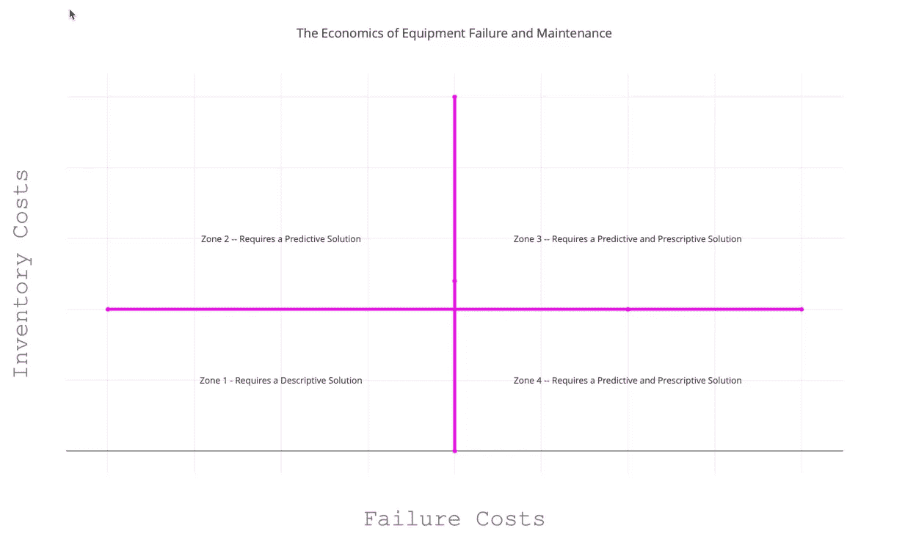

# 设备故障的经济学

> 原文：<https://towardsdatascience.com/the-economics-of-equipment-failure-cd37660d1000?source=collection_archive---------28----------------------->

## **理解问题的经济学与理解数据科学一样重要**

Image by Author

我职业生涯的大部分时间都在处理与销售和营销相关的问题。这意味着我大部分时间都在关注人类。有一件事我可以肯定地说。有时候人是完全理性和逻辑的。有时候人是完全完全完全完全不可理解的。

在过去五年左右的时间里，我有机会进入工业部门。在工业领域，主要关注的是优化机器，而不是人类。这肯定很有趣。

在工业领域，机器资产健康是一个持续上升的焦点领域。换句话说，我的资产或资产群有多健康？

资产的健康可以采取多种形式。有时它被表示为故障时间(离机器损坏还有多长时间)。其他时候，它表示为健康得分。例如，即将发生故障的机器的健康得分可能为 5，而不太可能发生故障的机器的健康得分可能为 100。

故障时间和健康得分通常来自预测故障或预期寿命的统计模型。显然这两者是有联系的。当然，它可以变化，但故障时间的估计通常是基于生存模型。资产健康得分通常基于逻辑回归或某种决策树模型(GBT 或随机森林)。

当谈到机器资产和机器资产健康时，我听到的主要问题是，“它什么时候会出故障”？由此，对话几乎总是转移到，“好吧，数据科学家先生，你能多准确地预测我的资产的失败？”有时候，这绝对是一个正确的问题。有时候不是。也就是说，有时你的主要精力应该放在故障预测上。有时候，应该是在“别的东西”上。

这个“别的东西”就是本文的重点。

线性规划绝对不是什么新鲜事。它和它的近亲非线性编程已经存在很长时间了。最近，我听说这两个概念被称为决策优化或规定性分析。说明性分析允许您根据某些标准优化资源。当我说优化时，我指的是最纯粹意义上的优化。我的意思是做出优化目标的决定。在商业世界中，这通常意味着做出一个能使收入最大化、成本最小化或利润最大化的决策。

规定性分析的经典例子是航空公司的机组人员排班。你如何将飞行员分配到路线上，以使你将乘客从 a 点运送到 b 点的成本最小化？再比如定价优化。比如一个公司可以收任何想要的价格，但是什么价格保证利润最大？

当我几分钟前提到“其他东西”时，我指的是决策优化或规定性分析。也就是说，在许多情况下，围绕管理机器资产的数据科学问题不是“我能多准确地预测故障？”相反，它应该是“我应该什么时候维护我的资产以最大化我的业务的整体盈利能力？”

我提到的另一个“别的事情”是“什么都不做”或“走向失败”。在这种情况下，事后描述故障的描述性解决方案或报告集可能就足够了。换句话说，有时你真的不需要担心预测性分析或规定性分析。你只需要让东西坏掉，然后修复它。

那么，你如何知道你应该更担心预测性、规范性还是描述性分析呢？当然，这取决于经济状况。

为了进一步探讨这个问题，让我首先定义两个与设备故障和维护相关的成本。

首先是**存货成本**。顾名思义，库存成本是保存机器替换零件的总成本。这显然包括物理存储项目的成本，但也包括存储项目的[机会成本](https://en.wikipedia.org/wiki/Opportunity_cost)。例如，如果你为电视遥控器购买了额外的电池，并把它们放在一边，知道你最终会需要它们，那么机会成本就是如果你决定手头没有额外的电池，你可能会购买的糖果。当你做一个具体的消费决定时，它是你放弃的东西。

经理们的想法和行为会因手头上保留一个替换零件的成本而大相径庭。根据器件的不同，这一成本可能会有很大差异。如果一个替换零件的价格是 1 美元，那么在一个方便的抽屉里放几十个零件是有意义的。如果一个替换零件是危险的，可能真的会杀了你，大多数人都不希望它无限期地挂着。我是说，谁会想要一加仑危险化学品无限期地存放在休息室里呢？稍微不那么引人注目的是，如果一个零件价值 10 亿美元，让一群人无所事事可能没有经济意义。至少你可以把你的十亿美元存入储蓄账户并获得利息，对吗？

第二个成本是**失败成本**。故障成本是机器发生故障时的成本。这包括生产损失、诉讼费用、财产损失，甚至人员伤亡。

同样，故障成本会有很大差异。如果我的遥控器没电了，那就太烦人了。如果喷气式飞机的引擎失灵，人们就会死亡。

因此，库存成本和故障成本决定了管理机器资产的最佳分析方法。它们回答了你是否应该使用一种说明性的、预测性的或描述性的方法。

机器资产健康决策(MAWD)图表以非常简单的方式详细说明了从业者如何有效地平衡故障和库存成本。MAWD 图表清楚地表明了你的问题的经济学建议是描述性的、预测性的还是规定性的分析方法。请看下面的 MAWD 图表。

MAWD 图表的纵轴是库存成本的连续统一体。横轴是故障成本的连续体。

让我们从西南象限开始，我把它标为“1 区”。在这个象限中，故障成本和库存成本都很低。这是你的“运行到故障”区域，因为存储替换零件和故障是一个相对“哼哼”的经历。

西北象限是第二区。在这里，故障成本很低，但库存成本很高。在这个区域，重点应该是预测和预测分析。因为保持备用零件的成本很高，所以一个好的预测模型将让您知道资产零件何时可能出现故障。了解零件何时会出现故障，可以最大限度地减少更换零件在库存中的时间。

因为故障成本低，维护不是一个大问题。目标应该是运行到失败，但是使用预测模型来最小化库存成本。

第三区是东北象限。这里的库存和故障成本很高。这一领域的重点应该是预测性和规范性分析。您将需要预测分析来衡量您资产的健康状况并最大限度地降低库存成本，但这还不够。

在区域 3 中，由于故障成本很高，您将需要在更大的规范分析解决方案中使用故障预测，以确保您的资产永远不会出现故障。失败的成本越高，公司就越需要确保失败永远不会发生。当故障成本很高时，重点应该放在优化维护计划上，而不仅仅是预测故障。优化维护计划可让您以尽可能低的成本将故障降至最低。它确保一切都以利润最大化的方式完美运行。

例如，如果您当前每六个月维护一组资产，说明性分析可能会强调 10%的资产需要每五个月维护一次，而其他资产可以等待六个月或七个月。

更智能的维护意味着更少的故障和更高的利润。

同样，预测分析更有可能成为说明性解决方案的一部分。例如，维护决策将基于许多因素，包括对故障时间或资产健康状况的预测。

第四区是东南象限。这里的库存成本很低，但故障成本很高。在这种情况下，您可能再次需要预测性和规范性的解决方案。评估资产健康状况或故障时间的预测性解决方案。一种规范性解决方案，采用预测指标，并将其与其他因素相结合，以优化维护计划。**与 3 区一样，4 区的重点应该是优化维护计划，而不仅仅是预测故障**。

如果有人对你说，“嘿，数据科学家先生。你能多准确地预测失败？”你应该说，“你好，客户先生。在此之前，让我们先来探索一下您的机器资产的经济性。”

在进入预测模型之前，就问题的经济性进行对话，这将极大地提高客户参与的成功率。