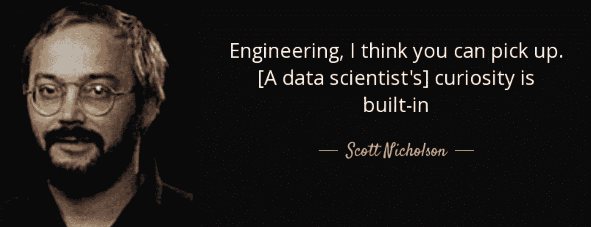
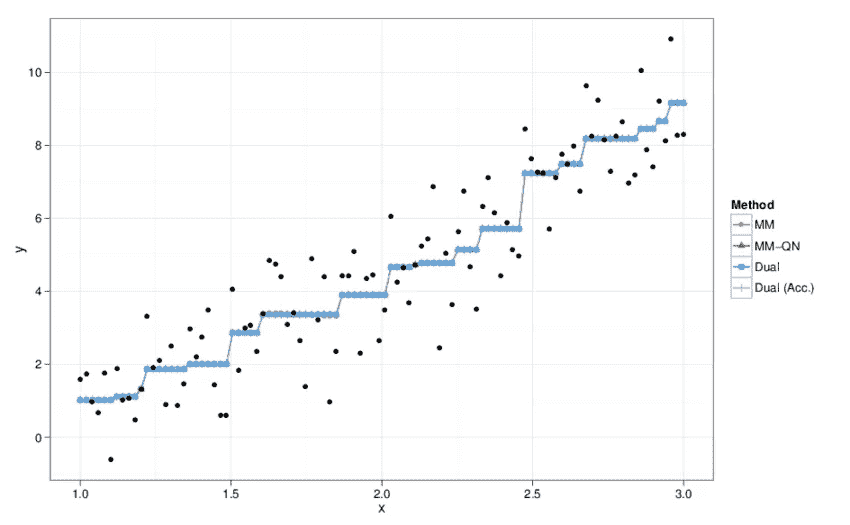

# 数据科学的“教育冲击”

> 原文：<https://towardsdatascience.com/the-education-shock-of-data-science-6fb2eddf6fa?source=collection_archive---------40----------------------->

Credit — AZQuotes.com

让我们面对事实:数据科学的奇妙世界既可怕又令人敬畏。人们可能很容易陷入拟合同一模型的常规，而不是开发新模型，因为庞大的数据和统计世界缺乏舒适感。他们对一般的软件开发人员，甚至是全栈开发人员也有类似的说法。坐在大椅子上的男人称之为

> “努力冲击”vs“回报冲击”

好吧，当你进入 DS 世界的深处时，准备好迎接大量的震惊吧。当你试图执行一项超出你能力范围的任务，并很快发现你在一艘正在下沉的船上，船上有充气救生筏时，不仅会出现标准的震惊，而且会对你的情绪健康产生额外的影响，比如我喜欢称之为:

> “教育冲击”

数据科学最大也是最痛苦的特征之一就是它作为职业、学科和科学的扩张性。不需要太长时间，不管你的经验如何，找到一个你一窍不通的东西，学习一个新的东西。尽管这令人生畏，但对某些口味的人来说，这是他们的最佳选择。不仅是创业教育和努力的冲击非常强烈，而且很多财产会伴随你一生。但是我认为告诉你们这个故事，让我开始谈论它，是一个更有意义的写作方式。

# 我的故事

很多研究必须深入到不同机器学习方法的用例、优点、缺点和特性。因此，我经常在维基百科上寻找生活中最大问题的答案。你看，在我说我对某件事有深刻的理解之前，我喜欢至少对它背后的数学有一个宽泛的理解。

模型的有趣之处在于，总有一些细微的变化，这些变化有着超越其他模型的用例，并且这些模型之间存在着巨大的差异，这些差异在纸面上看起来非常简单。

回归在数据科学家中是一个家喻户晓的术语，从我们开始使用的调制线性函数到基于概率的分类回归器。嗯，在搜索回归信息的时候，我不得不承认无法学习数学回归的每一种数学方法。就在你去查看更多关于不同回归量的信息时，另一个你从未听说过的回归量不知从哪里冒了出来！随着围绕数据科学和机器学习的每一个方面的算法数量不断增加，任何人都不可能知道每一个回归变量、每一个分类器、每一个无监督模型，坦率地说…

> 这是不可能的

这实际上会让我感到沮丧，在这个知识每天都在变化的世界里，这不是一个好的做法。

# 个人成长

不管你在旅途中可能遇到什么样的“教育冲击”,你要带走的一件重要的东西是你自己的成长。就我上面的例子而言，我决定只研究几个算法，也许会考虑回来研究更多。我最大的收获是一个可能取代我最喜欢的模型的模型，随机森林分类器(多么伟大的模型，)保序回归。它背后的数学让我想起加权最小二乘法，只是更有趣，也更复杂。*太牛逼了！*

当一手拿着 Postgres 登录，一手拿着空白文本文件处理复杂问题时，发展你的知识库对于保持强大的精神状态是绝对必要的。了解您的数据和模型对于为您的用例找到准确的算法也是至关重要的。

# 快速变化

很多时候这可能是压倒性的，但我从来不喜欢以负面的内涵来思考快速变化。有时，整个语言从我们的生态系统中被弃用，因为一种新的语言对于数据科学来说更理想。执行新任务和解决每天快速产生的新问题的完整算法是以小时为基础开发的。这常常会让你感到失落。甚至对你三年来每天使用的软件包的更新也会让你感到有点失落，就像最近对 *Tensorflow 的更新。*

你认为未来二十年通用技术将走向何方？你认为今天的产品是如何实现这一目标的？

感觉一切都在慢慢变异成机器学习。现代正在开发一种机器学习算法，让你像开车一样开车，甚至不用动一下肌肉。谷歌正在使用机器学习在他们的 pixel 设备上使用较低百万像素的摄像头制作美丽的照片。这个世纪的话题是一个机器学习面部识别算法，只需看一眼就可以解锁你的手机！我的观点是，整个技术世界发展如此之快，因此，为了跟上，这就是速度。

# “显著的相关性”

当我们谈论数据科学时，另一个问题是我们的好朋友“冒名顶替综合症”，用数据科学家书呆子的话说:“冒名顶替综合症和教育冲击之间的相关性的 P 值是 0.003。”冒名顶替综合症是不应该存在的事情之一。关于这种内部斗争的真相是，每个在任何领域从事数据科学的人都目睹了这种斗争。

没有什么好的理由让你觉得有义务不诚实地说出自己在哪里，从而阻碍自己的成长。事实是，我们都在那里，或者我们至少去过那里。要学的东西太多了，一百年的时间是不够的。埃德温·哈勃在证明他的宇宙膨胀理论之前就去世了，阿尔伯特·爱因斯坦去世时认为他在意外发现“重力波”时犯了一个数学错误，所以我想这个故事的寓意是

> 没有人是完美的，也没有人能做到。

# 接受现实吧

当你做我们做的事情时，适应性学习是关键。我已经成为对所有事情都使用相同模式的陈旧偏见的受害者，这真的阻碍了我的个人发展。重要的是不要给自己太大压力，也不要为小事而自责。数据很复杂，统计很难。他们不会无缘无故地把机器学习标榜为时髦词汇。数据科学是未来，通过了解这些技能并每天利用它们，我们就是未来。