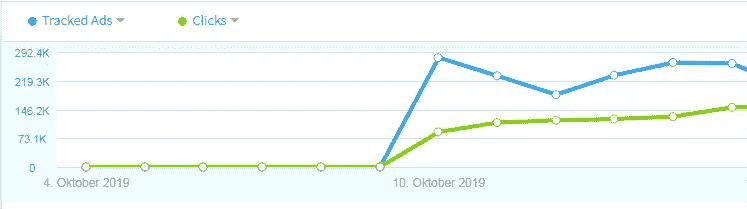
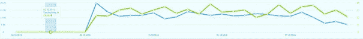
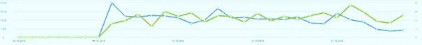
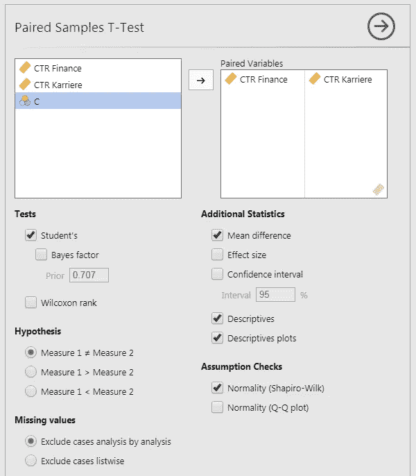
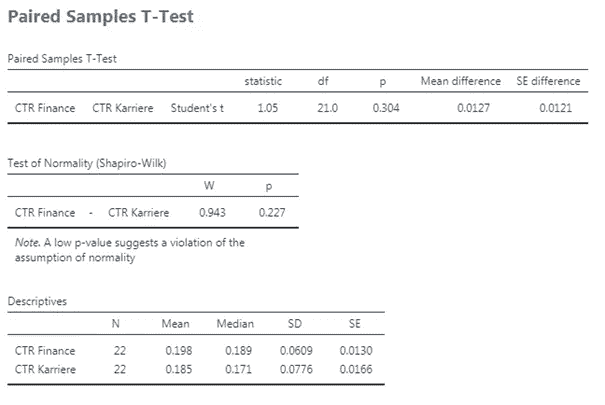
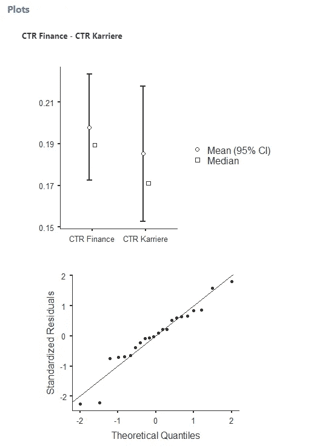
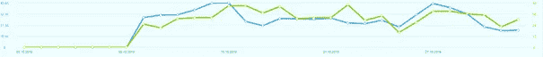
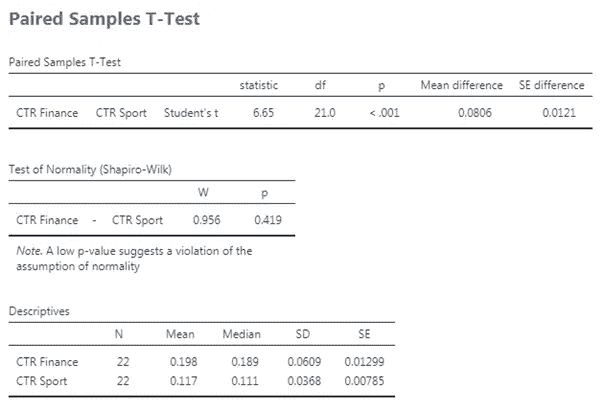
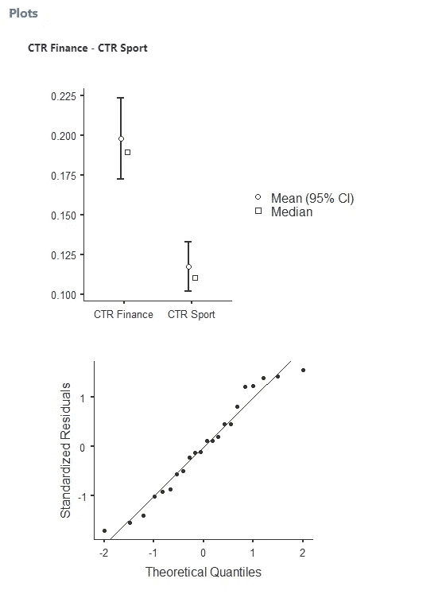

# 计划性广告活动的有效性

> 原文：<https://towardsdatascience.com/the-effectiveness-of-programmatic-advertising-campaigns-be0bab179a40?source=collection_archive---------25----------------------->

Image by the author

在本系列的第一部分中，我们比较了在有限的时间范围内针对两种不同受众的活动的效果，以确定表现是否不同。

我们正在关注 10 月 10 日推出的横幅广告。这是通过针对不同目标群体的“程序化广告”([https://en.wikipedia.org/wiki/Real-time_bidding](https://en.wikipedia.org/wiki/Real-time_bidding))开始的。

例如，在“金融”环境中:

Image by the author

或者在“职业”环境中:

Image by the author

蓝色是投放广告的数量，绿色是点击的数量。

在月底，我们将评估这两个目标群体中的哪一个在决定进一步的预算分配方面更有效。

**哪个更成功？**

**过了那个时期，我们能有多确定我们的决定是正确的？**

作为评估标准，我们采用每条广告的点击率(CTR)。

“金融”职位的 CTR 为 0.19%，“职业”职位的 CTR 为 0.17%。这可能表明在金融环境中投放广告更有效。然而，这两个图表还显示，这两个比率每天都有很大波动，这可能意味着这种差异是由于随机波动造成的，因此做出决定还为时过早。

我们能确定在“金融”环境中投放广告更好吗？有多确定？

为了回答这两个问题，我们必须对数据进行精确的统计分析。
我们用的软件“贾莫维”([www.jamovi.org](https://www.jamovi.org))，我已经[报过](http://www.stoeckl.ai/hilfe-bei-statistischen-fragestellungen/)。

我们有以下详细数据:

Datatable for the ads

仅仅看原始数据并不能让我们更接近问题的答案。统计有助于关键数字的计算、图形的创建和概率的计算。

使用“jamovi ”,我们可以一步完成示例中所需的所有计算:

T-test in jamovi / Image by the author

我们用 T 检验来检查我们的成对(每天)数据。同时，我们有描述性的数字，如平均值和标准差和一些图形。是否给出了数据正态分布的 T 检验的必要条件，我们也要检查。这是通过“夏皮罗-威尔克斯”测试和分位数图来完成的。

这给出了以下结果:

Results of T-test

以及以下情节:

Plots of the data / Image by the author

## 在我们的例子中如何解释这些结果？

第一个图显示，尽管两组的平均值略有偏移，但两个标准差范围明显重叠。这表明我们不能确定两个观众有不同的表现。

这可以通过计算 T 检验的“p 值”来证实。解释如下就是 0.227。目前的数据(它们的差异)纯属巧合的概率是 0.227。这并不意味着可能性很小。这向我们表明，我们不能肯定有不同的表现。只有在概率低于 0.05 时，人们才会谈论**显著性**，并拒绝一切都是偶然创造的观点。在这种情况下，人们会谈到目标群体的不同表现。

T 检验中“p 值”的计算是否基于正确的假设，即**正态分布**基本数据，还有待考虑。我们用两种方法做到了这一点，在第二张图中用图形表示，并通过计算“夏皮罗-威尔克斯”检验的 p 值。两者都表明假设得到了很好的满足，分位数图显示了近似在一条直线上的点，并且 p 值不是太小。

## 考虑另一个有两个观众的例子。

我们将广告放在“体育”环境中，与“金融”环境进行比较。

Image by the author

这种情况的平均点击率为 0.11%，因此低于“金融”环境。在这里，你能说有什么显著不同的表现吗？
让我们用同样的方式来检查一下:

Results second example

有了情节:

Plots second example / Image by the author

这些图显示了平均值的明显差异，从而显示了运动的有效性。这也用低于 0.001 的“p 值”来表示。这些数据极不可能只是偶然的产物。**因此，在线广告在“金融”环境中的投放明显比在“体育”环境中更有效。**

这里比第一个例子更好地满足了正态分布的基本要求。

在以后的文章中，我们将关注[如何使用方差分析来同时分析](https://medium.com/@andreasstckl/the-effectiveness-of-programmatic-advertising-campaigns-part-2-777e985d6e)多个受众，以及如何创建广告未来表现的预测(使用线性回归)。