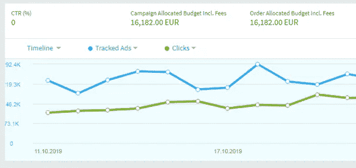
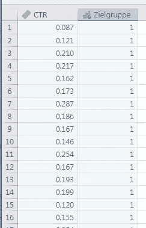
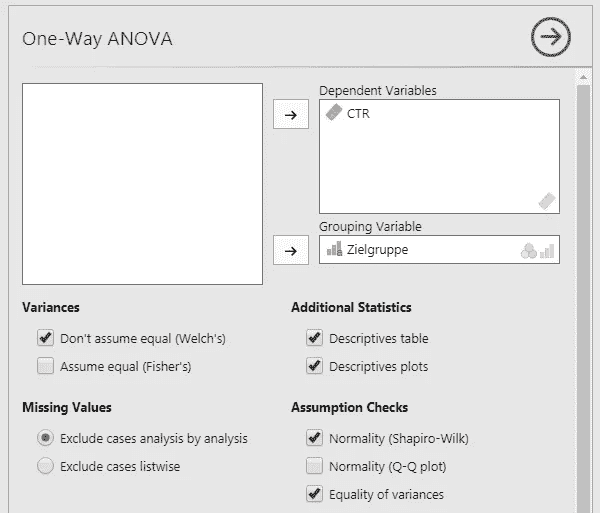
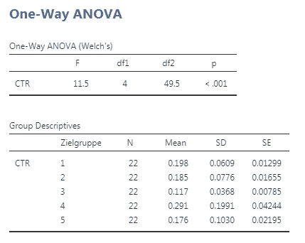
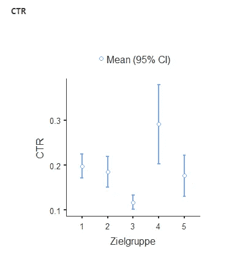
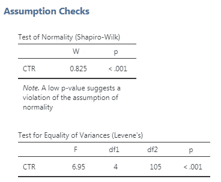

# 计划性广告活动的有效性——第二部分

> 原文：<https://towardsdatascience.com/the-effectiveness-of-programmatic-advertising-campaigns-part-2-777e985d6e?source=collection_archive---------33----------------------->

Image by the author

在系列文章的[第一部分，我展示了如何使用统计测试来调查两个“程序化广告”(【https://en.wikipedia.org/wiki/Real-time_bidding】](/the-effectiveness-of-programmatic-advertising-campaigns-be0bab179a40))活动的绩效数据是否有显著差异。用两个例子说明了程序，并讨论了结果。两个目标组的数据成对比较。

如果你想一次考察一些甚至很多目标群体，你需要另一种方法，即**[**方差分析**](https://en.wikipedia.org/wiki/Analysis_of_variance)**【ANOVA】**。与名字可能暗示的相反，主要不是比较单个数据序列的方差，而是平均值。**

**在分析的起点，让我们看看几个目标群体的数据(每日点击数、每日广告数、点击率)。我将看一个有 5 个不同观众的例子。环境中的位置:
-金融(id 1)
-职业(id 2)
-体育(id 3)
-艺术(id 4)
-新闻(id 5)**

**软件“贾莫维”([www.jamovi.org](http://www.jamovi.org))再次被使用。下表显示了不同目标群体的 CTR 数据。**

****

**CTRs for different audiences / Image by the author**

**第一列是所有日期和目标群体的 CTR，第二列是区分各个目标群体的因素。**

## **这些问题是:**

**对所有目标群体来说，安置是同样成功的，还是个别群体更成功？
这些差异显著还是只是随机波动？**

**在" jamovi "中再次对所有设置进行分析，以检查数据分布的先决条件，并且重要的绘图可以在单个掩膜中进行。**

****

**ANOVA in jamovi / Image by the author**

**选择要检查的值(本例中为 CTR)和分组变量(此处为目标组)，并检查数据的正态分布和单个目标组中方差的相等性。这里使用的是不等方差的 ANOVA。**

****

**Results from ANOVA**

****结果表明，必须放弃目标群体中所有绩效平均值相等的假设。这具有很高的意义。**这些数据纯属偶然产生的概率小于 0.001。
对于各组，还显示了平均值和标准偏差。**

**计算结果也得到曲线图的支持，曲线图显示了 CTR 的显著偏差，尤其是对于第 3 组(“运动”)和第 4 组(“艺术”)。在环境“运动”中的位置带来了较低的点击率，在环境“艺术”中的所有组中最好，但在数据中也具有高得多的分散性。**

****

**Plots for different audiences / Image by the author**

**对分析先决条件的检查产生了正态分布的正结果。方差相等的检验证实了存在不同方差的图的印象。因此，相应的设置用于分析。**

****

**Check of assumptions**

**因此，我们能够使用该分析来确定广告在不同放置环境中的不同表现，并确保显著性，还能够识别哪些组表现良好，哪些组表现不佳。在本系列的下一部分，我将介绍使用线性回归预测未来活动绩效的简单模型。**