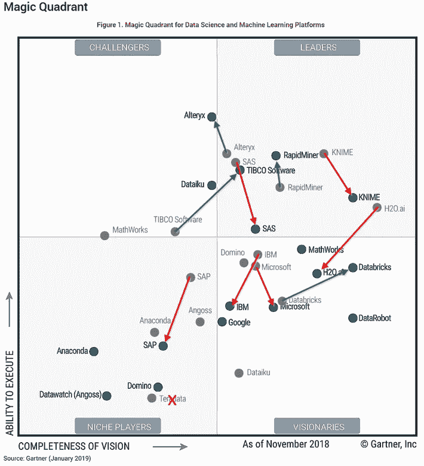

# 获得授权的数据驱动型组织

> 原文：<https://towardsdatascience.com/the-empowered-data-driven-organization-c9f969fc389e?source=collection_archive---------25----------------------->

## 组织如何释放数据和分析的力量以获得竞争优势。

> 🔥在你继续阅读这篇文章之前，我想让你知道，几天前，我发布了一个完整的课程，帮助你**提高你的决策技能，并在竞争中领先**。
> 这是多年研究的成果，在有限的时间内**可以免费获得**。
> 👉如果你想用科学的方法做出更好的决定，这里有一个链接:[https://smart-decision-makers.streamlit.app/](https://smart-decision-makers.streamlit.app/)
> [/Announcement]🔥

为了从他们的数据中获得更多价值，除了雇佣新的人才来管理和利用这些新的资产之外，公司今天还参与了捕获大量内部和外部数据的过程。然而，很少有组织能够实现其数据和分析能力的全部潜力。一个主要原因是，数字化转型首先是人的转型，进行文化变革比获得新资产和新能力要难得多。

# 改变你的组织文化

组织文化塑造了人们如何协作和互动，如何决策，以及如何经营企业的方方面面。在数据驱动型组织中，数据和分析被视为从竞争对手中脱颖而出的机会。要做到这一点，组织中的每个人都应该能够利用他/她自己环境中的数据和分析。这需要获得相关数据，并让非专家也能使用人工智能算法。

# 在您的组织中民主化数据科学

然后，获得授权的员工可以通过几种可能的方式，利用可用的数据和算法进行协作和轻松试验，为组织创造价值:创造新的见解，促进数据驱动的决策，测试新的业务模式或优化现有流程。

例如，优步已经通过开发自己的数据科学平台走上了这条道路，该平台为公司的任何人提供经过验证的预测算法，只需按一下按钮(不需要预测专业知识)。[https://eng.uber.com/building-ubers-data-science-platforms/](https://eng.uber.com/building-ubers-data-science-platforms/)

Data-science platform at Uber

数据科学平台的格局正在快速变化，Gartner(一家 IT 咨询公司)每年都会更新对大型参与者的全球看法，该公司沿着两个轴对数据科学和机器学习平台进行排名:愿景的完整性和执行能力。

The arrows illustrate shifts in major players’ positions in the Gartner Magic quadrant between 2018 and 2019.

即使许多平台仍然试图通过在其平台中推出更多更适合专家用户的高级功能来脱颖而出，您也可以注意到一种趋势，即向非专家数据科学家(也称为**“公民数据科学家】**)普及这些平台的使用。例如，DataRobot 作为一个有远见的人在 2019 年的 Gartner 魔力象限中出现，部分原因是它能够通过利用自动化[机器学习](https://arxiv.org/pdf/1908.00709v1.pdf)领域的最新进展，简化公民数据科学家对机器学习算法的使用。

> “让用户能够快速轻松地构建完全透明的高度准确的预测模型的能力，可能是任何成功的机器学习平台最重要的元素。唯一需要的成分是好奇心和数据——编码和机器学习技能完全是可选的！”数据机器人

# 改变您与数据的关系

很少有组织能够充分利用人工智能的第二个主要原因与整个组织如何管理数据有关。事实上，尽管现代数据科学平台使测试和比较数百种机器学习算法变得很容易，但对于许多组织来说，收集和准备正确的训练数据集来支持这些算法仍然是一个挑战。

Data preparation with Dataiku’s Studio

数据准备部分可能很耗时，但绝对不是拦路虎。数据科学家报告称，数据准备可能会占用一个项目 80%的时间。然而，数据科学平台正在提供越来越多用户友好的数据辩论能力。

另一方面，在整个组织中以一致的方式收集相关数据可能是一个真正的问题。在许多情况下，人工智能计划被停止，因为重要数据不可用或不可用。

为了说明这最后一点，让我们看看组织为他们的客户创造价值的方式。这通常通过几个相互关联的过程来实现(营销、财务、研发、制造、采购、供应链……)。当你从信息系统的角度来看这些过程时，我们通常会发现不同软件、数据库和 Excel 文件的拼凑，它们并不总是一致的，至少在数据的结构和存储方式上是如此。

组织试图解决这个问题的经典方法是启动大型数字化项目，部署新的信息系统并重组现有系统。这类项目通常风险很大，需要几年时间才能实现目标，而且非常昂贵，因此从数据和分析中获得任何竞争优势的机会被进一步推迟。

## 贝佐斯 API 指令

亚马逊在这一领域的做法值得一提:2002 年，亚马逊创始人兼首席执行官杰夫·贝索斯向他的员工发布了以下备忘录(后来称为“贝佐斯 API 指令”):

*   所有团队将从此通过服务接口公开他们的数据和功能。
*   团队必须通过这些接口相互交流。
*   不允许其他形式的进程间通信:不允许直接链接，不允许直接读取另一个团队的数据存储，不允许共享内存模型，不允许任何后门。唯一允许的通信是通过网络上的服务接口调用。
*   他们用什么技术并不重要。

备忘录以“任何不这样做的人都将被解雇”结尾。谢谢大家；祝你愉快！”。

如果我们抛开这份说明的专制方式，看看这种导向的后果，这意味着如果公司中有人需要从营销或组织中的任何其他团队获得信息，而不是通过电子邮件/电话联系他/她的同事并从数据库或简单的 Excel 文件中获得摘录。他/她现在可以使用编码的服务接口来获取数据。无论营销团队使用何种技术来管理和处理这些数据(从高级商业软件到简单的电子表格)，他们都需要通过公司中任何人都可以使用的应用程序编程接口来公开他们的数据。

从人际关系的角度来看，这可能听起来很奇怪，但它有一个很大的优势，那就是无论组织中的信息系统有多成熟，都可以标准化数据的构造和共享方式。

根据亚马逊在 2019 年 Q2 的报告，亚马逊的子公司、提供按需云计算的 AWS(亚马逊网络服务)已经创造了高达 84 亿美元的销售额，占亚马逊总收入的 13%。

# 下一代平台

在我的研究中，我没有发现任何超出数据准备/数据建模阶段的数据科学平台。他们中的大多数人完全忽略了数据管理部分，并假设用户能够带来自己的一致数据集或连接到现有的数据库，同时管理所有的协作和安全方面。在本节中，让我们想象一种下一代平台，在这种平台上，用户可以无缝体验从管理数据源到利用人工智能算法为组织创造价值的过程。

为此，我们将讲述 Barbara 的虚构故事，她作为产品负责人在市场部工作。芭芭拉刚刚完成了一项客户满意度调查，她收集了数千名客户对公司正在开发的各种产品的反馈。然后，她想到将这些数据与每种产品的广告活动预算以及研发部门提供的一组产品特征进行合并，以找出哪些参数组合与客户满意度相关。

## 浏览数据目录

为了测试她的想法，Barbara 兴奋地连接到她公司刚刚部署的数据科学平台。她现在可以浏览组织中所有可用数据源的目录。这一次，Barbara 更喜欢询问集成聊天机器人她正在寻找什么类型的信息，然后机器人将她快速导向一个简短的有趣数据源列表。她浏览了列表，阅读了每个数据源的描述，并很快确定了她需要在分析中使用的数据源。

## 创建新的数据源

现在是芭芭拉将自己的数据集上传到平台上的时候了。一旦她上传了文件并为她的同事创建了内容的简短描述，系统就会自动识别出用于在调查中识别客户的列也是在其他数据源中使用的参考列。它建议芭芭拉将她的数据集与客户的参考数据联系起来。系统还建议 Barbara 删除已经在引用中的其他客户特定列，因为它们可能被视为重复。芭芭拉对所有这些建议都很满意；她得到保证，她的数据集将始终是最新的，并直接连接到组织中的其他数据源。

## 不要忽视大局

第二天，芭芭拉接到该部门数据架构师吉姆的电话。吉姆想确保芭芭拉在站台上找到路。Jim 的职责是确保组织的全球数据模型定义明确、一致，并被不同的用户充分理解。在谈到新平台时，吉姆经常说:“自从这个平台部署以来，我感觉自己就像是成长花园中的园丁。我们的全球数据模型每天都在变得越来越丰富，我们大大提高了数据质量和从所有正在进行的实验中学习的能力。”

## 安全性和协作

Barbara 已经将新的数据源设置为公共的，这样组织中的每个人都可以使用它。但是，如果有任何敏感数据，她可以只授予特定用户或组访问权限。

该平台还提供了多种协作功能，如开始讨论或为数据集中的特定元素添加评论的可能性。平台上的每个数据源，无论是手动加载的还是表示现有信息系统的，都可以使用标准化编程接口(API)来请求。

## 最终

*   Barbara 能够测试她的想法，并确定用户满意度的一些关键驱动因素，这导致与产品开发团队进行了非常丰富的讨论。
*   由于 Jim 的参与，该组织的数据模型每天都在变得越来越丰富，同时保持了一个连贯的全局。
*   员工正逐步放弃 Excel 文件，转而寻求在线协作体验，这种体验放大了该平台的积极网络效应。

# **结论**

总之，一个愿意利用人工智能的可持续竞争优势的组织需要:

*   成功创造数据驱动的文化，这将促进实验和数据驱动的决策。
*   利用数据科学平台的力量来普及机器学习算法和数据准备工具的使用。
*   通过促进数据访问和协作，同时确保数据的安全性和组织全球数据模型的一致性，使员工能够采取行动。