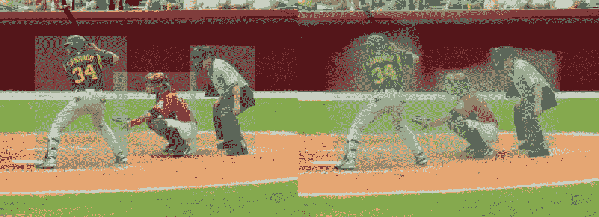
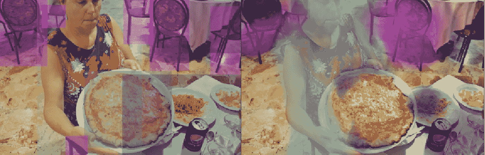
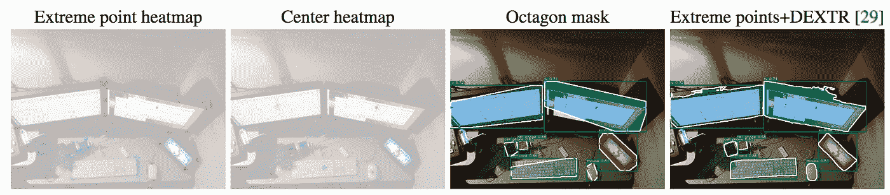
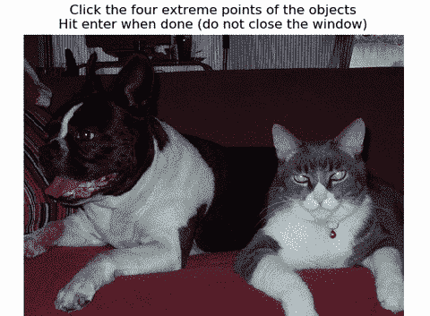

# 锚点的终结——改进对象检测模型和注释

> 原文：<https://towardsdatascience.com/the-end-of-anchors-improving-object-detection-models-and-annotations-73828c7b39f6?source=collection_archive---------9----------------------->

## [入门](https://towardsdatascience.com/tagged/getting-started)

# 问题是

如果你曾经需要修补锚盒，你可能会感到沮丧、困惑，并对自己说:“一定有别的办法！”现在看来，*是*的另一种方式。

当我第一次写[锚框](https://medium.com/@andersasac/anchor-boxes-the-key-to-quality-object-detection-ddf9d612d4f9)的时候，我就有了绕过锚框，把对象检测问题变成语义分割问题的想法。我试着预测每个像素的每个类有多少个对象边界框*。由于几个问题，这给出了相当差的结果:*

1.我无法将分割遮罩还原成边界框。这意味着我不能隔离或计数对象。

2.神经网络努力学习对象周围的哪些像素属于边界框。这可以在训练中看到，其中模型首先分割对象，然后才开始围绕它形成矩形。

Examples from the Common Objects in Context (COCO) dataset¹

几个月过去了，已经有几款车型以更具创新性的方式抛弃了锚盒。

# 无锚点对象检测

[CornerNet](https://arxiv.org/pdf/1808.01244.pdf) 预测每个像素的边界框的左上角和右下角以及嵌入。每个角的嵌入相匹配，以确定它们属于哪个对象。一旦你匹配了所有的角，恢复包围盒是很容易的。这解决了我所面临的问题:去掉锚框，同时能够从输出中恢复边界框。

然而，CornerNet 并没有解决我所面临的第二个问题，即网络必须知道在哪里定位一个甚至不包含对象的像素。这就是 ExtremeNet 的用武之地。这种方法是基于 CornerNet 的，但是它不是预测角，而是预测对象的中心以及最远的左、右、上、下点。然后，这些“极值点”根据它们的几何形状进行匹配，从而产生出色的结果:

# 释文

但是我怎么找到极值点标注呢？不幸的是，作者从分割遮罩中提取了极值点，如果您只能访问边界框，则该选项不可用。然而，极值点注释有几个优点:

1.标注对象的极值点比标注边界框要容易得多。要标记一个边界框，您必须目测与两个最极端点对齐的角的位置。通常，注释者必须在事后调整边界框，以便与极值点对齐。ExtremeNet 的论文估计，标注极值点所花费的时间几乎是标注边界框所花费时间的五分之一。

2.出于同样的原因，人类注释者更容易标记极值点，神经网络也应该更容易准确地指出它们的位置。目前，ExtremeNet 似乎优于其他单次检测器。

3.给定对象的极值点，生成边界框是很简单的。如果图像也包括在内，则可以使用[右旋](https://github.com/scaelles/DEXTR-PyTorch) ⁴算法来生成分割掩模。这使得极值点比边界框更加通用。

# 没那么快

在您将所有的对象检测系统迁移到 ExtremeNet 之前，请记住当前的实现既庞大又缓慢。预训练模型达到了最先进的结果，有近 2 亿个参数，占用 800mb。当我在 Tesla K80 GPU (p2.xlarge EC2 实例)上测试一批单个图像时，使用来自 [GitHub 页面](https://github.com/xingyizhou/ExtremeNet)的 demo.py 脚本，每张图像需要大约 8 秒*。使用 DEXTR 创建分段屏蔽会增加 2-12 秒，具体取决于检测次数。如果您想要对来自多个图像比例的检测进行分组，则数量会进一步增加。在单幅图像上运行多尺度分割总共需要一分钟，尽管我认为这些数字可以通过优化代码来提高。CornerNet 声称在 Titan X (Pascal) GPU 上运行速度约为 4 fps，这也比现有的单次检测器慢得多。在我考虑将 ExtremeNet 作为大多数应用程序的可行选项之前，需要有一个既快速又准确的版本。*

# **结论**

ExtremeNet 的论文声称，与所有其他单次检测器相比，其性能更为优越，同时无需仔细调整锚盒，然后对输出进行解码。即使没有这样的模型，注释方法本身也提供了显著的好处。该模型仍然没有像神经网络一样完全端到端地学习，并且包括多种算法来生成边界框或分割掩模。尽管如此，我非常希望在未来，极值点注释和模型成为对象检测的规范。

# 参考

[1]林，宗毅等.《微软 COCO:情境中的公共对象》计算机科学课堂讲稿(2014):740–755。交叉引用。网络。

[2]法、黑、加登。"角网:将物体检测为成对的关键点."计算机科学课堂讲稿(2018):765–781。交叉引用。网络。

[3]周、邢毅、卓家成和菲利普·克雷恩布尔。"通过组合极值点和中心点的自下而上的物体检测." *arXiv 预印本 arXiv:1901.08043* (2019)。

[4]马尼尼斯，K.-K .等人，“深度极限切割:从极限点到物体分割”2018 年 IEEE/CVF 计算机视觉与模式识别大会(2018): n. pag。交叉引用。网络。