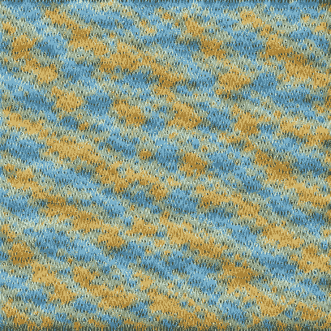
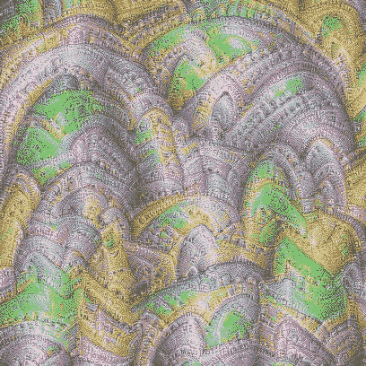
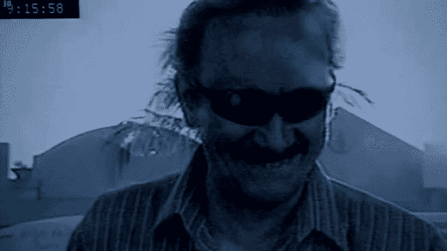

# 所有模糊图片的终结

> 原文：<https://towardsdatascience.com/the-end-to-all-blurry-pictures-f27e49f23588?source=collection_archive---------5----------------------->

## 使用 GANs 的图像超分辨率综述和解释。

你能数一数这张图片里有多少只企鹅吗？

现在呢？

嗯，我把它放大了，但是还是很模糊…

那么，现在呢？

啊！我们来数数企鹅和它的一个完美的例子 ***图像超分辨率*** 在行动！

图像超分辨率是从低分辨率图片创建更好看、更高分辨率的图像。任何在 Powerpoint 演示文稿中放入图像的人都知道，缩小图像实际上会让它看起来更糟*。这是因为**双三次插值**用于放大图像:一种采用**像素平均值来填充图像放大时产生的间隙**的技术。*

**

*How interpolation-based resizing/enlargement works. [Source](https://www.cambridgeincolour.com/tutorials/image-interpolation.htm).*

*这样做的问题是没有新的数据被创建——这意味着你的图像在分辨率上没有变好，只是变大了。*

*无论你只是创建一个 powerpoint，分析乳房 x 光片，还是进行**远程面部识别** *—* **超**分辨率**超**都很重要。*

*那么我们如何做到**超分辨率**？好吧，我们转向——人工智能！我们已经看到了大量使用*卷积神经网络*的图像超分辨率的最新进展(点击查看我关于它们的文章[，如果你想了解它们是如何用于超分辨率的，请点击](/classifying-skin-lesions-with-convolutional-neural-networks-fc1302c60d54)[查看](https://medium.com/coinmonks/review-srcnn-super-resolution-3cb3a4f67a7c))。但是，这仍然存在一些问题——图像看起来不如我们喜欢的清晰和详细，为了解决这个问题，制作了 **SRGANs** (超分辨率生成对抗网络*——试着说一口气*)。*

**

*Comparison of different SR methods. Zoom in to notice how crisp SRGAN is!*

*在进入超分辨率方面之前，这里有一个 GANs 的快速概述*

## *生成对抗网络概述*

> *"给定一个输入数据集，我们能生成看起来应该在该数据集中的新数据吗？"*

*想想一个**伪造者**在博物馆用赝品调换真画，而**馆长**的工作就是辨别真品和赝品。当它们都刚刚开始时，伪造者会犯很多错误，而馆长也不善于辨别真伪。*

*随着时间的推移，伪造者可以尝试不同的技术，并在制造假货方面变得更好，而馆长也找到了帮助他辨别假货的策略；**他们都在通过彼此提高。***

*伪造者的目标是**创造出看起来真实的艺术品**，而策展人的目标是**能够始终发现假画**。*

*这两个角色相互竞争，代表了一个 GAN 中的两个网络。作为**生成网络**的伪造者创建新图像，而作为**辨别网络**的策展人评估来自生成器的图像看起来是否真实。*

**

*Outline of a traditional GAN being trained to generate handwritten digits. [Source](https://www.google.com/url?sa=i&source=images&cd=&cad=rja&uact=8&ved=2ahUKEwim5dTu2e_kAhVHsZ4KHSsGDJEQjRx6BAgBEAQ&url=https%3A%2F%2Fskymind.ai%2Fwiki%2Fgenerative-adversarial-network-gan&psig=AOvVaw3iuMEvLAung_3xMKVx8tHp&ust=1569628979213810).*

*发生器接收随机像素数据(噪声)，将其转换为**假输出**，在超分辨率的情况下，它会将随机噪声转换为**更高分辨率的图像**。*

*鉴别器在训练集和发生器图像上接受训练，**学习区分它们**。*

*那么*为什么*用 GAN 更好呢？*

*有很多其他方法可以实现超分辨率，例如 SRResNet 和 SRCNN，但是，这些方法都有一个问题:视觉质量差，即使网络看起来运行良好。*

*当我们使用传统的损失函数来衡量我们的鉴别器有多准确时，它衡量的是**在数学上**有多接近(欧几里德距离)，而不是**在视觉上**生成的图像与真实图像有多接近，这导致了一个区域中颜色的平滑平均，正如您在下面的 SRResNet 图像中所看到的。*

***

SRGAN (left), SRResNet (right) — Notice the smoothness and lack of details in the SRResNet image.* 

*为了抵消这一点，创造了一个**感知损失**函数——来测量视觉清晰度。这个损失是两个不同损失的总和→ **内容损失**和**对抗损失**。*

## *对抗性损失*

*使用 GAN 的一个巨大好处是，你可以利用对抗性损失来激励输出看起来自然。发生这种情况是因为 GANs 的基本性质:**寻找看起来不属于**的数据。*

*对抗性损失是鉴别器网络评估**发电机运行情况**的一部分。如果鉴别器认为图像使我的发生器看起来合法，它将返回一个比它认为图像看起来完全是假的更低的损失。*

## ****内容损失****

*内容损失通过将生成的图像和原始图像通过 CNN 特征图并计算输出的损失来比较图像中的细微细节。*

*让我们来分解一下。*

*当我们训练一个卷积神经网络时——它的层执行 ***特征提取***——这是一种奇特的说法，它在图像中寻找模式和形状。随着我们越来越深入地研究网络，我们会发现越来越复杂的特征。*

**

*Visualization of feature maps.*

*好的，酷—让我们分析一下这些特征地图中到底发生了什么。在 Conv1 层中，保存了大量来自图像的原始信息。这是因为 CNN 中的初始(conv)层通常充当边缘检测器。*

*后来在网络中，更高层次的信息被编码，我们在 conv 2-4 中看到，图像开始变得更加抽象。即使看起来更深的层比初始层编码的信息更少(因为它们看起来模糊)，但它们实际上只是改变了它们包含的信息类型——从几何信息到语义信息。*

*为了更好地理解这一点:这里有一些在 [VGG16 网络](https://neurohive.io/en/popular-networks/vgg16/)中通过图像的实际过滤器的可视化效果。*(更具体地说，滤镜激活最多的图像，* [*代码执行此操作*](https://github.com/fg91/visualizing-cnn-feature-maps) *)**

## *第 7 层*

******

## *第 14 层*

******

## *第 20 层*

******

## *第 30 层*

******

## *第 40 层*

******

**哇哦。**

*这些不仅绝对令人着迷，而且当我们深入网络时，它们还能给我们一种直觉，告诉我们过滤器在寻找什么。在最后一行图像中，我们可以很容易地将拱门、鸟和链条识别为每个过滤器正在寻找的对象。*

*回到*内容损失，*我们通过特征图传递从生成器和参考(原始)图像重建的图像，并比较两个图像中的细微纹理差异，**惩罚纹理看起来平滑的图像**。*

*知觉损失的概念也用在了**神经风格转移**中，你可以在我关于它的[文章](/making-art-with-your-webcam-ac6d0f5504f4)中了解更多！*

*…就是这样！这是一个**感知损失函数**的基本思想。*

*随着这项技术的进步和不断完善，我们可以从这样的酷结果开始:*

**

*对此:*

**

*这项技术的进步可能会导致超远距离航空/卫星成像、医学图像增强、数字全息摄影，以及更多真正具有高影响力的应用，更不用说让企鹅看起来清晰明了。*

## *关键要点:*

*   *GANs 有两个神经网络**相互竞争**来完全生成**新** **图像** **看起来** **真实。***
*   *SRGAN 图像比 SRCNN 图像看起来更好，因为它们包含了**更多的细节:**使用感知损失函数的副产品。*
*   *感知损失的计算方法是将内容损失(结构相似性)与对抗性损失(该图像看起来有多合法)相加*

# ***如果你喜欢我的文章或者学到了新东西，请务必:***

*   *在 [LinkedIn](https://www.linkedin.com/in/aryan-misra/) 上与我联系。*
*   *给我发一些反馈和评论(aryanmisra4@gmail.com)。*
*   *检查一下 [SRGAN 纸](https://arxiv.org/abs/1609.04802)。*
*   *此外，请查看 SRGAN 的 Tensorflow 2.0 实现的代码，它在#PoweredByTF2.0 devpost 挑战赛中获得了两项大奖！( [github](https://github.com/aryanmisra/NeuraScale/) ， [devpost](https://devpost.com/software/neurascale) )*